# Load LLM False Belief Data


``` r
# setwd("/Users/seantrott/Dropbox/UCSD/Research/NLMs/epistemology/dev_tom/src/analysis")
# setwd("/Users/pamelariviere/Dropbox/Research/projects/dev_tom/src/analysis")

# Grab data for false belief task
directory_path <- "../../data/processed/fb_local/"
csv_files <- list.files(path = directory_path, pattern = "*.csv", full.names = TRUE)
csv_list <- csv_files %>%
  map(~ read_csv(.))
```

```
## Rows: 192 Columns: 16
## ── Column specification ────────────────────────────────────────────────────────
## Delimiter: ","
## chr (11): passage, start, end, knowledge_cue, first_mention, recent_mention,...
## dbl  (4): start_prob, end_prob, log_odds, step
## lgl  (1): ingredient
## 
## ℹ Use `spec()` to retrieve the full column specification for this data.
## ℹ Specify the column types or set `show_col_types = FALSE` to quiet this message.
## Rows: 192 Columns: 16
## ── Column specification ────────────────────────────────────────────────────────
## Delimiter: ","
## chr (11): passage, start, end, knowledge_cue, first_mention, recent_mention,...
## dbl  (4): start_prob, end_prob, log_odds, step
## lgl  (1): ingredient
## 
## ℹ Use `spec()` to retrieve the full column specification for this data.
## ℹ Specify the column types or set `show_col_types = FALSE` to quiet this message.
## Rows: 192 Columns: 16
## ── Column specification ────────────────────────────────────────────────────────
## Delimiter: ","
## chr (11): passage, start, end, knowledge_cue, first_mention, recent_mention,...
## dbl  (4): start_prob, end_prob, log_odds, step
## lgl  (1): ingredient
## 
## ℹ Use `spec()` to retrieve the full column specification for this data.
## ℹ Specify the column types or set `show_col_types = FALSE` to quiet this message.
## Rows: 192 Columns: 16
## ── Column specification ────────────────────────────────────────────────────────
## Delimiter: ","
## chr (11): passage, start, end, knowledge_cue, first_mention, recent_mention,...
## dbl  (4): start_prob, end_prob, log_odds, step
## lgl  (1): ingredient
## 
## ℹ Use `spec()` to retrieve the full column specification for this data.
## ℹ Specify the column types or set `show_col_types = FALSE` to quiet this message.
## Rows: 192 Columns: 16
## ── Column specification ────────────────────────────────────────────────────────
## Delimiter: ","
## chr (11): passage, start, end, knowledge_cue, first_mention, recent_mention,...
## dbl  (4): start_prob, end_prob, log_odds, step
## lgl  (1): ingredient
## 
## ℹ Use `spec()` to retrieve the full column specification for this data.
## ℹ Specify the column types or set `show_col_types = FALSE` to quiet this message.
## Rows: 192 Columns: 16
## ── Column specification ────────────────────────────────────────────────────────
## Delimiter: ","
## chr (11): passage, start, end, knowledge_cue, first_mention, recent_mention,...
## dbl  (4): start_prob, end_prob, log_odds, step
## lgl  (1): ingredient
## 
## ℹ Use `spec()` to retrieve the full column specification for this data.
## ℹ Specify the column types or set `show_col_types = FALSE` to quiet this message.
## Rows: 192 Columns: 16
## ── Column specification ────────────────────────────────────────────────────────
## Delimiter: ","
## chr (11): passage, start, end, knowledge_cue, first_mention, recent_mention,...
## dbl  (4): start_prob, end_prob, log_odds, step
## lgl  (1): ingredient
## 
## ℹ Use `spec()` to retrieve the full column specification for this data.
## ℹ Specify the column types or set `show_col_types = FALSE` to quiet this message.
## Rows: 192 Columns: 16
## ── Column specification ────────────────────────────────────────────────────────
## Delimiter: ","
## chr (11): passage, start, end, knowledge_cue, first_mention, recent_mention,...
## dbl  (4): start_prob, end_prob, log_odds, step
## lgl  (1): ingredient
## 
## ℹ Use `spec()` to retrieve the full column specification for this data.
## ℹ Specify the column types or set `show_col_types = FALSE` to quiet this message.
## Rows: 192 Columns: 16
## ── Column specification ────────────────────────────────────────────────────────
## Delimiter: ","
## chr (11): passage, start, end, knowledge_cue, first_mention, recent_mention,...
## dbl  (4): start_prob, end_prob, log_odds, step
## lgl  (1): ingredient
## 
## ℹ Use `spec()` to retrieve the full column specification for this data.
## ℹ Specify the column types or set `show_col_types = FALSE` to quiet this message.
## Rows: 192 Columns: 16
## ── Column specification ────────────────────────────────────────────────────────
## Delimiter: ","
## chr (11): passage, start, end, knowledge_cue, first_mention, recent_mention,...
## dbl  (4): start_prob, end_prob, log_odds, step
## lgl  (1): ingredient
## 
## ℹ Use `spec()` to retrieve the full column specification for this data.
## ℹ Specify the column types or set `show_col_types = FALSE` to quiet this message.
## Rows: 192 Columns: 16
## ── Column specification ────────────────────────────────────────────────────────
## Delimiter: ","
## chr (11): passage, start, end, knowledge_cue, first_mention, recent_mention,...
## dbl  (4): start_prob, end_prob, log_odds, step
## lgl  (1): ingredient
## 
## ℹ Use `spec()` to retrieve the full column specification for this data.
## ℹ Specify the column types or set `show_col_types = FALSE` to quiet this message.
## Rows: 192 Columns: 16
## ── Column specification ────────────────────────────────────────────────────────
## Delimiter: ","
## chr (11): passage, start, end, knowledge_cue, first_mention, recent_mention,...
## dbl  (4): start_prob, end_prob, log_odds, step
## lgl  (1): ingredient
## 
## ℹ Use `spec()` to retrieve the full column specification for this data.
## ℹ Specify the column types or set `show_col_types = FALSE` to quiet this message.
## Rows: 192 Columns: 16
## ── Column specification ────────────────────────────────────────────────────────
## Delimiter: ","
## chr (11): passage, start, end, knowledge_cue, first_mention, recent_mention,...
## dbl  (4): start_prob, end_prob, log_odds, step
## lgl  (1): ingredient
## 
## ℹ Use `spec()` to retrieve the full column specification for this data.
## ℹ Specify the column types or set `show_col_types = FALSE` to quiet this message.
## Rows: 192 Columns: 16
## ── Column specification ────────────────────────────────────────────────────────
## Delimiter: ","
## chr (11): passage, start, end, knowledge_cue, first_mention, recent_mention,...
## dbl  (4): start_prob, end_prob, log_odds, step
## lgl  (1): ingredient
## 
## ℹ Use `spec()` to retrieve the full column specification for this data.
## ℹ Specify the column types or set `show_col_types = FALSE` to quiet this message.
## Rows: 192 Columns: 16
## ── Column specification ────────────────────────────────────────────────────────
## Delimiter: ","
## chr (11): passage, start, end, knowledge_cue, first_mention, recent_mention,...
## dbl  (4): start_prob, end_prob, log_odds, step
## lgl  (1): ingredient
## 
## ℹ Use `spec()` to retrieve the full column specification for this data.
## ℹ Specify the column types or set `show_col_types = FALSE` to quiet this message.
## Rows: 192 Columns: 16
## ── Column specification ────────────────────────────────────────────────────────
## Delimiter: ","
## chr (11): passage, start, end, knowledge_cue, first_mention, recent_mention,...
## dbl  (4): start_prob, end_prob, log_odds, step
## lgl  (1): ingredient
## 
## ℹ Use `spec()` to retrieve the full column specification for this data.
## ℹ Specify the column types or set `show_col_types = FALSE` to quiet this message.
## Rows: 192 Columns: 16
## ── Column specification ────────────────────────────────────────────────────────
## Delimiter: ","
## chr (11): passage, start, end, knowledge_cue, first_mention, recent_mention,...
## dbl  (4): start_prob, end_prob, log_odds, step
## lgl  (1): ingredient
## 
## ℹ Use `spec()` to retrieve the full column specification for this data.
## ℹ Specify the column types or set `show_col_types = FALSE` to quiet this message.
## Rows: 192 Columns: 16
## ── Column specification ────────────────────────────────────────────────────────
## Delimiter: ","
## chr (11): passage, start, end, knowledge_cue, first_mention, recent_mention,...
## dbl  (4): start_prob, end_prob, log_odds, step
## lgl  (1): ingredient
## 
## ℹ Use `spec()` to retrieve the full column specification for this data.
## ℹ Specify the column types or set `show_col_types = FALSE` to quiet this message.
## Rows: 192 Columns: 16
## ── Column specification ────────────────────────────────────────────────────────
## Delimiter: ","
## chr (11): passage, start, end, knowledge_cue, first_mention, recent_mention,...
## dbl  (4): start_prob, end_prob, log_odds, step
## lgl  (1): ingredient
## 
## ℹ Use `spec()` to retrieve the full column specification for this data.
## ℹ Specify the column types or set `show_col_types = FALSE` to quiet this message.
## Rows: 192 Columns: 16
## ── Column specification ────────────────────────────────────────────────────────
## Delimiter: ","
## chr (11): passage, start, end, knowledge_cue, first_mention, recent_mention,...
## dbl  (4): start_prob, end_prob, log_odds, step
## lgl  (1): ingredient
## 
## ℹ Use `spec()` to retrieve the full column specification for this data.
## ℹ Specify the column types or set `show_col_types = FALSE` to quiet this message.
## Rows: 192 Columns: 16
## ── Column specification ────────────────────────────────────────────────────────
## Delimiter: ","
## chr (11): passage, start, end, knowledge_cue, first_mention, recent_mention,...
## dbl  (4): start_prob, end_prob, log_odds, step
## lgl  (1): ingredient
## 
## ℹ Use `spec()` to retrieve the full column specification for this data.
## ℹ Specify the column types or set `show_col_types = FALSE` to quiet this message.
## Rows: 192 Columns: 16
## ── Column specification ────────────────────────────────────────────────────────
## Delimiter: ","
## chr (11): passage, start, end, knowledge_cue, first_mention, recent_mention,...
## dbl  (4): start_prob, end_prob, log_odds, step
## lgl  (1): ingredient
## 
## ℹ Use `spec()` to retrieve the full column specification for this data.
## ℹ Specify the column types or set `show_col_types = FALSE` to quiet this message.
## Rows: 192 Columns: 16
## ── Column specification ────────────────────────────────────────────────────────
## Delimiter: ","
## chr (11): passage, start, end, knowledge_cue, first_mention, recent_mention,...
## dbl  (4): start_prob, end_prob, log_odds, step
## lgl  (1): ingredient
## 
## ℹ Use `spec()` to retrieve the full column specification for this data.
## ℹ Specify the column types or set `show_col_types = FALSE` to quiet this message.
## Rows: 192 Columns: 16
## ── Column specification ────────────────────────────────────────────────────────
## Delimiter: ","
## chr (11): passage, start, end, knowledge_cue, first_mention, recent_mention,...
## dbl  (4): start_prob, end_prob, log_odds, step
## lgl  (1): ingredient
## 
## ℹ Use `spec()` to retrieve the full column specification for this data.
## ℹ Specify the column types or set `show_col_types = FALSE` to quiet this message.
## Rows: 192 Columns: 16
## ── Column specification ────────────────────────────────────────────────────────
## Delimiter: ","
## chr (11): passage, start, end, knowledge_cue, first_mention, recent_mention,...
## dbl  (4): start_prob, end_prob, log_odds, step
## lgl  (1): ingredient
## 
## ℹ Use `spec()` to retrieve the full column specification for this data.
## ℹ Specify the column types or set `show_col_types = FALSE` to quiet this message.
## Rows: 192 Columns: 16
## ── Column specification ────────────────────────────────────────────────────────
## Delimiter: ","
## chr (11): passage, start, end, knowledge_cue, first_mention, recent_mention,...
## dbl  (4): start_prob, end_prob, log_odds, step
## lgl  (1): ingredient
## 
## ℹ Use `spec()` to retrieve the full column specification for this data.
## ℹ Specify the column types or set `show_col_types = FALSE` to quiet this message.
## Rows: 192 Columns: 16
## ── Column specification ────────────────────────────────────────────────────────
## Delimiter: ","
## chr (11): passage, start, end, knowledge_cue, first_mention, recent_mention,...
## dbl  (4): start_prob, end_prob, log_odds, step
## lgl  (1): ingredient
## 
## ℹ Use `spec()` to retrieve the full column specification for this data.
## ℹ Specify the column types or set `show_col_types = FALSE` to quiet this message.
## Rows: 192 Columns: 16
## ── Column specification ────────────────────────────────────────────────────────
## Delimiter: ","
## chr (11): passage, start, end, knowledge_cue, first_mention, recent_mention,...
## dbl  (4): start_prob, end_prob, log_odds, step
## lgl  (1): ingredient
## 
## ℹ Use `spec()` to retrieve the full column specification for this data.
## ℹ Specify the column types or set `show_col_types = FALSE` to quiet this message.
## Rows: 192 Columns: 16
## ── Column specification ────────────────────────────────────────────────────────
## Delimiter: ","
## chr (11): passage, start, end, knowledge_cue, first_mention, recent_mention,...
## dbl  (4): start_prob, end_prob, log_odds, step
## lgl  (1): ingredient
## 
## ℹ Use `spec()` to retrieve the full column specification for this data.
## ℹ Specify the column types or set `show_col_types = FALSE` to quiet this message.
## Rows: 192 Columns: 16
## ── Column specification ────────────────────────────────────────────────────────
## Delimiter: ","
## chr (11): passage, start, end, knowledge_cue, first_mention, recent_mention,...
## dbl  (4): start_prob, end_prob, log_odds, step
## lgl  (1): ingredient
## 
## ℹ Use `spec()` to retrieve the full column specification for this data.
## ℹ Specify the column types or set `show_col_types = FALSE` to quiet this message.
## Rows: 192 Columns: 16
## ── Column specification ────────────────────────────────────────────────────────
## Delimiter: ","
## chr (11): passage, start, end, knowledge_cue, first_mention, recent_mention,...
## dbl  (4): start_prob, end_prob, log_odds, step
## lgl  (1): ingredient
## 
## ℹ Use `spec()` to retrieve the full column specification for this data.
## ℹ Specify the column types or set `show_col_types = FALSE` to quiet this message.
## Rows: 192 Columns: 16
## ── Column specification ────────────────────────────────────────────────────────
## Delimiter: ","
## chr (11): passage, start, end, knowledge_cue, first_mention, recent_mention,...
## dbl  (4): start_prob, end_prob, log_odds, step
## lgl  (1): ingredient
## 
## ℹ Use `spec()` to retrieve the full column specification for this data.
## ℹ Specify the column types or set `show_col_types = FALSE` to quiet this message.
## Rows: 192 Columns: 16
## ── Column specification ────────────────────────────────────────────────────────
## Delimiter: ","
## chr (11): passage, start, end, knowledge_cue, first_mention, recent_mention,...
## dbl  (4): start_prob, end_prob, log_odds, step
## lgl  (1): ingredient
## 
## ℹ Use `spec()` to retrieve the full column specification for this data.
## ℹ Specify the column types or set `show_col_types = FALSE` to quiet this message.
## Rows: 192 Columns: 16
## ── Column specification ────────────────────────────────────────────────────────
## Delimiter: ","
## chr (11): passage, start, end, knowledge_cue, first_mention, recent_mention,...
## dbl  (4): start_prob, end_prob, log_odds, step
## lgl  (1): ingredient
## 
## ℹ Use `spec()` to retrieve the full column specification for this data.
## ℹ Specify the column types or set `show_col_types = FALSE` to quiet this message.
## Rows: 192 Columns: 16
## ── Column specification ────────────────────────────────────────────────────────
## Delimiter: ","
## chr (11): passage, start, end, knowledge_cue, first_mention, recent_mention,...
## dbl  (4): start_prob, end_prob, log_odds, step
## lgl  (1): ingredient
## 
## ℹ Use `spec()` to retrieve the full column specification for this data.
## ℹ Specify the column types or set `show_col_types = FALSE` to quiet this message.
## Rows: 192 Columns: 16
## ── Column specification ────────────────────────────────────────────────────────
## Delimiter: ","
## chr (11): passage, start, end, knowledge_cue, first_mention, recent_mention,...
## dbl  (4): start_prob, end_prob, log_odds, step
## lgl  (1): ingredient
## 
## ℹ Use `spec()` to retrieve the full column specification for this data.
## ℹ Specify the column types or set `show_col_types = FALSE` to quiet this message.
## Rows: 192 Columns: 16
## ── Column specification ────────────────────────────────────────────────────────
## Delimiter: ","
## chr (11): passage, start, end, knowledge_cue, first_mention, recent_mention,...
## dbl  (4): start_prob, end_prob, log_odds, step
## lgl  (1): ingredient
## 
## ℹ Use `spec()` to retrieve the full column specification for this data.
## ℹ Specify the column types or set `show_col_types = FALSE` to quiet this message.
## Rows: 192 Columns: 16
## ── Column specification ────────────────────────────────────────────────────────
## Delimiter: ","
## chr (11): passage, start, end, knowledge_cue, first_mention, recent_mention,...
## dbl  (4): start_prob, end_prob, log_odds, step
## lgl  (1): ingredient
## 
## ℹ Use `spec()` to retrieve the full column specification for this data.
## ℹ Specify the column types or set `show_col_types = FALSE` to quiet this message.
## Rows: 192 Columns: 16
## ── Column specification ────────────────────────────────────────────────────────
## Delimiter: ","
## chr (11): passage, start, end, knowledge_cue, first_mention, recent_mention,...
## dbl  (4): start_prob, end_prob, log_odds, step
## lgl  (1): ingredient
## 
## ℹ Use `spec()` to retrieve the full column specification for this data.
## ℹ Specify the column types or set `show_col_types = FALSE` to quiet this message.
## Rows: 192 Columns: 16
## ── Column specification ────────────────────────────────────────────────────────
## Delimiter: ","
## chr (11): passage, start, end, knowledge_cue, first_mention, recent_mention,...
## dbl  (4): start_prob, end_prob, log_odds, step
## lgl  (1): ingredient
## 
## ℹ Use `spec()` to retrieve the full column specification for this data.
## ℹ Specify the column types or set `show_col_types = FALSE` to quiet this message.
## Rows: 192 Columns: 16
## ── Column specification ────────────────────────────────────────────────────────
## Delimiter: ","
## chr (11): passage, start, end, knowledge_cue, first_mention, recent_mention,...
## dbl  (4): start_prob, end_prob, log_odds, step
## lgl  (1): ingredient
## 
## ℹ Use `spec()` to retrieve the full column specification for this data.
## ℹ Specify the column types or set `show_col_types = FALSE` to quiet this message.
## Rows: 192 Columns: 16
## ── Column specification ────────────────────────────────────────────────────────
## Delimiter: ","
## chr (11): passage, start, end, knowledge_cue, first_mention, recent_mention,...
## dbl  (4): start_prob, end_prob, log_odds, step
## lgl  (1): ingredient
## 
## ℹ Use `spec()` to retrieve the full column specification for this data.
## ℹ Specify the column types or set `show_col_types = FALSE` to quiet this message.
## Rows: 192 Columns: 16
## ── Column specification ────────────────────────────────────────────────────────
## Delimiter: ","
## chr (11): passage, start, end, knowledge_cue, first_mention, recent_mention,...
## dbl  (4): start_prob, end_prob, log_odds, step
## lgl  (1): ingredient
## 
## ℹ Use `spec()` to retrieve the full column specification for this data.
## ℹ Specify the column types or set `show_col_types = FALSE` to quiet this message.
## Rows: 192 Columns: 16
## ── Column specification ────────────────────────────────────────────────────────
## Delimiter: ","
## chr (11): passage, start, end, knowledge_cue, first_mention, recent_mention,...
## dbl  (4): start_prob, end_prob, log_odds, step
## lgl  (1): ingredient
## 
## ℹ Use `spec()` to retrieve the full column specification for this data.
## ℹ Specify the column types or set `show_col_types = FALSE` to quiet this message.
## Rows: 192 Columns: 16
## ── Column specification ────────────────────────────────────────────────────────
## Delimiter: ","
## chr (11): passage, start, end, knowledge_cue, first_mention, recent_mention,...
## dbl  (4): start_prob, end_prob, log_odds, step
## lgl  (1): ingredient
## 
## ℹ Use `spec()` to retrieve the full column specification for this data.
## ℹ Specify the column types or set `show_col_types = FALSE` to quiet this message.
## Rows: 192 Columns: 16
## ── Column specification ────────────────────────────────────────────────────────
## Delimiter: ","
## chr (11): passage, start, end, knowledge_cue, first_mention, recent_mention,...
## dbl  (4): start_prob, end_prob, log_odds, step
## lgl  (1): ingredient
## 
## ℹ Use `spec()` to retrieve the full column specification for this data.
## ℹ Specify the column types or set `show_col_types = FALSE` to quiet this message.
## Rows: 192 Columns: 16
## ── Column specification ────────────────────────────────────────────────────────
## Delimiter: ","
## chr (11): passage, start, end, knowledge_cue, first_mention, recent_mention,...
## dbl  (4): start_prob, end_prob, log_odds, step
## lgl  (1): ingredient
## 
## ℹ Use `spec()` to retrieve the full column specification for this data.
## ℹ Specify the column types or set `show_col_types = FALSE` to quiet this message.
## Rows: 192 Columns: 16
## ── Column specification ────────────────────────────────────────────────────────
## Delimiter: ","
## chr (11): passage, start, end, knowledge_cue, first_mention, recent_mention,...
## dbl  (4): start_prob, end_prob, log_odds, step
## lgl  (1): ingredient
## 
## ℹ Use `spec()` to retrieve the full column specification for this data.
## ℹ Specify the column types or set `show_col_types = FALSE` to quiet this message.
## Rows: 192 Columns: 16
## ── Column specification ────────────────────────────────────────────────────────
## Delimiter: ","
## chr (11): passage, start, end, knowledge_cue, first_mention, recent_mention,...
## dbl  (4): start_prob, end_prob, log_odds, step
## lgl  (1): ingredient
## 
## ℹ Use `spec()` to retrieve the full column specification for this data.
## ℹ Specify the column types or set `show_col_types = FALSE` to quiet this message.
## Rows: 192 Columns: 16
## ── Column specification ────────────────────────────────────────────────────────
## Delimiter: ","
## chr (11): passage, start, end, knowledge_cue, first_mention, recent_mention,...
## dbl  (4): start_prob, end_prob, log_odds, step
## lgl  (1): ingredient
## 
## ℹ Use `spec()` to retrieve the full column specification for this data.
## ℹ Specify the column types or set `show_col_types = FALSE` to quiet this message.
## Rows: 192 Columns: 16
## ── Column specification ────────────────────────────────────────────────────────
## Delimiter: ","
## chr (11): passage, start, end, knowledge_cue, first_mention, recent_mention,...
## dbl  (4): start_prob, end_prob, log_odds, step
## lgl  (1): ingredient
## 
## ℹ Use `spec()` to retrieve the full column specification for this data.
## ℹ Specify the column types or set `show_col_types = FALSE` to quiet this message.
## Rows: 192 Columns: 16
## ── Column specification ────────────────────────────────────────────────────────
## Delimiter: ","
## chr (11): passage, start, end, knowledge_cue, first_mention, recent_mention,...
## dbl  (4): start_prob, end_prob, log_odds, step
## lgl  (1): ingredient
## 
## ℹ Use `spec()` to retrieve the full column specification for this data.
## ℹ Specify the column types or set `show_col_types = FALSE` to quiet this message.
## Rows: 192 Columns: 16
## ── Column specification ────────────────────────────────────────────────────────
## Delimiter: ","
## chr (11): passage, start, end, knowledge_cue, first_mention, recent_mention,...
## dbl  (4): start_prob, end_prob, log_odds, step
## lgl  (1): ingredient
## 
## ℹ Use `spec()` to retrieve the full column specification for this data.
## ℹ Specify the column types or set `show_col_types = FALSE` to quiet this message.
## Rows: 192 Columns: 16
## ── Column specification ────────────────────────────────────────────────────────
## Delimiter: ","
## chr (11): passage, start, end, knowledge_cue, first_mention, recent_mention,...
## dbl  (4): start_prob, end_prob, log_odds, step
## lgl  (1): ingredient
## 
## ℹ Use `spec()` to retrieve the full column specification for this data.
## ℹ Specify the column types or set `show_col_types = FALSE` to quiet this message.
## Rows: 192 Columns: 16
## ── Column specification ────────────────────────────────────────────────────────
## Delimiter: ","
## chr (11): passage, start, end, knowledge_cue, first_mention, recent_mention,...
## dbl  (4): start_prob, end_prob, log_odds, step
## lgl  (1): ingredient
## 
## ℹ Use `spec()` to retrieve the full column specification for this data.
## ℹ Specify the column types or set `show_col_types = FALSE` to quiet this message.
## Rows: 192 Columns: 16
## ── Column specification ────────────────────────────────────────────────────────
## Delimiter: ","
## chr (11): passage, start, end, knowledge_cue, first_mention, recent_mention,...
## dbl  (4): start_prob, end_prob, log_odds, step
## lgl  (1): ingredient
## 
## ℹ Use `spec()` to retrieve the full column specification for this data.
## ℹ Specify the column types or set `show_col_types = FALSE` to quiet this message.
## Rows: 192 Columns: 16
## ── Column specification ────────────────────────────────────────────────────────
## Delimiter: ","
## chr (11): passage, start, end, knowledge_cue, first_mention, recent_mention,...
## dbl  (4): start_prob, end_prob, log_odds, step
## lgl  (1): ingredient
## 
## ℹ Use `spec()` to retrieve the full column specification for this data.
## ℹ Specify the column types or set `show_col_types = FALSE` to quiet this message.
## Rows: 192 Columns: 16
## ── Column specification ────────────────────────────────────────────────────────
## Delimiter: ","
## chr (11): passage, start, end, knowledge_cue, first_mention, recent_mention,...
## dbl  (4): start_prob, end_prob, log_odds, step
## lgl  (1): ingredient
## 
## ℹ Use `spec()` to retrieve the full column specification for this data.
## ℹ Specify the column types or set `show_col_types = FALSE` to quiet this message.
## Rows: 192 Columns: 16
## ── Column specification ────────────────────────────────────────────────────────
## Delimiter: ","
## chr (11): passage, start, end, knowledge_cue, first_mention, recent_mention,...
## dbl  (4): start_prob, end_prob, log_odds, step
## lgl  (1): ingredient
## 
## ℹ Use `spec()` to retrieve the full column specification for this data.
## ℹ Specify the column types or set `show_col_types = FALSE` to quiet this message.
## Rows: 192 Columns: 16
## ── Column specification ────────────────────────────────────────────────────────
## Delimiter: ","
## chr (11): passage, start, end, knowledge_cue, first_mention, recent_mention,...
## dbl  (4): start_prob, end_prob, log_odds, step
## lgl  (1): ingredient
## 
## ℹ Use `spec()` to retrieve the full column specification for this data.
## ℹ Specify the column types or set `show_col_types = FALSE` to quiet this message.
## Rows: 192 Columns: 16
## ── Column specification ────────────────────────────────────────────────────────
## Delimiter: ","
## chr (11): passage, start, end, knowledge_cue, first_mention, recent_mention,...
## dbl  (4): start_prob, end_prob, log_odds, step
## lgl  (1): ingredient
## 
## ℹ Use `spec()` to retrieve the full column specification for this data.
## ℹ Specify the column types or set `show_col_types = FALSE` to quiet this message.
## Rows: 192 Columns: 16
## ── Column specification ────────────────────────────────────────────────────────
## Delimiter: ","
## chr (12): passage, start, end, knowledge_cue, first_mention, recent_mention,...
## dbl  (4): start_prob, end_prob, log_odds, step
## 
## ℹ Use `spec()` to retrieve the full column specification for this data.
## ℹ Specify the column types or set `show_col_types = FALSE` to quiet this message.
## Rows: 192 Columns: 16
## ── Column specification ────────────────────────────────────────────────────────
## Delimiter: ","
## chr (12): passage, start, end, knowledge_cue, first_mention, recent_mention,...
## dbl  (4): start_prob, end_prob, log_odds, step
## 
## ℹ Use `spec()` to retrieve the full column specification for this data.
## ℹ Specify the column types or set `show_col_types = FALSE` to quiet this message.
## Rows: 192 Columns: 16
## ── Column specification ────────────────────────────────────────────────────────
## Delimiter: ","
## chr (12): passage, start, end, knowledge_cue, first_mention, recent_mention,...
## dbl  (4): start_prob, end_prob, log_odds, step
## 
## ℹ Use `spec()` to retrieve the full column specification for this data.
## ℹ Specify the column types or set `show_col_types = FALSE` to quiet this message.
## Rows: 192 Columns: 16
## ── Column specification ────────────────────────────────────────────────────────
## Delimiter: ","
## chr (12): passage, start, end, knowledge_cue, first_mention, recent_mention,...
## dbl  (4): start_prob, end_prob, log_odds, step
## 
## ℹ Use `spec()` to retrieve the full column specification for this data.
## ℹ Specify the column types or set `show_col_types = FALSE` to quiet this message.
## Rows: 192 Columns: 16
## ── Column specification ────────────────────────────────────────────────────────
## Delimiter: ","
## chr (12): passage, start, end, knowledge_cue, first_mention, recent_mention,...
## dbl  (4): start_prob, end_prob, log_odds, step
## 
## ℹ Use `spec()` to retrieve the full column specification for this data.
## ℹ Specify the column types or set `show_col_types = FALSE` to quiet this message.
## Rows: 192 Columns: 16
## ── Column specification ────────────────────────────────────────────────────────
## Delimiter: ","
## chr (12): passage, start, end, knowledge_cue, first_mention, recent_mention,...
## dbl  (4): start_prob, end_prob, log_odds, step
## 
## ℹ Use `spec()` to retrieve the full column specification for this data.
## ℹ Specify the column types or set `show_col_types = FALSE` to quiet this message.
## Rows: 192 Columns: 16
## ── Column specification ────────────────────────────────────────────────────────
## Delimiter: ","
## chr (12): passage, start, end, knowledge_cue, first_mention, recent_mention,...
## dbl  (4): start_prob, end_prob, log_odds, step
## 
## ℹ Use `spec()` to retrieve the full column specification for this data.
## ℹ Specify the column types or set `show_col_types = FALSE` to quiet this message.
## Rows: 192 Columns: 16
## ── Column specification ────────────────────────────────────────────────────────
## Delimiter: ","
## chr (12): passage, start, end, knowledge_cue, first_mention, recent_mention,...
## dbl  (4): start_prob, end_prob, log_odds, step
## 
## ℹ Use `spec()` to retrieve the full column specification for this data.
## ℹ Specify the column types or set `show_col_types = FALSE` to quiet this message.
## Rows: 192 Columns: 16
## ── Column specification ────────────────────────────────────────────────────────
## Delimiter: ","
## chr (12): passage, start, end, knowledge_cue, first_mention, recent_mention,...
## dbl  (4): start_prob, end_prob, log_odds, step
## 
## ℹ Use `spec()` to retrieve the full column specification for this data.
## ℹ Specify the column types or set `show_col_types = FALSE` to quiet this message.
## Rows: 192 Columns: 16
## ── Column specification ────────────────────────────────────────────────────────
## Delimiter: ","
## chr (12): passage, start, end, knowledge_cue, first_mention, recent_mention,...
## dbl  (4): start_prob, end_prob, log_odds, step
## 
## ℹ Use `spec()` to retrieve the full column specification for this data.
## ℹ Specify the column types or set `show_col_types = FALSE` to quiet this message.
## Rows: 192 Columns: 16
## ── Column specification ────────────────────────────────────────────────────────
## Delimiter: ","
## chr (12): passage, start, end, knowledge_cue, first_mention, recent_mention,...
## dbl  (4): start_prob, end_prob, log_odds, step
## 
## ℹ Use `spec()` to retrieve the full column specification for this data.
## ℹ Specify the column types or set `show_col_types = FALSE` to quiet this message.
## Rows: 192 Columns: 16
## ── Column specification ────────────────────────────────────────────────────────
## Delimiter: ","
## chr (12): passage, start, end, knowledge_cue, first_mention, recent_mention,...
## dbl  (4): start_prob, end_prob, log_odds, step
## 
## ℹ Use `spec()` to retrieve the full column specification for this data.
## ℹ Specify the column types or set `show_col_types = FALSE` to quiet this message.
## Rows: 192 Columns: 16
## ── Column specification ────────────────────────────────────────────────────────
## Delimiter: ","
## chr (12): passage, start, end, knowledge_cue, first_mention, recent_mention,...
## dbl  (4): start_prob, end_prob, log_odds, step
## 
## ℹ Use `spec()` to retrieve the full column specification for this data.
## ℹ Specify the column types or set `show_col_types = FALSE` to quiet this message.
## Rows: 192 Columns: 16
## ── Column specification ────────────────────────────────────────────────────────
## Delimiter: ","
## chr (12): passage, start, end, knowledge_cue, first_mention, recent_mention,...
## dbl  (4): start_prob, end_prob, log_odds, step
## 
## ℹ Use `spec()` to retrieve the full column specification for this data.
## ℹ Specify the column types or set `show_col_types = FALSE` to quiet this message.
## Rows: 192 Columns: 16
## ── Column specification ────────────────────────────────────────────────────────
## Delimiter: ","
## chr (12): passage, start, end, knowledge_cue, first_mention, recent_mention,...
## dbl  (4): start_prob, end_prob, log_odds, step
## 
## ℹ Use `spec()` to retrieve the full column specification for this data.
## ℹ Specify the column types or set `show_col_types = FALSE` to quiet this message.
## Rows: 192 Columns: 16
## ── Column specification ────────────────────────────────────────────────────────
## Delimiter: ","
## chr (12): passage, start, end, knowledge_cue, first_mention, recent_mention,...
## dbl  (4): start_prob, end_prob, log_odds, step
## 
## ℹ Use `spec()` to retrieve the full column specification for this data.
## ℹ Specify the column types or set `show_col_types = FALSE` to quiet this message.
## Rows: 192 Columns: 16
## ── Column specification ────────────────────────────────────────────────────────
## Delimiter: ","
## chr (12): passage, start, end, knowledge_cue, first_mention, recent_mention,...
## dbl  (4): start_prob, end_prob, log_odds, step
## 
## ℹ Use `spec()` to retrieve the full column specification for this data.
## ℹ Specify the column types or set `show_col_types = FALSE` to quiet this message.
## Rows: 192 Columns: 16
## ── Column specification ────────────────────────────────────────────────────────
## Delimiter: ","
## chr (12): passage, start, end, knowledge_cue, first_mention, recent_mention,...
## dbl  (4): start_prob, end_prob, log_odds, step
## 
## ℹ Use `spec()` to retrieve the full column specification for this data.
## ℹ Specify the column types or set `show_col_types = FALSE` to quiet this message.
## Rows: 192 Columns: 16
## ── Column specification ────────────────────────────────────────────────────────
## Delimiter: ","
## chr (12): passage, start, end, knowledge_cue, first_mention, recent_mention,...
## dbl  (4): start_prob, end_prob, log_odds, step
## 
## ℹ Use `spec()` to retrieve the full column specification for this data.
## ℹ Specify the column types or set `show_col_types = FALSE` to quiet this message.
## Rows: 192 Columns: 16
## ── Column specification ────────────────────────────────────────────────────────
## Delimiter: ","
## chr (12): passage, start, end, knowledge_cue, first_mention, recent_mention,...
## dbl  (4): start_prob, end_prob, log_odds, step
## 
## ℹ Use `spec()` to retrieve the full column specification for this data.
## ℹ Specify the column types or set `show_col_types = FALSE` to quiet this message.
## Rows: 192 Columns: 16
## ── Column specification ────────────────────────────────────────────────────────
## Delimiter: ","
## chr (12): passage, start, end, knowledge_cue, first_mention, recent_mention,...
## dbl  (4): start_prob, end_prob, log_odds, step
## 
## ℹ Use `spec()` to retrieve the full column specification for this data.
## ℹ Specify the column types or set `show_col_types = FALSE` to quiet this message.
## Rows: 192 Columns: 16
## ── Column specification ────────────────────────────────────────────────────────
## Delimiter: ","
## chr (12): passage, start, end, knowledge_cue, first_mention, recent_mention,...
## dbl  (4): start_prob, end_prob, log_odds, step
## 
## ℹ Use `spec()` to retrieve the full column specification for this data.
## ℹ Specify the column types or set `show_col_types = FALSE` to quiet this message.
## Rows: 192 Columns: 16
## ── Column specification ────────────────────────────────────────────────────────
## Delimiter: ","
## chr (12): passage, start, end, knowledge_cue, first_mention, recent_mention,...
## dbl  (4): start_prob, end_prob, log_odds, step
## 
## ℹ Use `spec()` to retrieve the full column specification for this data.
## ℹ Specify the column types or set `show_col_types = FALSE` to quiet this message.
## Rows: 192 Columns: 16
## ── Column specification ────────────────────────────────────────────────────────
## Delimiter: ","
## chr (12): passage, start, end, knowledge_cue, first_mention, recent_mention,...
## dbl  (4): start_prob, end_prob, log_odds, step
## 
## ℹ Use `spec()` to retrieve the full column specification for this data.
## ℹ Specify the column types or set `show_col_types = FALSE` to quiet this message.
## Rows: 192 Columns: 16
## ── Column specification ────────────────────────────────────────────────────────
## Delimiter: ","
## chr (12): passage, start, end, knowledge_cue, first_mention, recent_mention,...
## dbl  (4): start_prob, end_prob, log_odds, step
## 
## ℹ Use `spec()` to retrieve the full column specification for this data.
## ℹ Specify the column types or set `show_col_types = FALSE` to quiet this message.
## Rows: 192 Columns: 16
## ── Column specification ────────────────────────────────────────────────────────
## Delimiter: ","
## chr (12): passage, start, end, knowledge_cue, first_mention, recent_mention,...
## dbl  (4): start_prob, end_prob, log_odds, step
## 
## ℹ Use `spec()` to retrieve the full column specification for this data.
## ℹ Specify the column types or set `show_col_types = FALSE` to quiet this message.
## Rows: 192 Columns: 16
## ── Column specification ────────────────────────────────────────────────────────
## Delimiter: ","
## chr (12): passage, start, end, knowledge_cue, first_mention, recent_mention,...
## dbl  (4): start_prob, end_prob, log_odds, step
## 
## ℹ Use `spec()` to retrieve the full column specification for this data.
## ℹ Specify the column types or set `show_col_types = FALSE` to quiet this message.
## Rows: 192 Columns: 16
## ── Column specification ────────────────────────────────────────────────────────
## Delimiter: ","
## chr (12): passage, start, end, knowledge_cue, first_mention, recent_mention,...
## dbl  (4): start_prob, end_prob, log_odds, step
## 
## ℹ Use `spec()` to retrieve the full column specification for this data.
## ℹ Specify the column types or set `show_col_types = FALSE` to quiet this message.
## Rows: 192 Columns: 16
## ── Column specification ────────────────────────────────────────────────────────
## Delimiter: ","
## chr (12): passage, start, end, knowledge_cue, first_mention, recent_mention,...
## dbl  (4): start_prob, end_prob, log_odds, step
## 
## ℹ Use `spec()` to retrieve the full column specification for this data.
## ℹ Specify the column types or set `show_col_types = FALSE` to quiet this message.
## Rows: 192 Columns: 16
## ── Column specification ────────────────────────────────────────────────────────
## Delimiter: ","
## chr (12): passage, start, end, knowledge_cue, first_mention, recent_mention,...
## dbl  (4): start_prob, end_prob, log_odds, step
## 
## ℹ Use `spec()` to retrieve the full column specification for this data.
## ℹ Specify the column types or set `show_col_types = FALSE` to quiet this message.
## Rows: 192 Columns: 16
## ── Column specification ────────────────────────────────────────────────────────
## Delimiter: ","
## chr (12): passage, start, end, knowledge_cue, first_mention, recent_mention,...
## dbl  (4): start_prob, end_prob, log_odds, step
## 
## ℹ Use `spec()` to retrieve the full column specification for this data.
## ℹ Specify the column types or set `show_col_types = FALSE` to quiet this message.
## Rows: 192 Columns: 16
## ── Column specification ────────────────────────────────────────────────────────
## Delimiter: ","
## chr (12): passage, start, end, knowledge_cue, first_mention, recent_mention,...
## dbl  (4): start_prob, end_prob, log_odds, step
## 
## ℹ Use `spec()` to retrieve the full column specification for this data.
## ℹ Specify the column types or set `show_col_types = FALSE` to quiet this message.
## Rows: 192 Columns: 16
## ── Column specification ────────────────────────────────────────────────────────
## Delimiter: ","
## chr (12): passage, start, end, knowledge_cue, first_mention, recent_mention,...
## dbl  (4): start_prob, end_prob, log_odds, step
## 
## ℹ Use `spec()` to retrieve the full column specification for this data.
## ℹ Specify the column types or set `show_col_types = FALSE` to quiet this message.
## Rows: 192 Columns: 16
## ── Column specification ────────────────────────────────────────────────────────
## Delimiter: ","
## chr (11): passage, start, end, knowledge_cue, first_mention, recent_mention,...
## dbl  (4): start_prob, end_prob, log_odds, step
## lgl  (1): ingredient
## 
## ℹ Use `spec()` to retrieve the full column specification for this data.
## ℹ Specify the column types or set `show_col_types = FALSE` to quiet this message.
## Rows: 192 Columns: 16
## ── Column specification ────────────────────────────────────────────────────────
## Delimiter: ","
## chr (11): passage, start, end, knowledge_cue, first_mention, recent_mention,...
## dbl  (4): start_prob, end_prob, log_odds, step
## lgl  (1): ingredient
## 
## ℹ Use `spec()` to retrieve the full column specification for this data.
## ℹ Specify the column types or set `show_col_types = FALSE` to quiet this message.
## Rows: 192 Columns: 16
## ── Column specification ────────────────────────────────────────────────────────
## Delimiter: ","
## chr (11): passage, start, end, knowledge_cue, first_mention, recent_mention,...
## dbl  (4): start_prob, end_prob, log_odds, step
## lgl  (1): ingredient
## 
## ℹ Use `spec()` to retrieve the full column specification for this data.
## ℹ Specify the column types or set `show_col_types = FALSE` to quiet this message.
## Rows: 192 Columns: 16
## ── Column specification ────────────────────────────────────────────────────────
## Delimiter: ","
## chr (11): passage, start, end, knowledge_cue, first_mention, recent_mention,...
## dbl  (4): start_prob, end_prob, log_odds, step
## lgl  (1): ingredient
## 
## ℹ Use `spec()` to retrieve the full column specification for this data.
## ℹ Specify the column types or set `show_col_types = FALSE` to quiet this message.
## Rows: 192 Columns: 16
## ── Column specification ────────────────────────────────────────────────────────
## Delimiter: ","
## chr (11): passage, start, end, knowledge_cue, first_mention, recent_mention,...
## dbl  (4): start_prob, end_prob, log_odds, step
## lgl  (1): ingredient
## 
## ℹ Use `spec()` to retrieve the full column specification for this data.
## ℹ Specify the column types or set `show_col_types = FALSE` to quiet this message.
## Rows: 192 Columns: 16
## ── Column specification ────────────────────────────────────────────────────────
## Delimiter: ","
## chr (11): passage, start, end, knowledge_cue, first_mention, recent_mention,...
## dbl  (4): start_prob, end_prob, log_odds, step
## lgl  (1): ingredient
## 
## ℹ Use `spec()` to retrieve the full column specification for this data.
## ℹ Specify the column types or set `show_col_types = FALSE` to quiet this message.
## Rows: 192 Columns: 16
## ── Column specification ────────────────────────────────────────────────────────
## Delimiter: ","
## chr (11): passage, start, end, knowledge_cue, first_mention, recent_mention,...
## dbl  (4): start_prob, end_prob, log_odds, step
## lgl  (1): ingredient
## 
## ℹ Use `spec()` to retrieve the full column specification for this data.
## ℹ Specify the column types or set `show_col_types = FALSE` to quiet this message.
## Rows: 192 Columns: 16
## ── Column specification ────────────────────────────────────────────────────────
## Delimiter: ","
## chr (11): passage, start, end, knowledge_cue, first_mention, recent_mention,...
## dbl  (4): start_prob, end_prob, log_odds, step
## lgl  (1): ingredient
## 
## ℹ Use `spec()` to retrieve the full column specification for this data.
## ℹ Specify the column types or set `show_col_types = FALSE` to quiet this message.
## Rows: 192 Columns: 16
## ── Column specification ────────────────────────────────────────────────────────
## Delimiter: ","
## chr (11): passage, start, end, knowledge_cue, first_mention, recent_mention,...
## dbl  (4): start_prob, end_prob, log_odds, step
## lgl  (1): ingredient
## 
## ℹ Use `spec()` to retrieve the full column specification for this data.
## ℹ Specify the column types or set `show_col_types = FALSE` to quiet this message.
## Rows: 192 Columns: 16
## ── Column specification ────────────────────────────────────────────────────────
## Delimiter: ","
## chr (11): passage, start, end, knowledge_cue, first_mention, recent_mention,...
## dbl  (4): start_prob, end_prob, log_odds, step
## lgl  (1): ingredient
## 
## ℹ Use `spec()` to retrieve the full column specification for this data.
## ℹ Specify the column types or set `show_col_types = FALSE` to quiet this message.
## Rows: 192 Columns: 16
## ── Column specification ────────────────────────────────────────────────────────
## Delimiter: ","
## chr (11): passage, start, end, knowledge_cue, first_mention, recent_mention,...
## dbl  (4): start_prob, end_prob, log_odds, step
## lgl  (1): ingredient
## 
## ℹ Use `spec()` to retrieve the full column specification for this data.
## ℹ Specify the column types or set `show_col_types = FALSE` to quiet this message.
## Rows: 192 Columns: 16
## ── Column specification ────────────────────────────────────────────────────────
## Delimiter: ","
## chr (11): passage, start, end, knowledge_cue, first_mention, recent_mention,...
## dbl  (4): start_prob, end_prob, log_odds, step
## lgl  (1): ingredient
## 
## ℹ Use `spec()` to retrieve the full column specification for this data.
## ℹ Specify the column types or set `show_col_types = FALSE` to quiet this message.
## Rows: 192 Columns: 16
## ── Column specification ────────────────────────────────────────────────────────
## Delimiter: ","
## chr (11): passage, start, end, knowledge_cue, first_mention, recent_mention,...
## dbl  (4): start_prob, end_prob, log_odds, step
## lgl  (1): ingredient
## 
## ℹ Use `spec()` to retrieve the full column specification for this data.
## ℹ Specify the column types or set `show_col_types = FALSE` to quiet this message.
## Rows: 192 Columns: 16
## ── Column specification ────────────────────────────────────────────────────────
## Delimiter: ","
## chr (11): passage, start, end, knowledge_cue, first_mention, recent_mention,...
## dbl  (4): start_prob, end_prob, log_odds, step
## lgl  (1): ingredient
## 
## ℹ Use `spec()` to retrieve the full column specification for this data.
## ℹ Specify the column types or set `show_col_types = FALSE` to quiet this message.
## Rows: 192 Columns: 16
## ── Column specification ────────────────────────────────────────────────────────
## Delimiter: ","
## chr (11): passage, start, end, knowledge_cue, first_mention, recent_mention,...
## dbl  (4): start_prob, end_prob, log_odds, step
## lgl  (1): ingredient
## 
## ℹ Use `spec()` to retrieve the full column specification for this data.
## ℹ Specify the column types or set `show_col_types = FALSE` to quiet this message.
## Rows: 192 Columns: 16
## ── Column specification ────────────────────────────────────────────────────────
## Delimiter: ","
## chr (11): passage, start, end, knowledge_cue, first_mention, recent_mention,...
## dbl  (4): start_prob, end_prob, log_odds, step
## lgl  (1): ingredient
## 
## ℹ Use `spec()` to retrieve the full column specification for this data.
## ℹ Specify the column types or set `show_col_types = FALSE` to quiet this message.
## Rows: 192 Columns: 16
## ── Column specification ────────────────────────────────────────────────────────
## Delimiter: ","
## chr (11): passage, start, end, knowledge_cue, first_mention, recent_mention,...
## dbl  (4): start_prob, end_prob, log_odds, step
## lgl  (1): ingredient
## 
## ℹ Use `spec()` to retrieve the full column specification for this data.
## ℹ Specify the column types or set `show_col_types = FALSE` to quiet this message.
## Rows: 192 Columns: 16
## ── Column specification ────────────────────────────────────────────────────────
## Delimiter: ","
## chr (11): passage, start, end, knowledge_cue, first_mention, recent_mention,...
## dbl  (4): start_prob, end_prob, log_odds, step
## lgl  (1): ingredient
## 
## ℹ Use `spec()` to retrieve the full column specification for this data.
## ℹ Specify the column types or set `show_col_types = FALSE` to quiet this message.
## Rows: 192 Columns: 16
## ── Column specification ────────────────────────────────────────────────────────
## Delimiter: ","
## chr (11): passage, start, end, knowledge_cue, first_mention, recent_mention,...
## dbl  (4): start_prob, end_prob, log_odds, step
## lgl  (1): ingredient
## 
## ℹ Use `spec()` to retrieve the full column specification for this data.
## ℹ Specify the column types or set `show_col_types = FALSE` to quiet this message.
## Rows: 192 Columns: 16
## ── Column specification ────────────────────────────────────────────────────────
## Delimiter: ","
## chr (11): passage, start, end, knowledge_cue, first_mention, recent_mention,...
## dbl  (4): start_prob, end_prob, log_odds, step
## lgl  (1): ingredient
## 
## ℹ Use `spec()` to retrieve the full column specification for this data.
## ℹ Specify the column types or set `show_col_types = FALSE` to quiet this message.
## Rows: 192 Columns: 16
## ── Column specification ────────────────────────────────────────────────────────
## Delimiter: ","
## chr (11): passage, start, end, knowledge_cue, first_mention, recent_mention,...
## dbl  (4): start_prob, end_prob, log_odds, step
## lgl  (1): ingredient
## 
## ℹ Use `spec()` to retrieve the full column specification for this data.
## ℹ Specify the column types or set `show_col_types = FALSE` to quiet this message.
## Rows: 192 Columns: 16
## ── Column specification ────────────────────────────────────────────────────────
## Delimiter: ","
## chr (11): passage, start, end, knowledge_cue, first_mention, recent_mention,...
## dbl  (4): start_prob, end_prob, log_odds, step
## lgl  (1): ingredient
## 
## ℹ Use `spec()` to retrieve the full column specification for this data.
## ℹ Specify the column types or set `show_col_types = FALSE` to quiet this message.
## Rows: 192 Columns: 16
## ── Column specification ────────────────────────────────────────────────────────
## Delimiter: ","
## chr (11): passage, start, end, knowledge_cue, first_mention, recent_mention,...
## dbl  (4): start_prob, end_prob, log_odds, step
## lgl  (1): ingredient
## 
## ℹ Use `spec()` to retrieve the full column specification for this data.
## ℹ Specify the column types or set `show_col_types = FALSE` to quiet this message.
## Rows: 192 Columns: 16
## ── Column specification ────────────────────────────────────────────────────────
## Delimiter: ","
## chr (11): passage, start, end, knowledge_cue, first_mention, recent_mention,...
## dbl  (4): start_prob, end_prob, log_odds, step
## lgl  (1): ingredient
## 
## ℹ Use `spec()` to retrieve the full column specification for this data.
## ℹ Specify the column types or set `show_col_types = FALSE` to quiet this message.
## Rows: 192 Columns: 16
## ── Column specification ────────────────────────────────────────────────────────
## Delimiter: ","
## chr (11): passage, start, end, knowledge_cue, first_mention, recent_mention,...
## dbl  (4): start_prob, end_prob, log_odds, step
## lgl  (1): ingredient
## 
## ℹ Use `spec()` to retrieve the full column specification for this data.
## ℹ Specify the column types or set `show_col_types = FALSE` to quiet this message.
## Rows: 192 Columns: 16
## ── Column specification ────────────────────────────────────────────────────────
## Delimiter: ","
## chr (11): passage, start, end, knowledge_cue, first_mention, recent_mention,...
## dbl  (4): start_prob, end_prob, log_odds, step
## lgl  (1): ingredient
## 
## ℹ Use `spec()` to retrieve the full column specification for this data.
## ℹ Specify the column types or set `show_col_types = FALSE` to quiet this message.
## Rows: 192 Columns: 16
## ── Column specification ────────────────────────────────────────────────────────
## Delimiter: ","
## chr (11): passage, start, end, knowledge_cue, first_mention, recent_mention,...
## dbl  (4): start_prob, end_prob, log_odds, step
## lgl  (1): ingredient
## 
## ℹ Use `spec()` to retrieve the full column specification for this data.
## ℹ Specify the column types or set `show_col_types = FALSE` to quiet this message.
## Rows: 192 Columns: 16
## ── Column specification ────────────────────────────────────────────────────────
## Delimiter: ","
## chr (11): passage, start, end, knowledge_cue, first_mention, recent_mention,...
## dbl  (4): start_prob, end_prob, log_odds, step
## lgl  (1): ingredient
## 
## ℹ Use `spec()` to retrieve the full column specification for this data.
## ℹ Specify the column types or set `show_col_types = FALSE` to quiet this message.
## Rows: 192 Columns: 16
## ── Column specification ────────────────────────────────────────────────────────
## Delimiter: ","
## chr (11): passage, start, end, knowledge_cue, first_mention, recent_mention,...
## dbl  (4): start_prob, end_prob, log_odds, step
## lgl  (1): ingredient
## 
## ℹ Use `spec()` to retrieve the full column specification for this data.
## ℹ Specify the column types or set `show_col_types = FALSE` to quiet this message.
## Rows: 192 Columns: 16
## ── Column specification ────────────────────────────────────────────────────────
## Delimiter: ","
## chr (11): passage, start, end, knowledge_cue, first_mention, recent_mention,...
## dbl  (4): start_prob, end_prob, log_odds, step
## lgl  (1): ingredient
## 
## ℹ Use `spec()` to retrieve the full column specification for this data.
## ℹ Specify the column types or set `show_col_types = FALSE` to quiet this message.
## Rows: 192 Columns: 16
## ── Column specification ────────────────────────────────────────────────────────
## Delimiter: ","
## chr (11): passage, start, end, knowledge_cue, first_mention, recent_mention,...
## dbl  (4): start_prob, end_prob, log_odds, step
## lgl  (1): ingredient
## 
## ℹ Use `spec()` to retrieve the full column specification for this data.
## ℹ Specify the column types or set `show_col_types = FALSE` to quiet this message.
## Rows: 192 Columns: 16
## ── Column specification ────────────────────────────────────────────────────────
## Delimiter: ","
## chr (11): passage, start, end, knowledge_cue, first_mention, recent_mention,...
## dbl  (4): start_prob, end_prob, log_odds, step
## lgl  (1): ingredient
## 
## ℹ Use `spec()` to retrieve the full column specification for this data.
## ℹ Specify the column types or set `show_col_types = FALSE` to quiet this message.
## Rows: 192 Columns: 16
## ── Column specification ────────────────────────────────────────────────────────
## Delimiter: ","
## chr (11): passage, start, end, knowledge_cue, first_mention, recent_mention,...
## dbl  (4): start_prob, end_prob, log_odds, step
## lgl  (1): ingredient
## 
## ℹ Use `spec()` to retrieve the full column specification for this data.
## ℹ Specify the column types or set `show_col_types = FALSE` to quiet this message.
## Rows: 192 Columns: 16
## ── Column specification ────────────────────────────────────────────────────────
## Delimiter: ","
## chr (11): passage, start, end, knowledge_cue, first_mention, recent_mention,...
## dbl  (4): start_prob, end_prob, log_odds, step
## lgl  (1): ingredient
## 
## ℹ Use `spec()` to retrieve the full column specification for this data.
## ℹ Specify the column types or set `show_col_types = FALSE` to quiet this message.
## Rows: 192 Columns: 16
## ── Column specification ────────────────────────────────────────────────────────
## Delimiter: ","
## chr (11): passage, start, end, knowledge_cue, first_mention, recent_mention,...
## dbl  (4): start_prob, end_prob, log_odds, step
## lgl  (1): ingredient
## 
## ℹ Use `spec()` to retrieve the full column specification for this data.
## ℹ Specify the column types or set `show_col_types = FALSE` to quiet this message.
## Rows: 192 Columns: 16
## ── Column specification ────────────────────────────────────────────────────────
## Delimiter: ","
## chr (11): passage, start, end, knowledge_cue, first_mention, recent_mention,...
## dbl  (4): start_prob, end_prob, log_odds, step
## lgl  (1): ingredient
## 
## ℹ Use `spec()` to retrieve the full column specification for this data.
## ℹ Specify the column types or set `show_col_types = FALSE` to quiet this message.
## Rows: 192 Columns: 16
## ── Column specification ────────────────────────────────────────────────────────
## Delimiter: ","
## chr (11): passage, start, end, knowledge_cue, first_mention, recent_mention,...
## dbl  (4): start_prob, end_prob, log_odds, step
## lgl  (1): ingredient
## 
## ℹ Use `spec()` to retrieve the full column specification for this data.
## ℹ Specify the column types or set `show_col_types = FALSE` to quiet this message.
## Rows: 192 Columns: 16
## ── Column specification ────────────────────────────────────────────────────────
## Delimiter: ","
## chr (11): passage, start, end, knowledge_cue, first_mention, recent_mention,...
## dbl  (4): start_prob, end_prob, log_odds, step
## lgl  (1): ingredient
## 
## ℹ Use `spec()` to retrieve the full column specification for this data.
## ℹ Specify the column types or set `show_col_types = FALSE` to quiet this message.
## Rows: 192 Columns: 16
## ── Column specification ────────────────────────────────────────────────────────
## Delimiter: ","
## chr (11): passage, start, end, knowledge_cue, first_mention, recent_mention,...
## dbl  (4): start_prob, end_prob, log_odds, step
## lgl  (1): ingredient
## 
## ℹ Use `spec()` to retrieve the full column specification for this data.
## ℹ Specify the column types or set `show_col_types = FALSE` to quiet this message.
## Rows: 192 Columns: 16
## ── Column specification ────────────────────────────────────────────────────────
## Delimiter: ","
## chr (11): passage, start, end, knowledge_cue, first_mention, recent_mention,...
## dbl  (4): start_prob, end_prob, log_odds, step
## lgl  (1): ingredient
## 
## ℹ Use `spec()` to retrieve the full column specification for this data.
## ℹ Specify the column types or set `show_col_types = FALSE` to quiet this message.
## Rows: 192 Columns: 16
## ── Column specification ────────────────────────────────────────────────────────
## Delimiter: ","
## chr (11): passage, start, end, knowledge_cue, first_mention, recent_mention,...
## dbl  (4): start_prob, end_prob, log_odds, step
## lgl  (1): ingredient
## 
## ℹ Use `spec()` to retrieve the full column specification for this data.
## ℹ Specify the column types or set `show_col_types = FALSE` to quiet this message.
## Rows: 192 Columns: 16
## ── Column specification ────────────────────────────────────────────────────────
## Delimiter: ","
## chr (11): passage, start, end, knowledge_cue, first_mention, recent_mention,...
## dbl  (4): start_prob, end_prob, log_odds, step
## lgl  (1): ingredient
## 
## ℹ Use `spec()` to retrieve the full column specification for this data.
## ℹ Specify the column types or set `show_col_types = FALSE` to quiet this message.
## Rows: 192 Columns: 16
## ── Column specification ────────────────────────────────────────────────────────
## Delimiter: ","
## chr (11): passage, start, end, knowledge_cue, first_mention, recent_mention,...
## dbl  (4): start_prob, end_prob, log_odds, step
## lgl  (1): ingredient
## 
## ℹ Use `spec()` to retrieve the full column specification for this data.
## ℹ Specify the column types or set `show_col_types = FALSE` to quiet this message.
## Rows: 192 Columns: 16
## ── Column specification ────────────────────────────────────────────────────────
## Delimiter: ","
## chr (11): passage, start, end, knowledge_cue, first_mention, recent_mention,...
## dbl  (4): start_prob, end_prob, log_odds, step
## lgl  (1): ingredient
## 
## ℹ Use `spec()` to retrieve the full column specification for this data.
## ℹ Specify the column types or set `show_col_types = FALSE` to quiet this message.
## Rows: 192 Columns: 16
## ── Column specification ────────────────────────────────────────────────────────
## Delimiter: ","
## chr (11): passage, start, end, knowledge_cue, first_mention, recent_mention,...
## dbl  (4): start_prob, end_prob, log_odds, step
## lgl  (1): ingredient
## 
## ℹ Use `spec()` to retrieve the full column specification for this data.
## ℹ Specify the column types or set `show_col_types = FALSE` to quiet this message.
## Rows: 192 Columns: 16
## ── Column specification ────────────────────────────────────────────────────────
## Delimiter: ","
## chr (11): passage, start, end, knowledge_cue, first_mention, recent_mention,...
## dbl  (4): start_prob, end_prob, log_odds, step
## lgl  (1): ingredient
## 
## ℹ Use `spec()` to retrieve the full column specification for this data.
## ℹ Specify the column types or set `show_col_types = FALSE` to quiet this message.
## Rows: 192 Columns: 16
## ── Column specification ────────────────────────────────────────────────────────
## Delimiter: ","
## chr (11): passage, start, end, knowledge_cue, first_mention, recent_mention,...
## dbl  (4): start_prob, end_prob, log_odds, step
## lgl  (1): ingredient
## 
## ℹ Use `spec()` to retrieve the full column specification for this data.
## ℹ Specify the column types or set `show_col_types = FALSE` to quiet this message.
## Rows: 192 Columns: 16
## ── Column specification ────────────────────────────────────────────────────────
## Delimiter: ","
## chr (11): passage, start, end, knowledge_cue, first_mention, recent_mention,...
## dbl  (4): start_prob, end_prob, log_odds, step
## lgl  (1): ingredient
## 
## ℹ Use `spec()` to retrieve the full column specification for this data.
## ℹ Specify the column types or set `show_col_types = FALSE` to quiet this message.
## Rows: 192 Columns: 16
## ── Column specification ────────────────────────────────────────────────────────
## Delimiter: ","
## chr (11): passage, start, end, knowledge_cue, first_mention, recent_mention,...
## dbl  (4): start_prob, end_prob, log_odds, step
## lgl  (1): ingredient
## 
## ℹ Use `spec()` to retrieve the full column specification for this data.
## ℹ Specify the column types or set `show_col_types = FALSE` to quiet this message.
## Rows: 192 Columns: 16
## ── Column specification ────────────────────────────────────────────────────────
## Delimiter: ","
## chr (11): passage, start, end, knowledge_cue, first_mention, recent_mention,...
## dbl  (4): start_prob, end_prob, log_odds, step
## lgl  (1): ingredient
## 
## ℹ Use `spec()` to retrieve the full column specification for this data.
## ℹ Specify the column types or set `show_col_types = FALSE` to quiet this message.
## Rows: 192 Columns: 16
## ── Column specification ────────────────────────────────────────────────────────
## Delimiter: ","
## chr (11): passage, start, end, knowledge_cue, first_mention, recent_mention,...
## dbl  (4): start_prob, end_prob, log_odds, step
## lgl  (1): ingredient
## 
## ℹ Use `spec()` to retrieve the full column specification for this data.
## ℹ Specify the column types or set `show_col_types = FALSE` to quiet this message.
## Rows: 192 Columns: 16
## ── Column specification ────────────────────────────────────────────────────────
## Delimiter: ","
## chr (11): passage, start, end, knowledge_cue, first_mention, recent_mention,...
## dbl  (4): start_prob, end_prob, log_odds, step
## lgl  (1): ingredient
## 
## ℹ Use `spec()` to retrieve the full column specification for this data.
## ℹ Specify the column types or set `show_col_types = FALSE` to quiet this message.
## Rows: 192 Columns: 16
## ── Column specification ────────────────────────────────────────────────────────
## Delimiter: ","
## chr (11): passage, start, end, knowledge_cue, first_mention, recent_mention,...
## dbl  (4): start_prob, end_prob, log_odds, step
## lgl  (1): ingredient
## 
## ℹ Use `spec()` to retrieve the full column specification for this data.
## ℹ Specify the column types or set `show_col_types = FALSE` to quiet this message.
## Rows: 192 Columns: 16
## ── Column specification ────────────────────────────────────────────────────────
## Delimiter: ","
## chr (11): passage, start, end, knowledge_cue, first_mention, recent_mention,...
## dbl  (4): start_prob, end_prob, log_odds, step
## lgl  (1): ingredient
## 
## ℹ Use `spec()` to retrieve the full column specification for this data.
## ℹ Specify the column types or set `show_col_types = FALSE` to quiet this message.
## Rows: 192 Columns: 16
## ── Column specification ────────────────────────────────────────────────────────
## Delimiter: ","
## chr (11): passage, start, end, knowledge_cue, first_mention, recent_mention,...
## dbl  (4): start_prob, end_prob, log_odds, step
## lgl  (1): ingredient
## 
## ℹ Use `spec()` to retrieve the full column specification for this data.
## ℹ Specify the column types or set `show_col_types = FALSE` to quiet this message.
## Rows: 192 Columns: 16
## ── Column specification ────────────────────────────────────────────────────────
## Delimiter: ","
## chr (11): passage, start, end, knowledge_cue, first_mention, recent_mention,...
## dbl  (4): start_prob, end_prob, log_odds, step
## lgl  (1): ingredient
## 
## ℹ Use `spec()` to retrieve the full column specification for this data.
## ℹ Specify the column types or set `show_col_types = FALSE` to quiet this message.
## Rows: 192 Columns: 16
## ── Column specification ────────────────────────────────────────────────────────
## Delimiter: ","
## chr (11): passage, start, end, knowledge_cue, first_mention, recent_mention,...
## dbl  (4): start_prob, end_prob, log_odds, step
## lgl  (1): ingredient
## 
## ℹ Use `spec()` to retrieve the full column specification for this data.
## ℹ Specify the column types or set `show_col_types = FALSE` to quiet this message.
## Rows: 192 Columns: 16
## ── Column specification ────────────────────────────────────────────────────────
## Delimiter: ","
## chr (11): passage, start, end, knowledge_cue, first_mention, recent_mention,...
## dbl  (4): start_prob, end_prob, log_odds, step
## lgl  (1): ingredient
## 
## ℹ Use `spec()` to retrieve the full column specification for this data.
## ℹ Specify the column types or set `show_col_types = FALSE` to quiet this message.
## Rows: 192 Columns: 16
## ── Column specification ────────────────────────────────────────────────────────
## Delimiter: ","
## chr (11): passage, start, end, knowledge_cue, first_mention, recent_mention,...
## dbl  (4): start_prob, end_prob, log_odds, step
## lgl  (1): ingredient
## 
## ℹ Use `spec()` to retrieve the full column specification for this data.
## ℹ Specify the column types or set `show_col_types = FALSE` to quiet this message.
## Rows: 192 Columns: 16
## ── Column specification ────────────────────────────────────────────────────────
## Delimiter: ","
## chr (11): passage, start, end, knowledge_cue, first_mention, recent_mention,...
## dbl  (4): start_prob, end_prob, log_odds, step
## lgl  (1): ingredient
## 
## ℹ Use `spec()` to retrieve the full column specification for this data.
## ℹ Specify the column types or set `show_col_types = FALSE` to quiet this message.
## Rows: 192 Columns: 16
## ── Column specification ────────────────────────────────────────────────────────
## Delimiter: ","
## chr (11): passage, start, end, knowledge_cue, first_mention, recent_mention,...
## dbl  (4): start_prob, end_prob, log_odds, step
## lgl  (1): ingredient
## 
## ℹ Use `spec()` to retrieve the full column specification for this data.
## ℹ Specify the column types or set `show_col_types = FALSE` to quiet this message.
## Rows: 192 Columns: 16
## ── Column specification ────────────────────────────────────────────────────────
## Delimiter: ","
## chr (11): passage, start, end, knowledge_cue, first_mention, recent_mention,...
## dbl  (4): start_prob, end_prob, log_odds, step
## lgl  (1): ingredient
## 
## ℹ Use `spec()` to retrieve the full column specification for this data.
## ℹ Specify the column types or set `show_col_types = FALSE` to quiet this message.
## Rows: 192 Columns: 16
## ── Column specification ────────────────────────────────────────────────────────
## Delimiter: ","
## chr (11): passage, start, end, knowledge_cue, first_mention, recent_mention,...
## dbl  (4): start_prob, end_prob, log_odds, step
## lgl  (1): ingredient
## 
## ℹ Use `spec()` to retrieve the full column specification for this data.
## ℹ Specify the column types or set `show_col_types = FALSE` to quiet this message.
## Rows: 192 Columns: 16
## ── Column specification ────────────────────────────────────────────────────────
## Delimiter: ","
## chr (11): passage, start, end, knowledge_cue, first_mention, recent_mention,...
## dbl  (4): start_prob, end_prob, log_odds, step
## lgl  (1): ingredient
## 
## ℹ Use `spec()` to retrieve the full column specification for this data.
## ℹ Specify the column types or set `show_col_types = FALSE` to quiet this message.
## Rows: 192 Columns: 16
## ── Column specification ────────────────────────────────────────────────────────
## Delimiter: ","
## chr (11): passage, start, end, knowledge_cue, first_mention, recent_mention,...
## dbl  (4): start_prob, end_prob, log_odds, step
## lgl  (1): ingredient
## 
## ℹ Use `spec()` to retrieve the full column specification for this data.
## ℹ Specify the column types or set `show_col_types = FALSE` to quiet this message.
## Rows: 192 Columns: 16
## ── Column specification ────────────────────────────────────────────────────────
## Delimiter: ","
## chr (11): passage, start, end, knowledge_cue, first_mention, recent_mention,...
## dbl  (4): start_prob, end_prob, log_odds, step
## lgl  (1): ingredient
## 
## ℹ Use `spec()` to retrieve the full column specification for this data.
## ℹ Specify the column types or set `show_col_types = FALSE` to quiet this message.
## Rows: 192 Columns: 16
## ── Column specification ────────────────────────────────────────────────────────
## Delimiter: ","
## chr (11): passage, start, end, knowledge_cue, first_mention, recent_mention,...
## dbl  (4): start_prob, end_prob, log_odds, step
## lgl  (1): ingredient
## 
## ℹ Use `spec()` to retrieve the full column specification for this data.
## ℹ Specify the column types or set `show_col_types = FALSE` to quiet this message.
## Rows: 192 Columns: 16
## ── Column specification ────────────────────────────────────────────────────────
## Delimiter: ","
## chr (11): passage, start, end, knowledge_cue, first_mention, recent_mention,...
## dbl  (4): start_prob, end_prob, log_odds, step
## lgl  (1): ingredient
## 
## ℹ Use `spec()` to retrieve the full column specification for this data.
## ℹ Specify the column types or set `show_col_types = FALSE` to quiet this message.
## Rows: 192 Columns: 16
## ── Column specification ────────────────────────────────────────────────────────
## Delimiter: ","
## chr (11): passage, start, end, knowledge_cue, first_mention, recent_mention,...
## dbl  (4): start_prob, end_prob, log_odds, step
## lgl  (1): ingredient
## 
## ℹ Use `spec()` to retrieve the full column specification for this data.
## ℹ Specify the column types or set `show_col_types = FALSE` to quiet this message.
## Rows: 192 Columns: 16
## ── Column specification ────────────────────────────────────────────────────────
## Delimiter: ","
## chr (11): passage, start, end, knowledge_cue, first_mention, recent_mention,...
## dbl  (4): start_prob, end_prob, log_odds, step
## lgl  (1): ingredient
## 
## ℹ Use `spec()` to retrieve the full column specification for this data.
## ℹ Specify the column types or set `show_col_types = FALSE` to quiet this message.
## Rows: 192 Columns: 16
## ── Column specification ────────────────────────────────────────────────────────
## Delimiter: ","
## chr (11): passage, start, end, knowledge_cue, first_mention, recent_mention,...
## dbl  (4): start_prob, end_prob, log_odds, step
## lgl  (1): ingredient
## 
## ℹ Use `spec()` to retrieve the full column specification for this data.
## ℹ Specify the column types or set `show_col_types = FALSE` to quiet this message.
## Rows: 192 Columns: 16
## ── Column specification ────────────────────────────────────────────────────────
## Delimiter: ","
## chr (11): passage, start, end, knowledge_cue, first_mention, recent_mention,...
## dbl  (4): start_prob, end_prob, log_odds, step
## lgl  (1): ingredient
## 
## ℹ Use `spec()` to retrieve the full column specification for this data.
## ℹ Specify the column types or set `show_col_types = FALSE` to quiet this message.
## Rows: 192 Columns: 16
## ── Column specification ────────────────────────────────────────────────────────
## Delimiter: ","
## chr (11): passage, start, end, knowledge_cue, first_mention, recent_mention,...
## dbl  (4): start_prob, end_prob, log_odds, step
## lgl  (1): ingredient
## 
## ℹ Use `spec()` to retrieve the full column specification for this data.
## ℹ Specify the column types or set `show_col_types = FALSE` to quiet this message.
## Rows: 192 Columns: 16
## ── Column specification ────────────────────────────────────────────────────────
## Delimiter: ","
## chr (11): passage, start, end, knowledge_cue, first_mention, recent_mention,...
## dbl  (4): start_prob, end_prob, log_odds, step
## lgl  (1): ingredient
## 
## ℹ Use `spec()` to retrieve the full column specification for this data.
## ℹ Specify the column types or set `show_col_types = FALSE` to quiet this message.
## Rows: 192 Columns: 16
## ── Column specification ────────────────────────────────────────────────────────
## Delimiter: ","
## chr (11): passage, start, end, knowledge_cue, first_mention, recent_mention,...
## dbl  (4): start_prob, end_prob, log_odds, step
## lgl  (1): ingredient
## 
## ℹ Use `spec()` to retrieve the full column specification for this data.
## ℹ Specify the column types or set `show_col_types = FALSE` to quiet this message.
## Rows: 192 Columns: 16
## ── Column specification ────────────────────────────────────────────────────────
## Delimiter: ","
## chr (12): passage, start, end, knowledge_cue, first_mention, recent_mention,...
## dbl  (4): start_prob, end_prob, log_odds, step
## 
## ℹ Use `spec()` to retrieve the full column specification for this data.
## ℹ Specify the column types or set `show_col_types = FALSE` to quiet this message.
## Rows: 192 Columns: 16
## ── Column specification ────────────────────────────────────────────────────────
## Delimiter: ","
## chr (12): passage, start, end, knowledge_cue, first_mention, recent_mention,...
## dbl  (4): start_prob, end_prob, log_odds, step
## 
## ℹ Use `spec()` to retrieve the full column specification for this data.
## ℹ Specify the column types or set `show_col_types = FALSE` to quiet this message.
## Rows: 192 Columns: 16
## ── Column specification ────────────────────────────────────────────────────────
## Delimiter: ","
## chr (12): passage, start, end, knowledge_cue, first_mention, recent_mention,...
## dbl  (4): start_prob, end_prob, log_odds, step
## 
## ℹ Use `spec()` to retrieve the full column specification for this data.
## ℹ Specify the column types or set `show_col_types = FALSE` to quiet this message.
## Rows: 192 Columns: 16
## ── Column specification ────────────────────────────────────────────────────────
## Delimiter: ","
## chr (12): passage, start, end, knowledge_cue, first_mention, recent_mention,...
## dbl  (4): start_prob, end_prob, log_odds, step
## 
## ℹ Use `spec()` to retrieve the full column specification for this data.
## ℹ Specify the column types or set `show_col_types = FALSE` to quiet this message.
## Rows: 192 Columns: 16
## ── Column specification ────────────────────────────────────────────────────────
## Delimiter: ","
## chr (12): passage, start, end, knowledge_cue, first_mention, recent_mention,...
## dbl  (4): start_prob, end_prob, log_odds, step
## 
## ℹ Use `spec()` to retrieve the full column specification for this data.
## ℹ Specify the column types or set `show_col_types = FALSE` to quiet this message.
## Rows: 192 Columns: 16
## ── Column specification ────────────────────────────────────────────────────────
## Delimiter: ","
## chr (12): passage, start, end, knowledge_cue, first_mention, recent_mention,...
## dbl  (4): start_prob, end_prob, log_odds, step
## 
## ℹ Use `spec()` to retrieve the full column specification for this data.
## ℹ Specify the column types or set `show_col_types = FALSE` to quiet this message.
## Rows: 192 Columns: 16
## ── Column specification ────────────────────────────────────────────────────────
## Delimiter: ","
## chr (12): passage, start, end, knowledge_cue, first_mention, recent_mention,...
## dbl  (4): start_prob, end_prob, log_odds, step
## 
## ℹ Use `spec()` to retrieve the full column specification for this data.
## ℹ Specify the column types or set `show_col_types = FALSE` to quiet this message.
## Rows: 192 Columns: 16
## ── Column specification ────────────────────────────────────────────────────────
## Delimiter: ","
## chr (12): passage, start, end, knowledge_cue, first_mention, recent_mention,...
## dbl  (4): start_prob, end_prob, log_odds, step
## 
## ℹ Use `spec()` to retrieve the full column specification for this data.
## ℹ Specify the column types or set `show_col_types = FALSE` to quiet this message.
## Rows: 192 Columns: 16
## ── Column specification ────────────────────────────────────────────────────────
## Delimiter: ","
## chr (12): passage, start, end, knowledge_cue, first_mention, recent_mention,...
## dbl  (4): start_prob, end_prob, log_odds, step
## 
## ℹ Use `spec()` to retrieve the full column specification for this data.
## ℹ Specify the column types or set `show_col_types = FALSE` to quiet this message.
## Rows: 192 Columns: 16
## ── Column specification ────────────────────────────────────────────────────────
## Delimiter: ","
## chr (12): passage, start, end, knowledge_cue, first_mention, recent_mention,...
## dbl  (4): start_prob, end_prob, log_odds, step
## 
## ℹ Use `spec()` to retrieve the full column specification for this data.
## ℹ Specify the column types or set `show_col_types = FALSE` to quiet this message.
## Rows: 192 Columns: 16
## ── Column specification ────────────────────────────────────────────────────────
## Delimiter: ","
## chr (12): passage, start, end, knowledge_cue, first_mention, recent_mention,...
## dbl  (4): start_prob, end_prob, log_odds, step
## 
## ℹ Use `spec()` to retrieve the full column specification for this data.
## ℹ Specify the column types or set `show_col_types = FALSE` to quiet this message.
## Rows: 192 Columns: 16
## ── Column specification ────────────────────────────────────────────────────────
## Delimiter: ","
## chr (12): passage, start, end, knowledge_cue, first_mention, recent_mention,...
## dbl  (4): start_prob, end_prob, log_odds, step
## 
## ℹ Use `spec()` to retrieve the full column specification for this data.
## ℹ Specify the column types or set `show_col_types = FALSE` to quiet this message.
## Rows: 192 Columns: 16
## ── Column specification ────────────────────────────────────────────────────────
## Delimiter: ","
## chr (12): passage, start, end, knowledge_cue, first_mention, recent_mention,...
## dbl  (4): start_prob, end_prob, log_odds, step
## 
## ℹ Use `spec()` to retrieve the full column specification for this data.
## ℹ Specify the column types or set `show_col_types = FALSE` to quiet this message.
## Rows: 192 Columns: 16
## ── Column specification ────────────────────────────────────────────────────────
## Delimiter: ","
## chr (12): passage, start, end, knowledge_cue, first_mention, recent_mention,...
## dbl  (4): start_prob, end_prob, log_odds, step
## 
## ℹ Use `spec()` to retrieve the full column specification for this data.
## ℹ Specify the column types or set `show_col_types = FALSE` to quiet this message.
## Rows: 192 Columns: 16
## ── Column specification ────────────────────────────────────────────────────────
## Delimiter: ","
## chr (12): passage, start, end, knowledge_cue, first_mention, recent_mention,...
## dbl  (4): start_prob, end_prob, log_odds, step
## 
## ℹ Use `spec()` to retrieve the full column specification for this data.
## ℹ Specify the column types or set `show_col_types = FALSE` to quiet this message.
## Rows: 192 Columns: 16
## ── Column specification ────────────────────────────────────────────────────────
## Delimiter: ","
## chr (12): passage, start, end, knowledge_cue, first_mention, recent_mention,...
## dbl  (4): start_prob, end_prob, log_odds, step
## 
## ℹ Use `spec()` to retrieve the full column specification for this data.
## ℹ Specify the column types or set `show_col_types = FALSE` to quiet this message.
## Rows: 192 Columns: 16
## ── Column specification ────────────────────────────────────────────────────────
## Delimiter: ","
## chr (12): passage, start, end, knowledge_cue, first_mention, recent_mention,...
## dbl  (4): start_prob, end_prob, log_odds, step
## 
## ℹ Use `spec()` to retrieve the full column specification for this data.
## ℹ Specify the column types or set `show_col_types = FALSE` to quiet this message.
## Rows: 192 Columns: 16
## ── Column specification ────────────────────────────────────────────────────────
## Delimiter: ","
## chr (12): passage, start, end, knowledge_cue, first_mention, recent_mention,...
## dbl  (4): start_prob, end_prob, log_odds, step
## 
## ℹ Use `spec()` to retrieve the full column specification for this data.
## ℹ Specify the column types or set `show_col_types = FALSE` to quiet this message.
## Rows: 192 Columns: 16
## ── Column specification ────────────────────────────────────────────────────────
## Delimiter: ","
## chr (12): passage, start, end, knowledge_cue, first_mention, recent_mention,...
## dbl  (4): start_prob, end_prob, log_odds, step
## 
## ℹ Use `spec()` to retrieve the full column specification for this data.
## ℹ Specify the column types or set `show_col_types = FALSE` to quiet this message.
## Rows: 192 Columns: 16
## ── Column specification ────────────────────────────────────────────────────────
## Delimiter: ","
## chr (12): passage, start, end, knowledge_cue, first_mention, recent_mention,...
## dbl  (4): start_prob, end_prob, log_odds, step
## 
## ℹ Use `spec()` to retrieve the full column specification for this data.
## ℹ Specify the column types or set `show_col_types = FALSE` to quiet this message.
## Rows: 192 Columns: 16
## ── Column specification ────────────────────────────────────────────────────────
## Delimiter: ","
## chr (12): passage, start, end, knowledge_cue, first_mention, recent_mention,...
## dbl  (4): start_prob, end_prob, log_odds, step
## 
## ℹ Use `spec()` to retrieve the full column specification for this data.
## ℹ Specify the column types or set `show_col_types = FALSE` to quiet this message.
## Rows: 192 Columns: 16
## ── Column specification ────────────────────────────────────────────────────────
## Delimiter: ","
## chr (12): passage, start, end, knowledge_cue, first_mention, recent_mention,...
## dbl  (4): start_prob, end_prob, log_odds, step
## 
## ℹ Use `spec()` to retrieve the full column specification for this data.
## ℹ Specify the column types or set `show_col_types = FALSE` to quiet this message.
## Rows: 192 Columns: 16
## ── Column specification ────────────────────────────────────────────────────────
## Delimiter: ","
## chr (12): passage, start, end, knowledge_cue, first_mention, recent_mention,...
## dbl  (4): start_prob, end_prob, log_odds, step
## 
## ℹ Use `spec()` to retrieve the full column specification for this data.
## ℹ Specify the column types or set `show_col_types = FALSE` to quiet this message.
## Rows: 192 Columns: 16
## ── Column specification ────────────────────────────────────────────────────────
## Delimiter: ","
## chr (12): passage, start, end, knowledge_cue, first_mention, recent_mention,...
## dbl  (4): start_prob, end_prob, log_odds, step
## 
## ℹ Use `spec()` to retrieve the full column specification for this data.
## ℹ Specify the column types or set `show_col_types = FALSE` to quiet this message.
## Rows: 192 Columns: 16
## ── Column specification ────────────────────────────────────────────────────────
## Delimiter: ","
## chr (12): passage, start, end, knowledge_cue, first_mention, recent_mention,...
## dbl  (4): start_prob, end_prob, log_odds, step
## 
## ℹ Use `spec()` to retrieve the full column specification for this data.
## ℹ Specify the column types or set `show_col_types = FALSE` to quiet this message.
## Rows: 192 Columns: 16
## ── Column specification ────────────────────────────────────────────────────────
## Delimiter: ","
## chr (12): passage, start, end, knowledge_cue, first_mention, recent_mention,...
## dbl  (4): start_prob, end_prob, log_odds, step
## 
## ℹ Use `spec()` to retrieve the full column specification for this data.
## ℹ Specify the column types or set `show_col_types = FALSE` to quiet this message.
## Rows: 192 Columns: 16
## ── Column specification ────────────────────────────────────────────────────────
## Delimiter: ","
## chr (12): passage, start, end, knowledge_cue, first_mention, recent_mention,...
## dbl  (4): start_prob, end_prob, log_odds, step
## 
## ℹ Use `spec()` to retrieve the full column specification for this data.
## ℹ Specify the column types or set `show_col_types = FALSE` to quiet this message.
## Rows: 192 Columns: 16
## ── Column specification ────────────────────────────────────────────────────────
## Delimiter: ","
## chr (12): passage, start, end, knowledge_cue, first_mention, recent_mention,...
## dbl  (4): start_prob, end_prob, log_odds, step
## 
## ℹ Use `spec()` to retrieve the full column specification for this data.
## ℹ Specify the column types or set `show_col_types = FALSE` to quiet this message.
## Rows: 192 Columns: 16
## ── Column specification ────────────────────────────────────────────────────────
## Delimiter: ","
## chr (12): passage, start, end, knowledge_cue, first_mention, recent_mention,...
## dbl  (4): start_prob, end_prob, log_odds, step
## 
## ℹ Use `spec()` to retrieve the full column specification for this data.
## ℹ Specify the column types or set `show_col_types = FALSE` to quiet this message.
## Rows: 192 Columns: 16
## ── Column specification ────────────────────────────────────────────────────────
## Delimiter: ","
## chr (12): passage, start, end, knowledge_cue, first_mention, recent_mention,...
## dbl  (4): start_prob, end_prob, log_odds, step
## 
## ℹ Use `spec()` to retrieve the full column specification for this data.
## ℹ Specify the column types or set `show_col_types = FALSE` to quiet this message.
## Rows: 192 Columns: 16
## ── Column specification ────────────────────────────────────────────────────────
## Delimiter: ","
## chr (12): passage, start, end, knowledge_cue, first_mention, recent_mention,...
## dbl  (4): start_prob, end_prob, log_odds, step
## 
## ℹ Use `spec()` to retrieve the full column specification for this data.
## ℹ Specify the column types or set `show_col_types = FALSE` to quiet this message.
## Rows: 192 Columns: 16
## ── Column specification ────────────────────────────────────────────────────────
## Delimiter: ","
## chr (12): passage, start, end, knowledge_cue, first_mention, recent_mention,...
## dbl  (4): start_prob, end_prob, log_odds, step
## 
## ℹ Use `spec()` to retrieve the full column specification for this data.
## ℹ Specify the column types or set `show_col_types = FALSE` to quiet this message.
## Rows: 192 Columns: 16
## ── Column specification ────────────────────────────────────────────────────────
## Delimiter: ","
## chr (12): passage, start, end, knowledge_cue, first_mention, recent_mention,...
## dbl  (4): start_prob, end_prob, log_odds, step
## 
## ℹ Use `spec()` to retrieve the full column specification for this data.
## ℹ Specify the column types or set `show_col_types = FALSE` to quiet this message.
## Rows: 192 Columns: 16
## ── Column specification ────────────────────────────────────────────────────────
## Delimiter: ","
## chr (12): passage, start, end, knowledge_cue, first_mention, recent_mention,...
## dbl  (4): start_prob, end_prob, log_odds, step
## 
## ℹ Use `spec()` to retrieve the full column specification for this data.
## ℹ Specify the column types or set `show_col_types = FALSE` to quiet this message.
## Rows: 192 Columns: 16
## ── Column specification ────────────────────────────────────────────────────────
## Delimiter: ","
## chr (12): passage, start, end, knowledge_cue, first_mention, recent_mention,...
## dbl  (4): start_prob, end_prob, log_odds, step
## 
## ℹ Use `spec()` to retrieve the full column specification for this data.
## ℹ Specify the column types or set `show_col_types = FALSE` to quiet this message.
## Rows: 192 Columns: 16
## ── Column specification ────────────────────────────────────────────────────────
## Delimiter: ","
## chr (12): passage, start, end, knowledge_cue, first_mention, recent_mention,...
## dbl  (4): start_prob, end_prob, log_odds, step
## 
## ℹ Use `spec()` to retrieve the full column specification for this data.
## ℹ Specify the column types or set `show_col_types = FALSE` to quiet this message.
## Rows: 192 Columns: 16
## ── Column specification ────────────────────────────────────────────────────────
## Delimiter: ","
## chr (11): passage, start, end, knowledge_cue, first_mention, recent_mention,...
## dbl  (4): start_prob, end_prob, log_odds, step
## lgl  (1): ingredient
## 
## ℹ Use `spec()` to retrieve the full column specification for this data.
## ℹ Specify the column types or set `show_col_types = FALSE` to quiet this message.
## Rows: 192 Columns: 16
## ── Column specification ────────────────────────────────────────────────────────
## Delimiter: ","
## chr (11): passage, start, end, knowledge_cue, first_mention, recent_mention,...
## dbl  (4): start_prob, end_prob, log_odds, step
## lgl  (1): ingredient
## 
## ℹ Use `spec()` to retrieve the full column specification for this data.
## ℹ Specify the column types or set `show_col_types = FALSE` to quiet this message.
## Rows: 192 Columns: 16
## ── Column specification ────────────────────────────────────────────────────────
## Delimiter: ","
## chr (11): passage, start, end, knowledge_cue, first_mention, recent_mention,...
## dbl  (4): start_prob, end_prob, log_odds, step
## lgl  (1): ingredient
## 
## ℹ Use `spec()` to retrieve the full column specification for this data.
## ℹ Specify the column types or set `show_col_types = FALSE` to quiet this message.
## Rows: 192 Columns: 16
## ── Column specification ────────────────────────────────────────────────────────
## Delimiter: ","
## chr (11): passage, start, end, knowledge_cue, first_mention, recent_mention,...
## dbl  (4): start_prob, end_prob, log_odds, step
## lgl  (1): ingredient
## 
## ℹ Use `spec()` to retrieve the full column specification for this data.
## ℹ Specify the column types or set `show_col_types = FALSE` to quiet this message.
## Rows: 192 Columns: 16
## ── Column specification ────────────────────────────────────────────────────────
## Delimiter: ","
## chr (11): passage, start, end, knowledge_cue, first_mention, recent_mention,...
## dbl  (4): start_prob, end_prob, log_odds, step
## lgl  (1): ingredient
## 
## ℹ Use `spec()` to retrieve the full column specification for this data.
## ℹ Specify the column types or set `show_col_types = FALSE` to quiet this message.
## Rows: 192 Columns: 16
## ── Column specification ────────────────────────────────────────────────────────
## Delimiter: ","
## chr (11): passage, start, end, knowledge_cue, first_mention, recent_mention,...
## dbl  (4): start_prob, end_prob, log_odds, step
## lgl  (1): ingredient
## 
## ℹ Use `spec()` to retrieve the full column specification for this data.
## ℹ Specify the column types or set `show_col_types = FALSE` to quiet this message.
## Rows: 192 Columns: 16
## ── Column specification ────────────────────────────────────────────────────────
## Delimiter: ","
## chr (11): passage, start, end, knowledge_cue, first_mention, recent_mention,...
## dbl  (4): start_prob, end_prob, log_odds, step
## lgl  (1): ingredient
## 
## ℹ Use `spec()` to retrieve the full column specification for this data.
## ℹ Specify the column types or set `show_col_types = FALSE` to quiet this message.
## Rows: 192 Columns: 16
## ── Column specification ────────────────────────────────────────────────────────
## Delimiter: ","
## chr (11): passage, start, end, knowledge_cue, first_mention, recent_mention,...
## dbl  (4): start_prob, end_prob, log_odds, step
## lgl  (1): ingredient
## 
## ℹ Use `spec()` to retrieve the full column specification for this data.
## ℹ Specify the column types or set `show_col_types = FALSE` to quiet this message.
## Rows: 192 Columns: 16
## ── Column specification ────────────────────────────────────────────────────────
## Delimiter: ","
## chr (11): passage, start, end, knowledge_cue, first_mention, recent_mention,...
## dbl  (4): start_prob, end_prob, log_odds, step
## lgl  (1): ingredient
## 
## ℹ Use `spec()` to retrieve the full column specification for this data.
## ℹ Specify the column types or set `show_col_types = FALSE` to quiet this message.
## Rows: 192 Columns: 16
## ── Column specification ────────────────────────────────────────────────────────
## Delimiter: ","
## chr (11): passage, start, end, knowledge_cue, first_mention, recent_mention,...
## dbl  (4): start_prob, end_prob, log_odds, step
## lgl  (1): ingredient
## 
## ℹ Use `spec()` to retrieve the full column specification for this data.
## ℹ Specify the column types or set `show_col_types = FALSE` to quiet this message.
## Rows: 192 Columns: 16
## ── Column specification ────────────────────────────────────────────────────────
## Delimiter: ","
## chr (11): passage, start, end, knowledge_cue, first_mention, recent_mention,...
## dbl  (4): start_prob, end_prob, log_odds, step
## lgl  (1): ingredient
## 
## ℹ Use `spec()` to retrieve the full column specification for this data.
## ℹ Specify the column types or set `show_col_types = FALSE` to quiet this message.
## Rows: 192 Columns: 16
## ── Column specification ────────────────────────────────────────────────────────
## Delimiter: ","
## chr (11): passage, start, end, knowledge_cue, first_mention, recent_mention,...
## dbl  (4): start_prob, end_prob, log_odds, step
## lgl  (1): ingredient
## 
## ℹ Use `spec()` to retrieve the full column specification for this data.
## ℹ Specify the column types or set `show_col_types = FALSE` to quiet this message.
## Rows: 192 Columns: 16
## ── Column specification ────────────────────────────────────────────────────────
## Delimiter: ","
## chr (11): passage, start, end, knowledge_cue, first_mention, recent_mention,...
## dbl  (4): start_prob, end_prob, log_odds, step
## lgl  (1): ingredient
## 
## ℹ Use `spec()` to retrieve the full column specification for this data.
## ℹ Specify the column types or set `show_col_types = FALSE` to quiet this message.
## Rows: 192 Columns: 16
## ── Column specification ────────────────────────────────────────────────────────
## Delimiter: ","
## chr (11): passage, start, end, knowledge_cue, first_mention, recent_mention,...
## dbl  (4): start_prob, end_prob, log_odds, step
## lgl  (1): ingredient
## 
## ℹ Use `spec()` to retrieve the full column specification for this data.
## ℹ Specify the column types or set `show_col_types = FALSE` to quiet this message.
## Rows: 192 Columns: 16
## ── Column specification ────────────────────────────────────────────────────────
## Delimiter: ","
## chr (11): passage, start, end, knowledge_cue, first_mention, recent_mention,...
## dbl  (4): start_prob, end_prob, log_odds, step
## lgl  (1): ingredient
## 
## ℹ Use `spec()` to retrieve the full column specification for this data.
## ℹ Specify the column types or set `show_col_types = FALSE` to quiet this message.
## Rows: 192 Columns: 16
## ── Column specification ────────────────────────────────────────────────────────
## Delimiter: ","
## chr (11): passage, start, end, knowledge_cue, first_mention, recent_mention,...
## dbl  (4): start_prob, end_prob, log_odds, step
## lgl  (1): ingredient
## 
## ℹ Use `spec()` to retrieve the full column specification for this data.
## ℹ Specify the column types or set `show_col_types = FALSE` to quiet this message.
## Rows: 192 Columns: 16
## ── Column specification ────────────────────────────────────────────────────────
## Delimiter: ","
## chr (11): passage, start, end, knowledge_cue, first_mention, recent_mention,...
## dbl  (4): start_prob, end_prob, log_odds, step
## lgl  (1): ingredient
## 
## ℹ Use `spec()` to retrieve the full column specification for this data.
## ℹ Specify the column types or set `show_col_types = FALSE` to quiet this message.
## Rows: 192 Columns: 16
## ── Column specification ────────────────────────────────────────────────────────
## Delimiter: ","
## chr (11): passage, start, end, knowledge_cue, first_mention, recent_mention,...
## dbl  (4): start_prob, end_prob, log_odds, step
## lgl  (1): ingredient
## 
## ℹ Use `spec()` to retrieve the full column specification for this data.
## ℹ Specify the column types or set `show_col_types = FALSE` to quiet this message.
## Rows: 192 Columns: 16
## ── Column specification ────────────────────────────────────────────────────────
## Delimiter: ","
## chr (11): passage, start, end, knowledge_cue, first_mention, recent_mention,...
## dbl  (4): start_prob, end_prob, log_odds, step
## lgl  (1): ingredient
## 
## ℹ Use `spec()` to retrieve the full column specification for this data.
## ℹ Specify the column types or set `show_col_types = FALSE` to quiet this message.
## Rows: 192 Columns: 16
## ── Column specification ────────────────────────────────────────────────────────
## Delimiter: ","
## chr (11): passage, start, end, knowledge_cue, first_mention, recent_mention,...
## dbl  (4): start_prob, end_prob, log_odds, step
## lgl  (1): ingredient
## 
## ℹ Use `spec()` to retrieve the full column specification for this data.
## ℹ Specify the column types or set `show_col_types = FALSE` to quiet this message.
## Rows: 192 Columns: 16
## ── Column specification ────────────────────────────────────────────────────────
## Delimiter: ","
## chr (11): passage, start, end, knowledge_cue, first_mention, recent_mention,...
## dbl  (4): start_prob, end_prob, log_odds, step
## lgl  (1): ingredient
## 
## ℹ Use `spec()` to retrieve the full column specification for this data.
## ℹ Specify the column types or set `show_col_types = FALSE` to quiet this message.
## Rows: 192 Columns: 16
## ── Column specification ────────────────────────────────────────────────────────
## Delimiter: ","
## chr (11): passage, start, end, knowledge_cue, first_mention, recent_mention,...
## dbl  (4): start_prob, end_prob, log_odds, step
## lgl  (1): ingredient
## 
## ℹ Use `spec()` to retrieve the full column specification for this data.
## ℹ Specify the column types or set `show_col_types = FALSE` to quiet this message.
## Rows: 192 Columns: 16
## ── Column specification ────────────────────────────────────────────────────────
## Delimiter: ","
## chr (11): passage, start, end, knowledge_cue, first_mention, recent_mention,...
## dbl  (4): start_prob, end_prob, log_odds, step
## lgl  (1): ingredient
## 
## ℹ Use `spec()` to retrieve the full column specification for this data.
## ℹ Specify the column types or set `show_col_types = FALSE` to quiet this message.
## Rows: 192 Columns: 16
## ── Column specification ────────────────────────────────────────────────────────
## Delimiter: ","
## chr (11): passage, start, end, knowledge_cue, first_mention, recent_mention,...
## dbl  (4): start_prob, end_prob, log_odds, step
## lgl  (1): ingredient
## 
## ℹ Use `spec()` to retrieve the full column specification for this data.
## ℹ Specify the column types or set `show_col_types = FALSE` to quiet this message.
## Rows: 192 Columns: 16
## ── Column specification ────────────────────────────────────────────────────────
## Delimiter: ","
## chr (11): passage, start, end, knowledge_cue, first_mention, recent_mention,...
## dbl  (4): start_prob, end_prob, log_odds, step
## lgl  (1): ingredient
## 
## ℹ Use `spec()` to retrieve the full column specification for this data.
## ℹ Specify the column types or set `show_col_types = FALSE` to quiet this message.
## Rows: 192 Columns: 16
## ── Column specification ────────────────────────────────────────────────────────
## Delimiter: ","
## chr (11): passage, start, end, knowledge_cue, first_mention, recent_mention,...
## dbl  (4): start_prob, end_prob, log_odds, step
## lgl  (1): ingredient
## 
## ℹ Use `spec()` to retrieve the full column specification for this data.
## ℹ Specify the column types or set `show_col_types = FALSE` to quiet this message.
## Rows: 192 Columns: 16
## ── Column specification ────────────────────────────────────────────────────────
## Delimiter: ","
## chr (11): passage, start, end, knowledge_cue, first_mention, recent_mention,...
## dbl  (4): start_prob, end_prob, log_odds, step
## lgl  (1): ingredient
## 
## ℹ Use `spec()` to retrieve the full column specification for this data.
## ℹ Specify the column types or set `show_col_types = FALSE` to quiet this message.
## Rows: 192 Columns: 16
## ── Column specification ────────────────────────────────────────────────────────
## Delimiter: ","
## chr (11): passage, start, end, knowledge_cue, first_mention, recent_mention,...
## dbl  (4): start_prob, end_prob, log_odds, step
## lgl  (1): ingredient
## 
## ℹ Use `spec()` to retrieve the full column specification for this data.
## ℹ Specify the column types or set `show_col_types = FALSE` to quiet this message.
## Rows: 192 Columns: 16
## ── Column specification ────────────────────────────────────────────────────────
## Delimiter: ","
## chr (11): passage, start, end, knowledge_cue, first_mention, recent_mention,...
## dbl  (4): start_prob, end_prob, log_odds, step
## lgl  (1): ingredient
## 
## ℹ Use `spec()` to retrieve the full column specification for this data.
## ℹ Specify the column types or set `show_col_types = FALSE` to quiet this message.
## Rows: 192 Columns: 16
## ── Column specification ────────────────────────────────────────────────────────
## Delimiter: ","
## chr (11): passage, start, end, knowledge_cue, first_mention, recent_mention,...
## dbl  (4): start_prob, end_prob, log_odds, step
## lgl  (1): ingredient
## 
## ℹ Use `spec()` to retrieve the full column specification for this data.
## ℹ Specify the column types or set `show_col_types = FALSE` to quiet this message.
## Rows: 192 Columns: 16
## ── Column specification ────────────────────────────────────────────────────────
## Delimiter: ","
## chr (11): passage, start, end, knowledge_cue, first_mention, recent_mention,...
## dbl  (4): start_prob, end_prob, log_odds, step
## lgl  (1): ingredient
## 
## ℹ Use `spec()` to retrieve the full column specification for this data.
## ℹ Specify the column types or set `show_col_types = FALSE` to quiet this message.
## Rows: 192 Columns: 16
## ── Column specification ────────────────────────────────────────────────────────
## Delimiter: ","
## chr (11): passage, start, end, knowledge_cue, first_mention, recent_mention,...
## dbl  (4): start_prob, end_prob, log_odds, step
## lgl  (1): ingredient
## 
## ℹ Use `spec()` to retrieve the full column specification for this data.
## ℹ Specify the column types or set `show_col_types = FALSE` to quiet this message.
## Rows: 192 Columns: 16
## ── Column specification ────────────────────────────────────────────────────────
## Delimiter: ","
## chr (11): passage, start, end, knowledge_cue, first_mention, recent_mention,...
## dbl  (4): start_prob, end_prob, log_odds, step
## lgl  (1): ingredient
## 
## ℹ Use `spec()` to retrieve the full column specification for this data.
## ℹ Specify the column types or set `show_col_types = FALSE` to quiet this message.
## Rows: 192 Columns: 16
## ── Column specification ────────────────────────────────────────────────────────
## Delimiter: ","
## chr (11): passage, start, end, knowledge_cue, first_mention, recent_mention,...
## dbl  (4): start_prob, end_prob, log_odds, step
## lgl  (1): ingredient
## 
## ℹ Use `spec()` to retrieve the full column specification for this data.
## ℹ Specify the column types or set `show_col_types = FALSE` to quiet this message.
## Rows: 192 Columns: 16
## ── Column specification ────────────────────────────────────────────────────────
## Delimiter: ","
## chr (11): passage, start, end, knowledge_cue, first_mention, recent_mention,...
## dbl  (4): start_prob, end_prob, log_odds, step
## lgl  (1): ingredient
## 
## ℹ Use `spec()` to retrieve the full column specification for this data.
## ℹ Specify the column types or set `show_col_types = FALSE` to quiet this message.
## Rows: 192 Columns: 16
## ── Column specification ────────────────────────────────────────────────────────
## Delimiter: ","
## chr (11): passage, start, end, knowledge_cue, first_mention, recent_mention,...
## dbl  (4): start_prob, end_prob, log_odds, step
## lgl  (1): ingredient
## 
## ℹ Use `spec()` to retrieve the full column specification for this data.
## ℹ Specify the column types or set `show_col_types = FALSE` to quiet this message.
## Rows: 192 Columns: 16
## ── Column specification ────────────────────────────────────────────────────────
## Delimiter: ","
## chr (11): passage, start, end, knowledge_cue, first_mention, recent_mention,...
## dbl  (4): start_prob, end_prob, log_odds, step
## lgl  (1): ingredient
## 
## ℹ Use `spec()` to retrieve the full column specification for this data.
## ℹ Specify the column types or set `show_col_types = FALSE` to quiet this message.
## Rows: 192 Columns: 16
## ── Column specification ────────────────────────────────────────────────────────
## Delimiter: ","
## chr (11): passage, start, end, knowledge_cue, first_mention, recent_mention,...
## dbl  (4): start_prob, end_prob, log_odds, step
## lgl  (1): ingredient
## 
## ℹ Use `spec()` to retrieve the full column specification for this data.
## ℹ Specify the column types or set `show_col_types = FALSE` to quiet this message.
## Rows: 192 Columns: 16
## ── Column specification ────────────────────────────────────────────────────────
## Delimiter: ","
## chr (11): passage, start, end, knowledge_cue, first_mention, recent_mention,...
## dbl  (4): start_prob, end_prob, log_odds, step
## lgl  (1): ingredient
## 
## ℹ Use `spec()` to retrieve the full column specification for this data.
## ℹ Specify the column types or set `show_col_types = FALSE` to quiet this message.
## Rows: 192 Columns: 16
## ── Column specification ────────────────────────────────────────────────────────
## Delimiter: ","
## chr (11): passage, start, end, knowledge_cue, first_mention, recent_mention,...
## dbl  (4): start_prob, end_prob, log_odds, step
## lgl  (1): ingredient
## 
## ℹ Use `spec()` to retrieve the full column specification for this data.
## ℹ Specify the column types or set `show_col_types = FALSE` to quiet this message.
## Rows: 192 Columns: 16
## ── Column specification ────────────────────────────────────────────────────────
## Delimiter: ","
## chr (11): passage, start, end, knowledge_cue, first_mention, recent_mention,...
## dbl  (4): start_prob, end_prob, log_odds, step
## lgl  (1): ingredient
## 
## ℹ Use `spec()` to retrieve the full column specification for this data.
## ℹ Specify the column types or set `show_col_types = FALSE` to quiet this message.
## Rows: 192 Columns: 16
## ── Column specification ────────────────────────────────────────────────────────
## Delimiter: ","
## chr (11): passage, start, end, knowledge_cue, first_mention, recent_mention,...
## dbl  (4): start_prob, end_prob, log_odds, step
## lgl  (1): ingredient
## 
## ℹ Use `spec()` to retrieve the full column specification for this data.
## ℹ Specify the column types or set `show_col_types = FALSE` to quiet this message.
## Rows: 192 Columns: 16
## ── Column specification ────────────────────────────────────────────────────────
## Delimiter: ","
## chr (11): passage, start, end, knowledge_cue, first_mention, recent_mention,...
## dbl  (4): start_prob, end_prob, log_odds, step
## lgl  (1): ingredient
## 
## ℹ Use `spec()` to retrieve the full column specification for this data.
## ℹ Specify the column types or set `show_col_types = FALSE` to quiet this message.
## Rows: 192 Columns: 16
## ── Column specification ────────────────────────────────────────────────────────
## Delimiter: ","
## chr (11): passage, start, end, knowledge_cue, first_mention, recent_mention,...
## dbl  (4): start_prob, end_prob, log_odds, step
## lgl  (1): ingredient
## 
## ℹ Use `spec()` to retrieve the full column specification for this data.
## ℹ Specify the column types or set `show_col_types = FALSE` to quiet this message.
## Rows: 192 Columns: 16
## ── Column specification ────────────────────────────────────────────────────────
## Delimiter: ","
## chr (11): passage, start, end, knowledge_cue, first_mention, recent_mention,...
## dbl  (4): start_prob, end_prob, log_odds, step
## lgl  (1): ingredient
## 
## ℹ Use `spec()` to retrieve the full column specification for this data.
## ℹ Specify the column types or set `show_col_types = FALSE` to quiet this message.
## Rows: 192 Columns: 16
## ── Column specification ────────────────────────────────────────────────────────
## Delimiter: ","
## chr (11): passage, start, end, knowledge_cue, first_mention, recent_mention,...
## dbl  (4): start_prob, end_prob, log_odds, step
## lgl  (1): ingredient
## 
## ℹ Use `spec()` to retrieve the full column specification for this data.
## ℹ Specify the column types or set `show_col_types = FALSE` to quiet this message.
## Rows: 192 Columns: 16
## ── Column specification ────────────────────────────────────────────────────────
## Delimiter: ","
## chr (11): passage, start, end, knowledge_cue, first_mention, recent_mention,...
## dbl  (4): start_prob, end_prob, log_odds, step
## lgl  (1): ingredient
## 
## ℹ Use `spec()` to retrieve the full column specification for this data.
## ℹ Specify the column types or set `show_col_types = FALSE` to quiet this message.
## Rows: 192 Columns: 16
## ── Column specification ────────────────────────────────────────────────────────
## Delimiter: ","
## chr (11): passage, start, end, knowledge_cue, first_mention, recent_mention,...
## dbl  (4): start_prob, end_prob, log_odds, step
## lgl  (1): ingredient
## 
## ℹ Use `spec()` to retrieve the full column specification for this data.
## ℹ Specify the column types or set `show_col_types = FALSE` to quiet this message.
## Rows: 192 Columns: 16
## ── Column specification ────────────────────────────────────────────────────────
## Delimiter: ","
## chr (11): passage, start, end, knowledge_cue, first_mention, recent_mention,...
## dbl  (4): start_prob, end_prob, log_odds, step
## lgl  (1): ingredient
## 
## ℹ Use `spec()` to retrieve the full column specification for this data.
## ℹ Specify the column types or set `show_col_types = FALSE` to quiet this message.
## Rows: 192 Columns: 16
## ── Column specification ────────────────────────────────────────────────────────
## Delimiter: ","
## chr (11): passage, start, end, knowledge_cue, first_mention, recent_mention,...
## dbl  (4): start_prob, end_prob, log_odds, step
## lgl  (1): ingredient
## 
## ℹ Use `spec()` to retrieve the full column specification for this data.
## ℹ Specify the column types or set `show_col_types = FALSE` to quiet this message.
## Rows: 192 Columns: 16
## ── Column specification ────────────────────────────────────────────────────────
## Delimiter: ","
## chr (11): passage, start, end, knowledge_cue, first_mention, recent_mention,...
## dbl  (4): start_prob, end_prob, log_odds, step
## lgl  (1): ingredient
## 
## ℹ Use `spec()` to retrieve the full column specification for this data.
## ℹ Specify the column types or set `show_col_types = FALSE` to quiet this message.
## Rows: 192 Columns: 16
## ── Column specification ────────────────────────────────────────────────────────
## Delimiter: ","
## chr (11): passage, start, end, knowledge_cue, first_mention, recent_mention,...
## dbl  (4): start_prob, end_prob, log_odds, step
## lgl  (1): ingredient
## 
## ℹ Use `spec()` to retrieve the full column specification for this data.
## ℹ Specify the column types or set `show_col_types = FALSE` to quiet this message.
## Rows: 192 Columns: 16
## ── Column specification ────────────────────────────────────────────────────────
## Delimiter: ","
## chr (11): passage, start, end, knowledge_cue, first_mention, recent_mention,...
## dbl  (4): start_prob, end_prob, log_odds, step
## lgl  (1): ingredient
## 
## ℹ Use `spec()` to retrieve the full column specification for this data.
## ℹ Specify the column types or set `show_col_types = FALSE` to quiet this message.
## Rows: 192 Columns: 16
## ── Column specification ────────────────────────────────────────────────────────
## Delimiter: ","
## chr (11): passage, start, end, knowledge_cue, first_mention, recent_mention,...
## dbl  (4): start_prob, end_prob, log_odds, step
## lgl  (1): ingredient
## 
## ℹ Use `spec()` to retrieve the full column specification for this data.
## ℹ Specify the column types or set `show_col_types = FALSE` to quiet this message.
## Rows: 192 Columns: 16
## ── Column specification ────────────────────────────────────────────────────────
## Delimiter: ","
## chr (11): passage, start, end, knowledge_cue, first_mention, recent_mention,...
## dbl  (4): start_prob, end_prob, log_odds, step
## lgl  (1): ingredient
## 
## ℹ Use `spec()` to retrieve the full column specification for this data.
## ℹ Specify the column types or set `show_col_types = FALSE` to quiet this message.
## Rows: 192 Columns: 16
## ── Column specification ────────────────────────────────────────────────────────
## Delimiter: ","
## chr (11): passage, start, end, knowledge_cue, first_mention, recent_mention,...
## dbl  (4): start_prob, end_prob, log_odds, step
## lgl  (1): ingredient
## 
## ℹ Use `spec()` to retrieve the full column specification for this data.
## ℹ Specify the column types or set `show_col_types = FALSE` to quiet this message.
## Rows: 192 Columns: 16
## ── Column specification ────────────────────────────────────────────────────────
## Delimiter: ","
## chr (11): passage, start, end, knowledge_cue, first_mention, recent_mention,...
## dbl  (4): start_prob, end_prob, log_odds, step
## lgl  (1): ingredient
## 
## ℹ Use `spec()` to retrieve the full column specification for this data.
## ℹ Specify the column types or set `show_col_types = FALSE` to quiet this message.
## Rows: 192 Columns: 16
## ── Column specification ────────────────────────────────────────────────────────
## Delimiter: ","
## chr (11): passage, start, end, knowledge_cue, first_mention, recent_mention,...
## dbl  (4): start_prob, end_prob, log_odds, step
## lgl  (1): ingredient
## 
## ℹ Use `spec()` to retrieve the full column specification for this data.
## ℹ Specify the column types or set `show_col_types = FALSE` to quiet this message.
## Rows: 192 Columns: 16
## ── Column specification ────────────────────────────────────────────────────────
## Delimiter: ","
## chr (11): passage, start, end, knowledge_cue, first_mention, recent_mention,...
## dbl  (4): start_prob, end_prob, log_odds, step
## lgl  (1): ingredient
## 
## ℹ Use `spec()` to retrieve the full column specification for this data.
## ℹ Specify the column types or set `show_col_types = FALSE` to quiet this message.
## Rows: 192 Columns: 16
## ── Column specification ────────────────────────────────────────────────────────
## Delimiter: ","
## chr (11): passage, start, end, knowledge_cue, first_mention, recent_mention,...
## dbl  (4): start_prob, end_prob, log_odds, step
## lgl  (1): ingredient
## 
## ℹ Use `spec()` to retrieve the full column specification for this data.
## ℹ Specify the column types or set `show_col_types = FALSE` to quiet this message.
## Rows: 192 Columns: 16
## ── Column specification ────────────────────────────────────────────────────────
## Delimiter: ","
## chr (11): passage, start, end, knowledge_cue, first_mention, recent_mention,...
## dbl  (4): start_prob, end_prob, log_odds, step
## lgl  (1): ingredient
## 
## ℹ Use `spec()` to retrieve the full column specification for this data.
## ℹ Specify the column types or set `show_col_types = FALSE` to quiet this message.
## Rows: 192 Columns: 16
## ── Column specification ────────────────────────────────────────────────────────
## Delimiter: ","
## chr (11): passage, start, end, knowledge_cue, first_mention, recent_mention,...
## dbl  (4): start_prob, end_prob, log_odds, step
## lgl  (1): ingredient
## 
## ℹ Use `spec()` to retrieve the full column specification for this data.
## ℹ Specify the column types or set `show_col_types = FALSE` to quiet this message.
## Rows: 192 Columns: 16
## ── Column specification ────────────────────────────────────────────────────────
## Delimiter: ","
## chr (11): passage, start, end, knowledge_cue, first_mention, recent_mention,...
## dbl  (4): start_prob, end_prob, log_odds, step
## lgl  (1): ingredient
## 
## ℹ Use `spec()` to retrieve the full column specification for this data.
## ℹ Specify the column types or set `show_col_types = FALSE` to quiet this message.
## Rows: 192 Columns: 16
## ── Column specification ────────────────────────────────────────────────────────
## Delimiter: ","
## chr (11): passage, start, end, knowledge_cue, first_mention, recent_mention,...
## dbl  (4): start_prob, end_prob, log_odds, step
## lgl  (1): ingredient
## 
## ℹ Use `spec()` to retrieve the full column specification for this data.
## ℹ Specify the column types or set `show_col_types = FALSE` to quiet this message.
## Rows: 192 Columns: 16
## ── Column specification ────────────────────────────────────────────────────────
## Delimiter: ","
## chr (11): passage, start, end, knowledge_cue, first_mention, recent_mention,...
## dbl  (4): start_prob, end_prob, log_odds, step
## lgl  (1): ingredient
## 
## ℹ Use `spec()` to retrieve the full column specification for this data.
## ℹ Specify the column types or set `show_col_types = FALSE` to quiet this message.
## Rows: 192 Columns: 16
## ── Column specification ────────────────────────────────────────────────────────
## Delimiter: ","
## chr (11): passage, start, end, knowledge_cue, first_mention, recent_mention,...
## dbl  (4): start_prob, end_prob, log_odds, step
## lgl  (1): ingredient
## 
## ℹ Use `spec()` to retrieve the full column specification for this data.
## ℹ Specify the column types or set `show_col_types = FALSE` to quiet this message.
## Rows: 192 Columns: 16
## ── Column specification ────────────────────────────────────────────────────────
## Delimiter: ","
## chr (11): passage, start, end, knowledge_cue, first_mention, recent_mention,...
## dbl  (4): start_prob, end_prob, log_odds, step
## lgl  (1): ingredient
## 
## ℹ Use `spec()` to retrieve the full column specification for this data.
## ℹ Specify the column types or set `show_col_types = FALSE` to quiet this message.
## Rows: 192 Columns: 16
## ── Column specification ────────────────────────────────────────────────────────
## Delimiter: ","
## chr (11): passage, start, end, knowledge_cue, first_mention, recent_mention,...
## dbl  (4): start_prob, end_prob, log_odds, step
## lgl  (1): ingredient
## 
## ℹ Use `spec()` to retrieve the full column specification for this data.
## ℹ Specify the column types or set `show_col_types = FALSE` to quiet this message.
## Rows: 192 Columns: 16
## ── Column specification ────────────────────────────────────────────────────────
## Delimiter: ","
## chr (11): passage, start, end, knowledge_cue, first_mention, recent_mention,...
## dbl  (4): start_prob, end_prob, log_odds, step
## lgl  (1): ingredient
## 
## ℹ Use `spec()` to retrieve the full column specification for this data.
## ℹ Specify the column types or set `show_col_types = FALSE` to quiet this message.
## Rows: 192 Columns: 16
## ── Column specification ────────────────────────────────────────────────────────
## Delimiter: ","
## chr (11): passage, start, end, knowledge_cue, first_mention, recent_mention,...
## dbl  (4): start_prob, end_prob, log_odds, step
## lgl  (1): ingredient
## 
## ℹ Use `spec()` to retrieve the full column specification for this data.
## ℹ Specify the column types or set `show_col_types = FALSE` to quiet this message.
## Rows: 192 Columns: 16
## ── Column specification ────────────────────────────────────────────────────────
## Delimiter: ","
## chr (11): passage, start, end, knowledge_cue, first_mention, recent_mention,...
## dbl  (4): start_prob, end_prob, log_odds, step
## lgl  (1): ingredient
## 
## ℹ Use `spec()` to retrieve the full column specification for this data.
## ℹ Specify the column types or set `show_col_types = FALSE` to quiet this message.
## Rows: 192 Columns: 16
## ── Column specification ────────────────────────────────────────────────────────
## Delimiter: ","
## chr (11): passage, start, end, knowledge_cue, first_mention, recent_mention,...
## dbl  (4): start_prob, end_prob, log_odds, step
## lgl  (1): ingredient
## 
## ℹ Use `spec()` to retrieve the full column specification for this data.
## ℹ Specify the column types or set `show_col_types = FALSE` to quiet this message.
## Rows: 192 Columns: 16
## ── Column specification ────────────────────────────────────────────────────────
## Delimiter: ","
## chr (11): passage, start, end, knowledge_cue, first_mention, recent_mention,...
## dbl  (4): start_prob, end_prob, log_odds, step
## lgl  (1): ingredient
## 
## ℹ Use `spec()` to retrieve the full column specification for this data.
## ℹ Specify the column types or set `show_col_types = FALSE` to quiet this message.
## Rows: 192 Columns: 16
## ── Column specification ────────────────────────────────────────────────────────
## Delimiter: ","
## chr (12): passage, start, end, knowledge_cue, first_mention, recent_mention,...
## dbl  (4): start_prob, end_prob, log_odds, step
## 
## ℹ Use `spec()` to retrieve the full column specification for this data.
## ℹ Specify the column types or set `show_col_types = FALSE` to quiet this message.
## Rows: 192 Columns: 16
## ── Column specification ────────────────────────────────────────────────────────
## Delimiter: ","
## chr (12): passage, start, end, knowledge_cue, first_mention, recent_mention,...
## dbl  (4): start_prob, end_prob, log_odds, step
## 
## ℹ Use `spec()` to retrieve the full column specification for this data.
## ℹ Specify the column types or set `show_col_types = FALSE` to quiet this message.
## Rows: 192 Columns: 16
## ── Column specification ────────────────────────────────────────────────────────
## Delimiter: ","
## chr (12): passage, start, end, knowledge_cue, first_mention, recent_mention,...
## dbl  (4): start_prob, end_prob, log_odds, step
## 
## ℹ Use `spec()` to retrieve the full column specification for this data.
## ℹ Specify the column types or set `show_col_types = FALSE` to quiet this message.
## Rows: 192 Columns: 16
## ── Column specification ────────────────────────────────────────────────────────
## Delimiter: ","
## chr (12): passage, start, end, knowledge_cue, first_mention, recent_mention,...
## dbl  (4): start_prob, end_prob, log_odds, step
## 
## ℹ Use `spec()` to retrieve the full column specification for this data.
## ℹ Specify the column types or set `show_col_types = FALSE` to quiet this message.
## Rows: 192 Columns: 16
## ── Column specification ────────────────────────────────────────────────────────
## Delimiter: ","
## chr (12): passage, start, end, knowledge_cue, first_mention, recent_mention,...
## dbl  (4): start_prob, end_prob, log_odds, step
## 
## ℹ Use `spec()` to retrieve the full column specification for this data.
## ℹ Specify the column types or set `show_col_types = FALSE` to quiet this message.
## Rows: 192 Columns: 16
## ── Column specification ────────────────────────────────────────────────────────
## Delimiter: ","
## chr (12): passage, start, end, knowledge_cue, first_mention, recent_mention,...
## dbl  (4): start_prob, end_prob, log_odds, step
## 
## ℹ Use `spec()` to retrieve the full column specification for this data.
## ℹ Specify the column types or set `show_col_types = FALSE` to quiet this message.
## Rows: 192 Columns: 16
## ── Column specification ────────────────────────────────────────────────────────
## Delimiter: ","
## chr (12): passage, start, end, knowledge_cue, first_mention, recent_mention,...
## dbl  (4): start_prob, end_prob, log_odds, step
## 
## ℹ Use `spec()` to retrieve the full column specification for this data.
## ℹ Specify the column types or set `show_col_types = FALSE` to quiet this message.
## Rows: 192 Columns: 16
## ── Column specification ────────────────────────────────────────────────────────
## Delimiter: ","
## chr (12): passage, start, end, knowledge_cue, first_mention, recent_mention,...
## dbl  (4): start_prob, end_prob, log_odds, step
## 
## ℹ Use `spec()` to retrieve the full column specification for this data.
## ℹ Specify the column types or set `show_col_types = FALSE` to quiet this message.
## Rows: 192 Columns: 16
## ── Column specification ────────────────────────────────────────────────────────
## Delimiter: ","
## chr (12): passage, start, end, knowledge_cue, first_mention, recent_mention,...
## dbl  (4): start_prob, end_prob, log_odds, step
## 
## ℹ Use `spec()` to retrieve the full column specification for this data.
## ℹ Specify the column types or set `show_col_types = FALSE` to quiet this message.
## Rows: 192 Columns: 16
## ── Column specification ────────────────────────────────────────────────────────
## Delimiter: ","
## chr (12): passage, start, end, knowledge_cue, first_mention, recent_mention,...
## dbl  (4): start_prob, end_prob, log_odds, step
## 
## ℹ Use `spec()` to retrieve the full column specification for this data.
## ℹ Specify the column types or set `show_col_types = FALSE` to quiet this message.
## Rows: 192 Columns: 16
## ── Column specification ────────────────────────────────────────────────────────
## Delimiter: ","
## chr (12): passage, start, end, knowledge_cue, first_mention, recent_mention,...
## dbl  (4): start_prob, end_prob, log_odds, step
## 
## ℹ Use `spec()` to retrieve the full column specification for this data.
## ℹ Specify the column types or set `show_col_types = FALSE` to quiet this message.
## Rows: 192 Columns: 16
## ── Column specification ────────────────────────────────────────────────────────
## Delimiter: ","
## chr (12): passage, start, end, knowledge_cue, first_mention, recent_mention,...
## dbl  (4): start_prob, end_prob, log_odds, step
## 
## ℹ Use `spec()` to retrieve the full column specification for this data.
## ℹ Specify the column types or set `show_col_types = FALSE` to quiet this message.
## Rows: 192 Columns: 16
## ── Column specification ────────────────────────────────────────────────────────
## Delimiter: ","
## chr (12): passage, start, end, knowledge_cue, first_mention, recent_mention,...
## dbl  (4): start_prob, end_prob, log_odds, step
## 
## ℹ Use `spec()` to retrieve the full column specification for this data.
## ℹ Specify the column types or set `show_col_types = FALSE` to quiet this message.
## Rows: 192 Columns: 16
## ── Column specification ────────────────────────────────────────────────────────
## Delimiter: ","
## chr (12): passage, start, end, knowledge_cue, first_mention, recent_mention,...
## dbl  (4): start_prob, end_prob, log_odds, step
## 
## ℹ Use `spec()` to retrieve the full column specification for this data.
## ℹ Specify the column types or set `show_col_types = FALSE` to quiet this message.
## Rows: 192 Columns: 16
## ── Column specification ────────────────────────────────────────────────────────
## Delimiter: ","
## chr (12): passage, start, end, knowledge_cue, first_mention, recent_mention,...
## dbl  (4): start_prob, end_prob, log_odds, step
## 
## ℹ Use `spec()` to retrieve the full column specification for this data.
## ℹ Specify the column types or set `show_col_types = FALSE` to quiet this message.
## Rows: 192 Columns: 16
## ── Column specification ────────────────────────────────────────────────────────
## Delimiter: ","
## chr (12): passage, start, end, knowledge_cue, first_mention, recent_mention,...
## dbl  (4): start_prob, end_prob, log_odds, step
## 
## ℹ Use `spec()` to retrieve the full column specification for this data.
## ℹ Specify the column types or set `show_col_types = FALSE` to quiet this message.
## Rows: 192 Columns: 16
## ── Column specification ────────────────────────────────────────────────────────
## Delimiter: ","
## chr (12): passage, start, end, knowledge_cue, first_mention, recent_mention,...
## dbl  (4): start_prob, end_prob, log_odds, step
## 
## ℹ Use `spec()` to retrieve the full column specification for this data.
## ℹ Specify the column types or set `show_col_types = FALSE` to quiet this message.
## Rows: 192 Columns: 16
## ── Column specification ────────────────────────────────────────────────────────
## Delimiter: ","
## chr (12): passage, start, end, knowledge_cue, first_mention, recent_mention,...
## dbl  (4): start_prob, end_prob, log_odds, step
## 
## ℹ Use `spec()` to retrieve the full column specification for this data.
## ℹ Specify the column types or set `show_col_types = FALSE` to quiet this message.
## Rows: 192 Columns: 16
## ── Column specification ────────────────────────────────────────────────────────
## Delimiter: ","
## chr (12): passage, start, end, knowledge_cue, first_mention, recent_mention,...
## dbl  (4): start_prob, end_prob, log_odds, step
## 
## ℹ Use `spec()` to retrieve the full column specification for this data.
## ℹ Specify the column types or set `show_col_types = FALSE` to quiet this message.
## Rows: 192 Columns: 16
## ── Column specification ────────────────────────────────────────────────────────
## Delimiter: ","
## chr (12): passage, start, end, knowledge_cue, first_mention, recent_mention,...
## dbl  (4): start_prob, end_prob, log_odds, step
## 
## ℹ Use `spec()` to retrieve the full column specification for this data.
## ℹ Specify the column types or set `show_col_types = FALSE` to quiet this message.
## Rows: 192 Columns: 16
## ── Column specification ────────────────────────────────────────────────────────
## Delimiter: ","
## chr (12): passage, start, end, knowledge_cue, first_mention, recent_mention,...
## dbl  (4): start_prob, end_prob, log_odds, step
## 
## ℹ Use `spec()` to retrieve the full column specification for this data.
## ℹ Specify the column types or set `show_col_types = FALSE` to quiet this message.
## Rows: 192 Columns: 16
## ── Column specification ────────────────────────────────────────────────────────
## Delimiter: ","
## chr (12): passage, start, end, knowledge_cue, first_mention, recent_mention,...
## dbl  (4): start_prob, end_prob, log_odds, step
## 
## ℹ Use `spec()` to retrieve the full column specification for this data.
## ℹ Specify the column types or set `show_col_types = FALSE` to quiet this message.
## Rows: 192 Columns: 16
## ── Column specification ────────────────────────────────────────────────────────
## Delimiter: ","
## chr (12): passage, start, end, knowledge_cue, first_mention, recent_mention,...
## dbl  (4): start_prob, end_prob, log_odds, step
## 
## ℹ Use `spec()` to retrieve the full column specification for this data.
## ℹ Specify the column types or set `show_col_types = FALSE` to quiet this message.
## Rows: 192 Columns: 16
## ── Column specification ────────────────────────────────────────────────────────
## Delimiter: ","
## chr (12): passage, start, end, knowledge_cue, first_mention, recent_mention,...
## dbl  (4): start_prob, end_prob, log_odds, step
## 
## ℹ Use `spec()` to retrieve the full column specification for this data.
## ℹ Specify the column types or set `show_col_types = FALSE` to quiet this message.
## Rows: 192 Columns: 16
## ── Column specification ────────────────────────────────────────────────────────
## Delimiter: ","
## chr (12): passage, start, end, knowledge_cue, first_mention, recent_mention,...
## dbl  (4): start_prob, end_prob, log_odds, step
## 
## ℹ Use `spec()` to retrieve the full column specification for this data.
## ℹ Specify the column types or set `show_col_types = FALSE` to quiet this message.
## Rows: 192 Columns: 16
## ── Column specification ────────────────────────────────────────────────────────
## Delimiter: ","
## chr (12): passage, start, end, knowledge_cue, first_mention, recent_mention,...
## dbl  (4): start_prob, end_prob, log_odds, step
## 
## ℹ Use `spec()` to retrieve the full column specification for this data.
## ℹ Specify the column types or set `show_col_types = FALSE` to quiet this message.
## Rows: 192 Columns: 16
## ── Column specification ────────────────────────────────────────────────────────
## Delimiter: ","
## chr (12): passage, start, end, knowledge_cue, first_mention, recent_mention,...
## dbl  (4): start_prob, end_prob, log_odds, step
## 
## ℹ Use `spec()` to retrieve the full column specification for this data.
## ℹ Specify the column types or set `show_col_types = FALSE` to quiet this message.
## Rows: 192 Columns: 16
## ── Column specification ────────────────────────────────────────────────────────
## Delimiter: ","
## chr (12): passage, start, end, knowledge_cue, first_mention, recent_mention,...
## dbl  (4): start_prob, end_prob, log_odds, step
## 
## ℹ Use `spec()` to retrieve the full column specification for this data.
## ℹ Specify the column types or set `show_col_types = FALSE` to quiet this message.
## Rows: 192 Columns: 16
## ── Column specification ────────────────────────────────────────────────────────
## Delimiter: ","
## chr (12): passage, start, end, knowledge_cue, first_mention, recent_mention,...
## dbl  (4): start_prob, end_prob, log_odds, step
## 
## ℹ Use `spec()` to retrieve the full column specification for this data.
## ℹ Specify the column types or set `show_col_types = FALSE` to quiet this message.
## Rows: 192 Columns: 16
## ── Column specification ────────────────────────────────────────────────────────
## Delimiter: ","
## chr (9): passage, start, end, knowledge_cue, first_mention, recent_mention, ...
## dbl (3): start_prob, end_prob, log_odds
## lgl (4): stage, ingredient, step, tokens_seen
## 
## ℹ Use `spec()` to retrieve the full column specification for this data.
## ℹ Specify the column types or set `show_col_types = FALSE` to quiet this message.
## Rows: 192 Columns: 16
## ── Column specification ────────────────────────────────────────────────────────
## Delimiter: ","
## chr (9): passage, start, end, knowledge_cue, first_mention, recent_mention, ...
## dbl (4): start_prob, end_prob, log_odds, step
## lgl (3): stage, ingredient, tokens_seen
## 
## ℹ Use `spec()` to retrieve the full column specification for this data.
## ℹ Specify the column types or set `show_col_types = FALSE` to quiet this message.
## Rows: 192 Columns: 16
## ── Column specification ────────────────────────────────────────────────────────
## Delimiter: ","
## chr (9): passage, start, end, knowledge_cue, first_mention, recent_mention, ...
## dbl (4): start_prob, end_prob, log_odds, step
## lgl (3): stage, ingredient, tokens_seen
## 
## ℹ Use `spec()` to retrieve the full column specification for this data.
## ℹ Specify the column types or set `show_col_types = FALSE` to quiet this message.
## Rows: 192 Columns: 16
## ── Column specification ────────────────────────────────────────────────────────
## Delimiter: ","
## chr (9): passage, start, end, knowledge_cue, first_mention, recent_mention, ...
## dbl (4): start_prob, end_prob, log_odds, step
## lgl (3): stage, ingredient, tokens_seen
## 
## ℹ Use `spec()` to retrieve the full column specification for this data.
## ℹ Specify the column types or set `show_col_types = FALSE` to quiet this message.
## Rows: 192 Columns: 16
## ── Column specification ────────────────────────────────────────────────────────
## Delimiter: ","
## chr (9): passage, start, end, knowledge_cue, first_mention, recent_mention, ...
## dbl (4): start_prob, end_prob, log_odds, step
## lgl (3): stage, ingredient, tokens_seen
## 
## ℹ Use `spec()` to retrieve the full column specification for this data.
## ℹ Specify the column types or set `show_col_types = FALSE` to quiet this message.
## Rows: 192 Columns: 16
## ── Column specification ────────────────────────────────────────────────────────
## Delimiter: ","
## chr (9): passage, start, end, knowledge_cue, first_mention, recent_mention, ...
## dbl (4): start_prob, end_prob, log_odds, step
## lgl (3): stage, ingredient, tokens_seen
## 
## ℹ Use `spec()` to retrieve the full column specification for this data.
## ℹ Specify the column types or set `show_col_types = FALSE` to quiet this message.
## Rows: 192 Columns: 16
## ── Column specification ────────────────────────────────────────────────────────
## Delimiter: ","
## chr (9): passage, start, end, knowledge_cue, first_mention, recent_mention, ...
## dbl (4): start_prob, end_prob, log_odds, step
## lgl (3): stage, ingredient, tokens_seen
## 
## ℹ Use `spec()` to retrieve the full column specification for this data.
## ℹ Specify the column types or set `show_col_types = FALSE` to quiet this message.
## Rows: 192 Columns: 16
## ── Column specification ────────────────────────────────────────────────────────
## Delimiter: ","
## chr (9): passage, start, end, knowledge_cue, first_mention, recent_mention, ...
## dbl (4): start_prob, end_prob, log_odds, step
## lgl (3): stage, ingredient, tokens_seen
## 
## ℹ Use `spec()` to retrieve the full column specification for this data.
## ℹ Specify the column types or set `show_col_types = FALSE` to quiet this message.
## Rows: 192 Columns: 16
## ── Column specification ────────────────────────────────────────────────────────
## Delimiter: ","
## chr (9): passage, start, end, knowledge_cue, first_mention, recent_mention, ...
## dbl (4): start_prob, end_prob, log_odds, step
## lgl (3): stage, ingredient, tokens_seen
## 
## ℹ Use `spec()` to retrieve the full column specification for this data.
## ℹ Specify the column types or set `show_col_types = FALSE` to quiet this message.
## Rows: 192 Columns: 16
## ── Column specification ────────────────────────────────────────────────────────
## Delimiter: ","
## chr (9): passage, start, end, knowledge_cue, first_mention, recent_mention, ...
## dbl (4): start_prob, end_prob, log_odds, step
## lgl (3): stage, ingredient, tokens_seen
## 
## ℹ Use `spec()` to retrieve the full column specification for this data.
## ℹ Specify the column types or set `show_col_types = FALSE` to quiet this message.
## Rows: 192 Columns: 16
## ── Column specification ────────────────────────────────────────────────────────
## Delimiter: ","
## chr (9): passage, start, end, knowledge_cue, first_mention, recent_mention, ...
## dbl (4): start_prob, end_prob, log_odds, step
## lgl (3): stage, ingredient, tokens_seen
## 
## ℹ Use `spec()` to retrieve the full column specification for this data.
## ℹ Specify the column types or set `show_col_types = FALSE` to quiet this message.
## Rows: 192 Columns: 16
## ── Column specification ────────────────────────────────────────────────────────
## Delimiter: ","
## chr (9): passage, start, end, knowledge_cue, first_mention, recent_mention, ...
## dbl (4): start_prob, end_prob, log_odds, step
## lgl (3): stage, ingredient, tokens_seen
## 
## ℹ Use `spec()` to retrieve the full column specification for this data.
## ℹ Specify the column types or set `show_col_types = FALSE` to quiet this message.
## Rows: 192 Columns: 16
## ── Column specification ────────────────────────────────────────────────────────
## Delimiter: ","
## chr (9): passage, start, end, knowledge_cue, first_mention, recent_mention, ...
## dbl (4): start_prob, end_prob, log_odds, step
## lgl (3): stage, ingredient, tokens_seen
## 
## ℹ Use `spec()` to retrieve the full column specification for this data.
## ℹ Specify the column types or set `show_col_types = FALSE` to quiet this message.
## Rows: 192 Columns: 16
## ── Column specification ────────────────────────────────────────────────────────
## Delimiter: ","
## chr (9): passage, start, end, knowledge_cue, first_mention, recent_mention, ...
## dbl (4): start_prob, end_prob, log_odds, step
## lgl (3): stage, ingredient, tokens_seen
## 
## ℹ Use `spec()` to retrieve the full column specification for this data.
## ℹ Specify the column types or set `show_col_types = FALSE` to quiet this message.
## Rows: 192 Columns: 16
## ── Column specification ────────────────────────────────────────────────────────
## Delimiter: ","
## chr (9): passage, start, end, knowledge_cue, first_mention, recent_mention, ...
## dbl (4): start_prob, end_prob, log_odds, step
## lgl (3): stage, ingredient, tokens_seen
## 
## ℹ Use `spec()` to retrieve the full column specification for this data.
## ℹ Specify the column types or set `show_col_types = FALSE` to quiet this message.
## Rows: 192 Columns: 16
## ── Column specification ────────────────────────────────────────────────────────
## Delimiter: ","
## chr (9): passage, start, end, knowledge_cue, first_mention, recent_mention, ...
## dbl (4): start_prob, end_prob, log_odds, step
## lgl (3): stage, ingredient, tokens_seen
## 
## ℹ Use `spec()` to retrieve the full column specification for this data.
## ℹ Specify the column types or set `show_col_types = FALSE` to quiet this message.
## Rows: 192 Columns: 16
## ── Column specification ────────────────────────────────────────────────────────
## Delimiter: ","
## chr (9): passage, start, end, knowledge_cue, first_mention, recent_mention, ...
## dbl (4): start_prob, end_prob, log_odds, step
## lgl (3): stage, ingredient, tokens_seen
## 
## ℹ Use `spec()` to retrieve the full column specification for this data.
## ℹ Specify the column types or set `show_col_types = FALSE` to quiet this message.
## Rows: 192 Columns: 16
## ── Column specification ────────────────────────────────────────────────────────
## Delimiter: ","
## chr (9): passage, start, end, knowledge_cue, first_mention, recent_mention, ...
## dbl (4): start_prob, end_prob, log_odds, step
## lgl (3): stage, ingredient, tokens_seen
## 
## ℹ Use `spec()` to retrieve the full column specification for this data.
## ℹ Specify the column types or set `show_col_types = FALSE` to quiet this message.
## Rows: 192 Columns: 16
## ── Column specification ────────────────────────────────────────────────────────
## Delimiter: ","
## chr (9): passage, start, end, knowledge_cue, first_mention, recent_mention, ...
## dbl (4): start_prob, end_prob, log_odds, step
## lgl (3): stage, ingredient, tokens_seen
## 
## ℹ Use `spec()` to retrieve the full column specification for this data.
## ℹ Specify the column types or set `show_col_types = FALSE` to quiet this message.
## Rows: 192 Columns: 16
## ── Column specification ────────────────────────────────────────────────────────
## Delimiter: ","
## chr (9): passage, start, end, knowledge_cue, first_mention, recent_mention, ...
## dbl (4): start_prob, end_prob, log_odds, step
## lgl (3): stage, ingredient, tokens_seen
## 
## ℹ Use `spec()` to retrieve the full column specification for this data.
## ℹ Specify the column types or set `show_col_types = FALSE` to quiet this message.
## Rows: 192 Columns: 16
## ── Column specification ────────────────────────────────────────────────────────
## Delimiter: ","
## chr (9): passage, start, end, knowledge_cue, first_mention, recent_mention, ...
## dbl (4): start_prob, end_prob, log_odds, step
## lgl (3): stage, ingredient, tokens_seen
## 
## ℹ Use `spec()` to retrieve the full column specification for this data.
## ℹ Specify the column types or set `show_col_types = FALSE` to quiet this message.
## Rows: 192 Columns: 16
## ── Column specification ────────────────────────────────────────────────────────
## Delimiter: ","
## chr (9): passage, start, end, knowledge_cue, first_mention, recent_mention, ...
## dbl (4): start_prob, end_prob, log_odds, step
## lgl (3): stage, ingredient, tokens_seen
## 
## ℹ Use `spec()` to retrieve the full column specification for this data.
## ℹ Specify the column types or set `show_col_types = FALSE` to quiet this message.
## Rows: 192 Columns: 16
## ── Column specification ────────────────────────────────────────────────────────
## Delimiter: ","
## chr (9): passage, start, end, knowledge_cue, first_mention, recent_mention, ...
## dbl (4): start_prob, end_prob, log_odds, step
## lgl (3): stage, ingredient, tokens_seen
## 
## ℹ Use `spec()` to retrieve the full column specification for this data.
## ℹ Specify the column types or set `show_col_types = FALSE` to quiet this message.
## Rows: 192 Columns: 16
## ── Column specification ────────────────────────────────────────────────────────
## Delimiter: ","
## chr (9): passage, start, end, knowledge_cue, first_mention, recent_mention, ...
## dbl (4): start_prob, end_prob, log_odds, step
## lgl (3): stage, ingredient, tokens_seen
## 
## ℹ Use `spec()` to retrieve the full column specification for this data.
## ℹ Specify the column types or set `show_col_types = FALSE` to quiet this message.
## Rows: 192 Columns: 16
## ── Column specification ────────────────────────────────────────────────────────
## Delimiter: ","
## chr (9): passage, start, end, knowledge_cue, first_mention, recent_mention, ...
## dbl (4): start_prob, end_prob, log_odds, step
## lgl (3): stage, ingredient, tokens_seen
## 
## ℹ Use `spec()` to retrieve the full column specification for this data.
## ℹ Specify the column types or set `show_col_types = FALSE` to quiet this message.
## Rows: 192 Columns: 16
## ── Column specification ────────────────────────────────────────────────────────
## Delimiter: ","
## chr (9): passage, start, end, knowledge_cue, first_mention, recent_mention, ...
## dbl (4): start_prob, end_prob, log_odds, step
## lgl (3): stage, ingredient, tokens_seen
## 
## ℹ Use `spec()` to retrieve the full column specification for this data.
## ℹ Specify the column types or set `show_col_types = FALSE` to quiet this message.
## Rows: 192 Columns: 16
## ── Column specification ────────────────────────────────────────────────────────
## Delimiter: ","
## chr (9): passage, start, end, knowledge_cue, first_mention, recent_mention, ...
## dbl (4): start_prob, end_prob, log_odds, step
## lgl (3): stage, ingredient, tokens_seen
## 
## ℹ Use `spec()` to retrieve the full column specification for this data.
## ℹ Specify the column types or set `show_col_types = FALSE` to quiet this message.
## Rows: 192 Columns: 16
## ── Column specification ────────────────────────────────────────────────────────
## Delimiter: ","
## chr (9): passage, start, end, knowledge_cue, first_mention, recent_mention, ...
## dbl (4): start_prob, end_prob, log_odds, step
## lgl (3): stage, ingredient, tokens_seen
## 
## ℹ Use `spec()` to retrieve the full column specification for this data.
## ℹ Specify the column types or set `show_col_types = FALSE` to quiet this message.
## Rows: 192 Columns: 16
## ── Column specification ────────────────────────────────────────────────────────
## Delimiter: ","
## chr (9): passage, start, end, knowledge_cue, first_mention, recent_mention, ...
## dbl (4): start_prob, end_prob, log_odds, step
## lgl (3): stage, ingredient, tokens_seen
## 
## ℹ Use `spec()` to retrieve the full column specification for this data.
## ℹ Specify the column types or set `show_col_types = FALSE` to quiet this message.
## Rows: 192 Columns: 16
## ── Column specification ────────────────────────────────────────────────────────
## Delimiter: ","
## chr (9): passage, start, end, knowledge_cue, first_mention, recent_mention, ...
## dbl (4): start_prob, end_prob, log_odds, step
## lgl (3): stage, ingredient, tokens_seen
## 
## ℹ Use `spec()` to retrieve the full column specification for this data.
## ℹ Specify the column types or set `show_col_types = FALSE` to quiet this message.
## Rows: 192 Columns: 16
## ── Column specification ────────────────────────────────────────────────────────
## Delimiter: ","
## chr (9): passage, start, end, knowledge_cue, first_mention, recent_mention, ...
## dbl (4): start_prob, end_prob, log_odds, step
## lgl (3): stage, ingredient, tokens_seen
## 
## ℹ Use `spec()` to retrieve the full column specification for this data.
## ℹ Specify the column types or set `show_col_types = FALSE` to quiet this message.
## Rows: 192 Columns: 16
## ── Column specification ────────────────────────────────────────────────────────
## Delimiter: ","
## chr (9): passage, start, end, knowledge_cue, first_mention, recent_mention, ...
## dbl (4): start_prob, end_prob, log_odds, step
## lgl (3): stage, ingredient, tokens_seen
## 
## ℹ Use `spec()` to retrieve the full column specification for this data.
## ℹ Specify the column types or set `show_col_types = FALSE` to quiet this message.
## Rows: 192 Columns: 16
## ── Column specification ────────────────────────────────────────────────────────
## Delimiter: ","
## chr (9): passage, start, end, knowledge_cue, first_mention, recent_mention, ...
## dbl (4): start_prob, end_prob, log_odds, step
## lgl (3): stage, ingredient, tokens_seen
## 
## ℹ Use `spec()` to retrieve the full column specification for this data.
## ℹ Specify the column types or set `show_col_types = FALSE` to quiet this message.
## Rows: 192 Columns: 16
## ── Column specification ────────────────────────────────────────────────────────
## Delimiter: ","
## chr (9): passage, start, end, knowledge_cue, first_mention, recent_mention, ...
## dbl (4): start_prob, end_prob, log_odds, step
## lgl (3): stage, ingredient, tokens_seen
## 
## ℹ Use `spec()` to retrieve the full column specification for this data.
## ℹ Specify the column types or set `show_col_types = FALSE` to quiet this message.
## Rows: 192 Columns: 16
## ── Column specification ────────────────────────────────────────────────────────
## Delimiter: ","
## chr (9): passage, start, end, knowledge_cue, first_mention, recent_mention, ...
## dbl (4): start_prob, end_prob, log_odds, step
## lgl (3): stage, ingredient, tokens_seen
## 
## ℹ Use `spec()` to retrieve the full column specification for this data.
## ℹ Specify the column types or set `show_col_types = FALSE` to quiet this message.
## Rows: 192 Columns: 16
## ── Column specification ────────────────────────────────────────────────────────
## Delimiter: ","
## chr (9): passage, start, end, knowledge_cue, first_mention, recent_mention, ...
## dbl (4): start_prob, end_prob, log_odds, step
## lgl (3): stage, ingredient, tokens_seen
## 
## ℹ Use `spec()` to retrieve the full column specification for this data.
## ℹ Specify the column types or set `show_col_types = FALSE` to quiet this message.
## Rows: 192 Columns: 16
## ── Column specification ────────────────────────────────────────────────────────
## Delimiter: ","
## chr (9): passage, start, end, knowledge_cue, first_mention, recent_mention, ...
## dbl (4): start_prob, end_prob, log_odds, step
## lgl (3): stage, ingredient, tokens_seen
## 
## ℹ Use `spec()` to retrieve the full column specification for this data.
## ℹ Specify the column types or set `show_col_types = FALSE` to quiet this message.
## Rows: 192 Columns: 16
## ── Column specification ────────────────────────────────────────────────────────
## Delimiter: ","
## chr (9): passage, start, end, knowledge_cue, first_mention, recent_mention, ...
## dbl (4): start_prob, end_prob, log_odds, step
## lgl (3): stage, ingredient, tokens_seen
## 
## ℹ Use `spec()` to retrieve the full column specification for this data.
## ℹ Specify the column types or set `show_col_types = FALSE` to quiet this message.
## Rows: 192 Columns: 16
## ── Column specification ────────────────────────────────────────────────────────
## Delimiter: ","
## chr (9): passage, start, end, knowledge_cue, first_mention, recent_mention, ...
## dbl (4): start_prob, end_prob, log_odds, step
## lgl (3): stage, ingredient, tokens_seen
## 
## ℹ Use `spec()` to retrieve the full column specification for this data.
## ℹ Specify the column types or set `show_col_types = FALSE` to quiet this message.
## Rows: 192 Columns: 16
## ── Column specification ────────────────────────────────────────────────────────
## Delimiter: ","
## chr (9): passage, start, end, knowledge_cue, first_mention, recent_mention, ...
## dbl (4): start_prob, end_prob, log_odds, step
## lgl (3): stage, ingredient, tokens_seen
## 
## ℹ Use `spec()` to retrieve the full column specification for this data.
## ℹ Specify the column types or set `show_col_types = FALSE` to quiet this message.
## Rows: 192 Columns: 16
## ── Column specification ────────────────────────────────────────────────────────
## Delimiter: ","
## chr (9): passage, start, end, knowledge_cue, first_mention, recent_mention, ...
## dbl (4): start_prob, end_prob, log_odds, step
## lgl (3): stage, ingredient, tokens_seen
## 
## ℹ Use `spec()` to retrieve the full column specification for this data.
## ℹ Specify the column types or set `show_col_types = FALSE` to quiet this message.
## Rows: 192 Columns: 16
## ── Column specification ────────────────────────────────────────────────────────
## Delimiter: ","
## chr (9): passage, start, end, knowledge_cue, first_mention, recent_mention, ...
## dbl (4): start_prob, end_prob, log_odds, step
## lgl (3): stage, ingredient, tokens_seen
## 
## ℹ Use `spec()` to retrieve the full column specification for this data.
## ℹ Specify the column types or set `show_col_types = FALSE` to quiet this message.
## Rows: 192 Columns: 16
## ── Column specification ────────────────────────────────────────────────────────
## Delimiter: ","
## chr (9): passage, start, end, knowledge_cue, first_mention, recent_mention, ...
## dbl (4): start_prob, end_prob, log_odds, step
## lgl (3): stage, ingredient, tokens_seen
## 
## ℹ Use `spec()` to retrieve the full column specification for this data.
## ℹ Specify the column types or set `show_col_types = FALSE` to quiet this message.
## Rows: 192 Columns: 16
## ── Column specification ────────────────────────────────────────────────────────
## Delimiter: ","
## chr (9): passage, start, end, knowledge_cue, first_mention, recent_mention, ...
## dbl (4): start_prob, end_prob, log_odds, step
## lgl (3): stage, ingredient, tokens_seen
## 
## ℹ Use `spec()` to retrieve the full column specification for this data.
## ℹ Specify the column types or set `show_col_types = FALSE` to quiet this message.
## Rows: 192 Columns: 16
## ── Column specification ────────────────────────────────────────────────────────
## Delimiter: ","
## chr (9): passage, start, end, knowledge_cue, first_mention, recent_mention, ...
## dbl (4): start_prob, end_prob, log_odds, step
## lgl (3): stage, ingredient, tokens_seen
## 
## ℹ Use `spec()` to retrieve the full column specification for this data.
## ℹ Specify the column types or set `show_col_types = FALSE` to quiet this message.
## Rows: 192 Columns: 16
## ── Column specification ────────────────────────────────────────────────────────
## Delimiter: ","
## chr (9): passage, start, end, knowledge_cue, first_mention, recent_mention, ...
## dbl (4): start_prob, end_prob, log_odds, step
## lgl (3): stage, ingredient, tokens_seen
## 
## ℹ Use `spec()` to retrieve the full column specification for this data.
## ℹ Specify the column types or set `show_col_types = FALSE` to quiet this message.
## Rows: 192 Columns: 16
## ── Column specification ────────────────────────────────────────────────────────
## Delimiter: ","
## chr (9): passage, start, end, knowledge_cue, first_mention, recent_mention, ...
## dbl (4): start_prob, end_prob, log_odds, step
## lgl (3): stage, ingredient, tokens_seen
## 
## ℹ Use `spec()` to retrieve the full column specification for this data.
## ℹ Specify the column types or set `show_col_types = FALSE` to quiet this message.
## Rows: 192 Columns: 16
## ── Column specification ────────────────────────────────────────────────────────
## Delimiter: ","
## chr (9): passage, start, end, knowledge_cue, first_mention, recent_mention, ...
## dbl (4): start_prob, end_prob, log_odds, step
## lgl (3): stage, ingredient, tokens_seen
## 
## ℹ Use `spec()` to retrieve the full column specification for this data.
## ℹ Specify the column types or set `show_col_types = FALSE` to quiet this message.
## Rows: 192 Columns: 16
## ── Column specification ────────────────────────────────────────────────────────
## Delimiter: ","
## chr (9): passage, start, end, knowledge_cue, first_mention, recent_mention, ...
## dbl (4): start_prob, end_prob, log_odds, step
## lgl (3): stage, ingredient, tokens_seen
## 
## ℹ Use `spec()` to retrieve the full column specification for this data.
## ℹ Specify the column types or set `show_col_types = FALSE` to quiet this message.
## Rows: 192 Columns: 16
## ── Column specification ────────────────────────────────────────────────────────
## Delimiter: ","
## chr (9): passage, start, end, knowledge_cue, first_mention, recent_mention, ...
## dbl (4): start_prob, end_prob, log_odds, step
## lgl (3): stage, ingredient, tokens_seen
## 
## ℹ Use `spec()` to retrieve the full column specification for this data.
## ℹ Specify the column types or set `show_col_types = FALSE` to quiet this message.
## Rows: 192 Columns: 16
## ── Column specification ────────────────────────────────────────────────────────
## Delimiter: ","
## chr (9): passage, start, end, knowledge_cue, first_mention, recent_mention, ...
## dbl (4): start_prob, end_prob, log_odds, step
## lgl (3): stage, ingredient, tokens_seen
## 
## ℹ Use `spec()` to retrieve the full column specification for this data.
## ℹ Specify the column types or set `show_col_types = FALSE` to quiet this message.
## Rows: 192 Columns: 16
## ── Column specification ────────────────────────────────────────────────────────
## Delimiter: ","
## chr (9): passage, start, end, knowledge_cue, first_mention, recent_mention, ...
## dbl (4): start_prob, end_prob, log_odds, step
## lgl (3): stage, ingredient, tokens_seen
## 
## ℹ Use `spec()` to retrieve the full column specification for this data.
## ℹ Specify the column types or set `show_col_types = FALSE` to quiet this message.
## Rows: 192 Columns: 16
## ── Column specification ────────────────────────────────────────────────────────
## Delimiter: ","
## chr (9): passage, start, end, knowledge_cue, first_mention, recent_mention, ...
## dbl (3): start_prob, end_prob, log_odds
## lgl (4): stage, ingredient, step, tokens_seen
## 
## ℹ Use `spec()` to retrieve the full column specification for this data.
## ℹ Specify the column types or set `show_col_types = FALSE` to quiet this message.
## Rows: 192 Columns: 16
## ── Column specification ────────────────────────────────────────────────────────
## Delimiter: ","
## chr (9): passage, start, end, knowledge_cue, first_mention, recent_mention, ...
## dbl (4): start_prob, end_prob, log_odds, step
## lgl (3): stage, ingredient, tokens_seen
## 
## ℹ Use `spec()` to retrieve the full column specification for this data.
## ℹ Specify the column types or set `show_col_types = FALSE` to quiet this message.
## Rows: 192 Columns: 16
## ── Column specification ────────────────────────────────────────────────────────
## Delimiter: ","
## chr (9): passage, start, end, knowledge_cue, first_mention, recent_mention, ...
## dbl (4): start_prob, end_prob, log_odds, step
## lgl (3): stage, ingredient, tokens_seen
## 
## ℹ Use `spec()` to retrieve the full column specification for this data.
## ℹ Specify the column types or set `show_col_types = FALSE` to quiet this message.
## Rows: 192 Columns: 16
## ── Column specification ────────────────────────────────────────────────────────
## Delimiter: ","
## chr (9): passage, start, end, knowledge_cue, first_mention, recent_mention, ...
## dbl (4): start_prob, end_prob, log_odds, step
## lgl (3): stage, ingredient, tokens_seen
## 
## ℹ Use `spec()` to retrieve the full column specification for this data.
## ℹ Specify the column types or set `show_col_types = FALSE` to quiet this message.
## Rows: 192 Columns: 16
## ── Column specification ────────────────────────────────────────────────────────
## Delimiter: ","
## chr (9): passage, start, end, knowledge_cue, first_mention, recent_mention, ...
## dbl (4): start_prob, end_prob, log_odds, step
## lgl (3): stage, ingredient, tokens_seen
## 
## ℹ Use `spec()` to retrieve the full column specification for this data.
## ℹ Specify the column types or set `show_col_types = FALSE` to quiet this message.
## Rows: 192 Columns: 16
## ── Column specification ────────────────────────────────────────────────────────
## Delimiter: ","
## chr (9): passage, start, end, knowledge_cue, first_mention, recent_mention, ...
## dbl (4): start_prob, end_prob, log_odds, step
## lgl (3): stage, ingredient, tokens_seen
## 
## ℹ Use `spec()` to retrieve the full column specification for this data.
## ℹ Specify the column types or set `show_col_types = FALSE` to quiet this message.
## Rows: 192 Columns: 16
## ── Column specification ────────────────────────────────────────────────────────
## Delimiter: ","
## chr (9): passage, start, end, knowledge_cue, first_mention, recent_mention, ...
## dbl (4): start_prob, end_prob, log_odds, step
## lgl (3): stage, ingredient, tokens_seen
## 
## ℹ Use `spec()` to retrieve the full column specification for this data.
## ℹ Specify the column types or set `show_col_types = FALSE` to quiet this message.
## Rows: 192 Columns: 16
## ── Column specification ────────────────────────────────────────────────────────
## Delimiter: ","
## chr (9): passage, start, end, knowledge_cue, first_mention, recent_mention, ...
## dbl (4): start_prob, end_prob, log_odds, step
## lgl (3): stage, ingredient, tokens_seen
## 
## ℹ Use `spec()` to retrieve the full column specification for this data.
## ℹ Specify the column types or set `show_col_types = FALSE` to quiet this message.
## Rows: 192 Columns: 16
## ── Column specification ────────────────────────────────────────────────────────
## Delimiter: ","
## chr (9): passage, start, end, knowledge_cue, first_mention, recent_mention, ...
## dbl (4): start_prob, end_prob, log_odds, step
## lgl (3): stage, ingredient, tokens_seen
## 
## ℹ Use `spec()` to retrieve the full column specification for this data.
## ℹ Specify the column types or set `show_col_types = FALSE` to quiet this message.
## Rows: 192 Columns: 16
## ── Column specification ────────────────────────────────────────────────────────
## Delimiter: ","
## chr (9): passage, start, end, knowledge_cue, first_mention, recent_mention, ...
## dbl (4): start_prob, end_prob, log_odds, step
## lgl (3): stage, ingredient, tokens_seen
## 
## ℹ Use `spec()` to retrieve the full column specification for this data.
## ℹ Specify the column types or set `show_col_types = FALSE` to quiet this message.
## Rows: 192 Columns: 16
## ── Column specification ────────────────────────────────────────────────────────
## Delimiter: ","
## chr (9): passage, start, end, knowledge_cue, first_mention, recent_mention, ...
## dbl (4): start_prob, end_prob, log_odds, step
## lgl (3): stage, ingredient, tokens_seen
## 
## ℹ Use `spec()` to retrieve the full column specification for this data.
## ℹ Specify the column types or set `show_col_types = FALSE` to quiet this message.
## Rows: 192 Columns: 16
## ── Column specification ────────────────────────────────────────────────────────
## Delimiter: ","
## chr (9): passage, start, end, knowledge_cue, first_mention, recent_mention, ...
## dbl (4): start_prob, end_prob, log_odds, step
## lgl (3): stage, ingredient, tokens_seen
## 
## ℹ Use `spec()` to retrieve the full column specification for this data.
## ℹ Specify the column types or set `show_col_types = FALSE` to quiet this message.
## Rows: 192 Columns: 16
## ── Column specification ────────────────────────────────────────────────────────
## Delimiter: ","
## chr (9): passage, start, end, knowledge_cue, first_mention, recent_mention, ...
## dbl (4): start_prob, end_prob, log_odds, step
## lgl (3): stage, ingredient, tokens_seen
## 
## ℹ Use `spec()` to retrieve the full column specification for this data.
## ℹ Specify the column types or set `show_col_types = FALSE` to quiet this message.
## Rows: 192 Columns: 16
## ── Column specification ────────────────────────────────────────────────────────
## Delimiter: ","
## chr (9): passage, start, end, knowledge_cue, first_mention, recent_mention, ...
## dbl (4): start_prob, end_prob, log_odds, step
## lgl (3): stage, ingredient, tokens_seen
## 
## ℹ Use `spec()` to retrieve the full column specification for this data.
## ℹ Specify the column types or set `show_col_types = FALSE` to quiet this message.
## Rows: 192 Columns: 16
## ── Column specification ────────────────────────────────────────────────────────
## Delimiter: ","
## chr (9): passage, start, end, knowledge_cue, first_mention, recent_mention, ...
## dbl (4): start_prob, end_prob, log_odds, step
## lgl (3): stage, ingredient, tokens_seen
## 
## ℹ Use `spec()` to retrieve the full column specification for this data.
## ℹ Specify the column types or set `show_col_types = FALSE` to quiet this message.
## Rows: 192 Columns: 16
## ── Column specification ────────────────────────────────────────────────────────
## Delimiter: ","
## chr (9): passage, start, end, knowledge_cue, first_mention, recent_mention, ...
## dbl (4): start_prob, end_prob, log_odds, step
## lgl (3): stage, ingredient, tokens_seen
## 
## ℹ Use `spec()` to retrieve the full column specification for this data.
## ℹ Specify the column types or set `show_col_types = FALSE` to quiet this message.
## Rows: 192 Columns: 16
## ── Column specification ────────────────────────────────────────────────────────
## Delimiter: ","
## chr (9): passage, start, end, knowledge_cue, first_mention, recent_mention, ...
## dbl (4): start_prob, end_prob, log_odds, step
## lgl (3): stage, ingredient, tokens_seen
## 
## ℹ Use `spec()` to retrieve the full column specification for this data.
## ℹ Specify the column types or set `show_col_types = FALSE` to quiet this message.
## Rows: 192 Columns: 16
## ── Column specification ────────────────────────────────────────────────────────
## Delimiter: ","
## chr (9): passage, start, end, knowledge_cue, first_mention, recent_mention, ...
## dbl (4): start_prob, end_prob, log_odds, step
## lgl (3): stage, ingredient, tokens_seen
## 
## ℹ Use `spec()` to retrieve the full column specification for this data.
## ℹ Specify the column types or set `show_col_types = FALSE` to quiet this message.
## Rows: 192 Columns: 16
## ── Column specification ────────────────────────────────────────────────────────
## Delimiter: ","
## chr (9): passage, start, end, knowledge_cue, first_mention, recent_mention, ...
## dbl (4): start_prob, end_prob, log_odds, step
## lgl (3): stage, ingredient, tokens_seen
## 
## ℹ Use `spec()` to retrieve the full column specification for this data.
## ℹ Specify the column types or set `show_col_types = FALSE` to quiet this message.
## Rows: 192 Columns: 16
## ── Column specification ────────────────────────────────────────────────────────
## Delimiter: ","
## chr (9): passage, start, end, knowledge_cue, first_mention, recent_mention, ...
## dbl (4): start_prob, end_prob, log_odds, step
## lgl (3): stage, ingredient, tokens_seen
## 
## ℹ Use `spec()` to retrieve the full column specification for this data.
## ℹ Specify the column types or set `show_col_types = FALSE` to quiet this message.
## Rows: 192 Columns: 16
## ── Column specification ────────────────────────────────────────────────────────
## Delimiter: ","
## chr (9): passage, start, end, knowledge_cue, first_mention, recent_mention, ...
## dbl (4): start_prob, end_prob, log_odds, step
## lgl (3): stage, ingredient, tokens_seen
## 
## ℹ Use `spec()` to retrieve the full column specification for this data.
## ℹ Specify the column types or set `show_col_types = FALSE` to quiet this message.
## Rows: 192 Columns: 16
## ── Column specification ────────────────────────────────────────────────────────
## Delimiter: ","
## chr (9): passage, start, end, knowledge_cue, first_mention, recent_mention, ...
## dbl (4): start_prob, end_prob, log_odds, step
## lgl (3): stage, ingredient, tokens_seen
## 
## ℹ Use `spec()` to retrieve the full column specification for this data.
## ℹ Specify the column types or set `show_col_types = FALSE` to quiet this message.
## Rows: 192 Columns: 16
## ── Column specification ────────────────────────────────────────────────────────
## Delimiter: ","
## chr (9): passage, start, end, knowledge_cue, first_mention, recent_mention, ...
## dbl (4): start_prob, end_prob, log_odds, step
## lgl (3): stage, ingredient, tokens_seen
## 
## ℹ Use `spec()` to retrieve the full column specification for this data.
## ℹ Specify the column types or set `show_col_types = FALSE` to quiet this message.
## Rows: 192 Columns: 16
## ── Column specification ────────────────────────────────────────────────────────
## Delimiter: ","
## chr (9): passage, start, end, knowledge_cue, first_mention, recent_mention, ...
## dbl (4): start_prob, end_prob, log_odds, step
## lgl (3): stage, ingredient, tokens_seen
## 
## ℹ Use `spec()` to retrieve the full column specification for this data.
## ℹ Specify the column types or set `show_col_types = FALSE` to quiet this message.
## Rows: 192 Columns: 16
## ── Column specification ────────────────────────────────────────────────────────
## Delimiter: ","
## chr (9): passage, start, end, knowledge_cue, first_mention, recent_mention, ...
## dbl (4): start_prob, end_prob, log_odds, step
## lgl (3): stage, ingredient, tokens_seen
## 
## ℹ Use `spec()` to retrieve the full column specification for this data.
## ℹ Specify the column types or set `show_col_types = FALSE` to quiet this message.
## Rows: 192 Columns: 16
## ── Column specification ────────────────────────────────────────────────────────
## Delimiter: ","
## chr (9): passage, start, end, knowledge_cue, first_mention, recent_mention, ...
## dbl (4): start_prob, end_prob, log_odds, step
## lgl (3): stage, ingredient, tokens_seen
## 
## ℹ Use `spec()` to retrieve the full column specification for this data.
## ℹ Specify the column types or set `show_col_types = FALSE` to quiet this message.
## Rows: 192 Columns: 16
## ── Column specification ────────────────────────────────────────────────────────
## Delimiter: ","
## chr (9): passage, start, end, knowledge_cue, first_mention, recent_mention, ...
## dbl (4): start_prob, end_prob, log_odds, step
## lgl (3): stage, ingredient, tokens_seen
## 
## ℹ Use `spec()` to retrieve the full column specification for this data.
## ℹ Specify the column types or set `show_col_types = FALSE` to quiet this message.
## Rows: 192 Columns: 16
## ── Column specification ────────────────────────────────────────────────────────
## Delimiter: ","
## chr (9): passage, start, end, knowledge_cue, first_mention, recent_mention, ...
## dbl (4): start_prob, end_prob, log_odds, step
## lgl (3): stage, ingredient, tokens_seen
## 
## ℹ Use `spec()` to retrieve the full column specification for this data.
## ℹ Specify the column types or set `show_col_types = FALSE` to quiet this message.
## Rows: 192 Columns: 16
## ── Column specification ────────────────────────────────────────────────────────
## Delimiter: ","
## chr (9): passage, start, end, knowledge_cue, first_mention, recent_mention, ...
## dbl (4): start_prob, end_prob, log_odds, step
## lgl (3): stage, ingredient, tokens_seen
## 
## ℹ Use `spec()` to retrieve the full column specification for this data.
## ℹ Specify the column types or set `show_col_types = FALSE` to quiet this message.
## Rows: 192 Columns: 16
## ── Column specification ────────────────────────────────────────────────────────
## Delimiter: ","
## chr (9): passage, start, end, knowledge_cue, first_mention, recent_mention, ...
## dbl (4): start_prob, end_prob, log_odds, step
## lgl (3): stage, ingredient, tokens_seen
## 
## ℹ Use `spec()` to retrieve the full column specification for this data.
## ℹ Specify the column types or set `show_col_types = FALSE` to quiet this message.
## Rows: 192 Columns: 16
## ── Column specification ────────────────────────────────────────────────────────
## Delimiter: ","
## chr (9): passage, start, end, knowledge_cue, first_mention, recent_mention, ...
## dbl (4): start_prob, end_prob, log_odds, step
## lgl (3): stage, ingredient, tokens_seen
## 
## ℹ Use `spec()` to retrieve the full column specification for this data.
## ℹ Specify the column types or set `show_col_types = FALSE` to quiet this message.
## Rows: 192 Columns: 16
## ── Column specification ────────────────────────────────────────────────────────
## Delimiter: ","
## chr (9): passage, start, end, knowledge_cue, first_mention, recent_mention, ...
## dbl (4): start_prob, end_prob, log_odds, step
## lgl (3): stage, ingredient, tokens_seen
## 
## ℹ Use `spec()` to retrieve the full column specification for this data.
## ℹ Specify the column types or set `show_col_types = FALSE` to quiet this message.
## Rows: 192 Columns: 16
## ── Column specification ────────────────────────────────────────────────────────
## Delimiter: ","
## chr (9): passage, start, end, knowledge_cue, first_mention, recent_mention, ...
## dbl (4): start_prob, end_prob, log_odds, step
## lgl (3): stage, ingredient, tokens_seen
## 
## ℹ Use `spec()` to retrieve the full column specification for this data.
## ℹ Specify the column types or set `show_col_types = FALSE` to quiet this message.
## Rows: 192 Columns: 16
## ── Column specification ────────────────────────────────────────────────────────
## Delimiter: ","
## chr (9): passage, start, end, knowledge_cue, first_mention, recent_mention, ...
## dbl (4): start_prob, end_prob, log_odds, step
## lgl (3): stage, ingredient, tokens_seen
## 
## ℹ Use `spec()` to retrieve the full column specification for this data.
## ℹ Specify the column types or set `show_col_types = FALSE` to quiet this message.
## Rows: 192 Columns: 16
## ── Column specification ────────────────────────────────────────────────────────
## Delimiter: ","
## chr (9): passage, start, end, knowledge_cue, first_mention, recent_mention, ...
## dbl (4): start_prob, end_prob, log_odds, step
## lgl (3): stage, ingredient, tokens_seen
## 
## ℹ Use `spec()` to retrieve the full column specification for this data.
## ℹ Specify the column types or set `show_col_types = FALSE` to quiet this message.
## Rows: 192 Columns: 16
## ── Column specification ────────────────────────────────────────────────────────
## Delimiter: ","
## chr (9): passage, start, end, knowledge_cue, first_mention, recent_mention, ...
## dbl (4): start_prob, end_prob, log_odds, step
## lgl (3): stage, ingredient, tokens_seen
## 
## ℹ Use `spec()` to retrieve the full column specification for this data.
## ℹ Specify the column types or set `show_col_types = FALSE` to quiet this message.
## Rows: 192 Columns: 16
## ── Column specification ────────────────────────────────────────────────────────
## Delimiter: ","
## chr (9): passage, start, end, knowledge_cue, first_mention, recent_mention, ...
## dbl (4): start_prob, end_prob, log_odds, step
## lgl (3): stage, ingredient, tokens_seen
## 
## ℹ Use `spec()` to retrieve the full column specification for this data.
## ℹ Specify the column types or set `show_col_types = FALSE` to quiet this message.
## Rows: 192 Columns: 16
## ── Column specification ────────────────────────────────────────────────────────
## Delimiter: ","
## chr (9): passage, start, end, knowledge_cue, first_mention, recent_mention, ...
## dbl (4): start_prob, end_prob, log_odds, step
## lgl (3): stage, ingredient, tokens_seen
## 
## ℹ Use `spec()` to retrieve the full column specification for this data.
## ℹ Specify the column types or set `show_col_types = FALSE` to quiet this message.
## Rows: 192 Columns: 16
## ── Column specification ────────────────────────────────────────────────────────
## Delimiter: ","
## chr (9): passage, start, end, knowledge_cue, first_mention, recent_mention, ...
## dbl (4): start_prob, end_prob, log_odds, step
## lgl (3): stage, ingredient, tokens_seen
## 
## ℹ Use `spec()` to retrieve the full column specification for this data.
## ℹ Specify the column types or set `show_col_types = FALSE` to quiet this message.
## Rows: 192 Columns: 16
## ── Column specification ────────────────────────────────────────────────────────
## Delimiter: ","
## chr (9): passage, start, end, knowledge_cue, first_mention, recent_mention, ...
## dbl (4): start_prob, end_prob, log_odds, step
## lgl (3): stage, ingredient, tokens_seen
## 
## ℹ Use `spec()` to retrieve the full column specification for this data.
## ℹ Specify the column types or set `show_col_types = FALSE` to quiet this message.
## Rows: 192 Columns: 16
## ── Column specification ────────────────────────────────────────────────────────
## Delimiter: ","
## chr (9): passage, start, end, knowledge_cue, first_mention, recent_mention, ...
## dbl (4): start_prob, end_prob, log_odds, step
## lgl (3): stage, ingredient, tokens_seen
## 
## ℹ Use `spec()` to retrieve the full column specification for this data.
## ℹ Specify the column types or set `show_col_types = FALSE` to quiet this message.
## Rows: 192 Columns: 16
## ── Column specification ────────────────────────────────────────────────────────
## Delimiter: ","
## chr (9): passage, start, end, knowledge_cue, first_mention, recent_mention, ...
## dbl (4): start_prob, end_prob, log_odds, step
## lgl (3): stage, ingredient, tokens_seen
## 
## ℹ Use `spec()` to retrieve the full column specification for this data.
## ℹ Specify the column types or set `show_col_types = FALSE` to quiet this message.
## Rows: 192 Columns: 16
## ── Column specification ────────────────────────────────────────────────────────
## Delimiter: ","
## chr (9): passage, start, end, knowledge_cue, first_mention, recent_mention, ...
## dbl (4): start_prob, end_prob, log_odds, step
## lgl (3): stage, ingredient, tokens_seen
## 
## ℹ Use `spec()` to retrieve the full column specification for this data.
## ℹ Specify the column types or set `show_col_types = FALSE` to quiet this message.
## Rows: 192 Columns: 16
## ── Column specification ────────────────────────────────────────────────────────
## Delimiter: ","
## chr (9): passage, start, end, knowledge_cue, first_mention, recent_mention, ...
## dbl (4): start_prob, end_prob, log_odds, step
## lgl (3): stage, ingredient, tokens_seen
## 
## ℹ Use `spec()` to retrieve the full column specification for this data.
## ℹ Specify the column types or set `show_col_types = FALSE` to quiet this message.
## Rows: 192 Columns: 16
## ── Column specification ────────────────────────────────────────────────────────
## Delimiter: ","
## chr (9): passage, start, end, knowledge_cue, first_mention, recent_mention, ...
## dbl (4): start_prob, end_prob, log_odds, step
## lgl (3): stage, ingredient, tokens_seen
## 
## ℹ Use `spec()` to retrieve the full column specification for this data.
## ℹ Specify the column types or set `show_col_types = FALSE` to quiet this message.
## Rows: 192 Columns: 16
## ── Column specification ────────────────────────────────────────────────────────
## Delimiter: ","
## chr (9): passage, start, end, knowledge_cue, first_mention, recent_mention, ...
## dbl (4): start_prob, end_prob, log_odds, step
## lgl (3): stage, ingredient, tokens_seen
## 
## ℹ Use `spec()` to retrieve the full column specification for this data.
## ℹ Specify the column types or set `show_col_types = FALSE` to quiet this message.
## Rows: 192 Columns: 16
## ── Column specification ────────────────────────────────────────────────────────
## Delimiter: ","
## chr (9): passage, start, end, knowledge_cue, first_mention, recent_mention, ...
## dbl (4): start_prob, end_prob, log_odds, step
## lgl (3): stage, ingredient, tokens_seen
## 
## ℹ Use `spec()` to retrieve the full column specification for this data.
## ℹ Specify the column types or set `show_col_types = FALSE` to quiet this message.
## Rows: 192 Columns: 16
## ── Column specification ────────────────────────────────────────────────────────
## Delimiter: ","
## chr (9): passage, start, end, knowledge_cue, first_mention, recent_mention, ...
## dbl (4): start_prob, end_prob, log_odds, step
## lgl (3): stage, ingredient, tokens_seen
## 
## ℹ Use `spec()` to retrieve the full column specification for this data.
## ℹ Specify the column types or set `show_col_types = FALSE` to quiet this message.
## Rows: 192 Columns: 16
## ── Column specification ────────────────────────────────────────────────────────
## Delimiter: ","
## chr (9): passage, start, end, knowledge_cue, first_mention, recent_mention, ...
## dbl (4): start_prob, end_prob, log_odds, step
## lgl (3): stage, ingredient, tokens_seen
## 
## ℹ Use `spec()` to retrieve the full column specification for this data.
## ℹ Specify the column types or set `show_col_types = FALSE` to quiet this message.
## Rows: 192 Columns: 16
## ── Column specification ────────────────────────────────────────────────────────
## Delimiter: ","
## chr (9): passage, start, end, knowledge_cue, first_mention, recent_mention, ...
## dbl (4): start_prob, end_prob, log_odds, step
## lgl (3): stage, ingredient, tokens_seen
## 
## ℹ Use `spec()` to retrieve the full column specification for this data.
## ℹ Specify the column types or set `show_col_types = FALSE` to quiet this message.
## Rows: 192 Columns: 16
## ── Column specification ────────────────────────────────────────────────────────
## Delimiter: ","
## chr (9): passage, start, end, knowledge_cue, first_mention, recent_mention, ...
## dbl (4): start_prob, end_prob, log_odds, step
## lgl (3): stage, ingredient, tokens_seen
## 
## ℹ Use `spec()` to retrieve the full column specification for this data.
## ℹ Specify the column types or set `show_col_types = FALSE` to quiet this message.
## Rows: 192 Columns: 16
## ── Column specification ────────────────────────────────────────────────────────
## Delimiter: ","
## chr (9): passage, start, end, knowledge_cue, first_mention, recent_mention, ...
## dbl (4): start_prob, end_prob, log_odds, step
## lgl (3): stage, ingredient, tokens_seen
## 
## ℹ Use `spec()` to retrieve the full column specification for this data.
## ℹ Specify the column types or set `show_col_types = FALSE` to quiet this message.
## Rows: 192 Columns: 16
## ── Column specification ────────────────────────────────────────────────────────
## Delimiter: ","
## chr (9): passage, start, end, knowledge_cue, first_mention, recent_mention, ...
## dbl (3): start_prob, end_prob, log_odds
## lgl (4): stage, ingredient, step, tokens_seen
## 
## ℹ Use `spec()` to retrieve the full column specification for this data.
## ℹ Specify the column types or set `show_col_types = FALSE` to quiet this message.
## Rows: 192 Columns: 16
## ── Column specification ────────────────────────────────────────────────────────
## Delimiter: ","
## chr (9): passage, start, end, knowledge_cue, first_mention, recent_mention, ...
## dbl (4): start_prob, end_prob, log_odds, step
## lgl (3): stage, ingredient, tokens_seen
## 
## ℹ Use `spec()` to retrieve the full column specification for this data.
## ℹ Specify the column types or set `show_col_types = FALSE` to quiet this message.
## Rows: 192 Columns: 16
## ── Column specification ────────────────────────────────────────────────────────
## Delimiter: ","
## chr (9): passage, start, end, knowledge_cue, first_mention, recent_mention, ...
## dbl (4): start_prob, end_prob, log_odds, step
## lgl (3): stage, ingredient, tokens_seen
## 
## ℹ Use `spec()` to retrieve the full column specification for this data.
## ℹ Specify the column types or set `show_col_types = FALSE` to quiet this message.
## Rows: 192 Columns: 16
## ── Column specification ────────────────────────────────────────────────────────
## Delimiter: ","
## chr (9): passage, start, end, knowledge_cue, first_mention, recent_mention, ...
## dbl (4): start_prob, end_prob, log_odds, step
## lgl (3): stage, ingredient, tokens_seen
## 
## ℹ Use `spec()` to retrieve the full column specification for this data.
## ℹ Specify the column types or set `show_col_types = FALSE` to quiet this message.
## Rows: 192 Columns: 16
## ── Column specification ────────────────────────────────────────────────────────
## Delimiter: ","
## chr (9): passage, start, end, knowledge_cue, first_mention, recent_mention, ...
## dbl (4): start_prob, end_prob, log_odds, step
## lgl (3): stage, ingredient, tokens_seen
## 
## ℹ Use `spec()` to retrieve the full column specification for this data.
## ℹ Specify the column types or set `show_col_types = FALSE` to quiet this message.
## Rows: 192 Columns: 16
## ── Column specification ────────────────────────────────────────────────────────
## Delimiter: ","
## chr (9): passage, start, end, knowledge_cue, first_mention, recent_mention, ...
## dbl (4): start_prob, end_prob, log_odds, step
## lgl (3): stage, ingredient, tokens_seen
## 
## ℹ Use `spec()` to retrieve the full column specification for this data.
## ℹ Specify the column types or set `show_col_types = FALSE` to quiet this message.
## Rows: 192 Columns: 16
## ── Column specification ────────────────────────────────────────────────────────
## Delimiter: ","
## chr (9): passage, start, end, knowledge_cue, first_mention, recent_mention, ...
## dbl (4): start_prob, end_prob, log_odds, step
## lgl (3): stage, ingredient, tokens_seen
## 
## ℹ Use `spec()` to retrieve the full column specification for this data.
## ℹ Specify the column types or set `show_col_types = FALSE` to quiet this message.
## Rows: 192 Columns: 16
## ── Column specification ────────────────────────────────────────────────────────
## Delimiter: ","
## chr (9): passage, start, end, knowledge_cue, first_mention, recent_mention, ...
## dbl (4): start_prob, end_prob, log_odds, step
## lgl (3): stage, ingredient, tokens_seen
## 
## ℹ Use `spec()` to retrieve the full column specification for this data.
## ℹ Specify the column types or set `show_col_types = FALSE` to quiet this message.
## Rows: 192 Columns: 16
## ── Column specification ────────────────────────────────────────────────────────
## Delimiter: ","
## chr (9): passage, start, end, knowledge_cue, first_mention, recent_mention, ...
## dbl (4): start_prob, end_prob, log_odds, step
## lgl (3): stage, ingredient, tokens_seen
## 
## ℹ Use `spec()` to retrieve the full column specification for this data.
## ℹ Specify the column types or set `show_col_types = FALSE` to quiet this message.
## Rows: 192 Columns: 16
## ── Column specification ────────────────────────────────────────────────────────
## Delimiter: ","
## chr (9): passage, start, end, knowledge_cue, first_mention, recent_mention, ...
## dbl (4): start_prob, end_prob, log_odds, step
## lgl (3): stage, ingredient, tokens_seen
## 
## ℹ Use `spec()` to retrieve the full column specification for this data.
## ℹ Specify the column types or set `show_col_types = FALSE` to quiet this message.
## Rows: 192 Columns: 16
## ── Column specification ────────────────────────────────────────────────────────
## Delimiter: ","
## chr (9): passage, start, end, knowledge_cue, first_mention, recent_mention, ...
## dbl (4): start_prob, end_prob, log_odds, step
## lgl (3): stage, ingredient, tokens_seen
## 
## ℹ Use `spec()` to retrieve the full column specification for this data.
## ℹ Specify the column types or set `show_col_types = FALSE` to quiet this message.
## Rows: 192 Columns: 16
## ── Column specification ────────────────────────────────────────────────────────
## Delimiter: ","
## chr (9): passage, start, end, knowledge_cue, first_mention, recent_mention, ...
## dbl (4): start_prob, end_prob, log_odds, step
## lgl (3): stage, ingredient, tokens_seen
## 
## ℹ Use `spec()` to retrieve the full column specification for this data.
## ℹ Specify the column types or set `show_col_types = FALSE` to quiet this message.
## Rows: 192 Columns: 16
## ── Column specification ────────────────────────────────────────────────────────
## Delimiter: ","
## chr (9): passage, start, end, knowledge_cue, first_mention, recent_mention, ...
## dbl (4): start_prob, end_prob, log_odds, step
## lgl (3): stage, ingredient, tokens_seen
## 
## ℹ Use `spec()` to retrieve the full column specification for this data.
## ℹ Specify the column types or set `show_col_types = FALSE` to quiet this message.
## Rows: 192 Columns: 16
## ── Column specification ────────────────────────────────────────────────────────
## Delimiter: ","
## chr (9): passage, start, end, knowledge_cue, first_mention, recent_mention, ...
## dbl (4): start_prob, end_prob, log_odds, step
## lgl (3): stage, ingredient, tokens_seen
## 
## ℹ Use `spec()` to retrieve the full column specification for this data.
## ℹ Specify the column types or set `show_col_types = FALSE` to quiet this message.
## Rows: 192 Columns: 16
## ── Column specification ────────────────────────────────────────────────────────
## Delimiter: ","
## chr (9): passage, start, end, knowledge_cue, first_mention, recent_mention, ...
## dbl (4): start_prob, end_prob, log_odds, step
## lgl (3): stage, ingredient, tokens_seen
## 
## ℹ Use `spec()` to retrieve the full column specification for this data.
## ℹ Specify the column types or set `show_col_types = FALSE` to quiet this message.
## Rows: 192 Columns: 16
## ── Column specification ────────────────────────────────────────────────────────
## Delimiter: ","
## chr (9): passage, start, end, knowledge_cue, first_mention, recent_mention, ...
## dbl (4): start_prob, end_prob, log_odds, step
## lgl (3): stage, ingredient, tokens_seen
## 
## ℹ Use `spec()` to retrieve the full column specification for this data.
## ℹ Specify the column types or set `show_col_types = FALSE` to quiet this message.
## Rows: 192 Columns: 16
## ── Column specification ────────────────────────────────────────────────────────
## Delimiter: ","
## chr (9): passage, start, end, knowledge_cue, first_mention, recent_mention, ...
## dbl (4): start_prob, end_prob, log_odds, step
## lgl (3): stage, ingredient, tokens_seen
## 
## ℹ Use `spec()` to retrieve the full column specification for this data.
## ℹ Specify the column types or set `show_col_types = FALSE` to quiet this message.
## Rows: 192 Columns: 16
## ── Column specification ────────────────────────────────────────────────────────
## Delimiter: ","
## chr (9): passage, start, end, knowledge_cue, first_mention, recent_mention, ...
## dbl (4): start_prob, end_prob, log_odds, step
## lgl (3): stage, ingredient, tokens_seen
## 
## ℹ Use `spec()` to retrieve the full column specification for this data.
## ℹ Specify the column types or set `show_col_types = FALSE` to quiet this message.
## Rows: 192 Columns: 16
## ── Column specification ────────────────────────────────────────────────────────
## Delimiter: ","
## chr (9): passage, start, end, knowledge_cue, first_mention, recent_mention, ...
## dbl (4): start_prob, end_prob, log_odds, step
## lgl (3): stage, ingredient, tokens_seen
## 
## ℹ Use `spec()` to retrieve the full column specification for this data.
## ℹ Specify the column types or set `show_col_types = FALSE` to quiet this message.
## Rows: 192 Columns: 16
## ── Column specification ────────────────────────────────────────────────────────
## Delimiter: ","
## chr (9): passage, start, end, knowledge_cue, first_mention, recent_mention, ...
## dbl (4): start_prob, end_prob, log_odds, step
## lgl (3): stage, ingredient, tokens_seen
## 
## ℹ Use `spec()` to retrieve the full column specification for this data.
## ℹ Specify the column types or set `show_col_types = FALSE` to quiet this message.
## Rows: 192 Columns: 16
## ── Column specification ────────────────────────────────────────────────────────
## Delimiter: ","
## chr (9): passage, start, end, knowledge_cue, first_mention, recent_mention, ...
## dbl (4): start_prob, end_prob, log_odds, step
## lgl (3): stage, ingredient, tokens_seen
## 
## ℹ Use `spec()` to retrieve the full column specification for this data.
## ℹ Specify the column types or set `show_col_types = FALSE` to quiet this message.
## Rows: 192 Columns: 16
## ── Column specification ────────────────────────────────────────────────────────
## Delimiter: ","
## chr (9): passage, start, end, knowledge_cue, first_mention, recent_mention, ...
## dbl (4): start_prob, end_prob, log_odds, step
## lgl (3): stage, ingredient, tokens_seen
## 
## ℹ Use `spec()` to retrieve the full column specification for this data.
## ℹ Specify the column types or set `show_col_types = FALSE` to quiet this message.
## Rows: 192 Columns: 16
## ── Column specification ────────────────────────────────────────────────────────
## Delimiter: ","
## chr (9): passage, start, end, knowledge_cue, first_mention, recent_mention, ...
## dbl (4): start_prob, end_prob, log_odds, step
## lgl (3): stage, ingredient, tokens_seen
## 
## ℹ Use `spec()` to retrieve the full column specification for this data.
## ℹ Specify the column types or set `show_col_types = FALSE` to quiet this message.
## Rows: 192 Columns: 16
## ── Column specification ────────────────────────────────────────────────────────
## Delimiter: ","
## chr (9): passage, start, end, knowledge_cue, first_mention, recent_mention, ...
## dbl (4): start_prob, end_prob, log_odds, step
## lgl (3): stage, ingredient, tokens_seen
## 
## ℹ Use `spec()` to retrieve the full column specification for this data.
## ℹ Specify the column types or set `show_col_types = FALSE` to quiet this message.
## Rows: 192 Columns: 16
## ── Column specification ────────────────────────────────────────────────────────
## Delimiter: ","
## chr (9): passage, start, end, knowledge_cue, first_mention, recent_mention, ...
## dbl (4): start_prob, end_prob, log_odds, step
## lgl (3): stage, ingredient, tokens_seen
## 
## ℹ Use `spec()` to retrieve the full column specification for this data.
## ℹ Specify the column types or set `show_col_types = FALSE` to quiet this message.
## Rows: 192 Columns: 16
## ── Column specification ────────────────────────────────────────────────────────
## Delimiter: ","
## chr (9): passage, start, end, knowledge_cue, first_mention, recent_mention, ...
## dbl (4): start_prob, end_prob, log_odds, step
## lgl (3): stage, ingredient, tokens_seen
## 
## ℹ Use `spec()` to retrieve the full column specification for this data.
## ℹ Specify the column types or set `show_col_types = FALSE` to quiet this message.
## Rows: 192 Columns: 16
## ── Column specification ────────────────────────────────────────────────────────
## Delimiter: ","
## chr (9): passage, start, end, knowledge_cue, first_mention, recent_mention, ...
## dbl (4): start_prob, end_prob, log_odds, step
## lgl (3): stage, ingredient, tokens_seen
## 
## ℹ Use `spec()` to retrieve the full column specification for this data.
## ℹ Specify the column types or set `show_col_types = FALSE` to quiet this message.
## Rows: 192 Columns: 16
## ── Column specification ────────────────────────────────────────────────────────
## Delimiter: ","
## chr (9): passage, start, end, knowledge_cue, first_mention, recent_mention, ...
## dbl (4): start_prob, end_prob, log_odds, step
## lgl (3): stage, ingredient, tokens_seen
## 
## ℹ Use `spec()` to retrieve the full column specification for this data.
## ℹ Specify the column types or set `show_col_types = FALSE` to quiet this message.
## Rows: 192 Columns: 16
## ── Column specification ────────────────────────────────────────────────────────
## Delimiter: ","
## chr (9): passage, start, end, knowledge_cue, first_mention, recent_mention, ...
## dbl (4): start_prob, end_prob, log_odds, step
## lgl (3): stage, ingredient, tokens_seen
## 
## ℹ Use `spec()` to retrieve the full column specification for this data.
## ℹ Specify the column types or set `show_col_types = FALSE` to quiet this message.
## Rows: 192 Columns: 16
## ── Column specification ────────────────────────────────────────────────────────
## Delimiter: ","
## chr (9): passage, start, end, knowledge_cue, first_mention, recent_mention, ...
## dbl (4): start_prob, end_prob, log_odds, step
## lgl (3): stage, ingredient, tokens_seen
## 
## ℹ Use `spec()` to retrieve the full column specification for this data.
## ℹ Specify the column types or set `show_col_types = FALSE` to quiet this message.
## Rows: 192 Columns: 16
## ── Column specification ────────────────────────────────────────────────────────
## Delimiter: ","
## chr (9): passage, start, end, knowledge_cue, first_mention, recent_mention, ...
## dbl (4): start_prob, end_prob, log_odds, step
## lgl (3): stage, ingredient, tokens_seen
## 
## ℹ Use `spec()` to retrieve the full column specification for this data.
## ℹ Specify the column types or set `show_col_types = FALSE` to quiet this message.
## Rows: 192 Columns: 16
## ── Column specification ────────────────────────────────────────────────────────
## Delimiter: ","
## chr (9): passage, start, end, knowledge_cue, first_mention, recent_mention, ...
## dbl (4): start_prob, end_prob, log_odds, step
## lgl (3): stage, ingredient, tokens_seen
## 
## ℹ Use `spec()` to retrieve the full column specification for this data.
## ℹ Specify the column types or set `show_col_types = FALSE` to quiet this message.
## Rows: 192 Columns: 16
## ── Column specification ────────────────────────────────────────────────────────
## Delimiter: ","
## chr (9): passage, start, end, knowledge_cue, first_mention, recent_mention, ...
## dbl (4): start_prob, end_prob, log_odds, step
## lgl (3): stage, ingredient, tokens_seen
## 
## ℹ Use `spec()` to retrieve the full column specification for this data.
## ℹ Specify the column types or set `show_col_types = FALSE` to quiet this message.
## Rows: 192 Columns: 16
## ── Column specification ────────────────────────────────────────────────────────
## Delimiter: ","
## chr (9): passage, start, end, knowledge_cue, first_mention, recent_mention, ...
## dbl (4): start_prob, end_prob, log_odds, step
## lgl (3): stage, ingredient, tokens_seen
## 
## ℹ Use `spec()` to retrieve the full column specification for this data.
## ℹ Specify the column types or set `show_col_types = FALSE` to quiet this message.
## Rows: 192 Columns: 16
## ── Column specification ────────────────────────────────────────────────────────
## Delimiter: ","
## chr (9): passage, start, end, knowledge_cue, first_mention, recent_mention, ...
## dbl (4): start_prob, end_prob, log_odds, step
## lgl (3): stage, ingredient, tokens_seen
## 
## ℹ Use `spec()` to retrieve the full column specification for this data.
## ℹ Specify the column types or set `show_col_types = FALSE` to quiet this message.
## Rows: 192 Columns: 16
## ── Column specification ────────────────────────────────────────────────────────
## Delimiter: ","
## chr (9): passage, start, end, knowledge_cue, first_mention, recent_mention, ...
## dbl (4): start_prob, end_prob, log_odds, step
## lgl (3): stage, ingredient, tokens_seen
## 
## ℹ Use `spec()` to retrieve the full column specification for this data.
## ℹ Specify the column types or set `show_col_types = FALSE` to quiet this message.
## Rows: 192 Columns: 16
## ── Column specification ────────────────────────────────────────────────────────
## Delimiter: ","
## chr (9): passage, start, end, knowledge_cue, first_mention, recent_mention, ...
## dbl (4): start_prob, end_prob, log_odds, step
## lgl (3): stage, ingredient, tokens_seen
## 
## ℹ Use `spec()` to retrieve the full column specification for this data.
## ℹ Specify the column types or set `show_col_types = FALSE` to quiet this message.
## Rows: 192 Columns: 16
## ── Column specification ────────────────────────────────────────────────────────
## Delimiter: ","
## chr (9): passage, start, end, knowledge_cue, first_mention, recent_mention, ...
## dbl (4): start_prob, end_prob, log_odds, step
## lgl (3): stage, ingredient, tokens_seen
## 
## ℹ Use `spec()` to retrieve the full column specification for this data.
## ℹ Specify the column types or set `show_col_types = FALSE` to quiet this message.
## Rows: 192 Columns: 16
## ── Column specification ────────────────────────────────────────────────────────
## Delimiter: ","
## chr (9): passage, start, end, knowledge_cue, first_mention, recent_mention, ...
## dbl (4): start_prob, end_prob, log_odds, step
## lgl (3): stage, ingredient, tokens_seen
## 
## ℹ Use `spec()` to retrieve the full column specification for this data.
## ℹ Specify the column types or set `show_col_types = FALSE` to quiet this message.
## Rows: 192 Columns: 16
## ── Column specification ────────────────────────────────────────────────────────
## Delimiter: ","
## chr (9): passage, start, end, knowledge_cue, first_mention, recent_mention, ...
## dbl (4): start_prob, end_prob, log_odds, step
## lgl (3): stage, ingredient, tokens_seen
## 
## ℹ Use `spec()` to retrieve the full column specification for this data.
## ℹ Specify the column types or set `show_col_types = FALSE` to quiet this message.
## Rows: 192 Columns: 16
## ── Column specification ────────────────────────────────────────────────────────
## Delimiter: ","
## chr (9): passage, start, end, knowledge_cue, first_mention, recent_mention, ...
## dbl (4): start_prob, end_prob, log_odds, step
## lgl (3): stage, ingredient, tokens_seen
## 
## ℹ Use `spec()` to retrieve the full column specification for this data.
## ℹ Specify the column types or set `show_col_types = FALSE` to quiet this message.
## Rows: 192 Columns: 16
## ── Column specification ────────────────────────────────────────────────────────
## Delimiter: ","
## chr (9): passage, start, end, knowledge_cue, first_mention, recent_mention, ...
## dbl (4): start_prob, end_prob, log_odds, step
## lgl (3): stage, ingredient, tokens_seen
## 
## ℹ Use `spec()` to retrieve the full column specification for this data.
## ℹ Specify the column types or set `show_col_types = FALSE` to quiet this message.
## Rows: 192 Columns: 16
## ── Column specification ────────────────────────────────────────────────────────
## Delimiter: ","
## chr (9): passage, start, end, knowledge_cue, first_mention, recent_mention, ...
## dbl (4): start_prob, end_prob, log_odds, step
## lgl (3): stage, ingredient, tokens_seen
## 
## ℹ Use `spec()` to retrieve the full column specification for this data.
## ℹ Specify the column types or set `show_col_types = FALSE` to quiet this message.
## Rows: 192 Columns: 16
## ── Column specification ────────────────────────────────────────────────────────
## Delimiter: ","
## chr (9): passage, start, end, knowledge_cue, first_mention, recent_mention, ...
## dbl (4): start_prob, end_prob, log_odds, step
## lgl (3): stage, ingredient, tokens_seen
## 
## ℹ Use `spec()` to retrieve the full column specification for this data.
## ℹ Specify the column types or set `show_col_types = FALSE` to quiet this message.
## Rows: 192 Columns: 16
## ── Column specification ────────────────────────────────────────────────────────
## Delimiter: ","
## chr (9): passage, start, end, knowledge_cue, first_mention, recent_mention, ...
## dbl (4): start_prob, end_prob, log_odds, step
## lgl (3): stage, ingredient, tokens_seen
## 
## ℹ Use `spec()` to retrieve the full column specification for this data.
## ℹ Specify the column types or set `show_col_types = FALSE` to quiet this message.
## Rows: 192 Columns: 16
## ── Column specification ────────────────────────────────────────────────────────
## Delimiter: ","
## chr (9): passage, start, end, knowledge_cue, first_mention, recent_mention, ...
## dbl (4): start_prob, end_prob, log_odds, step
## lgl (3): stage, ingredient, tokens_seen
## 
## ℹ Use `spec()` to retrieve the full column specification for this data.
## ℹ Specify the column types or set `show_col_types = FALSE` to quiet this message.
## Rows: 192 Columns: 16
## ── Column specification ────────────────────────────────────────────────────────
## Delimiter: ","
## chr (9): passage, start, end, knowledge_cue, first_mention, recent_mention, ...
## dbl (4): start_prob, end_prob, log_odds, step
## lgl (3): stage, ingredient, tokens_seen
## 
## ℹ Use `spec()` to retrieve the full column specification for this data.
## ℹ Specify the column types or set `show_col_types = FALSE` to quiet this message.
## Rows: 192 Columns: 16
## ── Column specification ────────────────────────────────────────────────────────
## Delimiter: ","
## chr (9): passage, start, end, knowledge_cue, first_mention, recent_mention, ...
## dbl (4): start_prob, end_prob, log_odds, step
## lgl (3): stage, ingredient, tokens_seen
## 
## ℹ Use `spec()` to retrieve the full column specification for this data.
## ℹ Specify the column types or set `show_col_types = FALSE` to quiet this message.
## Rows: 192 Columns: 16
## ── Column specification ────────────────────────────────────────────────────────
## Delimiter: ","
## chr (9): passage, start, end, knowledge_cue, first_mention, recent_mention, ...
## dbl (4): start_prob, end_prob, log_odds, step
## lgl (3): stage, ingredient, tokens_seen
## 
## ℹ Use `spec()` to retrieve the full column specification for this data.
## ℹ Specify the column types or set `show_col_types = FALSE` to quiet this message.
## Rows: 192 Columns: 16
## ── Column specification ────────────────────────────────────────────────────────
## Delimiter: ","
## chr (9): passage, start, end, knowledge_cue, first_mention, recent_mention, ...
## dbl (4): start_prob, end_prob, log_odds, step
## lgl (3): stage, ingredient, tokens_seen
## 
## ℹ Use `spec()` to retrieve the full column specification for this data.
## ℹ Specify the column types or set `show_col_types = FALSE` to quiet this message.
## Rows: 192 Columns: 16
## ── Column specification ────────────────────────────────────────────────────────
## Delimiter: ","
## chr (9): passage, start, end, knowledge_cue, first_mention, recent_mention, ...
## dbl (4): start_prob, end_prob, log_odds, step
## lgl (3): stage, ingredient, tokens_seen
## 
## ℹ Use `spec()` to retrieve the full column specification for this data.
## ℹ Specify the column types or set `show_col_types = FALSE` to quiet this message.
## Rows: 192 Columns: 16
## ── Column specification ────────────────────────────────────────────────────────
## Delimiter: ","
## chr (9): passage, start, end, knowledge_cue, first_mention, recent_mention, ...
## dbl (4): start_prob, end_prob, log_odds, step
## lgl (3): stage, ingredient, tokens_seen
## 
## ℹ Use `spec()` to retrieve the full column specification for this data.
## ℹ Specify the column types or set `show_col_types = FALSE` to quiet this message.
## Rows: 192 Columns: 16
## ── Column specification ────────────────────────────────────────────────────────
## Delimiter: ","
## chr (9): passage, start, end, knowledge_cue, first_mention, recent_mention, ...
## dbl (3): start_prob, end_prob, log_odds
## lgl (4): stage, ingredient, step, tokens_seen
## 
## ℹ Use `spec()` to retrieve the full column specification for this data.
## ℹ Specify the column types or set `show_col_types = FALSE` to quiet this message.
## Rows: 192 Columns: 16
## ── Column specification ────────────────────────────────────────────────────────
## Delimiter: ","
## chr (9): passage, start, end, knowledge_cue, first_mention, recent_mention, ...
## dbl (4): start_prob, end_prob, log_odds, step
## lgl (3): stage, ingredient, tokens_seen
## 
## ℹ Use `spec()` to retrieve the full column specification for this data.
## ℹ Specify the column types or set `show_col_types = FALSE` to quiet this message.
## Rows: 192 Columns: 16
## ── Column specification ────────────────────────────────────────────────────────
## Delimiter: ","
## chr (9): passage, start, end, knowledge_cue, first_mention, recent_mention, ...
## dbl (4): start_prob, end_prob, log_odds, step
## lgl (3): stage, ingredient, tokens_seen
## 
## ℹ Use `spec()` to retrieve the full column specification for this data.
## ℹ Specify the column types or set `show_col_types = FALSE` to quiet this message.
## Rows: 192 Columns: 16
## ── Column specification ────────────────────────────────────────────────────────
## Delimiter: ","
## chr (9): passage, start, end, knowledge_cue, first_mention, recent_mention, ...
## dbl (4): start_prob, end_prob, log_odds, step
## lgl (3): stage, ingredient, tokens_seen
## 
## ℹ Use `spec()` to retrieve the full column specification for this data.
## ℹ Specify the column types or set `show_col_types = FALSE` to quiet this message.
## Rows: 192 Columns: 16
## ── Column specification ────────────────────────────────────────────────────────
## Delimiter: ","
## chr (9): passage, start, end, knowledge_cue, first_mention, recent_mention, ...
## dbl (4): start_prob, end_prob, log_odds, step
## lgl (3): stage, ingredient, tokens_seen
## 
## ℹ Use `spec()` to retrieve the full column specification for this data.
## ℹ Specify the column types or set `show_col_types = FALSE` to quiet this message.
## Rows: 192 Columns: 16
## ── Column specification ────────────────────────────────────────────────────────
## Delimiter: ","
## chr (9): passage, start, end, knowledge_cue, first_mention, recent_mention, ...
## dbl (4): start_prob, end_prob, log_odds, step
## lgl (3): stage, ingredient, tokens_seen
## 
## ℹ Use `spec()` to retrieve the full column specification for this data.
## ℹ Specify the column types or set `show_col_types = FALSE` to quiet this message.
## Rows: 192 Columns: 16
## ── Column specification ────────────────────────────────────────────────────────
## Delimiter: ","
## chr (9): passage, start, end, knowledge_cue, first_mention, recent_mention, ...
## dbl (4): start_prob, end_prob, log_odds, step
## lgl (3): stage, ingredient, tokens_seen
## 
## ℹ Use `spec()` to retrieve the full column specification for this data.
## ℹ Specify the column types or set `show_col_types = FALSE` to quiet this message.
## Rows: 192 Columns: 16
## ── Column specification ────────────────────────────────────────────────────────
## Delimiter: ","
## chr (9): passage, start, end, knowledge_cue, first_mention, recent_mention, ...
## dbl (4): start_prob, end_prob, log_odds, step
## lgl (3): stage, ingredient, tokens_seen
## 
## ℹ Use `spec()` to retrieve the full column specification for this data.
## ℹ Specify the column types or set `show_col_types = FALSE` to quiet this message.
## Rows: 192 Columns: 16
## ── Column specification ────────────────────────────────────────────────────────
## Delimiter: ","
## chr (9): passage, start, end, knowledge_cue, first_mention, recent_mention, ...
## dbl (4): start_prob, end_prob, log_odds, step
## lgl (3): stage, ingredient, tokens_seen
## 
## ℹ Use `spec()` to retrieve the full column specification for this data.
## ℹ Specify the column types or set `show_col_types = FALSE` to quiet this message.
## Rows: 192 Columns: 16
## ── Column specification ────────────────────────────────────────────────────────
## Delimiter: ","
## chr (9): passage, start, end, knowledge_cue, first_mention, recent_mention, ...
## dbl (4): start_prob, end_prob, log_odds, step
## lgl (3): stage, ingredient, tokens_seen
## 
## ℹ Use `spec()` to retrieve the full column specification for this data.
## ℹ Specify the column types or set `show_col_types = FALSE` to quiet this message.
## Rows: 192 Columns: 16
## ── Column specification ────────────────────────────────────────────────────────
## Delimiter: ","
## chr (9): passage, start, end, knowledge_cue, first_mention, recent_mention, ...
## dbl (4): start_prob, end_prob, log_odds, step
## lgl (3): stage, ingredient, tokens_seen
## 
## ℹ Use `spec()` to retrieve the full column specification for this data.
## ℹ Specify the column types or set `show_col_types = FALSE` to quiet this message.
## Rows: 192 Columns: 16
## ── Column specification ────────────────────────────────────────────────────────
## Delimiter: ","
## chr (9): passage, start, end, knowledge_cue, first_mention, recent_mention, ...
## dbl (4): start_prob, end_prob, log_odds, step
## lgl (3): stage, ingredient, tokens_seen
## 
## ℹ Use `spec()` to retrieve the full column specification for this data.
## ℹ Specify the column types or set `show_col_types = FALSE` to quiet this message.
## Rows: 192 Columns: 16
## ── Column specification ────────────────────────────────────────────────────────
## Delimiter: ","
## chr (9): passage, start, end, knowledge_cue, first_mention, recent_mention, ...
## dbl (4): start_prob, end_prob, log_odds, step
## lgl (3): stage, ingredient, tokens_seen
## 
## ℹ Use `spec()` to retrieve the full column specification for this data.
## ℹ Specify the column types or set `show_col_types = FALSE` to quiet this message.
## Rows: 192 Columns: 16
## ── Column specification ────────────────────────────────────────────────────────
## Delimiter: ","
## chr (9): passage, start, end, knowledge_cue, first_mention, recent_mention, ...
## dbl (4): start_prob, end_prob, log_odds, step
## lgl (3): stage, ingredient, tokens_seen
## 
## ℹ Use `spec()` to retrieve the full column specification for this data.
## ℹ Specify the column types or set `show_col_types = FALSE` to quiet this message.
## Rows: 192 Columns: 16
## ── Column specification ────────────────────────────────────────────────────────
## Delimiter: ","
## chr (9): passage, start, end, knowledge_cue, first_mention, recent_mention, ...
## dbl (4): start_prob, end_prob, log_odds, step
## lgl (3): stage, ingredient, tokens_seen
## 
## ℹ Use `spec()` to retrieve the full column specification for this data.
## ℹ Specify the column types or set `show_col_types = FALSE` to quiet this message.
## Rows: 192 Columns: 16
## ── Column specification ────────────────────────────────────────────────────────
## Delimiter: ","
## chr (9): passage, start, end, knowledge_cue, first_mention, recent_mention, ...
## dbl (4): start_prob, end_prob, log_odds, step
## lgl (3): stage, ingredient, tokens_seen
## 
## ℹ Use `spec()` to retrieve the full column specification for this data.
## ℹ Specify the column types or set `show_col_types = FALSE` to quiet this message.
## Rows: 192 Columns: 16
## ── Column specification ────────────────────────────────────────────────────────
## Delimiter: ","
## chr (9): passage, start, end, knowledge_cue, first_mention, recent_mention, ...
## dbl (4): start_prob, end_prob, log_odds, step
## lgl (3): stage, ingredient, tokens_seen
## 
## ℹ Use `spec()` to retrieve the full column specification for this data.
## ℹ Specify the column types or set `show_col_types = FALSE` to quiet this message.
## Rows: 192 Columns: 16
## ── Column specification ────────────────────────────────────────────────────────
## Delimiter: ","
## chr (9): passage, start, end, knowledge_cue, first_mention, recent_mention, ...
## dbl (4): start_prob, end_prob, log_odds, step
## lgl (3): stage, ingredient, tokens_seen
## 
## ℹ Use `spec()` to retrieve the full column specification for this data.
## ℹ Specify the column types or set `show_col_types = FALSE` to quiet this message.
## Rows: 192 Columns: 16
## ── Column specification ────────────────────────────────────────────────────────
## Delimiter: ","
## chr (9): passage, start, end, knowledge_cue, first_mention, recent_mention, ...
## dbl (4): start_prob, end_prob, log_odds, step
## lgl (3): stage, ingredient, tokens_seen
## 
## ℹ Use `spec()` to retrieve the full column specification for this data.
## ℹ Specify the column types or set `show_col_types = FALSE` to quiet this message.
## Rows: 192 Columns: 16
## ── Column specification ────────────────────────────────────────────────────────
## Delimiter: ","
## chr (9): passage, start, end, knowledge_cue, first_mention, recent_mention, ...
## dbl (4): start_prob, end_prob, log_odds, step
## lgl (3): stage, ingredient, tokens_seen
## 
## ℹ Use `spec()` to retrieve the full column specification for this data.
## ℹ Specify the column types or set `show_col_types = FALSE` to quiet this message.
## Rows: 192 Columns: 16
## ── Column specification ────────────────────────────────────────────────────────
## Delimiter: ","
## chr (9): passage, start, end, knowledge_cue, first_mention, recent_mention, ...
## dbl (4): start_prob, end_prob, log_odds, step
## lgl (3): stage, ingredient, tokens_seen
## 
## ℹ Use `spec()` to retrieve the full column specification for this data.
## ℹ Specify the column types or set `show_col_types = FALSE` to quiet this message.
## Rows: 192 Columns: 16
## ── Column specification ────────────────────────────────────────────────────────
## Delimiter: ","
## chr (9): passage, start, end, knowledge_cue, first_mention, recent_mention, ...
## dbl (4): start_prob, end_prob, log_odds, step
## lgl (3): stage, ingredient, tokens_seen
## 
## ℹ Use `spec()` to retrieve the full column specification for this data.
## ℹ Specify the column types or set `show_col_types = FALSE` to quiet this message.
## Rows: 192 Columns: 16
## ── Column specification ────────────────────────────────────────────────────────
## Delimiter: ","
## chr (9): passage, start, end, knowledge_cue, first_mention, recent_mention, ...
## dbl (4): start_prob, end_prob, log_odds, step
## lgl (3): stage, ingredient, tokens_seen
## 
## ℹ Use `spec()` to retrieve the full column specification for this data.
## ℹ Specify the column types or set `show_col_types = FALSE` to quiet this message.
## Rows: 192 Columns: 16
## ── Column specification ────────────────────────────────────────────────────────
## Delimiter: ","
## chr (9): passage, start, end, knowledge_cue, first_mention, recent_mention, ...
## dbl (4): start_prob, end_prob, log_odds, step
## lgl (3): stage, ingredient, tokens_seen
## 
## ℹ Use `spec()` to retrieve the full column specification for this data.
## ℹ Specify the column types or set `show_col_types = FALSE` to quiet this message.
## Rows: 192 Columns: 16
## ── Column specification ────────────────────────────────────────────────────────
## Delimiter: ","
## chr (9): passage, start, end, knowledge_cue, first_mention, recent_mention, ...
## dbl (4): start_prob, end_prob, log_odds, step
## lgl (3): stage, ingredient, tokens_seen
## 
## ℹ Use `spec()` to retrieve the full column specification for this data.
## ℹ Specify the column types or set `show_col_types = FALSE` to quiet this message.
## Rows: 192 Columns: 16
## ── Column specification ────────────────────────────────────────────────────────
## Delimiter: ","
## chr (9): passage, start, end, knowledge_cue, first_mention, recent_mention, ...
## dbl (4): start_prob, end_prob, log_odds, step
## lgl (3): stage, ingredient, tokens_seen
## 
## ℹ Use `spec()` to retrieve the full column specification for this data.
## ℹ Specify the column types or set `show_col_types = FALSE` to quiet this message.
## Rows: 192 Columns: 16
## ── Column specification ────────────────────────────────────────────────────────
## Delimiter: ","
## chr (9): passage, start, end, knowledge_cue, first_mention, recent_mention, ...
## dbl (4): start_prob, end_prob, log_odds, step
## lgl (3): stage, ingredient, tokens_seen
## 
## ℹ Use `spec()` to retrieve the full column specification for this data.
## ℹ Specify the column types or set `show_col_types = FALSE` to quiet this message.
## Rows: 192 Columns: 16
## ── Column specification ────────────────────────────────────────────────────────
## Delimiter: ","
## chr (9): passage, start, end, knowledge_cue, first_mention, recent_mention, ...
## dbl (4): start_prob, end_prob, log_odds, step
## lgl (3): stage, ingredient, tokens_seen
## 
## ℹ Use `spec()` to retrieve the full column specification for this data.
## ℹ Specify the column types or set `show_col_types = FALSE` to quiet this message.
## Rows: 192 Columns: 16
## ── Column specification ────────────────────────────────────────────────────────
## Delimiter: ","
## chr (9): passage, start, end, knowledge_cue, first_mention, recent_mention, ...
## dbl (4): start_prob, end_prob, log_odds, step
## lgl (3): stage, ingredient, tokens_seen
## 
## ℹ Use `spec()` to retrieve the full column specification for this data.
## ℹ Specify the column types or set `show_col_types = FALSE` to quiet this message.
## Rows: 192 Columns: 16
## ── Column specification ────────────────────────────────────────────────────────
## Delimiter: ","
## chr (9): passage, start, end, knowledge_cue, first_mention, recent_mention, ...
## dbl (4): start_prob, end_prob, log_odds, step
## lgl (3): stage, ingredient, tokens_seen
## 
## ℹ Use `spec()` to retrieve the full column specification for this data.
## ℹ Specify the column types or set `show_col_types = FALSE` to quiet this message.
## Rows: 192 Columns: 16
## ── Column specification ────────────────────────────────────────────────────────
## Delimiter: ","
## chr (9): passage, start, end, knowledge_cue, first_mention, recent_mention, ...
## dbl (4): start_prob, end_prob, log_odds, step
## lgl (3): stage, ingredient, tokens_seen
## 
## ℹ Use `spec()` to retrieve the full column specification for this data.
## ℹ Specify the column types or set `show_col_types = FALSE` to quiet this message.
## Rows: 192 Columns: 16
## ── Column specification ────────────────────────────────────────────────────────
## Delimiter: ","
## chr (9): passage, start, end, knowledge_cue, first_mention, recent_mention, ...
## dbl (4): start_prob, end_prob, log_odds, step
## lgl (3): stage, ingredient, tokens_seen
## 
## ℹ Use `spec()` to retrieve the full column specification for this data.
## ℹ Specify the column types or set `show_col_types = FALSE` to quiet this message.
## Rows: 192 Columns: 16
## ── Column specification ────────────────────────────────────────────────────────
## Delimiter: ","
## chr (9): passage, start, end, knowledge_cue, first_mention, recent_mention, ...
## dbl (4): start_prob, end_prob, log_odds, step
## lgl (3): stage, ingredient, tokens_seen
## 
## ℹ Use `spec()` to retrieve the full column specification for this data.
## ℹ Specify the column types or set `show_col_types = FALSE` to quiet this message.
## Rows: 192 Columns: 16
## ── Column specification ────────────────────────────────────────────────────────
## Delimiter: ","
## chr (9): passage, start, end, knowledge_cue, first_mention, recent_mention, ...
## dbl (4): start_prob, end_prob, log_odds, step
## lgl (3): stage, ingredient, tokens_seen
## 
## ℹ Use `spec()` to retrieve the full column specification for this data.
## ℹ Specify the column types or set `show_col_types = FALSE` to quiet this message.
## Rows: 192 Columns: 16
## ── Column specification ────────────────────────────────────────────────────────
## Delimiter: ","
## chr (9): passage, start, end, knowledge_cue, first_mention, recent_mention, ...
## dbl (4): start_prob, end_prob, log_odds, step
## lgl (3): stage, ingredient, tokens_seen
## 
## ℹ Use `spec()` to retrieve the full column specification for this data.
## ℹ Specify the column types or set `show_col_types = FALSE` to quiet this message.
## Rows: 192 Columns: 16
## ── Column specification ────────────────────────────────────────────────────────
## Delimiter: ","
## chr (9): passage, start, end, knowledge_cue, first_mention, recent_mention, ...
## dbl (4): start_prob, end_prob, log_odds, step
## lgl (3): stage, ingredient, tokens_seen
## 
## ℹ Use `spec()` to retrieve the full column specification for this data.
## ℹ Specify the column types or set `show_col_types = FALSE` to quiet this message.
## Rows: 192 Columns: 16
## ── Column specification ────────────────────────────────────────────────────────
## Delimiter: ","
## chr (9): passage, start, end, knowledge_cue, first_mention, recent_mention, ...
## dbl (4): start_prob, end_prob, log_odds, step
## lgl (3): stage, ingredient, tokens_seen
## 
## ℹ Use `spec()` to retrieve the full column specification for this data.
## ℹ Specify the column types or set `show_col_types = FALSE` to quiet this message.
## Rows: 192 Columns: 16
## ── Column specification ────────────────────────────────────────────────────────
## Delimiter: ","
## chr (9): passage, start, end, knowledge_cue, first_mention, recent_mention, ...
## dbl (4): start_prob, end_prob, log_odds, step
## lgl (3): stage, ingredient, tokens_seen
## 
## ℹ Use `spec()` to retrieve the full column specification for this data.
## ℹ Specify the column types or set `show_col_types = FALSE` to quiet this message.
## Rows: 192 Columns: 16
## ── Column specification ────────────────────────────────────────────────────────
## Delimiter: ","
## chr (9): passage, start, end, knowledge_cue, first_mention, recent_mention, ...
## dbl (4): start_prob, end_prob, log_odds, step
## lgl (3): stage, ingredient, tokens_seen
## 
## ℹ Use `spec()` to retrieve the full column specification for this data.
## ℹ Specify the column types or set `show_col_types = FALSE` to quiet this message.
## Rows: 192 Columns: 16
## ── Column specification ────────────────────────────────────────────────────────
## Delimiter: ","
## chr (9): passage, start, end, knowledge_cue, first_mention, recent_mention, ...
## dbl (4): start_prob, end_prob, log_odds, step
## lgl (3): stage, ingredient, tokens_seen
## 
## ℹ Use `spec()` to retrieve the full column specification for this data.
## ℹ Specify the column types or set `show_col_types = FALSE` to quiet this message.
## Rows: 192 Columns: 16
## ── Column specification ────────────────────────────────────────────────────────
## Delimiter: ","
## chr (9): passage, start, end, knowledge_cue, first_mention, recent_mention, ...
## dbl (4): start_prob, end_prob, log_odds, step
## lgl (3): stage, ingredient, tokens_seen
## 
## ℹ Use `spec()` to retrieve the full column specification for this data.
## ℹ Specify the column types or set `show_col_types = FALSE` to quiet this message.
## Rows: 192 Columns: 16
## ── Column specification ────────────────────────────────────────────────────────
## Delimiter: ","
## chr (9): passage, start, end, knowledge_cue, first_mention, recent_mention, ...
## dbl (4): start_prob, end_prob, log_odds, step
## lgl (3): stage, ingredient, tokens_seen
## 
## ℹ Use `spec()` to retrieve the full column specification for this data.
## ℹ Specify the column types or set `show_col_types = FALSE` to quiet this message.
## Rows: 192 Columns: 16
## ── Column specification ────────────────────────────────────────────────────────
## Delimiter: ","
## chr (9): passage, start, end, knowledge_cue, first_mention, recent_mention, ...
## dbl (4): start_prob, end_prob, log_odds, step
## lgl (3): stage, ingredient, tokens_seen
## 
## ℹ Use `spec()` to retrieve the full column specification for this data.
## ℹ Specify the column types or set `show_col_types = FALSE` to quiet this message.
## Rows: 192 Columns: 16
## ── Column specification ────────────────────────────────────────────────────────
## Delimiter: ","
## chr (9): passage, start, end, knowledge_cue, first_mention, recent_mention, ...
## dbl (4): start_prob, end_prob, log_odds, step
## lgl (3): stage, ingredient, tokens_seen
## 
## ℹ Use `spec()` to retrieve the full column specification for this data.
## ℹ Specify the column types or set `show_col_types = FALSE` to quiet this message.
## Rows: 192 Columns: 16
## ── Column specification ────────────────────────────────────────────────────────
## Delimiter: ","
## chr (9): passage, start, end, knowledge_cue, first_mention, recent_mention, ...
## dbl (4): start_prob, end_prob, log_odds, step
## lgl (3): stage, ingredient, tokens_seen
## 
## ℹ Use `spec()` to retrieve the full column specification for this data.
## ℹ Specify the column types or set `show_col_types = FALSE` to quiet this message.
## Rows: 192 Columns: 16
## ── Column specification ────────────────────────────────────────────────────────
## Delimiter: ","
## chr (9): passage, start, end, knowledge_cue, first_mention, recent_mention, ...
## dbl (4): start_prob, end_prob, log_odds, step
## lgl (3): stage, ingredient, tokens_seen
## 
## ℹ Use `spec()` to retrieve the full column specification for this data.
## ℹ Specify the column types or set `show_col_types = FALSE` to quiet this message.
## Rows: 192 Columns: 16
## ── Column specification ────────────────────────────────────────────────────────
## Delimiter: ","
## chr (9): passage, start, end, knowledge_cue, first_mention, recent_mention, ...
## dbl (4): start_prob, end_prob, log_odds, step
## lgl (3): stage, ingredient, tokens_seen
## 
## ℹ Use `spec()` to retrieve the full column specification for this data.
## ℹ Specify the column types or set `show_col_types = FALSE` to quiet this message.
## Rows: 192 Columns: 16
## ── Column specification ────────────────────────────────────────────────────────
## Delimiter: ","
## chr (9): passage, start, end, knowledge_cue, first_mention, recent_mention, ...
## dbl (4): start_prob, end_prob, log_odds, step
## lgl (3): stage, ingredient, tokens_seen
## 
## ℹ Use `spec()` to retrieve the full column specification for this data.
## ℹ Specify the column types or set `show_col_types = FALSE` to quiet this message.
## Rows: 192 Columns: 16
## ── Column specification ────────────────────────────────────────────────────────
## Delimiter: ","
## chr (9): passage, start, end, knowledge_cue, first_mention, recent_mention, ...
## dbl (4): start_prob, end_prob, log_odds, step
## lgl (3): stage, ingredient, tokens_seen
## 
## ℹ Use `spec()` to retrieve the full column specification for this data.
## ℹ Specify the column types or set `show_col_types = FALSE` to quiet this message.
## Rows: 192 Columns: 16
## ── Column specification ────────────────────────────────────────────────────────
## Delimiter: ","
## chr (9): passage, start, end, knowledge_cue, first_mention, recent_mention, ...
## dbl (4): start_prob, end_prob, log_odds, step
## lgl (3): stage, ingredient, tokens_seen
## 
## ℹ Use `spec()` to retrieve the full column specification for this data.
## ℹ Specify the column types or set `show_col_types = FALSE` to quiet this message.
## Rows: 192 Columns: 16
## ── Column specification ────────────────────────────────────────────────────────
## Delimiter: ","
## chr (9): passage, start, end, knowledge_cue, first_mention, recent_mention, ...
## dbl (4): start_prob, end_prob, log_odds, step
## lgl (3): stage, ingredient, tokens_seen
## 
## ℹ Use `spec()` to retrieve the full column specification for this data.
## ℹ Specify the column types or set `show_col_types = FALSE` to quiet this message.
## Rows: 192 Columns: 16
## ── Column specification ────────────────────────────────────────────────────────
## Delimiter: ","
## chr (9): passage, start, end, knowledge_cue, first_mention, recent_mention, ...
## dbl (4): start_prob, end_prob, log_odds, step
## lgl (3): stage, ingredient, tokens_seen
## 
## ℹ Use `spec()` to retrieve the full column specification for this data.
## ℹ Specify the column types or set `show_col_types = FALSE` to quiet this message.
```

``` r
df_tmp <- bind_rows(csv_list) %>%
  mutate(model_shorthand = str_to_title(model_shorthand))
nrow(df_tmp)
```

```
## [1] 98880
```

``` r
# Create a column with numeric versions of the tokens seen for that step, using 
# the Olmo file naming convention
df_tmp$tokens_seen_numeric <- as.numeric(sub("B", "", df_tmp$tokens_seen)) * 1e9

# Create a column with a modified version of the numeric tokens seen, for plotting
# and analysis purposes (just +1)
df_tmp = df_tmp %>%
  # filter(stage == "stage1") %>%
  mutate(model_id = paste(stage, "step", "-", step)) %>%
  mutate(tokens_seen_numeric_mod = tokens_seen_numeric + 1)

## NOTE: Pythia model data contains a "main" checkpoint/step that appears as a NaN in the `step` column
## must change this to the actual value of the final step, 143000
df_tmp$step[is.na(df_tmp$step)] <- 143000 #hard-coded the final step 

# sort df columns by model name and step value
df_tmp <- df_tmp %>%
  arrange(model_shorthand, step)  # arrange in ascending order

metadata <- read_csv("../../data/raw/metadata_models.csv")
```

```
## Rows: 7 Columns: 6
## ── Column specification ────────────────────────────────────────────────────────
## Delimiter: ","
## chr (2): model_shorthand, model_stage
## dbl (4): n_params_approx, n_heads, n_layers, total_train_tokens_approx
## 
## ℹ Use `spec()` to retrieve the full column specification for this data.
## ℹ Specify the column types or set `show_col_types = FALSE` to quiet this message.
```

``` r
# merge the metadata with the fb task df
df_all_models_fb <- df_tmp %>% left_join(metadata, by = "model_shorthand")

tokens_seen_pythia <- read_csv("../../data/raw/pythia_tokens_seen.csv")
```

```
## Rows: 616 Columns: 3
## ── Column specification ────────────────────────────────────────────────────────
## Delimiter: ","
## chr (1): model_shorthand
## dbl (1): step
## num (1): tokens_seen_numeric
## 
## ℹ Use `spec()` to retrieve the full column specification for this data.
## ℹ Specify the column types or set `show_col_types = FALSE` to quiet this message.
```

``` r
# merge stepwise tokens data for Pythia models
df_all_models_fb <- df_all_models_fb %>%
  left_join(tokens_seen_pythia %>% select(model_shorthand, step, tokens_seen_from_df1 = tokens_seen_numeric), 
            by = c("model_shorthand", "step")) %>%
  mutate(tokens_seen_numeric = coalesce(tokens_seen_numeric, tokens_seen_from_df1)) %>%
  select(-tokens_seen_from_df1) %>%
  mutate(tokens_seen_numeric_mod = tokens_seen_numeric + 1)


df_all_models_fb = df_all_models_fb %>%
  mutate(model_family = case_when(
    model_shorthand %in% c("Pythia 14m", "Pythia 1b", 
                           "Pythia 6.9b", "Pythia 12b") ~ "Pythia",
    model_shorthand %in% c("Olmo 2 1b", "Olmo 2 7b", "Olmo 2 13b") ~ "Olmo 2",
  ))

length(unique(df_tmp$model_id))
```

```
## [1] 246
```

``` r
table(df_tmp$model_path)
```

```
## 
##  allenai/OLMo-2-0425-1B allenai/OLMo-2-1124-13B  allenai/OLMo-2-1124-7B 
##                   18048                   21312                   19584 
##   EleutherAI/pythia-12b   EleutherAI/pythia-14m    EleutherAI/pythia-1b 
##                    9984                    9984                    9984 
##  EleutherAI/pythia-6.9b 
##                    9984
```

``` r
table(df_tmp$model_shorthand)
```

```
## 
##  Olmo 2 13b   Olmo 2 1b   Olmo 2 7b  Pythia 12b  Pythia 14m   Pythia 1b 
##       21312       18048       19584        9984        9984        9984 
## Pythia 6.9b 
##        9984
```

``` r
table(df_tmp$tokens_seen_numeric)
```

```
## 
##         0     1e+09     3e+09     4e+09     5e+09     7e+09     9e+09     1e+10 
##       384       384       960       384      1344       576      1728       384 
##   1.1e+10   1.3e+10   1.7e+10   1.9e+10   2.1e+10   2.6e+10     3e+10   3.2e+10 
##       576      1344      1728       576      1152      1920       768       192 
##   3.4e+10   3.6e+10   3.8e+10   4.2e+10   4.7e+10   4.9e+10     5e+10   5.1e+10 
##      1344       576       768       768       576       768       576      1536 
##   5.5e+10   5.9e+10   6.3e+10   6.8e+10   7.2e+10   7.6e+10     8e+10   8.4e+10 
##       192       576       384       768       192       192       192       960 
##   8.9e+10   9.3e+10     1e+11  1.01e+11  1.05e+11   1.1e+11  1.22e+11  1.26e+11 
##       192       576       576       576       192       384       192       384 
##  1.31e+11  1.35e+11  1.39e+11  1.47e+11  1.51e+11   1.6e+11  1.64e+11  1.68e+11 
##       192       576       192       192       384       192       192       384 
##  1.81e+11  1.85e+11  1.89e+11  1.98e+11  2.02e+11   2.1e+11  2.19e+11  2.23e+11 
##       192       192       192       192       576       192       192       192 
##  2.31e+11  2.44e+11  2.52e+11  2.61e+11  2.69e+11  2.73e+11  2.86e+11   2.9e+11 
##       192       384       192       384       192       192       192       192 
##  2.94e+11     3e+11  3.11e+11  3.15e+11  3.23e+11  3.44e+11  3.53e+11  3.57e+11 
##       576       192       192       192       192       192       192       192 
##   3.7e+11  3.78e+11  3.86e+11  3.99e+11  4.03e+11   4.2e+11  4.28e+11  4.33e+11 
##       192       192       192       192       192       192       192       192 
##  4.41e+11  4.45e+11   4.7e+11  4.83e+11  4.87e+11  5.04e+11  5.12e+11  5.25e+11 
##       192       192       192       192       192       384       192       192 
##  5.29e+11  5.46e+11  5.63e+11  5.71e+11  6.09e+11  6.13e+11  6.21e+11  6.25e+11 
##       192       192       192       192       192       192       192       192 
##   6.3e+11  6.51e+11  6.72e+11   6.8e+11  6.93e+11  7.39e+11  7.55e+11  7.97e+11 
##       192       192       192       192       192       384       384       384 
##  8.06e+11  8.39e+11  8.52e+11   8.6e+11  8.81e+11  8.87e+11  9.11e+11  9.23e+11 
##       192       192       192       384       192       192       192       192 
##  9.32e+11  9.44e+11  9.61e+11  9.82e+11 1.007e+12 1.028e+12 1.049e+12  1.07e+12 
##       192       192       192       192       192       192       192       192 
## 1.083e+12 1.141e+12 1.146e+12 1.154e+12 1.238e+12  1.25e+12 1.259e+12 1.267e+12 
##       192       192       192       192       192       192       384       192 
## 1.309e+12 1.322e+12 1.368e+12 1.401e+12 1.427e+12 1.494e+12 1.531e+12 1.552e+12 
##       192       192       192       192       192       192       192       192 
## 1.628e+12 1.636e+12 1.678e+12 1.699e+12 1.712e+12 1.762e+12 1.775e+12 1.884e+12 
##       192       192       192       192       192       192       192       192 
## 1.888e+12 1.938e+12 2.014e+12 2.072e+12 2.114e+12 2.161e+12 2.265e+12 2.274e+12 
##       384       192       192       192       192       192       192       192 
## 2.307e+12 2.475e+12   2.5e+12 2.517e+12 2.664e+12  2.71e+12 2.718e+12 2.752e+12 
##       384       192       192       384       192       192       192       192 
## 2.827e+12 2.832e+12 2.962e+12 3.008e+12  3.02e+12 3.041e+12 3.239e+12 3.251e+12 
##       192       192       192       192       192       192       192       192 
## 3.276e+12 3.356e+12 3.482e+12 3.515e+12 3.574e+12 3.733e+12 3.851e+12 3.896e+12 
##       192       192       192       192       192       192       192       192 
## 3.985e+12 4.001e+12 4.186e+12 4.195e+12 4.581e+12     5e+12 5.001e+12 
##       192       192       192       192       192       192       192
```

``` r
table(df_tmp$step)
```

```
## 
##       0       1       2       4       8      16      32      64     128     150 
##    1152     768     768     768     768     768     768     768     768     192 
##     256     300     512     600     700     850     900    1000    1100    2000 
##     768     192     768     192     192     192     192    2880     192    3072 
##    2150    3000    4000    5000    6000    7000    8000    9000   10000   11000 
##     192    3072    2688    2496    2496    2112    1920    1536    1920    1920 
##   11931   12000   13000   14000   15000   16000   17000   18000   19000   20000 
##    1344    1728     384     768    1344     384    1536     192    1152     576 
##   21000   22000   23000   23100   23852   24000   25000   26000   27000   29000 
##     960     192    1344     192     576     576     768     384     768     384 
##   30000   31000   32000   33000   34000   35000   35773   36000   37000   38000 
##     960     576     192     768     192     960     192     192     192     768 
##   39000   40000   41000   42000   43000   44000   45000   47000   48000   49000 
##     192     192     192     768     192     192     768     192     384     768 
##   50000   53000   57000   58000   60000   61000   63000   64000   66000   66200 
##     384    1152     768     384     384     768     192     192     768     192 
##   68000   69000   70000   71000   74000   75000   76000   77000   80000   81000 
##     192     192     384     768     192     192     768     192     192     192 
##   82000   84000   88000   90000   92000   95000   1e+05  101000  101500  102000 
##     768     192     960     384     192     960     384     768     192     192 
##  102500  103000  105700  109000  110000  111000  112000  117000  120000  122000 
##     192     192     192     768     192     192     192     960     192     192 
##  122500  125000  129000  130000  134000  136000  140000  143000  146000  149000 
##     192     768     192     192     960     192     192     768     192     192 
##  150000  151000  160000  167000  170000  176000  180000  185000  190000  192000 
##     384     192     192     192     192     192     192     192     192     192 
##   2e+05  204000  210000  217000  225000  229000  230000  240000  247000  250000 
##     192     192     384     192     192     192     192     192     192     384 
##  260000  271000  273000  290000  298000   3e+05  310000  312000  323000  326000 
##     192     192     192     192     384     192     192     192     192     192 
##  330000  337000  353000  356000  360000  380000  386000  388000   4e+05  410000 
##     192     192     192     192     192     192     192     192     192     192 
##  419000  423000  440000  449000  450000  459000  462000  480000  499000   5e+05 
##     192     192     192     192     192     192     192     192     192     192 
##  504000  510000  546000  550000  590000  596000  596057   6e+05  630000  648000 
##     192     192     192     384     192     192     192     384     192     192 
##  656000  680000  717000  730000  780000  781000  810000  840000  852000   9e+05 
##     192     192     192     192     192     192     192     192     192     192 
##  928646  960000 1030000 1080000 1100000 1180000 1270000 1350000 1440000 1450000 
##     192     192     192     192     192     192     192     192     192     192 
## 1550000 1660000 1780000 1900000 1907359 
##     192     192     192     192     192
```

``` r
# How many unique checkpoints per model, per stage (in the case of stages)?
df_all_models_fb %>% 
  group_by(model_shorthand,stage) %>% 
  summarise(unique_steps = n_distinct(step))
```

```
## `summarise()` has grouped output by 'model_shorthand'. You can override using
## the `.groups` argument.
```

```
## # A tibble: 10 × 3
## # Groups:   model_shorthand [7]
##    model_shorthand stage  unique_steps
##    <chr>           <chr>         <int>
##  1 Olmo 2 13b      stage1           75
##  2 Olmo 2 13b      stage2           15
##  3 Olmo 2 1b       stage1           61
##  4 Olmo 2 1b       stage2           13
##  5 Olmo 2 7b       stage1           73
##  6 Olmo 2 7b       stage2           11
##  7 Pythia 12b      <NA>             52
##  8 Pythia 14m      <NA>             52
##  9 Pythia 1b       <NA>             52
## 10 Pythia 6.9b     <NA>             52
```

``` r
df_all_models_fb %>% 
  group_by(model_shorthand,stage) %>% 
  summarise(unique_tokens = n_distinct(tokens_seen_numeric_mod))
```

```
## `summarise()` has grouped output by 'model_shorthand'. You can override using
## the `.groups` argument.
```

```
## # A tibble: 10 × 3
## # Groups:   model_shorthand [7]
##    model_shorthand stage  unique_tokens
##    <chr>           <chr>          <int>
##  1 Olmo 2 13b      stage1            75
##  2 Olmo 2 13b      stage2            16
##  3 Olmo 2 1b       stage1            61
##  4 Olmo 2 1b       stage2            13
##  5 Olmo 2 7b       stage1            71
##  6 Olmo 2 7b       stage2            11
##  7 Pythia 12b      <NA>              52
##  8 Pythia 14m      <NA>              52
##  9 Pythia 1b       <NA>              52
## 10 Pythia 6.9b     <NA>              52
```

``` r
# Tracking down duplicate tokens_seen_numeric_mod for different steps
# Find tokens_seen values that appear with multiple different steps
duplicates <- df_all_models_fb %>%
  group_by(model_shorthand, stage, tokens_seen_numeric_mod) %>%
  summarise(
    unique_steps = n_distinct(step),
    steps = list(unique(step)),
    .groups = "drop"
  ) %>%
  filter(unique_steps > 1)

# Get the actual rows where this occurs
problem_tokens <- duplicates$tokens_seen_numeric_mod

df_all_models_fb %>%
  filter(tokens_seen_numeric_mod %in% problem_tokens) %>%
  arrange(tokens_seen_numeric_mod, step)
```

```
## # A tibble: 1,344 × 25
##    start_prob end_prob passage           start end   knowledge_cue first_mention
##         <dbl>    <dbl> <chr>             <chr> <chr> <chr>         <chr>        
##  1    0.00321   0.0475 David and Marta … gara… frid… Explicit      Start        
##  2    0.00185   0.0154 David and Marta … gara… frid… Implicit      Start        
##  3    0.00236   0.0439 David and Marta … gara… frid… Explicit      Start        
##  4    0.00136   0.0147 David and Marta … gara… frid… Implicit      Start        
##  5    0.00257   0.0535 David and Marta … gara… frid… Explicit      Start        
##  6    0.00157   0.0139 David and Marta … gara… frid… Implicit      Start        
##  7    0.00187   0.0495 David and Marta … gara… frid… Explicit      Start        
##  8    0.00105   0.0141 David and Marta … gara… frid… Implicit      Start        
##  9    0.00321   0.0497 David and Marta … gara… frid… Explicit      End          
## 10    0.00177   0.0155 David and Marta … gara… frid… Implicit      End          
## # ℹ 1,334 more rows
## # ℹ 18 more variables: recent_mention <chr>, log_odds <dbl>, condition <chr>,
## #   model_path <chr>, model_shorthand <chr>, stage <chr>, ingredient <chr>,
## #   step <dbl>, tokens_seen <chr>, tokens_seen_numeric <dbl>, model_id <chr>,
## #   tokens_seen_numeric_mod <dbl>, n_params_approx <dbl>, n_heads <dbl>,
## #   n_layers <dbl>, total_train_tokens_approx <dbl>, model_stage <chr>,
## #   model_family <chr>
```

``` r
tmp <- df_all_models_fb %>%
  filter(model_shorthand == "Olmo 2 7b") %>%
  filter(tokens_seen_numeric_mod %in% problem_tokens) %>% 
  arrange(tokens_seen_numeric_mod, step)

#For Olmo 2 7b --> see filenames for 
#   ....stage1_step600_3B, 
#.  ....stage1_step700_3B
#.  ....stage1_step850_4B
#.  ....stage1_step900_4B
# The tokens seen is duplicated for each of these steps, which is why you get 
# 73 unique steps, but 71 unique tokens seen for Olmo 2 7b, and this is just a 
# property of how the tokens seen appear on the 7b HuggingFace revisions
# this will mean that you should keep in mind which column name (`step` or 
# `tokens_seen_numeric_mod`) you want to group by for your analysis -- there are
# as many actually unique data points as there are number of `step` x number of conditions
```


# FB Analysis

## Sensitivity to FB over time

## Accuracy metric


``` r
df_all_models_fb = df_all_models_fb %>%
  mutate(correct = case_when(
    condition == "False Belief" & log_odds > 0 ~ TRUE,
    condition == "True Belief" & log_odds <= 0 ~ TRUE,
    TRUE ~ FALSE  # all other cases are incorrect
  ))

df_summ_fb = df_all_models_fb %>%
  group_by(model_path, model_shorthand,
           step, tokens_seen_numeric, model_family, stage) %>%
  summarise(mean_accuracy = mean(correct)) %>%
  mutate(tokens_seen_numeric_mod = tokens_seen_numeric + 1)
```

```
## `summarise()` has grouped output by 'model_path', 'model_shorthand', 'step',
## 'tokens_seen_numeric', 'model_family'. You can override using the `.groups`
## argument.
```

``` r
df_summ_fb %>%
  select(model_shorthand, mean_accuracy)
```

```
## Adding missing grouping variables: `model_path`, `step`, `tokens_seen_numeric`,
## `model_family`
```

```
## # A tibble: 457 × 6
## # Groups:   model_path, model_shorthand, step, tokens_seen_numeric,
## #   model_family [434]
##    model_path             step tokens_seen_numeric model_family model_shorthand
##    <chr>                 <dbl>               <dbl> <chr>        <chr>          
##  1 EleutherAI/pythia-12b     0                   0 Pythia       Pythia 12b     
##  2 EleutherAI/pythia-12b     1             2097152 Pythia       Pythia 12b     
##  3 EleutherAI/pythia-12b     2             4194304 Pythia       Pythia 12b     
##  4 EleutherAI/pythia-12b     4             8388608 Pythia       Pythia 12b     
##  5 EleutherAI/pythia-12b     8            16777216 Pythia       Pythia 12b     
##  6 EleutherAI/pythia-12b    16            33554432 Pythia       Pythia 12b     
##  7 EleutherAI/pythia-12b    32            67108864 Pythia       Pythia 12b     
##  8 EleutherAI/pythia-12b    64           134217728 Pythia       Pythia 12b     
##  9 EleutherAI/pythia-12b   128           268435456 Pythia       Pythia 12b     
## 10 EleutherAI/pythia-12b   256           536870912 Pythia       Pythia 12b     
## # ℹ 447 more rows
## # ℹ 1 more variable: mean_accuracy <dbl>
```

``` r
mean(df_all_models_fb$correct)
```

```
## [1] 0.5298847
```

``` r
df_summ_fb %>%
  ungroup() %>%
  arrange(desc(mean_accuracy)) %>%
  select(model_shorthand, mean_accuracy, step, stage) %>%
  head(5)
```

```
## # A tibble: 5 × 4
##   model_shorthand mean_accuracy   step stage 
##   <chr>                   <dbl>  <dbl> <chr> 
## 1 Olmo 2 13b              0.703 337000 stage1
## 2 Olmo 2 13b              0.703 499000 stage1
## 3 Olmo 2 13b              0.698 500000 stage1
## 4 Olmo 2 13b              0.693   3000 stage2
## 5 Olmo 2 13b              0.693 419000 stage1
```

``` r
# Get the final step for each model and extract final accuracy
df_summ_fb = df_all_models_fb %>%
  group_by(model_path, model_shorthand,
           step, tokens_seen_numeric, 
           model_family, stage, n_params_approx) %>%
  summarise(mean_accuracy = mean(correct)) %>%
  mutate(tokens_seen_numeric_mod = tokens_seen_numeric + 1)
```

```
## `summarise()` has grouped output by 'model_path', 'model_shorthand', 'step',
## 'tokens_seen_numeric', 'model_family', 'stage'. You can override using the
## `.groups` argument.
```

``` r
final_accuracy <- df_summ_fb %>%
  group_by(model_shorthand, model_family) %>%
  filter(step == max(step)) %>%  # Get the final step for each model
  ungroup()

final_accuracy <- df_summ_fb %>%
  filter(!is.na(step), !is.na(model_shorthand)) %>%  # Remove NAs
  group_by(model_shorthand) %>%
  slice_max(step, n = 1, with_ties = FALSE) %>%  # One row per model, no ties
  ungroup()

# Plot accuracy at final step by model parameter size
ggplot(final_accuracy, aes(x = n_params_approx, y = mean_accuracy)) +
  geom_point(size = 3, alpha = 0.7) +
  geom_text(aes(label = model_shorthand), vjust = -0.8, hjust = 0.5, size = 3) +
  geom_hline(yintercept = .5, linetype = "dashed",
             size = 1.2, alpha = .5) +
  scale_x_log10(labels = scales::comma_format()) +  # Log scale for params
  labs(
    title = "False Belief Task Accuracy at Final Step",
    x = "Number of Parameters (log scale)",
    y = "Accuracy"
  ) +
  theme_minimal() +
  theme(plot.title = element_text(hjust = 0.6),
        plot.subtitle = element_text(hjust = 0.6))
```

```
## Warning: Using `size` aesthetic for lines was deprecated in ggplot2 3.4.0.
## ℹ Please use `linewidth` instead.
## This warning is displayed once every 8 hours.
## Call `lifecycle::last_lifecycle_warnings()` to see where this warning was
## generated.
```

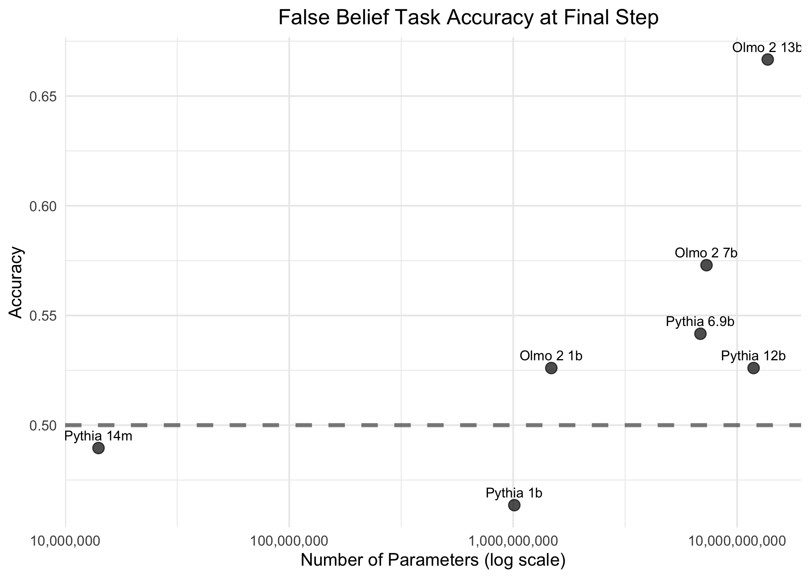<!-- -->

``` r
# PAPER FIGURE: Plot displays fb task accuracy for all steps, final step in red
ggplot(df_summ_fb, aes(x = n_params_approx, y = mean_accuracy)) +
  geom_line(aes(group = model_shorthand), alpha = 0.3, color = "gray") +
  geom_point(alpha = 0.3, size = 1, color = "gray") +
  geom_point(data = final_accuracy, size = 4, 
             aes(color = model_family), 
             alpha = 0.8) +
  geom_hline(yintercept = .5, linetype = "dashed",
             size = 1.2, alpha = .5) +
  scale_color_manual(values = viridisLite::viridis(2, option = "mako", 
                                                  begin = 0.8, end = 0.15)) + 
  geom_text_repel(data = final_accuracy, aes(label = model_shorthand), size = 3) +
  scale_x_log10(labels = scales::comma_format()) +
  labs(
    title = "False Belief Task Accuracy: Progression and Final Step",
    subtitle = "Red points highlight accuracy at final pretraining step",
    x = "Number of Parameters (log scale)",
    y = "Accuracy"
  ) +
  theme_minimal()
```

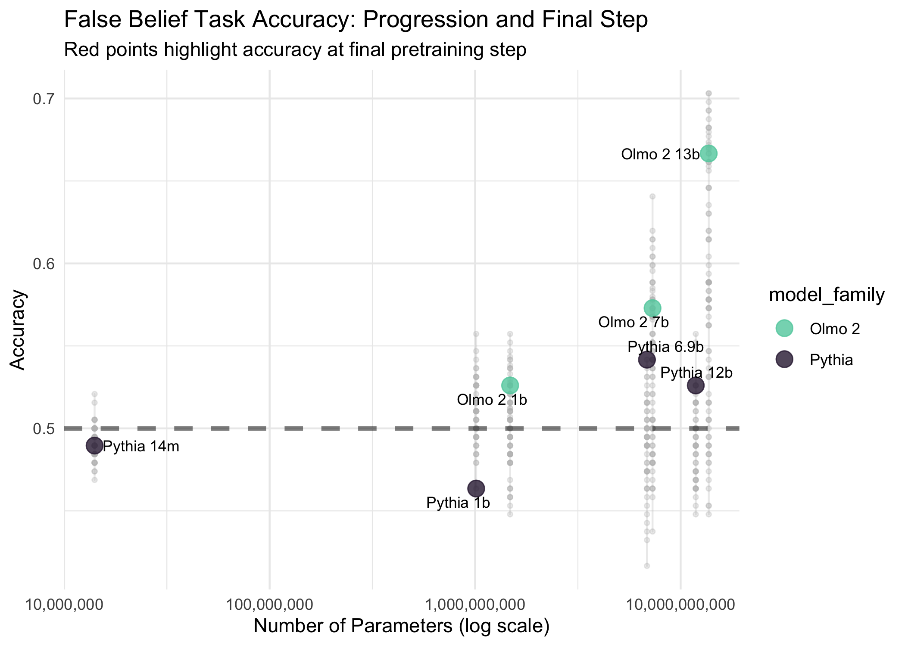<!-- -->

``` r
df_summ_fb %>%
  mutate(step_modded = step + 1) %>%
  ggplot(aes(x = step_modded,
             y = mean_accuracy,
             color = model_shorthand)) +
  #geom_point(size = 3,
  #           alpha = .7) +
  geom_hline(yintercept = .83,##TODO: Calculate from scratch
             linetype = "dotted", color = "red",
             size = 1.2, alpha = .8) + 
  geom_line(size = 1) +
  geom_hline(yintercept = .5, linetype = "dotted",
             size = 1.2, alpha = .5) +
  scale_x_log10() +
  # geom_text_repel(aes(label=model_shorthand), size=3) +
  scale_y_continuous(limits = c(0, 1)) +
  labs(x = "Step",
       y = "Accuracy",
       color = "",
       shape = "") +
  theme_bw() +
  scale_color_manual(values = viridisLite::viridis(7, option = "mako", 
                                                  begin = 0.8, end = 0.15)) +
  theme(text = element_text(size = 15),
        legend.position="bottom") +
  facet_wrap(~stage)
```

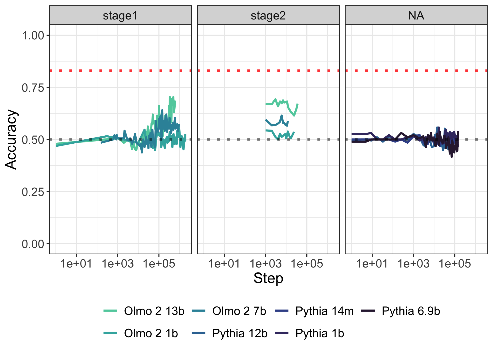<!-- -->

``` r
df_summ_fb %>%
  ggplot(aes(x = tokens_seen_numeric_mod,
             y = mean_accuracy,
             color = model_shorthand)) +
  #geom_point(size = 3,
    #         alpha = .7) +
  geom_line(size = 1, alpha=0.7) +
  geom_hline(yintercept = .5, linetype = "dashed",
             size = 1.2, alpha = .5) +
  scale_x_log10(labels = scales::comma_format()) +
  # geom_text_repel(aes(label=model_shorthand), size=3) +
  scale_y_continuous(limits = c(0, 1)) +
  labs(x = "Tokens Seen",
       y = "Accuracy",
       color = "",
       shape = "") +
  theme_bw() +
  scale_color_manual(values = viridisLite::viridis(7, option = "mako", 
                                                  begin = 0.9, end = 0.15)) +
  theme(text = element_text(size = 15),
        legend.position="bottom") +
  facet_wrap(~stage)
```

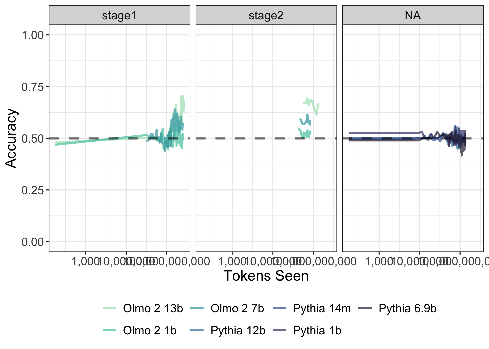<!-- -->

``` r
# PAPER FIGURE: Plot of Olmo stage1 and Pythias
df_summ_fb %>%
  filter(stage == "stage1" | is.na(stage)) %>%
  ggplot(aes(x = tokens_seen_numeric_mod,
             y = mean_accuracy,
             color = model_shorthand)) +
  geom_line(size = 1.5, alpha = 0.8) +
  geom_hline(yintercept = .5, linetype = "dashed",
             size = 1.2, alpha = .5) +
  scale_x_log10(labels = scales::comma_format()) +
  # geom_text_repel(aes(label=model_shorthand), size=3) +
  #scale_y_continuous(limits = c(0.25, 0.75)) +
  labs(x = "Tokens Seen",
       y = "Accuracy",
       color = "",
       shape = "") +
  theme_bw() +
  scale_color_manual(values = viridisLite::viridis(7, option = "mako", 
                                                  begin = 0.8, end = 0.1)) +
  labs(
    title = "False Belief Task Accuracy Over Pretraining",
    x = "Number of Tokens Seen (log scale)",
    y = "Accuracy"
  ) +
  theme_minimal() + 
  theme(text = element_text(size = 15),
        legend.position="bottom") 
```

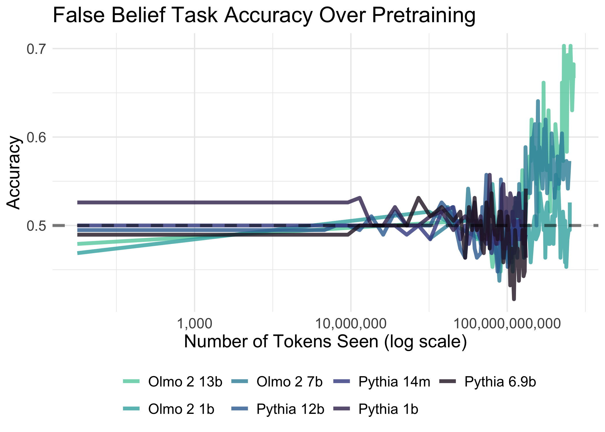<!-- -->

``` r
# Filter for only stage1 olmo data and pythia models (e.g. exclude olmo stage2)
olmo_and_pythia <- df_all_models_fb %>%
  filter(stage == "stage1" | is.na(stage)) 
  
### PAPER LMER: How do model properties predict the probability of a correct response?
mod_full = glmer(data = olmo_and_pythia,
                 correct ~ condition + knowledge_cue + 
                   log10(tokens_seen_numeric_mod) +
                   (1 | start) +
                   (1 | model_shorthand),
                 family = binomial())
summary(mod_full)
```

```
## Generalized linear mixed model fit by maximum likelihood (Laplace
##   Approximation) [glmerMod]
##  Family: binomial  ( logit )
## Formula: 
## correct ~ condition + knowledge_cue + log10(tokens_seen_numeric_mod) +  
##     (1 | start) + (1 | model_shorthand)
##    Data: olmo_and_pythia
## 
##       AIC       BIC    logLik -2*log(L)  df.resid 
##  108729.2  108784.9  -54358.6  108717.2     80058 
## 
## Scaled residuals: 
##     Min      1Q  Median      3Q     Max 
## -1.5053 -0.9692  0.7153  0.9369  1.4325 
## 
## Random effects:
##  Groups          Name        Variance Std.Dev.
##  start           (Intercept) 0.011809 0.10867 
##  model_shorthand (Intercept) 0.009687 0.09842 
## Number of obs: 80064, groups:  start, 10; model_shorthand, 7
## 
## Fixed effects:
##                                 Estimate Std. Error z value Pr(>|z|)    
## (Intercept)                    -0.354589   0.069207  -5.124    3e-07 ***
## conditionTrue Belief            0.586820   0.014350  40.894  < 2e-16 ***
## knowledge_cueImplicit          -0.134477   0.014346  -9.374  < 2e-16 ***
## log10(tokens_seen_numeric_mod)  0.015501   0.004283   3.619 0.000295 ***
## ---
## Signif. codes:  0 '***' 0.001 '**' 0.01 '*' 0.05 '.' 0.1 ' ' 1
## 
## Correlation of Fixed Effects:
##             (Intr) cndtTB knwl_I
## condtnTrBlf -0.105              
## knwldg_cImp -0.102 -0.010       
## lg10(tk___) -0.657  0.004 -0.001
```

``` r
### Plot coefficients
df_coef <- broom.mixed::tidy(mod_full, effects = "fixed") %>%
  mutate(term = forcats::fct_reorder(term, estimate))


df_coef %>%
  filter(term != "(Intercept)") %>%
  ggplot(aes(x = term, y = estimate)) +
  geom_point() +
  geom_errorbar(aes(ymin = estimate - std.error, ymax = estimate + std.error),
                width = 0.2) +
  geom_hline(yintercept = 0, linetype = "dashed", color = "gray40") +
  coord_flip() +
  labs(
    x = NULL, y = "Coefficient Estimate",
  ) +
  theme_minimal(base_size = 12)
```

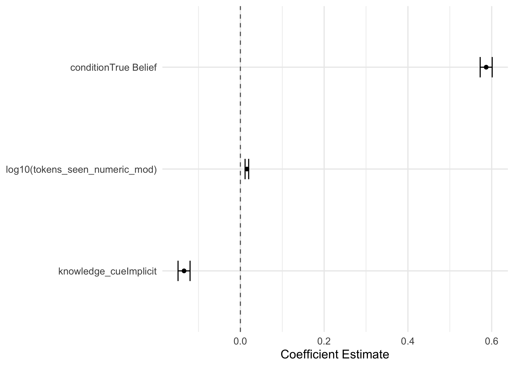<!-- -->

``` r
# write.csv(df_summ, "../../data/processed/summaries/fb_summary.csv")
```

## Phase shift modeling

Here, we predict the probability of a correct response over tokens seen, focusing on stage 1.

### Using GAM


``` r
library(mgcv)
```

```
## Loading required package: nlme
```

```
## 
## Attaching package: 'nlme'
```

```
## The following object is masked from 'package:lme4':
## 
##     lmList
```

```
## The following object is masked from 'package:dplyr':
## 
##     collapse
```

```
## This is mgcv 1.9-1. For overview type 'help("mgcv-package")'.
```

``` r
library(dplyr)
library(purrr)

# Aggregate to get accuracy per checkpoint (helps GAM fit) for just Olmo stage1 & pythia
df_summary_fb <- olmo_and_pythia %>%
  filter(stage == "stage1" | is.na(stage)) %>%
  group_by(model_shorthand, 
           condition, 
           knowledge_cue,
           step,
           tokens_seen_numeric_mod) %>%
  summarise(acc = mean(correct), .groups = "drop") %>%
  mutate(log_tokens = log10(tokens_seen_numeric_mod))


# Fit a GAM for each model separately
fits <- df_summary_fb %>%
  group_split(model_shorthand) %>%
  set_names(map_chr(., ~ unique(.$model_shorthand))) %>%
  map(~ gam(acc ~ s(tokens_seen_numeric_mod, k = 10),
            data = ., family = binomial(link = "logit")))  # logistic is natural for accuracy
```

```
## Warning in eval(family$initialize): non-integer #successes in a binomial glm!
## Warning in eval(family$initialize): non-integer #successes in a binomial glm!
## Warning in eval(family$initialize): non-integer #successes in a binomial glm!
## Warning in eval(family$initialize): non-integer #successes in a binomial glm!
## Warning in eval(family$initialize): non-integer #successes in a binomial glm!
## Warning in eval(family$initialize): non-integer #successes in a binomial glm!
## Warning in eval(family$initialize): non-integer #successes in a binomial glm!
## Warning in eval(family$initialize): non-integer #successes in a binomial glm!
## Warning in eval(family$initialize): non-integer #successes in a binomial glm!
## Warning in eval(family$initialize): non-integer #successes in a binomial glm!
## Warning in eval(family$initialize): non-integer #successes in a binomial glm!
## Warning in eval(family$initialize): non-integer #successes in a binomial glm!
## Warning in eval(family$initialize): non-integer #successes in a binomial glm!
## Warning in eval(family$initialize): non-integer #successes in a binomial glm!
## Warning in eval(family$initialize): non-integer #successes in a binomial glm!
## Warning in eval(family$initialize): non-integer #successes in a binomial glm!
## Warning in eval(family$initialize): non-integer #successes in a binomial glm!
## Warning in eval(family$initialize): non-integer #successes in a binomial glm!
## Warning in eval(family$initialize): non-integer #successes in a binomial glm!
## Warning in eval(family$initialize): non-integer #successes in a binomial glm!
## Warning in eval(family$initialize): non-integer #successes in a binomial glm!
## Warning in eval(family$initialize): non-integer #successes in a binomial glm!
## Warning in eval(family$initialize): non-integer #successes in a binomial glm!
## Warning in eval(family$initialize): non-integer #successes in a binomial glm!
## Warning in eval(family$initialize): non-integer #successes in a binomial glm!
## Warning in eval(family$initialize): non-integer #successes in a binomial glm!
## Warning in eval(family$initialize): non-integer #successes in a binomial glm!
## Warning in eval(family$initialize): non-integer #successes in a binomial glm!
## Warning in eval(family$initialize): non-integer #successes in a binomial glm!
## Warning in eval(family$initialize): non-integer #successes in a binomial glm!
## Warning in eval(family$initialize): non-integer #successes in a binomial glm!
## Warning in eval(family$initialize): non-integer #successes in a binomial glm!
## Warning in eval(family$initialize): non-integer #successes in a binomial glm!
## Warning in eval(family$initialize): non-integer #successes in a binomial glm!
## Warning in eval(family$initialize): non-integer #successes in a binomial glm!
## Warning in eval(family$initialize): non-integer #successes in a binomial glm!
## Warning in eval(family$initialize): non-integer #successes in a binomial glm!
## Warning in eval(family$initialize): non-integer #successes in a binomial glm!
## Warning in eval(family$initialize): non-integer #successes in a binomial glm!
## Warning in eval(family$initialize): non-integer #successes in a binomial glm!
## Warning in eval(family$initialize): non-integer #successes in a binomial glm!
## Warning in eval(family$initialize): non-integer #successes in a binomial glm!
## Warning in eval(family$initialize): non-integer #successes in a binomial glm!
## Warning in eval(family$initialize): non-integer #successes in a binomial glm!
## Warning in eval(family$initialize): non-integer #successes in a binomial glm!
## Warning in eval(family$initialize): non-integer #successes in a binomial glm!
## Warning in eval(family$initialize): non-integer #successes in a binomial glm!
## Warning in eval(family$initialize): non-integer #successes in a binomial glm!
## Warning in eval(family$initialize): non-integer #successes in a binomial glm!
## Warning in eval(family$initialize): non-integer #successes in a binomial glm!
## Warning in eval(family$initialize): non-integer #successes in a binomial glm!
## Warning in eval(family$initialize): non-integer #successes in a binomial glm!
## Warning in eval(family$initialize): non-integer #successes in a binomial glm!
## Warning in eval(family$initialize): non-integer #successes in a binomial glm!
## Warning in eval(family$initialize): non-integer #successes in a binomial glm!
## Warning in eval(family$initialize): non-integer #successes in a binomial glm!
## Warning in eval(family$initialize): non-integer #successes in a binomial glm!
## Warning in eval(family$initialize): non-integer #successes in a binomial glm!
## Warning in eval(family$initialize): non-integer #successes in a binomial glm!
## Warning in eval(family$initialize): non-integer #successes in a binomial glm!
## Warning in eval(family$initialize): non-integer #successes in a binomial glm!
## Warning in eval(family$initialize): non-integer #successes in a binomial glm!
## Warning in eval(family$initialize): non-integer #successes in a binomial glm!
## Warning in eval(family$initialize): non-integer #successes in a binomial glm!
## Warning in eval(family$initialize): non-integer #successes in a binomial glm!
## Warning in eval(family$initialize): non-integer #successes in a binomial glm!
## Warning in eval(family$initialize): non-integer #successes in a binomial glm!
## Warning in eval(family$initialize): non-integer #successes in a binomial glm!
## Warning in eval(family$initialize): non-integer #successes in a binomial glm!
## Warning in eval(family$initialize): non-integer #successes in a binomial glm!
## Warning in eval(family$initialize): non-integer #successes in a binomial glm!
## Warning in eval(family$initialize): non-integer #successes in a binomial glm!
## Warning in eval(family$initialize): non-integer #successes in a binomial glm!
## Warning in eval(family$initialize): non-integer #successes in a binomial glm!
## Warning in eval(family$initialize): non-integer #successes in a binomial glm!
## Warning in eval(family$initialize): non-integer #successes in a binomial glm!
## Warning in eval(family$initialize): non-integer #successes in a binomial glm!
## Warning in eval(family$initialize): non-integer #successes in a binomial glm!
## Warning in eval(family$initialize): non-integer #successes in a binomial glm!
## Warning in eval(family$initialize): non-integer #successes in a binomial glm!
## Warning in eval(family$initialize): non-integer #successes in a binomial glm!
## Warning in eval(family$initialize): non-integer #successes in a binomial glm!
## Warning in eval(family$initialize): non-integer #successes in a binomial glm!
## Warning in eval(family$initialize): non-integer #successes in a binomial glm!
```

``` r
df_pred <- map2_df(fits, names(fits), function(mod, name) {
  newdat <- data.frame(tokens_seen_numeric_mod = seq(min(df_summary_fb$tokens_seen_numeric_mod),
                                        max(df_summary_fb$tokens_seen_numeric_mod),
                                        length.out = 200))
  newdat$acc_hat <- predict(mod, newdat, type = "response")
  newdat$model_shorthand <- name
  newdat
})

# PAPER FIGURE: plot of GAM fits for each model
ggplot(df_summary_fb, aes(x = tokens_seen_numeric_mod, y = acc, color = model_shorthand)) +
  geom_point(alpha = 0.3) +
  geom_line(data = df_pred, aes(y = acc_hat), size = 1.2) +
  scale_color_manual(values = viridisLite::viridis(7, option = "mako", 
                                                  begin = 0.8, end = 0.15)) +
  scale_x_log10(labels = scales::comma_format()) +
  labs(
    title = "Development of False Belief Task Performance",
    x = "Number of Tokens Seen (log scale)",
    y = "Accuracy"
  ) +
  theme_minimal()
```

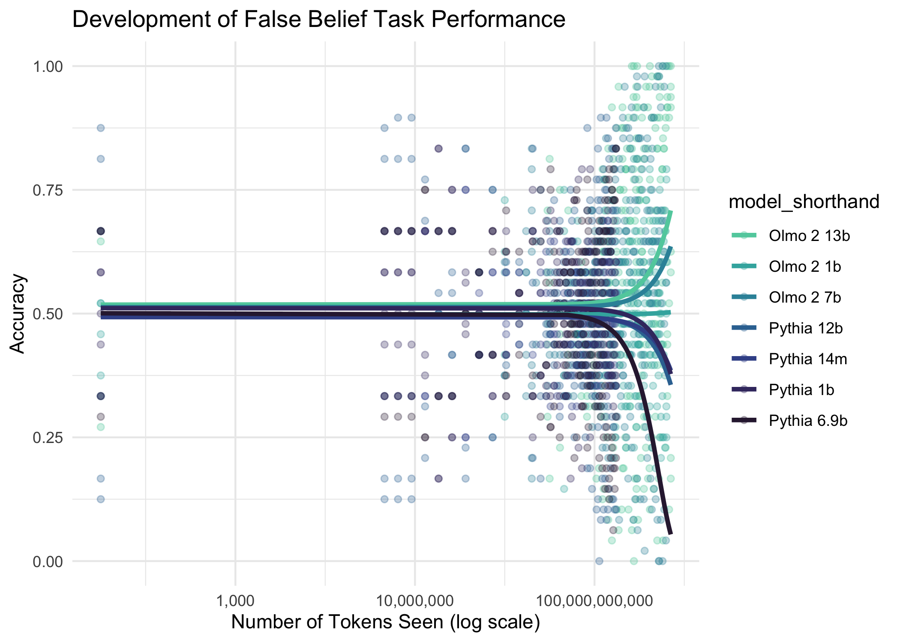<!-- -->

``` r
### TODO: Identify inflection points
```


# Situation Model -- Attention Check Results


**TODO**: Unlike the original task, these aren't necessarily balanced; so differences in probability of start vs. end location, or which person, could also affect accuracy. Could check on this too.


``` r
directory_path <- "../../data/processed/attn-checks-local/"

csv_files <- list.files(path = directory_path, pattern = "*.csv", full.names = TRUE)
csv_list <- csv_files %>%
  map(~ read_csv(.))
```

```
## Rows: 768 Columns: 17
## ── Column specification ────────────────────────────────────────────────────────
## Delimiter: ","
## chr (7): question, correct_answer, distractor_answer, model_path, model_shor...
## dbl (6): item, question_id, prob_correct, prob_distractor, log_odds, step
## lgl (4): item_id, condition, is_correct, ingredient
## 
## ℹ Use `spec()` to retrieve the full column specification for this data.
## ℹ Specify the column types or set `show_col_types = FALSE` to quiet this message.
## Rows: 768 Columns: 17
## ── Column specification ────────────────────────────────────────────────────────
## Delimiter: ","
## chr (7): question, correct_answer, distractor_answer, model_path, model_shor...
## dbl (6): item, question_id, prob_correct, prob_distractor, log_odds, step
## lgl (4): item_id, condition, is_correct, ingredient
## 
## ℹ Use `spec()` to retrieve the full column specification for this data.
## ℹ Specify the column types or set `show_col_types = FALSE` to quiet this message.
## Rows: 768 Columns: 17
## ── Column specification ────────────────────────────────────────────────────────
## Delimiter: ","
## chr (7): question, correct_answer, distractor_answer, model_path, model_shor...
## dbl (6): item, question_id, prob_correct, prob_distractor, log_odds, step
## lgl (4): item_id, condition, is_correct, ingredient
## 
## ℹ Use `spec()` to retrieve the full column specification for this data.
## ℹ Specify the column types or set `show_col_types = FALSE` to quiet this message.
## Rows: 768 Columns: 17
## ── Column specification ────────────────────────────────────────────────────────
## Delimiter: ","
## chr (7): question, correct_answer, distractor_answer, model_path, model_shor...
## dbl (6): item, question_id, prob_correct, prob_distractor, log_odds, step
## lgl (4): item_id, condition, is_correct, ingredient
## 
## ℹ Use `spec()` to retrieve the full column specification for this data.
## ℹ Specify the column types or set `show_col_types = FALSE` to quiet this message.
## Rows: 768 Columns: 17
## ── Column specification ────────────────────────────────────────────────────────
## Delimiter: ","
## chr (7): question, correct_answer, distractor_answer, model_path, model_shor...
## dbl (6): item, question_id, prob_correct, prob_distractor, log_odds, step
## lgl (4): item_id, condition, is_correct, ingredient
## 
## ℹ Use `spec()` to retrieve the full column specification for this data.
## ℹ Specify the column types or set `show_col_types = FALSE` to quiet this message.
## Rows: 768 Columns: 17
## ── Column specification ────────────────────────────────────────────────────────
## Delimiter: ","
## chr (7): question, correct_answer, distractor_answer, model_path, model_shor...
## dbl (6): item, question_id, prob_correct, prob_distractor, log_odds, step
## lgl (4): item_id, condition, is_correct, ingredient
## 
## ℹ Use `spec()` to retrieve the full column specification for this data.
## ℹ Specify the column types or set `show_col_types = FALSE` to quiet this message.
## Rows: 768 Columns: 17
## ── Column specification ────────────────────────────────────────────────────────
## Delimiter: ","
## chr (7): question, correct_answer, distractor_answer, model_path, model_shor...
## dbl (6): item, question_id, prob_correct, prob_distractor, log_odds, step
## lgl (4): item_id, condition, is_correct, ingredient
## 
## ℹ Use `spec()` to retrieve the full column specification for this data.
## ℹ Specify the column types or set `show_col_types = FALSE` to quiet this message.
## Rows: 768 Columns: 17
## ── Column specification ────────────────────────────────────────────────────────
## Delimiter: ","
## chr (7): question, correct_answer, distractor_answer, model_path, model_shor...
## dbl (6): item, question_id, prob_correct, prob_distractor, log_odds, step
## lgl (4): item_id, condition, is_correct, ingredient
## 
## ℹ Use `spec()` to retrieve the full column specification for this data.
## ℹ Specify the column types or set `show_col_types = FALSE` to quiet this message.
## Rows: 768 Columns: 17
## ── Column specification ────────────────────────────────────────────────────────
## Delimiter: ","
## chr (7): question, correct_answer, distractor_answer, model_path, model_shor...
## dbl (6): item, question_id, prob_correct, prob_distractor, log_odds, step
## lgl (4): item_id, condition, is_correct, ingredient
## 
## ℹ Use `spec()` to retrieve the full column specification for this data.
## ℹ Specify the column types or set `show_col_types = FALSE` to quiet this message.
## Rows: 768 Columns: 17
## ── Column specification ────────────────────────────────────────────────────────
## Delimiter: ","
## chr (7): question, correct_answer, distractor_answer, model_path, model_shor...
## dbl (6): item, question_id, prob_correct, prob_distractor, log_odds, step
## lgl (4): item_id, condition, is_correct, ingredient
## 
## ℹ Use `spec()` to retrieve the full column specification for this data.
## ℹ Specify the column types or set `show_col_types = FALSE` to quiet this message.
## Rows: 768 Columns: 17
## ── Column specification ────────────────────────────────────────────────────────
## Delimiter: ","
## chr (7): question, correct_answer, distractor_answer, model_path, model_shor...
## dbl (6): item, question_id, prob_correct, prob_distractor, log_odds, step
## lgl (4): item_id, condition, is_correct, ingredient
## 
## ℹ Use `spec()` to retrieve the full column specification for this data.
## ℹ Specify the column types or set `show_col_types = FALSE` to quiet this message.
## Rows: 768 Columns: 17
## ── Column specification ────────────────────────────────────────────────────────
## Delimiter: ","
## chr (7): question, correct_answer, distractor_answer, model_path, model_shor...
## dbl (6): item, question_id, prob_correct, prob_distractor, log_odds, step
## lgl (4): item_id, condition, is_correct, ingredient
## 
## ℹ Use `spec()` to retrieve the full column specification for this data.
## ℹ Specify the column types or set `show_col_types = FALSE` to quiet this message.
## Rows: 768 Columns: 17
## ── Column specification ────────────────────────────────────────────────────────
## Delimiter: ","
## chr (7): question, correct_answer, distractor_answer, model_path, model_shor...
## dbl (6): item, question_id, prob_correct, prob_distractor, log_odds, step
## lgl (4): item_id, condition, is_correct, ingredient
## 
## ℹ Use `spec()` to retrieve the full column specification for this data.
## ℹ Specify the column types or set `show_col_types = FALSE` to quiet this message.
## Rows: 768 Columns: 17
## ── Column specification ────────────────────────────────────────────────────────
## Delimiter: ","
## chr (7): question, correct_answer, distractor_answer, model_path, model_shor...
## dbl (6): item, question_id, prob_correct, prob_distractor, log_odds, step
## lgl (4): item_id, condition, is_correct, ingredient
## 
## ℹ Use `spec()` to retrieve the full column specification for this data.
## ℹ Specify the column types or set `show_col_types = FALSE` to quiet this message.
## Rows: 768 Columns: 17
## ── Column specification ────────────────────────────────────────────────────────
## Delimiter: ","
## chr (7): question, correct_answer, distractor_answer, model_path, model_shor...
## dbl (6): item, question_id, prob_correct, prob_distractor, log_odds, step
## lgl (4): item_id, condition, is_correct, ingredient
## 
## ℹ Use `spec()` to retrieve the full column specification for this data.
## ℹ Specify the column types or set `show_col_types = FALSE` to quiet this message.
## Rows: 768 Columns: 17
## ── Column specification ────────────────────────────────────────────────────────
## Delimiter: ","
## chr (7): question, correct_answer, distractor_answer, model_path, model_shor...
## dbl (6): item, question_id, prob_correct, prob_distractor, log_odds, step
## lgl (4): item_id, condition, is_correct, ingredient
## 
## ℹ Use `spec()` to retrieve the full column specification for this data.
## ℹ Specify the column types or set `show_col_types = FALSE` to quiet this message.
## Rows: 768 Columns: 17
## ── Column specification ────────────────────────────────────────────────────────
## Delimiter: ","
## chr (7): question, correct_answer, distractor_answer, model_path, model_shor...
## dbl (6): item, question_id, prob_correct, prob_distractor, log_odds, step
## lgl (4): item_id, condition, is_correct, ingredient
## 
## ℹ Use `spec()` to retrieve the full column specification for this data.
## ℹ Specify the column types or set `show_col_types = FALSE` to quiet this message.
## Rows: 768 Columns: 17
## ── Column specification ────────────────────────────────────────────────────────
## Delimiter: ","
## chr (7): question, correct_answer, distractor_answer, model_path, model_shor...
## dbl (6): item, question_id, prob_correct, prob_distractor, log_odds, step
## lgl (4): item_id, condition, is_correct, ingredient
## 
## ℹ Use `spec()` to retrieve the full column specification for this data.
## ℹ Specify the column types or set `show_col_types = FALSE` to quiet this message.
## Rows: 768 Columns: 17
## ── Column specification ────────────────────────────────────────────────────────
## Delimiter: ","
## chr (7): question, correct_answer, distractor_answer, model_path, model_shor...
## dbl (6): item, question_id, prob_correct, prob_distractor, log_odds, step
## lgl (4): item_id, condition, is_correct, ingredient
## 
## ℹ Use `spec()` to retrieve the full column specification for this data.
## ℹ Specify the column types or set `show_col_types = FALSE` to quiet this message.
## Rows: 768 Columns: 17
## ── Column specification ────────────────────────────────────────────────────────
## Delimiter: ","
## chr (7): question, correct_answer, distractor_answer, model_path, model_shor...
## dbl (6): item, question_id, prob_correct, prob_distractor, log_odds, step
## lgl (4): item_id, condition, is_correct, ingredient
## 
## ℹ Use `spec()` to retrieve the full column specification for this data.
## ℹ Specify the column types or set `show_col_types = FALSE` to quiet this message.
## Rows: 768 Columns: 17
## ── Column specification ────────────────────────────────────────────────────────
## Delimiter: ","
## chr (7): question, correct_answer, distractor_answer, model_path, model_shor...
## dbl (6): item, question_id, prob_correct, prob_distractor, log_odds, step
## lgl (4): item_id, condition, is_correct, ingredient
## 
## ℹ Use `spec()` to retrieve the full column specification for this data.
## ℹ Specify the column types or set `show_col_types = FALSE` to quiet this message.
## Rows: 768 Columns: 17
## ── Column specification ────────────────────────────────────────────────────────
## Delimiter: ","
## chr (7): question, correct_answer, distractor_answer, model_path, model_shor...
## dbl (6): item, question_id, prob_correct, prob_distractor, log_odds, step
## lgl (4): item_id, condition, is_correct, ingredient
## 
## ℹ Use `spec()` to retrieve the full column specification for this data.
## ℹ Specify the column types or set `show_col_types = FALSE` to quiet this message.
## Rows: 768 Columns: 17
## ── Column specification ────────────────────────────────────────────────────────
## Delimiter: ","
## chr (7): question, correct_answer, distractor_answer, model_path, model_shor...
## dbl (6): item, question_id, prob_correct, prob_distractor, log_odds, step
## lgl (4): item_id, condition, is_correct, ingredient
## 
## ℹ Use `spec()` to retrieve the full column specification for this data.
## ℹ Specify the column types or set `show_col_types = FALSE` to quiet this message.
## Rows: 768 Columns: 17
## ── Column specification ────────────────────────────────────────────────────────
## Delimiter: ","
## chr (7): question, correct_answer, distractor_answer, model_path, model_shor...
## dbl (6): item, question_id, prob_correct, prob_distractor, log_odds, step
## lgl (4): item_id, condition, is_correct, ingredient
## 
## ℹ Use `spec()` to retrieve the full column specification for this data.
## ℹ Specify the column types or set `show_col_types = FALSE` to quiet this message.
## Rows: 768 Columns: 17
## ── Column specification ────────────────────────────────────────────────────────
## Delimiter: ","
## chr (7): question, correct_answer, distractor_answer, model_path, model_shor...
## dbl (6): item, question_id, prob_correct, prob_distractor, log_odds, step
## lgl (4): item_id, condition, is_correct, ingredient
## 
## ℹ Use `spec()` to retrieve the full column specification for this data.
## ℹ Specify the column types or set `show_col_types = FALSE` to quiet this message.
## Rows: 768 Columns: 17
## ── Column specification ────────────────────────────────────────────────────────
## Delimiter: ","
## chr (7): question, correct_answer, distractor_answer, model_path, model_shor...
## dbl (6): item, question_id, prob_correct, prob_distractor, log_odds, step
## lgl (4): item_id, condition, is_correct, ingredient
## 
## ℹ Use `spec()` to retrieve the full column specification for this data.
## ℹ Specify the column types or set `show_col_types = FALSE` to quiet this message.
## Rows: 768 Columns: 17
## ── Column specification ────────────────────────────────────────────────────────
## Delimiter: ","
## chr (7): question, correct_answer, distractor_answer, model_path, model_shor...
## dbl (6): item, question_id, prob_correct, prob_distractor, log_odds, step
## lgl (4): item_id, condition, is_correct, ingredient
## 
## ℹ Use `spec()` to retrieve the full column specification for this data.
## ℹ Specify the column types or set `show_col_types = FALSE` to quiet this message.
## Rows: 768 Columns: 17
## ── Column specification ────────────────────────────────────────────────────────
## Delimiter: ","
## chr (7): question, correct_answer, distractor_answer, model_path, model_shor...
## dbl (6): item, question_id, prob_correct, prob_distractor, log_odds, step
## lgl (4): item_id, condition, is_correct, ingredient
## 
## ℹ Use `spec()` to retrieve the full column specification for this data.
## ℹ Specify the column types or set `show_col_types = FALSE` to quiet this message.
## Rows: 768 Columns: 17
## ── Column specification ────────────────────────────────────────────────────────
## Delimiter: ","
## chr (7): question, correct_answer, distractor_answer, model_path, model_shor...
## dbl (6): item, question_id, prob_correct, prob_distractor, log_odds, step
## lgl (4): item_id, condition, is_correct, ingredient
## 
## ℹ Use `spec()` to retrieve the full column specification for this data.
## ℹ Specify the column types or set `show_col_types = FALSE` to quiet this message.
## Rows: 768 Columns: 17
## ── Column specification ────────────────────────────────────────────────────────
## Delimiter: ","
## chr (7): question, correct_answer, distractor_answer, model_path, model_shor...
## dbl (6): item, question_id, prob_correct, prob_distractor, log_odds, step
## lgl (4): item_id, condition, is_correct, ingredient
## 
## ℹ Use `spec()` to retrieve the full column specification for this data.
## ℹ Specify the column types or set `show_col_types = FALSE` to quiet this message.
## Rows: 768 Columns: 17
## ── Column specification ────────────────────────────────────────────────────────
## Delimiter: ","
## chr (7): question, correct_answer, distractor_answer, model_path, model_shor...
## dbl (6): item, question_id, prob_correct, prob_distractor, log_odds, step
## lgl (4): item_id, condition, is_correct, ingredient
## 
## ℹ Use `spec()` to retrieve the full column specification for this data.
## ℹ Specify the column types or set `show_col_types = FALSE` to quiet this message.
## Rows: 768 Columns: 17
## ── Column specification ────────────────────────────────────────────────────────
## Delimiter: ","
## chr (7): question, correct_answer, distractor_answer, model_path, model_shor...
## dbl (6): item, question_id, prob_correct, prob_distractor, log_odds, step
## lgl (4): item_id, condition, is_correct, ingredient
## 
## ℹ Use `spec()` to retrieve the full column specification for this data.
## ℹ Specify the column types or set `show_col_types = FALSE` to quiet this message.
## Rows: 768 Columns: 17
## ── Column specification ────────────────────────────────────────────────────────
## Delimiter: ","
## chr (7): question, correct_answer, distractor_answer, model_path, model_shor...
## dbl (6): item, question_id, prob_correct, prob_distractor, log_odds, step
## lgl (4): item_id, condition, is_correct, ingredient
## 
## ℹ Use `spec()` to retrieve the full column specification for this data.
## ℹ Specify the column types or set `show_col_types = FALSE` to quiet this message.
## Rows: 768 Columns: 17
## ── Column specification ────────────────────────────────────────────────────────
## Delimiter: ","
## chr (7): question, correct_answer, distractor_answer, model_path, model_shor...
## dbl (6): item, question_id, prob_correct, prob_distractor, log_odds, step
## lgl (4): item_id, condition, is_correct, ingredient
## 
## ℹ Use `spec()` to retrieve the full column specification for this data.
## ℹ Specify the column types or set `show_col_types = FALSE` to quiet this message.
## Rows: 768 Columns: 17
## ── Column specification ────────────────────────────────────────────────────────
## Delimiter: ","
## chr (7): question, correct_answer, distractor_answer, model_path, model_shor...
## dbl (6): item, question_id, prob_correct, prob_distractor, log_odds, step
## lgl (4): item_id, condition, is_correct, ingredient
## 
## ℹ Use `spec()` to retrieve the full column specification for this data.
## ℹ Specify the column types or set `show_col_types = FALSE` to quiet this message.
## Rows: 768 Columns: 17
## ── Column specification ────────────────────────────────────────────────────────
## Delimiter: ","
## chr (7): question, correct_answer, distractor_answer, model_path, model_shor...
## dbl (6): item, question_id, prob_correct, prob_distractor, log_odds, step
## lgl (4): item_id, condition, is_correct, ingredient
## 
## ℹ Use `spec()` to retrieve the full column specification for this data.
## ℹ Specify the column types or set `show_col_types = FALSE` to quiet this message.
## Rows: 768 Columns: 17
## ── Column specification ────────────────────────────────────────────────────────
## Delimiter: ","
## chr (7): question, correct_answer, distractor_answer, model_path, model_shor...
## dbl (6): item, question_id, prob_correct, prob_distractor, log_odds, step
## lgl (4): item_id, condition, is_correct, ingredient
## 
## ℹ Use `spec()` to retrieve the full column specification for this data.
## ℹ Specify the column types or set `show_col_types = FALSE` to quiet this message.
## Rows: 768 Columns: 17
## ── Column specification ────────────────────────────────────────────────────────
## Delimiter: ","
## chr (7): question, correct_answer, distractor_answer, model_path, model_shor...
## dbl (6): item, question_id, prob_correct, prob_distractor, log_odds, step
## lgl (4): item_id, condition, is_correct, ingredient
## 
## ℹ Use `spec()` to retrieve the full column specification for this data.
## ℹ Specify the column types or set `show_col_types = FALSE` to quiet this message.
## Rows: 768 Columns: 17
## ── Column specification ────────────────────────────────────────────────────────
## Delimiter: ","
## chr (7): question, correct_answer, distractor_answer, model_path, model_shor...
## dbl (6): item, question_id, prob_correct, prob_distractor, log_odds, step
## lgl (4): item_id, condition, is_correct, ingredient
## 
## ℹ Use `spec()` to retrieve the full column specification for this data.
## ℹ Specify the column types or set `show_col_types = FALSE` to quiet this message.
## Rows: 768 Columns: 17
## ── Column specification ────────────────────────────────────────────────────────
## Delimiter: ","
## chr (7): question, correct_answer, distractor_answer, model_path, model_shor...
## dbl (6): item, question_id, prob_correct, prob_distractor, log_odds, step
## lgl (4): item_id, condition, is_correct, ingredient
## 
## ℹ Use `spec()` to retrieve the full column specification for this data.
## ℹ Specify the column types or set `show_col_types = FALSE` to quiet this message.
## Rows: 768 Columns: 17
## ── Column specification ────────────────────────────────────────────────────────
## Delimiter: ","
## chr (7): question, correct_answer, distractor_answer, model_path, model_shor...
## dbl (6): item, question_id, prob_correct, prob_distractor, log_odds, step
## lgl (4): item_id, condition, is_correct, ingredient
## 
## ℹ Use `spec()` to retrieve the full column specification for this data.
## ℹ Specify the column types or set `show_col_types = FALSE` to quiet this message.
## Rows: 768 Columns: 17
## ── Column specification ────────────────────────────────────────────────────────
## Delimiter: ","
## chr (7): question, correct_answer, distractor_answer, model_path, model_shor...
## dbl (6): item, question_id, prob_correct, prob_distractor, log_odds, step
## lgl (4): item_id, condition, is_correct, ingredient
## 
## ℹ Use `spec()` to retrieve the full column specification for this data.
## ℹ Specify the column types or set `show_col_types = FALSE` to quiet this message.
## Rows: 768 Columns: 17
## ── Column specification ────────────────────────────────────────────────────────
## Delimiter: ","
## chr (7): question, correct_answer, distractor_answer, model_path, model_shor...
## dbl (6): item, question_id, prob_correct, prob_distractor, log_odds, step
## lgl (4): item_id, condition, is_correct, ingredient
## 
## ℹ Use `spec()` to retrieve the full column specification for this data.
## ℹ Specify the column types or set `show_col_types = FALSE` to quiet this message.
## Rows: 768 Columns: 17
## ── Column specification ────────────────────────────────────────────────────────
## Delimiter: ","
## chr (7): question, correct_answer, distractor_answer, model_path, model_shor...
## dbl (6): item, question_id, prob_correct, prob_distractor, log_odds, step
## lgl (4): item_id, condition, is_correct, ingredient
## 
## ℹ Use `spec()` to retrieve the full column specification for this data.
## ℹ Specify the column types or set `show_col_types = FALSE` to quiet this message.
## Rows: 768 Columns: 17
## ── Column specification ────────────────────────────────────────────────────────
## Delimiter: ","
## chr (7): question, correct_answer, distractor_answer, model_path, model_shor...
## dbl (6): item, question_id, prob_correct, prob_distractor, log_odds, step
## lgl (4): item_id, condition, is_correct, ingredient
## 
## ℹ Use `spec()` to retrieve the full column specification for this data.
## ℹ Specify the column types or set `show_col_types = FALSE` to quiet this message.
## Rows: 768 Columns: 17
## ── Column specification ────────────────────────────────────────────────────────
## Delimiter: ","
## chr (7): question, correct_answer, distractor_answer, model_path, model_shor...
## dbl (6): item, question_id, prob_correct, prob_distractor, log_odds, step
## lgl (4): item_id, condition, is_correct, ingredient
## 
## ℹ Use `spec()` to retrieve the full column specification for this data.
## ℹ Specify the column types or set `show_col_types = FALSE` to quiet this message.
## Rows: 768 Columns: 17
## ── Column specification ────────────────────────────────────────────────────────
## Delimiter: ","
## chr (7): question, correct_answer, distractor_answer, model_path, model_shor...
## dbl (6): item, question_id, prob_correct, prob_distractor, log_odds, step
## lgl (4): item_id, condition, is_correct, ingredient
## 
## ℹ Use `spec()` to retrieve the full column specification for this data.
## ℹ Specify the column types or set `show_col_types = FALSE` to quiet this message.
## Rows: 768 Columns: 17
## ── Column specification ────────────────────────────────────────────────────────
## Delimiter: ","
## chr (7): question, correct_answer, distractor_answer, model_path, model_shor...
## dbl (6): item, question_id, prob_correct, prob_distractor, log_odds, step
## lgl (4): item_id, condition, is_correct, ingredient
## 
## ℹ Use `spec()` to retrieve the full column specification for this data.
## ℹ Specify the column types or set `show_col_types = FALSE` to quiet this message.
## Rows: 768 Columns: 17
## ── Column specification ────────────────────────────────────────────────────────
## Delimiter: ","
## chr (7): question, correct_answer, distractor_answer, model_path, model_shor...
## dbl (6): item, question_id, prob_correct, prob_distractor, log_odds, step
## lgl (4): item_id, condition, is_correct, ingredient
## 
## ℹ Use `spec()` to retrieve the full column specification for this data.
## ℹ Specify the column types or set `show_col_types = FALSE` to quiet this message.
## Rows: 768 Columns: 17
## ── Column specification ────────────────────────────────────────────────────────
## Delimiter: ","
## chr (7): question, correct_answer, distractor_answer, model_path, model_shor...
## dbl (6): item, question_id, prob_correct, prob_distractor, log_odds, step
## lgl (4): item_id, condition, is_correct, ingredient
## 
## ℹ Use `spec()` to retrieve the full column specification for this data.
## ℹ Specify the column types or set `show_col_types = FALSE` to quiet this message.
## Rows: 768 Columns: 17
## ── Column specification ────────────────────────────────────────────────────────
## Delimiter: ","
## chr (7): question, correct_answer, distractor_answer, model_path, model_shor...
## dbl (6): item, question_id, prob_correct, prob_distractor, log_odds, step
## lgl (4): item_id, condition, is_correct, ingredient
## 
## ℹ Use `spec()` to retrieve the full column specification for this data.
## ℹ Specify the column types or set `show_col_types = FALSE` to quiet this message.
## Rows: 768 Columns: 17
## ── Column specification ────────────────────────────────────────────────────────
## Delimiter: ","
## chr (7): question, correct_answer, distractor_answer, model_path, model_shor...
## dbl (6): item, question_id, prob_correct, prob_distractor, log_odds, step
## lgl (4): item_id, condition, is_correct, ingredient
## 
## ℹ Use `spec()` to retrieve the full column specification for this data.
## ℹ Specify the column types or set `show_col_types = FALSE` to quiet this message.
## Rows: 768 Columns: 17
## ── Column specification ────────────────────────────────────────────────────────
## Delimiter: ","
## chr (7): question, correct_answer, distractor_answer, model_path, model_shor...
## dbl (6): item, question_id, prob_correct, prob_distractor, log_odds, step
## lgl (4): item_id, condition, is_correct, ingredient
## 
## ℹ Use `spec()` to retrieve the full column specification for this data.
## ℹ Specify the column types or set `show_col_types = FALSE` to quiet this message.
## Rows: 768 Columns: 17
## ── Column specification ────────────────────────────────────────────────────────
## Delimiter: ","
## chr (7): question, correct_answer, distractor_answer, model_path, model_shor...
## dbl (6): item, question_id, prob_correct, prob_distractor, log_odds, step
## lgl (4): item_id, condition, is_correct, ingredient
## 
## ℹ Use `spec()` to retrieve the full column specification for this data.
## ℹ Specify the column types or set `show_col_types = FALSE` to quiet this message.
## Rows: 768 Columns: 17
## ── Column specification ────────────────────────────────────────────────────────
## Delimiter: ","
## chr (7): question, correct_answer, distractor_answer, model_path, model_shor...
## dbl (6): item, question_id, prob_correct, prob_distractor, log_odds, step
## lgl (4): item_id, condition, is_correct, ingredient
## 
## ℹ Use `spec()` to retrieve the full column specification for this data.
## ℹ Specify the column types or set `show_col_types = FALSE` to quiet this message.
## Rows: 768 Columns: 17
## ── Column specification ────────────────────────────────────────────────────────
## Delimiter: ","
## chr (8): question, correct_answer, distractor_answer, model_path, model_shor...
## dbl (6): item, question_id, prob_correct, prob_distractor, log_odds, step
## lgl (3): item_id, condition, is_correct
## 
## ℹ Use `spec()` to retrieve the full column specification for this data.
## ℹ Specify the column types or set `show_col_types = FALSE` to quiet this message.
## Rows: 768 Columns: 17
## ── Column specification ────────────────────────────────────────────────────────
## Delimiter: ","
## chr (8): question, correct_answer, distractor_answer, model_path, model_shor...
## dbl (6): item, question_id, prob_correct, prob_distractor, log_odds, step
## lgl (3): item_id, condition, is_correct
## 
## ℹ Use `spec()` to retrieve the full column specification for this data.
## ℹ Specify the column types or set `show_col_types = FALSE` to quiet this message.
## Rows: 768 Columns: 17
## ── Column specification ────────────────────────────────────────────────────────
## Delimiter: ","
## chr (8): question, correct_answer, distractor_answer, model_path, model_shor...
## dbl (6): item, question_id, prob_correct, prob_distractor, log_odds, step
## lgl (3): item_id, condition, is_correct
## 
## ℹ Use `spec()` to retrieve the full column specification for this data.
## ℹ Specify the column types or set `show_col_types = FALSE` to quiet this message.
## Rows: 768 Columns: 17
## ── Column specification ────────────────────────────────────────────────────────
## Delimiter: ","
## chr (8): question, correct_answer, distractor_answer, model_path, model_shor...
## dbl (6): item, question_id, prob_correct, prob_distractor, log_odds, step
## lgl (3): item_id, condition, is_correct
## 
## ℹ Use `spec()` to retrieve the full column specification for this data.
## ℹ Specify the column types or set `show_col_types = FALSE` to quiet this message.
## Rows: 768 Columns: 17
## ── Column specification ────────────────────────────────────────────────────────
## Delimiter: ","
## chr (8): question, correct_answer, distractor_answer, model_path, model_shor...
## dbl (6): item, question_id, prob_correct, prob_distractor, log_odds, step
## lgl (3): item_id, condition, is_correct
## 
## ℹ Use `spec()` to retrieve the full column specification for this data.
## ℹ Specify the column types or set `show_col_types = FALSE` to quiet this message.
## Rows: 768 Columns: 17
## ── Column specification ────────────────────────────────────────────────────────
## Delimiter: ","
## chr (8): question, correct_answer, distractor_answer, model_path, model_shor...
## dbl (6): item, question_id, prob_correct, prob_distractor, log_odds, step
## lgl (3): item_id, condition, is_correct
## 
## ℹ Use `spec()` to retrieve the full column specification for this data.
## ℹ Specify the column types or set `show_col_types = FALSE` to quiet this message.
## Rows: 768 Columns: 17
## ── Column specification ────────────────────────────────────────────────────────
## Delimiter: ","
## chr (8): question, correct_answer, distractor_answer, model_path, model_shor...
## dbl (6): item, question_id, prob_correct, prob_distractor, log_odds, step
## lgl (3): item_id, condition, is_correct
## 
## ℹ Use `spec()` to retrieve the full column specification for this data.
## ℹ Specify the column types or set `show_col_types = FALSE` to quiet this message.
## Rows: 768 Columns: 17
## ── Column specification ────────────────────────────────────────────────────────
## Delimiter: ","
## chr (8): question, correct_answer, distractor_answer, model_path, model_shor...
## dbl (6): item, question_id, prob_correct, prob_distractor, log_odds, step
## lgl (3): item_id, condition, is_correct
## 
## ℹ Use `spec()` to retrieve the full column specification for this data.
## ℹ Specify the column types or set `show_col_types = FALSE` to quiet this message.
## Rows: 768 Columns: 17
## ── Column specification ────────────────────────────────────────────────────────
## Delimiter: ","
## chr (8): question, correct_answer, distractor_answer, model_path, model_shor...
## dbl (6): item, question_id, prob_correct, prob_distractor, log_odds, step
## lgl (3): item_id, condition, is_correct
## 
## ℹ Use `spec()` to retrieve the full column specification for this data.
## ℹ Specify the column types or set `show_col_types = FALSE` to quiet this message.
## Rows: 768 Columns: 17
## ── Column specification ────────────────────────────────────────────────────────
## Delimiter: ","
## chr (8): question, correct_answer, distractor_answer, model_path, model_shor...
## dbl (6): item, question_id, prob_correct, prob_distractor, log_odds, step
## lgl (3): item_id, condition, is_correct
## 
## ℹ Use `spec()` to retrieve the full column specification for this data.
## ℹ Specify the column types or set `show_col_types = FALSE` to quiet this message.
## Rows: 768 Columns: 17
## ── Column specification ────────────────────────────────────────────────────────
## Delimiter: ","
## chr (8): question, correct_answer, distractor_answer, model_path, model_shor...
## dbl (6): item, question_id, prob_correct, prob_distractor, log_odds, step
## lgl (3): item_id, condition, is_correct
## 
## ℹ Use `spec()` to retrieve the full column specification for this data.
## ℹ Specify the column types or set `show_col_types = FALSE` to quiet this message.
## Rows: 768 Columns: 17
## ── Column specification ────────────────────────────────────────────────────────
## Delimiter: ","
## chr (8): question, correct_answer, distractor_answer, model_path, model_shor...
## dbl (6): item, question_id, prob_correct, prob_distractor, log_odds, step
## lgl (3): item_id, condition, is_correct
## 
## ℹ Use `spec()` to retrieve the full column specification for this data.
## ℹ Specify the column types or set `show_col_types = FALSE` to quiet this message.
## Rows: 768 Columns: 17
## ── Column specification ────────────────────────────────────────────────────────
## Delimiter: ","
## chr (8): question, correct_answer, distractor_answer, model_path, model_shor...
## dbl (6): item, question_id, prob_correct, prob_distractor, log_odds, step
## lgl (3): item_id, condition, is_correct
## 
## ℹ Use `spec()` to retrieve the full column specification for this data.
## ℹ Specify the column types or set `show_col_types = FALSE` to quiet this message.
## Rows: 768 Columns: 17
## ── Column specification ────────────────────────────────────────────────────────
## Delimiter: ","
## chr (8): question, correct_answer, distractor_answer, model_path, model_shor...
## dbl (6): item, question_id, prob_correct, prob_distractor, log_odds, step
## lgl (3): item_id, condition, is_correct
## 
## ℹ Use `spec()` to retrieve the full column specification for this data.
## ℹ Specify the column types or set `show_col_types = FALSE` to quiet this message.
## Rows: 768 Columns: 17
## ── Column specification ────────────────────────────────────────────────────────
## Delimiter: ","
## chr (8): question, correct_answer, distractor_answer, model_path, model_shor...
## dbl (6): item, question_id, prob_correct, prob_distractor, log_odds, step
## lgl (3): item_id, condition, is_correct
## 
## ℹ Use `spec()` to retrieve the full column specification for this data.
## ℹ Specify the column types or set `show_col_types = FALSE` to quiet this message.
## Rows: 768 Columns: 17
## ── Column specification ────────────────────────────────────────────────────────
## Delimiter: ","
## chr (8): question, correct_answer, distractor_answer, model_path, model_shor...
## dbl (6): item, question_id, prob_correct, prob_distractor, log_odds, step
## lgl (3): item_id, condition, is_correct
## 
## ℹ Use `spec()` to retrieve the full column specification for this data.
## ℹ Specify the column types or set `show_col_types = FALSE` to quiet this message.
## Rows: 768 Columns: 17
## ── Column specification ────────────────────────────────────────────────────────
## Delimiter: ","
## chr (8): question, correct_answer, distractor_answer, model_path, model_shor...
## dbl (6): item, question_id, prob_correct, prob_distractor, log_odds, step
## lgl (3): item_id, condition, is_correct
## 
## ℹ Use `spec()` to retrieve the full column specification for this data.
## ℹ Specify the column types or set `show_col_types = FALSE` to quiet this message.
## Rows: 768 Columns: 17
## ── Column specification ────────────────────────────────────────────────────────
## Delimiter: ","
## chr (8): question, correct_answer, distractor_answer, model_path, model_shor...
## dbl (6): item, question_id, prob_correct, prob_distractor, log_odds, step
## lgl (3): item_id, condition, is_correct
## 
## ℹ Use `spec()` to retrieve the full column specification for this data.
## ℹ Specify the column types or set `show_col_types = FALSE` to quiet this message.
## Rows: 768 Columns: 17
## ── Column specification ────────────────────────────────────────────────────────
## Delimiter: ","
## chr (8): question, correct_answer, distractor_answer, model_path, model_shor...
## dbl (6): item, question_id, prob_correct, prob_distractor, log_odds, step
## lgl (3): item_id, condition, is_correct
## 
## ℹ Use `spec()` to retrieve the full column specification for this data.
## ℹ Specify the column types or set `show_col_types = FALSE` to quiet this message.
## Rows: 768 Columns: 17
## ── Column specification ────────────────────────────────────────────────────────
## Delimiter: ","
## chr (8): question, correct_answer, distractor_answer, model_path, model_shor...
## dbl (6): item, question_id, prob_correct, prob_distractor, log_odds, step
## lgl (3): item_id, condition, is_correct
## 
## ℹ Use `spec()` to retrieve the full column specification for this data.
## ℹ Specify the column types or set `show_col_types = FALSE` to quiet this message.
## Rows: 768 Columns: 17
## ── Column specification ────────────────────────────────────────────────────────
## Delimiter: ","
## chr (8): question, correct_answer, distractor_answer, model_path, model_shor...
## dbl (6): item, question_id, prob_correct, prob_distractor, log_odds, step
## lgl (3): item_id, condition, is_correct
## 
## ℹ Use `spec()` to retrieve the full column specification for this data.
## ℹ Specify the column types or set `show_col_types = FALSE` to quiet this message.
## Rows: 768 Columns: 17
## ── Column specification ────────────────────────────────────────────────────────
## Delimiter: ","
## chr (8): question, correct_answer, distractor_answer, model_path, model_shor...
## dbl (6): item, question_id, prob_correct, prob_distractor, log_odds, step
## lgl (3): item_id, condition, is_correct
## 
## ℹ Use `spec()` to retrieve the full column specification for this data.
## ℹ Specify the column types or set `show_col_types = FALSE` to quiet this message.
## Rows: 768 Columns: 17
## ── Column specification ────────────────────────────────────────────────────────
## Delimiter: ","
## chr (8): question, correct_answer, distractor_answer, model_path, model_shor...
## dbl (6): item, question_id, prob_correct, prob_distractor, log_odds, step
## lgl (3): item_id, condition, is_correct
## 
## ℹ Use `spec()` to retrieve the full column specification for this data.
## ℹ Specify the column types or set `show_col_types = FALSE` to quiet this message.
## Rows: 768 Columns: 17
## ── Column specification ────────────────────────────────────────────────────────
## Delimiter: ","
## chr (8): question, correct_answer, distractor_answer, model_path, model_shor...
## dbl (6): item, question_id, prob_correct, prob_distractor, log_odds, step
## lgl (3): item_id, condition, is_correct
## 
## ℹ Use `spec()` to retrieve the full column specification for this data.
## ℹ Specify the column types or set `show_col_types = FALSE` to quiet this message.
## Rows: 768 Columns: 17
## ── Column specification ────────────────────────────────────────────────────────
## Delimiter: ","
## chr (8): question, correct_answer, distractor_answer, model_path, model_shor...
## dbl (6): item, question_id, prob_correct, prob_distractor, log_odds, step
## lgl (3): item_id, condition, is_correct
## 
## ℹ Use `spec()` to retrieve the full column specification for this data.
## ℹ Specify the column types or set `show_col_types = FALSE` to quiet this message.
## Rows: 768 Columns: 17
## ── Column specification ────────────────────────────────────────────────────────
## Delimiter: ","
## chr (8): question, correct_answer, distractor_answer, model_path, model_shor...
## dbl (6): item, question_id, prob_correct, prob_distractor, log_odds, step
## lgl (3): item_id, condition, is_correct
## 
## ℹ Use `spec()` to retrieve the full column specification for this data.
## ℹ Specify the column types or set `show_col_types = FALSE` to quiet this message.
## Rows: 768 Columns: 17
## ── Column specification ────────────────────────────────────────────────────────
## Delimiter: ","
## chr (8): question, correct_answer, distractor_answer, model_path, model_shor...
## dbl (6): item, question_id, prob_correct, prob_distractor, log_odds, step
## lgl (3): item_id, condition, is_correct
## 
## ℹ Use `spec()` to retrieve the full column specification for this data.
## ℹ Specify the column types or set `show_col_types = FALSE` to quiet this message.
## Rows: 768 Columns: 17
## ── Column specification ────────────────────────────────────────────────────────
## Delimiter: ","
## chr (8): question, correct_answer, distractor_answer, model_path, model_shor...
## dbl (6): item, question_id, prob_correct, prob_distractor, log_odds, step
## lgl (3): item_id, condition, is_correct
## 
## ℹ Use `spec()` to retrieve the full column specification for this data.
## ℹ Specify the column types or set `show_col_types = FALSE` to quiet this message.
## Rows: 768 Columns: 17
## ── Column specification ────────────────────────────────────────────────────────
## Delimiter: ","
## chr (8): question, correct_answer, distractor_answer, model_path, model_shor...
## dbl (6): item, question_id, prob_correct, prob_distractor, log_odds, step
## lgl (3): item_id, condition, is_correct
## 
## ℹ Use `spec()` to retrieve the full column specification for this data.
## ℹ Specify the column types or set `show_col_types = FALSE` to quiet this message.
## Rows: 768 Columns: 17
## ── Column specification ────────────────────────────────────────────────────────
## Delimiter: ","
## chr (8): question, correct_answer, distractor_answer, model_path, model_shor...
## dbl (6): item, question_id, prob_correct, prob_distractor, log_odds, step
## lgl (3): item_id, condition, is_correct
## 
## ℹ Use `spec()` to retrieve the full column specification for this data.
## ℹ Specify the column types or set `show_col_types = FALSE` to quiet this message.
## Rows: 768 Columns: 17
## ── Column specification ────────────────────────────────────────────────────────
## Delimiter: ","
## chr (8): question, correct_answer, distractor_answer, model_path, model_shor...
## dbl (6): item, question_id, prob_correct, prob_distractor, log_odds, step
## lgl (3): item_id, condition, is_correct
## 
## ℹ Use `spec()` to retrieve the full column specification for this data.
## ℹ Specify the column types or set `show_col_types = FALSE` to quiet this message.
## Rows: 768 Columns: 17
## ── Column specification ────────────────────────────────────────────────────────
## Delimiter: ","
## chr (8): question, correct_answer, distractor_answer, model_path, model_shor...
## dbl (6): item, question_id, prob_correct, prob_distractor, log_odds, step
## lgl (3): item_id, condition, is_correct
## 
## ℹ Use `spec()` to retrieve the full column specification for this data.
## ℹ Specify the column types or set `show_col_types = FALSE` to quiet this message.
## Rows: 768 Columns: 17
## ── Column specification ────────────────────────────────────────────────────────
## Delimiter: ","
## chr (8): question, correct_answer, distractor_answer, model_path, model_shor...
## dbl (6): item, question_id, prob_correct, prob_distractor, log_odds, step
## lgl (3): item_id, condition, is_correct
## 
## ℹ Use `spec()` to retrieve the full column specification for this data.
## ℹ Specify the column types or set `show_col_types = FALSE` to quiet this message.
## Rows: 768 Columns: 17
## ── Column specification ────────────────────────────────────────────────────────
## Delimiter: ","
## chr (7): question, correct_answer, distractor_answer, model_path, model_shor...
## dbl (6): item, question_id, prob_correct, prob_distractor, log_odds, step
## lgl (4): item_id, condition, is_correct, ingredient
## 
## ℹ Use `spec()` to retrieve the full column specification for this data.
## ℹ Specify the column types or set `show_col_types = FALSE` to quiet this message.
## Rows: 768 Columns: 17
## ── Column specification ────────────────────────────────────────────────────────
## Delimiter: ","
## chr (7): question, correct_answer, distractor_answer, model_path, model_shor...
## dbl (6): item, question_id, prob_correct, prob_distractor, log_odds, step
## lgl (4): item_id, condition, is_correct, ingredient
## 
## ℹ Use `spec()` to retrieve the full column specification for this data.
## ℹ Specify the column types or set `show_col_types = FALSE` to quiet this message.
## Rows: 768 Columns: 17
## ── Column specification ────────────────────────────────────────────────────────
## Delimiter: ","
## chr (7): question, correct_answer, distractor_answer, model_path, model_shor...
## dbl (6): item, question_id, prob_correct, prob_distractor, log_odds, step
## lgl (4): item_id, condition, is_correct, ingredient
## 
## ℹ Use `spec()` to retrieve the full column specification for this data.
## ℹ Specify the column types or set `show_col_types = FALSE` to quiet this message.
## Rows: 768 Columns: 13
## ── Column specification ────────────────────────────────────────────────────────
## Delimiter: ","
## chr (5): question, correct_answer, distractor_answer, model_path, model_shor...
## dbl (5): item, question_id, prob_correct, prob_distractor, log_odds
## lgl (3): item_id, condition, is_correct
## 
## ℹ Use `spec()` to retrieve the full column specification for this data.
## ℹ Specify the column types or set `show_col_types = FALSE` to quiet this message.
## Rows: 768 Columns: 17
## ── Column specification ────────────────────────────────────────────────────────
## Delimiter: ","
## chr (7): question, correct_answer, distractor_answer, model_path, model_shor...
## dbl (6): item, question_id, prob_correct, prob_distractor, log_odds, step
## lgl (4): item_id, condition, is_correct, ingredient
## 
## ℹ Use `spec()` to retrieve the full column specification for this data.
## ℹ Specify the column types or set `show_col_types = FALSE` to quiet this message.
## Rows: 768 Columns: 17
## ── Column specification ────────────────────────────────────────────────────────
## Delimiter: ","
## chr (7): question, correct_answer, distractor_answer, model_path, model_shor...
## dbl (6): item, question_id, prob_correct, prob_distractor, log_odds, step
## lgl (4): item_id, condition, is_correct, ingredient
## 
## ℹ Use `spec()` to retrieve the full column specification for this data.
## ℹ Specify the column types or set `show_col_types = FALSE` to quiet this message.
## Rows: 768 Columns: 13
## ── Column specification ────────────────────────────────────────────────────────
## Delimiter: ","
## chr (5): question, correct_answer, distractor_answer, model_path, model_shor...
## dbl (5): item, question_id, prob_correct, prob_distractor, log_odds
## lgl (3): item_id, condition, is_correct
## 
## ℹ Use `spec()` to retrieve the full column specification for this data.
## ℹ Specify the column types or set `show_col_types = FALSE` to quiet this message.
## Rows: 768 Columns: 17
## ── Column specification ────────────────────────────────────────────────────────
## Delimiter: ","
## chr (7): question, correct_answer, distractor_answer, model_path, model_shor...
## dbl (6): item, question_id, prob_correct, prob_distractor, log_odds, step
## lgl (4): item_id, condition, is_correct, ingredient
## 
## ℹ Use `spec()` to retrieve the full column specification for this data.
## ℹ Specify the column types or set `show_col_types = FALSE` to quiet this message.
## Rows: 768 Columns: 17
## ── Column specification ────────────────────────────────────────────────────────
## Delimiter: ","
## chr (7): question, correct_answer, distractor_answer, model_path, model_shor...
## dbl (6): item, question_id, prob_correct, prob_distractor, log_odds, step
## lgl (4): item_id, condition, is_correct, ingredient
## 
## ℹ Use `spec()` to retrieve the full column specification for this data.
## ℹ Specify the column types or set `show_col_types = FALSE` to quiet this message.
## Rows: 768 Columns: 17
## ── Column specification ────────────────────────────────────────────────────────
## Delimiter: ","
## chr (7): question, correct_answer, distractor_answer, model_path, model_shor...
## dbl (6): item, question_id, prob_correct, prob_distractor, log_odds, step
## lgl (4): item_id, condition, is_correct, ingredient
## 
## ℹ Use `spec()` to retrieve the full column specification for this data.
## ℹ Specify the column types or set `show_col_types = FALSE` to quiet this message.
## Rows: 768 Columns: 17
## ── Column specification ────────────────────────────────────────────────────────
## Delimiter: ","
## chr (7): question, correct_answer, distractor_answer, model_path, model_shor...
## dbl (6): item, question_id, prob_correct, prob_distractor, log_odds, step
## lgl (4): item_id, condition, is_correct, ingredient
## 
## ℹ Use `spec()` to retrieve the full column specification for this data.
## ℹ Specify the column types or set `show_col_types = FALSE` to quiet this message.
## Rows: 768 Columns: 17
## ── Column specification ────────────────────────────────────────────────────────
## Delimiter: ","
## chr (7): question, correct_answer, distractor_answer, model_path, model_shor...
## dbl (6): item, question_id, prob_correct, prob_distractor, log_odds, step
## lgl (4): item_id, condition, is_correct, ingredient
## 
## ℹ Use `spec()` to retrieve the full column specification for this data.
## ℹ Specify the column types or set `show_col_types = FALSE` to quiet this message.
## Rows: 768 Columns: 13
## ── Column specification ────────────────────────────────────────────────────────
## Delimiter: ","
## chr (5): question, correct_answer, distractor_answer, model_path, model_shor...
## dbl (5): item, question_id, prob_correct, prob_distractor, log_odds
## lgl (3): item_id, condition, is_correct
## 
## ℹ Use `spec()` to retrieve the full column specification for this data.
## ℹ Specify the column types or set `show_col_types = FALSE` to quiet this message.
## Rows: 768 Columns: 17
## ── Column specification ────────────────────────────────────────────────────────
## Delimiter: ","
## chr (7): question, correct_answer, distractor_answer, model_path, model_shor...
## dbl (6): item, question_id, prob_correct, prob_distractor, log_odds, step
## lgl (4): item_id, condition, is_correct, ingredient
## 
## ℹ Use `spec()` to retrieve the full column specification for this data.
## ℹ Specify the column types or set `show_col_types = FALSE` to quiet this message.
## Rows: 768 Columns: 17
## ── Column specification ────────────────────────────────────────────────────────
## Delimiter: ","
## chr (7): question, correct_answer, distractor_answer, model_path, model_shor...
## dbl (6): item, question_id, prob_correct, prob_distractor, log_odds, step
## lgl (4): item_id, condition, is_correct, ingredient
## 
## ℹ Use `spec()` to retrieve the full column specification for this data.
## ℹ Specify the column types or set `show_col_types = FALSE` to quiet this message.
## Rows: 768 Columns: 17
## ── Column specification ────────────────────────────────────────────────────────
## Delimiter: ","
## chr (7): question, correct_answer, distractor_answer, model_path, model_shor...
## dbl (6): item, question_id, prob_correct, prob_distractor, log_odds, step
## lgl (4): item_id, condition, is_correct, ingredient
## 
## ℹ Use `spec()` to retrieve the full column specification for this data.
## ℹ Specify the column types or set `show_col_types = FALSE` to quiet this message.
## Rows: 768 Columns: 13
## ── Column specification ────────────────────────────────────────────────────────
## Delimiter: ","
## chr (5): question, correct_answer, distractor_answer, model_path, model_shor...
## dbl (5): item, question_id, prob_correct, prob_distractor, log_odds
## lgl (3): item_id, condition, is_correct
## 
## ℹ Use `spec()` to retrieve the full column specification for this data.
## ℹ Specify the column types or set `show_col_types = FALSE` to quiet this message.
## Rows: 768 Columns: 17
## ── Column specification ────────────────────────────────────────────────────────
## Delimiter: ","
## chr (7): question, correct_answer, distractor_answer, model_path, model_shor...
## dbl (6): item, question_id, prob_correct, prob_distractor, log_odds, step
## lgl (4): item_id, condition, is_correct, ingredient
## 
## ℹ Use `spec()` to retrieve the full column specification for this data.
## ℹ Specify the column types or set `show_col_types = FALSE` to quiet this message.
## Rows: 768 Columns: 17
## ── Column specification ────────────────────────────────────────────────────────
## Delimiter: ","
## chr (7): question, correct_answer, distractor_answer, model_path, model_shor...
## dbl (6): item, question_id, prob_correct, prob_distractor, log_odds, step
## lgl (4): item_id, condition, is_correct, ingredient
## 
## ℹ Use `spec()` to retrieve the full column specification for this data.
## ℹ Specify the column types or set `show_col_types = FALSE` to quiet this message.
## Rows: 768 Columns: 17
## ── Column specification ────────────────────────────────────────────────────────
## Delimiter: ","
## chr (7): question, correct_answer, distractor_answer, model_path, model_shor...
## dbl (6): item, question_id, prob_correct, prob_distractor, log_odds, step
## lgl (4): item_id, condition, is_correct, ingredient
## 
## ℹ Use `spec()` to retrieve the full column specification for this data.
## ℹ Specify the column types or set `show_col_types = FALSE` to quiet this message.
## Rows: 768 Columns: 17
## ── Column specification ────────────────────────────────────────────────────────
## Delimiter: ","
## chr (7): question, correct_answer, distractor_answer, model_path, model_shor...
## dbl (6): item, question_id, prob_correct, prob_distractor, log_odds, step
## lgl (4): item_id, condition, is_correct, ingredient
## 
## ℹ Use `spec()` to retrieve the full column specification for this data.
## ℹ Specify the column types or set `show_col_types = FALSE` to quiet this message.
## Rows: 768 Columns: 13
## ── Column specification ────────────────────────────────────────────────────────
## Delimiter: ","
## chr (5): question, correct_answer, distractor_answer, model_path, model_shor...
## dbl (5): item, question_id, prob_correct, prob_distractor, log_odds
## lgl (3): item_id, condition, is_correct
## 
## ℹ Use `spec()` to retrieve the full column specification for this data.
## ℹ Specify the column types or set `show_col_types = FALSE` to quiet this message.
## Rows: 768 Columns: 17
## ── Column specification ────────────────────────────────────────────────────────
## Delimiter: ","
## chr (7): question, correct_answer, distractor_answer, model_path, model_shor...
## dbl (6): item, question_id, prob_correct, prob_distractor, log_odds, step
## lgl (4): item_id, condition, is_correct, ingredient
## 
## ℹ Use `spec()` to retrieve the full column specification for this data.
## ℹ Specify the column types or set `show_col_types = FALSE` to quiet this message.
## Rows: 768 Columns: 17
## ── Column specification ────────────────────────────────────────────────────────
## Delimiter: ","
## chr (7): question, correct_answer, distractor_answer, model_path, model_shor...
## dbl (6): item, question_id, prob_correct, prob_distractor, log_odds, step
## lgl (4): item_id, condition, is_correct, ingredient
## 
## ℹ Use `spec()` to retrieve the full column specification for this data.
## ℹ Specify the column types or set `show_col_types = FALSE` to quiet this message.
## Rows: 768 Columns: 17
## ── Column specification ────────────────────────────────────────────────────────
## Delimiter: ","
## chr (7): question, correct_answer, distractor_answer, model_path, model_shor...
## dbl (6): item, question_id, prob_correct, prob_distractor, log_odds, step
## lgl (4): item_id, condition, is_correct, ingredient
## 
## ℹ Use `spec()` to retrieve the full column specification for this data.
## ℹ Specify the column types or set `show_col_types = FALSE` to quiet this message.
## Rows: 768 Columns: 17
## ── Column specification ────────────────────────────────────────────────────────
## Delimiter: ","
## chr (7): question, correct_answer, distractor_answer, model_path, model_shor...
## dbl (6): item, question_id, prob_correct, prob_distractor, log_odds, step
## lgl (4): item_id, condition, is_correct, ingredient
## 
## ℹ Use `spec()` to retrieve the full column specification for this data.
## ℹ Specify the column types or set `show_col_types = FALSE` to quiet this message.
## Rows: 768 Columns: 17
## ── Column specification ────────────────────────────────────────────────────────
## Delimiter: ","
## chr (7): question, correct_answer, distractor_answer, model_path, model_shor...
## dbl (6): item, question_id, prob_correct, prob_distractor, log_odds, step
## lgl (4): item_id, condition, is_correct, ingredient
## 
## ℹ Use `spec()` to retrieve the full column specification for this data.
## ℹ Specify the column types or set `show_col_types = FALSE` to quiet this message.
## Rows: 768 Columns: 17
## ── Column specification ────────────────────────────────────────────────────────
## Delimiter: ","
## chr (7): question, correct_answer, distractor_answer, model_path, model_shor...
## dbl (6): item, question_id, prob_correct, prob_distractor, log_odds, step
## lgl (4): item_id, condition, is_correct, ingredient
## 
## ℹ Use `spec()` to retrieve the full column specification for this data.
## ℹ Specify the column types or set `show_col_types = FALSE` to quiet this message.
## Rows: 768 Columns: 13
## ── Column specification ────────────────────────────────────────────────────────
## Delimiter: ","
## chr (5): question, correct_answer, distractor_answer, model_path, model_shor...
## dbl (5): item, question_id, prob_correct, prob_distractor, log_odds
## lgl (3): item_id, condition, is_correct
## 
## ℹ Use `spec()` to retrieve the full column specification for this data.
## ℹ Specify the column types or set `show_col_types = FALSE` to quiet this message.
## Rows: 768 Columns: 17
## ── Column specification ────────────────────────────────────────────────────────
## Delimiter: ","
## chr (7): question, correct_answer, distractor_answer, model_path, model_shor...
## dbl (6): item, question_id, prob_correct, prob_distractor, log_odds, step
## lgl (4): item_id, condition, is_correct, ingredient
## 
## ℹ Use `spec()` to retrieve the full column specification for this data.
## ℹ Specify the column types or set `show_col_types = FALSE` to quiet this message.
## Rows: 768 Columns: 13
## ── Column specification ────────────────────────────────────────────────────────
## Delimiter: ","
## chr (5): question, correct_answer, distractor_answer, model_path, model_shor...
## dbl (5): item, question_id, prob_correct, prob_distractor, log_odds
## lgl (3): item_id, condition, is_correct
## 
## ℹ Use `spec()` to retrieve the full column specification for this data.
## ℹ Specify the column types or set `show_col_types = FALSE` to quiet this message.
## Rows: 768 Columns: 17
## ── Column specification ────────────────────────────────────────────────────────
## Delimiter: ","
## chr (7): question, correct_answer, distractor_answer, model_path, model_shor...
## dbl (6): item, question_id, prob_correct, prob_distractor, log_odds, step
## lgl (4): item_id, condition, is_correct, ingredient
## 
## ℹ Use `spec()` to retrieve the full column specification for this data.
## ℹ Specify the column types or set `show_col_types = FALSE` to quiet this message.
## Rows: 768 Columns: 17
## ── Column specification ────────────────────────────────────────────────────────
## Delimiter: ","
## chr (7): question, correct_answer, distractor_answer, model_path, model_shor...
## dbl (6): item, question_id, prob_correct, prob_distractor, log_odds, step
## lgl (4): item_id, condition, is_correct, ingredient
## 
## ℹ Use `spec()` to retrieve the full column specification for this data.
## ℹ Specify the column types or set `show_col_types = FALSE` to quiet this message.
## Rows: 768 Columns: 17
## ── Column specification ────────────────────────────────────────────────────────
## Delimiter: ","
## chr (7): question, correct_answer, distractor_answer, model_path, model_shor...
## dbl (6): item, question_id, prob_correct, prob_distractor, log_odds, step
## lgl (4): item_id, condition, is_correct, ingredient
## 
## ℹ Use `spec()` to retrieve the full column specification for this data.
## ℹ Specify the column types or set `show_col_types = FALSE` to quiet this message.
## Rows: 768 Columns: 13
## ── Column specification ────────────────────────────────────────────────────────
## Delimiter: ","
## chr (5): question, correct_answer, distractor_answer, model_path, model_shor...
## dbl (5): item, question_id, prob_correct, prob_distractor, log_odds
## lgl (3): item_id, condition, is_correct
## 
## ℹ Use `spec()` to retrieve the full column specification for this data.
## ℹ Specify the column types or set `show_col_types = FALSE` to quiet this message.
## Rows: 768 Columns: 17
## ── Column specification ────────────────────────────────────────────────────────
## Delimiter: ","
## chr (7): question, correct_answer, distractor_answer, model_path, model_shor...
## dbl (6): item, question_id, prob_correct, prob_distractor, log_odds, step
## lgl (4): item_id, condition, is_correct, ingredient
## 
## ℹ Use `spec()` to retrieve the full column specification for this data.
## ℹ Specify the column types or set `show_col_types = FALSE` to quiet this message.
## Rows: 768 Columns: 13
## ── Column specification ────────────────────────────────────────────────────────
## Delimiter: ","
## chr (5): question, correct_answer, distractor_answer, model_path, model_shor...
## dbl (5): item, question_id, prob_correct, prob_distractor, log_odds
## lgl (3): item_id, condition, is_correct
## 
## ℹ Use `spec()` to retrieve the full column specification for this data.
## ℹ Specify the column types or set `show_col_types = FALSE` to quiet this message.
## Rows: 768 Columns: 17
## ── Column specification ────────────────────────────────────────────────────────
## Delimiter: ","
## chr (7): question, correct_answer, distractor_answer, model_path, model_shor...
## dbl (6): item, question_id, prob_correct, prob_distractor, log_odds, step
## lgl (4): item_id, condition, is_correct, ingredient
## 
## ℹ Use `spec()` to retrieve the full column specification for this data.
## ℹ Specify the column types or set `show_col_types = FALSE` to quiet this message.
## Rows: 768 Columns: 17
## ── Column specification ────────────────────────────────────────────────────────
## Delimiter: ","
## chr (7): question, correct_answer, distractor_answer, model_path, model_shor...
## dbl (6): item, question_id, prob_correct, prob_distractor, log_odds, step
## lgl (4): item_id, condition, is_correct, ingredient
## 
## ℹ Use `spec()` to retrieve the full column specification for this data.
## ℹ Specify the column types or set `show_col_types = FALSE` to quiet this message.
## Rows: 768 Columns: 17
## ── Column specification ────────────────────────────────────────────────────────
## Delimiter: ","
## chr (7): question, correct_answer, distractor_answer, model_path, model_shor...
## dbl (6): item, question_id, prob_correct, prob_distractor, log_odds, step
## lgl (4): item_id, condition, is_correct, ingredient
## 
## ℹ Use `spec()` to retrieve the full column specification for this data.
## ℹ Specify the column types or set `show_col_types = FALSE` to quiet this message.
## Rows: 768 Columns: 13
## ── Column specification ────────────────────────────────────────────────────────
## Delimiter: ","
## chr (5): question, correct_answer, distractor_answer, model_path, model_shor...
## dbl (5): item, question_id, prob_correct, prob_distractor, log_odds
## lgl (3): item_id, condition, is_correct
## 
## ℹ Use `spec()` to retrieve the full column specification for this data.
## ℹ Specify the column types or set `show_col_types = FALSE` to quiet this message.
## Rows: 768 Columns: 17
## ── Column specification ────────────────────────────────────────────────────────
## Delimiter: ","
## chr (7): question, correct_answer, distractor_answer, model_path, model_shor...
## dbl (6): item, question_id, prob_correct, prob_distractor, log_odds, step
## lgl (4): item_id, condition, is_correct, ingredient
## 
## ℹ Use `spec()` to retrieve the full column specification for this data.
## ℹ Specify the column types or set `show_col_types = FALSE` to quiet this message.
## Rows: 768 Columns: 17
## ── Column specification ────────────────────────────────────────────────────────
## Delimiter: ","
## chr (7): question, correct_answer, distractor_answer, model_path, model_shor...
## dbl (6): item, question_id, prob_correct, prob_distractor, log_odds, step
## lgl (4): item_id, condition, is_correct, ingredient
## 
## ℹ Use `spec()` to retrieve the full column specification for this data.
## ℹ Specify the column types or set `show_col_types = FALSE` to quiet this message.
## Rows: 768 Columns: 13
## ── Column specification ────────────────────────────────────────────────────────
## Delimiter: ","
## chr (5): question, correct_answer, distractor_answer, model_path, model_shor...
## dbl (5): item, question_id, prob_correct, prob_distractor, log_odds
## lgl (3): item_id, condition, is_correct
## 
## ℹ Use `spec()` to retrieve the full column specification for this data.
## ℹ Specify the column types or set `show_col_types = FALSE` to quiet this message.
## Rows: 768 Columns: 17
## ── Column specification ────────────────────────────────────────────────────────
## Delimiter: ","
## chr (7): question, correct_answer, distractor_answer, model_path, model_shor...
## dbl (6): item, question_id, prob_correct, prob_distractor, log_odds, step
## lgl (4): item_id, condition, is_correct, ingredient
## 
## ℹ Use `spec()` to retrieve the full column specification for this data.
## ℹ Specify the column types or set `show_col_types = FALSE` to quiet this message.
## Rows: 768 Columns: 17
## ── Column specification ────────────────────────────────────────────────────────
## Delimiter: ","
## chr (7): question, correct_answer, distractor_answer, model_path, model_shor...
## dbl (6): item, question_id, prob_correct, prob_distractor, log_odds, step
## lgl (4): item_id, condition, is_correct, ingredient
## 
## ℹ Use `spec()` to retrieve the full column specification for this data.
## ℹ Specify the column types or set `show_col_types = FALSE` to quiet this message.
## Rows: 768 Columns: 17
## ── Column specification ────────────────────────────────────────────────────────
## Delimiter: ","
## chr (7): question, correct_answer, distractor_answer, model_path, model_shor...
## dbl (6): item, question_id, prob_correct, prob_distractor, log_odds, step
## lgl (4): item_id, condition, is_correct, ingredient
## 
## ℹ Use `spec()` to retrieve the full column specification for this data.
## ℹ Specify the column types or set `show_col_types = FALSE` to quiet this message.
## Rows: 768 Columns: 13
## ── Column specification ────────────────────────────────────────────────────────
## Delimiter: ","
## chr (5): question, correct_answer, distractor_answer, model_path, model_shor...
## dbl (5): item, question_id, prob_correct, prob_distractor, log_odds
## lgl (3): item_id, condition, is_correct
## 
## ℹ Use `spec()` to retrieve the full column specification for this data.
## ℹ Specify the column types or set `show_col_types = FALSE` to quiet this message.
## Rows: 768 Columns: 17
## ── Column specification ────────────────────────────────────────────────────────
## Delimiter: ","
## chr (7): question, correct_answer, distractor_answer, model_path, model_shor...
## dbl (6): item, question_id, prob_correct, prob_distractor, log_odds, step
## lgl (4): item_id, condition, is_correct, ingredient
## 
## ℹ Use `spec()` to retrieve the full column specification for this data.
## ℹ Specify the column types or set `show_col_types = FALSE` to quiet this message.
## Rows: 768 Columns: 13
## ── Column specification ────────────────────────────────────────────────────────
## Delimiter: ","
## chr (5): question, correct_answer, distractor_answer, model_path, model_shor...
## dbl (5): item, question_id, prob_correct, prob_distractor, log_odds
## lgl (3): item_id, condition, is_correct
## 
## ℹ Use `spec()` to retrieve the full column specification for this data.
## ℹ Specify the column types or set `show_col_types = FALSE` to quiet this message.
## Rows: 768 Columns: 17
## ── Column specification ────────────────────────────────────────────────────────
## Delimiter: ","
## chr (7): question, correct_answer, distractor_answer, model_path, model_shor...
## dbl (6): item, question_id, prob_correct, prob_distractor, log_odds, step
## lgl (4): item_id, condition, is_correct, ingredient
## 
## ℹ Use `spec()` to retrieve the full column specification for this data.
## ℹ Specify the column types or set `show_col_types = FALSE` to quiet this message.
## Rows: 768 Columns: 17
## ── Column specification ────────────────────────────────────────────────────────
## Delimiter: ","
## chr (7): question, correct_answer, distractor_answer, model_path, model_shor...
## dbl (6): item, question_id, prob_correct, prob_distractor, log_odds, step
## lgl (4): item_id, condition, is_correct, ingredient
## 
## ℹ Use `spec()` to retrieve the full column specification for this data.
## ℹ Specify the column types or set `show_col_types = FALSE` to quiet this message.
## Rows: 768 Columns: 17
## ── Column specification ────────────────────────────────────────────────────────
## Delimiter: ","
## chr (7): question, correct_answer, distractor_answer, model_path, model_shor...
## dbl (6): item, question_id, prob_correct, prob_distractor, log_odds, step
## lgl (4): item_id, condition, is_correct, ingredient
## 
## ℹ Use `spec()` to retrieve the full column specification for this data.
## ℹ Specify the column types or set `show_col_types = FALSE` to quiet this message.
## Rows: 768 Columns: 17
## ── Column specification ────────────────────────────────────────────────────────
## Delimiter: ","
## chr (7): question, correct_answer, distractor_answer, model_path, model_shor...
## dbl (6): item, question_id, prob_correct, prob_distractor, log_odds, step
## lgl (4): item_id, condition, is_correct, ingredient
## 
## ℹ Use `spec()` to retrieve the full column specification for this data.
## ℹ Specify the column types or set `show_col_types = FALSE` to quiet this message.
## Rows: 768 Columns: 13
## ── Column specification ────────────────────────────────────────────────────────
## Delimiter: ","
## chr (5): question, correct_answer, distractor_answer, model_path, model_shor...
## dbl (5): item, question_id, prob_correct, prob_distractor, log_odds
## lgl (3): item_id, condition, is_correct
## 
## ℹ Use `spec()` to retrieve the full column specification for this data.
## ℹ Specify the column types or set `show_col_types = FALSE` to quiet this message.
## Rows: 768 Columns: 17
## ── Column specification ────────────────────────────────────────────────────────
## Delimiter: ","
## chr (7): question, correct_answer, distractor_answer, model_path, model_shor...
## dbl (6): item, question_id, prob_correct, prob_distractor, log_odds, step
## lgl (4): item_id, condition, is_correct, ingredient
## 
## ℹ Use `spec()` to retrieve the full column specification for this data.
## ℹ Specify the column types or set `show_col_types = FALSE` to quiet this message.
## Rows: 768 Columns: 13
## ── Column specification ────────────────────────────────────────────────────────
## Delimiter: ","
## chr (5): question, correct_answer, distractor_answer, model_path, model_shor...
## dbl (5): item, question_id, prob_correct, prob_distractor, log_odds
## lgl (3): item_id, condition, is_correct
## 
## ℹ Use `spec()` to retrieve the full column specification for this data.
## ℹ Specify the column types or set `show_col_types = FALSE` to quiet this message.
## Rows: 768 Columns: 17
## ── Column specification ────────────────────────────────────────────────────────
## Delimiter: ","
## chr (7): question, correct_answer, distractor_answer, model_path, model_shor...
## dbl (6): item, question_id, prob_correct, prob_distractor, log_odds, step
## lgl (4): item_id, condition, is_correct, ingredient
## 
## ℹ Use `spec()` to retrieve the full column specification for this data.
## ℹ Specify the column types or set `show_col_types = FALSE` to quiet this message.
## Rows: 768 Columns: 17
## ── Column specification ────────────────────────────────────────────────────────
## Delimiter: ","
## chr (7): question, correct_answer, distractor_answer, model_path, model_shor...
## dbl (6): item, question_id, prob_correct, prob_distractor, log_odds, step
## lgl (4): item_id, condition, is_correct, ingredient
## 
## ℹ Use `spec()` to retrieve the full column specification for this data.
## ℹ Specify the column types or set `show_col_types = FALSE` to quiet this message.
## Rows: 768 Columns: 17
## ── Column specification ────────────────────────────────────────────────────────
## Delimiter: ","
## chr (7): question, correct_answer, distractor_answer, model_path, model_shor...
## dbl (6): item, question_id, prob_correct, prob_distractor, log_odds, step
## lgl (4): item_id, condition, is_correct, ingredient
## 
## ℹ Use `spec()` to retrieve the full column specification for this data.
## ℹ Specify the column types or set `show_col_types = FALSE` to quiet this message.
## Rows: 768 Columns: 13
## ── Column specification ────────────────────────────────────────────────────────
## Delimiter: ","
## chr (5): question, correct_answer, distractor_answer, model_path, model_shor...
## dbl (5): item, question_id, prob_correct, prob_distractor, log_odds
## lgl (3): item_id, condition, is_correct
## 
## ℹ Use `spec()` to retrieve the full column specification for this data.
## ℹ Specify the column types or set `show_col_types = FALSE` to quiet this message.
## Rows: 768 Columns: 17
## ── Column specification ────────────────────────────────────────────────────────
## Delimiter: ","
## chr (7): question, correct_answer, distractor_answer, model_path, model_shor...
## dbl (6): item, question_id, prob_correct, prob_distractor, log_odds, step
## lgl (4): item_id, condition, is_correct, ingredient
## 
## ℹ Use `spec()` to retrieve the full column specification for this data.
## ℹ Specify the column types or set `show_col_types = FALSE` to quiet this message.
## Rows: 768 Columns: 17
## ── Column specification ────────────────────────────────────────────────────────
## Delimiter: ","
## chr (7): question, correct_answer, distractor_answer, model_path, model_shor...
## dbl (6): item, question_id, prob_correct, prob_distractor, log_odds, step
## lgl (4): item_id, condition, is_correct, ingredient
## 
## ℹ Use `spec()` to retrieve the full column specification for this data.
## ℹ Specify the column types or set `show_col_types = FALSE` to quiet this message.
## Rows: 768 Columns: 13
## ── Column specification ────────────────────────────────────────────────────────
## Delimiter: ","
## chr (5): question, correct_answer, distractor_answer, model_path, model_shor...
## dbl (5): item, question_id, prob_correct, prob_distractor, log_odds
## lgl (3): item_id, condition, is_correct
## 
## ℹ Use `spec()` to retrieve the full column specification for this data.
## ℹ Specify the column types or set `show_col_types = FALSE` to quiet this message.
## Rows: 768 Columns: 17
## ── Column specification ────────────────────────────────────────────────────────
## Delimiter: ","
## chr (7): question, correct_answer, distractor_answer, model_path, model_shor...
## dbl (6): item, question_id, prob_correct, prob_distractor, log_odds, step
## lgl (4): item_id, condition, is_correct, ingredient
## 
## ℹ Use `spec()` to retrieve the full column specification for this data.
## ℹ Specify the column types or set `show_col_types = FALSE` to quiet this message.
## Rows: 768 Columns: 17
## ── Column specification ────────────────────────────────────────────────────────
## Delimiter: ","
## chr (7): question, correct_answer, distractor_answer, model_path, model_shor...
## dbl (6): item, question_id, prob_correct, prob_distractor, log_odds, step
## lgl (4): item_id, condition, is_correct, ingredient
## 
## ℹ Use `spec()` to retrieve the full column specification for this data.
## ℹ Specify the column types or set `show_col_types = FALSE` to quiet this message.
## Rows: 768 Columns: 17
## ── Column specification ────────────────────────────────────────────────────────
## Delimiter: ","
## chr (7): question, correct_answer, distractor_answer, model_path, model_shor...
## dbl (6): item, question_id, prob_correct, prob_distractor, log_odds, step
## lgl (4): item_id, condition, is_correct, ingredient
## 
## ℹ Use `spec()` to retrieve the full column specification for this data.
## ℹ Specify the column types or set `show_col_types = FALSE` to quiet this message.
## Rows: 768 Columns: 17
## ── Column specification ────────────────────────────────────────────────────────
## Delimiter: ","
## chr (7): question, correct_answer, distractor_answer, model_path, model_shor...
## dbl (6): item, question_id, prob_correct, prob_distractor, log_odds, step
## lgl (4): item_id, condition, is_correct, ingredient
## 
## ℹ Use `spec()` to retrieve the full column specification for this data.
## ℹ Specify the column types or set `show_col_types = FALSE` to quiet this message.
## Rows: 768 Columns: 17
## ── Column specification ────────────────────────────────────────────────────────
## Delimiter: ","
## chr (7): question, correct_answer, distractor_answer, model_path, model_shor...
## dbl (6): item, question_id, prob_correct, prob_distractor, log_odds, step
## lgl (4): item_id, condition, is_correct, ingredient
## 
## ℹ Use `spec()` to retrieve the full column specification for this data.
## ℹ Specify the column types or set `show_col_types = FALSE` to quiet this message.
## Rows: 768 Columns: 17
## ── Column specification ────────────────────────────────────────────────────────
## Delimiter: ","
## chr (7): question, correct_answer, distractor_answer, model_path, model_shor...
## dbl (6): item, question_id, prob_correct, prob_distractor, log_odds, step
## lgl (4): item_id, condition, is_correct, ingredient
## 
## ℹ Use `spec()` to retrieve the full column specification for this data.
## ℹ Specify the column types or set `show_col_types = FALSE` to quiet this message.
## Rows: 768 Columns: 13
## ── Column specification ────────────────────────────────────────────────────────
## Delimiter: ","
## chr (5): question, correct_answer, distractor_answer, model_path, model_shor...
## dbl (5): item, question_id, prob_correct, prob_distractor, log_odds
## lgl (3): item_id, condition, is_correct
## 
## ℹ Use `spec()` to retrieve the full column specification for this data.
## ℹ Specify the column types or set `show_col_types = FALSE` to quiet this message.
## Rows: 768 Columns: 17
## ── Column specification ────────────────────────────────────────────────────────
## Delimiter: ","
## chr (7): question, correct_answer, distractor_answer, model_path, model_shor...
## dbl (6): item, question_id, prob_correct, prob_distractor, log_odds, step
## lgl (4): item_id, condition, is_correct, ingredient
## 
## ℹ Use `spec()` to retrieve the full column specification for this data.
## ℹ Specify the column types or set `show_col_types = FALSE` to quiet this message.
## Rows: 768 Columns: 17
## ── Column specification ────────────────────────────────────────────────────────
## Delimiter: ","
## chr (7): question, correct_answer, distractor_answer, model_path, model_shor...
## dbl (6): item, question_id, prob_correct, prob_distractor, log_odds, step
## lgl (4): item_id, condition, is_correct, ingredient
## 
## ℹ Use `spec()` to retrieve the full column specification for this data.
## ℹ Specify the column types or set `show_col_types = FALSE` to quiet this message.
## Rows: 768 Columns: 17
## ── Column specification ────────────────────────────────────────────────────────
## Delimiter: ","
## chr (7): question, correct_answer, distractor_answer, model_path, model_shor...
## dbl (6): item, question_id, prob_correct, prob_distractor, log_odds, step
## lgl (4): item_id, condition, is_correct, ingredient
## 
## ℹ Use `spec()` to retrieve the full column specification for this data.
## ℹ Specify the column types or set `show_col_types = FALSE` to quiet this message.
## Rows: 768 Columns: 13
## ── Column specification ────────────────────────────────────────────────────────
## Delimiter: ","
## chr (5): question, correct_answer, distractor_answer, model_path, model_shor...
## dbl (5): item, question_id, prob_correct, prob_distractor, log_odds
## lgl (3): item_id, condition, is_correct
## 
## ℹ Use `spec()` to retrieve the full column specification for this data.
## ℹ Specify the column types or set `show_col_types = FALSE` to quiet this message.
## Rows: 768 Columns: 17
## ── Column specification ────────────────────────────────────────────────────────
## Delimiter: ","
## chr (7): question, correct_answer, distractor_answer, model_path, model_shor...
## dbl (6): item, question_id, prob_correct, prob_distractor, log_odds, step
## lgl (4): item_id, condition, is_correct, ingredient
## 
## ℹ Use `spec()` to retrieve the full column specification for this data.
## ℹ Specify the column types or set `show_col_types = FALSE` to quiet this message.
## Rows: 768 Columns: 17
## ── Column specification ────────────────────────────────────────────────────────
## Delimiter: ","
## chr (7): question, correct_answer, distractor_answer, model_path, model_shor...
## dbl (6): item, question_id, prob_correct, prob_distractor, log_odds, step
## lgl (4): item_id, condition, is_correct, ingredient
## 
## ℹ Use `spec()` to retrieve the full column specification for this data.
## ℹ Specify the column types or set `show_col_types = FALSE` to quiet this message.
## Rows: 768 Columns: 17
## ── Column specification ────────────────────────────────────────────────────────
## Delimiter: ","
## chr (7): question, correct_answer, distractor_answer, model_path, model_shor...
## dbl (6): item, question_id, prob_correct, prob_distractor, log_odds, step
## lgl (4): item_id, condition, is_correct, ingredient
## 
## ℹ Use `spec()` to retrieve the full column specification for this data.
## ℹ Specify the column types or set `show_col_types = FALSE` to quiet this message.
## Rows: 768 Columns: 13
## ── Column specification ────────────────────────────────────────────────────────
## Delimiter: ","
## chr (5): question, correct_answer, distractor_answer, model_path, model_shor...
## dbl (5): item, question_id, prob_correct, prob_distractor, log_odds
## lgl (3): item_id, condition, is_correct
## 
## ℹ Use `spec()` to retrieve the full column specification for this data.
## ℹ Specify the column types or set `show_col_types = FALSE` to quiet this message.
## Rows: 768 Columns: 17
## ── Column specification ────────────────────────────────────────────────────────
## Delimiter: ","
## chr (7): question, correct_answer, distractor_answer, model_path, model_shor...
## dbl (6): item, question_id, prob_correct, prob_distractor, log_odds, step
## lgl (4): item_id, condition, is_correct, ingredient
## 
## ℹ Use `spec()` to retrieve the full column specification for this data.
## ℹ Specify the column types or set `show_col_types = FALSE` to quiet this message.
## Rows: 768 Columns: 17
## ── Column specification ────────────────────────────────────────────────────────
## Delimiter: ","
## chr (7): question, correct_answer, distractor_answer, model_path, model_shor...
## dbl (6): item, question_id, prob_correct, prob_distractor, log_odds, step
## lgl (4): item_id, condition, is_correct, ingredient
## 
## ℹ Use `spec()` to retrieve the full column specification for this data.
## ℹ Specify the column types or set `show_col_types = FALSE` to quiet this message.
## Rows: 768 Columns: 17
## ── Column specification ────────────────────────────────────────────────────────
## Delimiter: ","
## chr (7): question, correct_answer, distractor_answer, model_path, model_shor...
## dbl (6): item, question_id, prob_correct, prob_distractor, log_odds, step
## lgl (4): item_id, condition, is_correct, ingredient
## 
## ℹ Use `spec()` to retrieve the full column specification for this data.
## ℹ Specify the column types or set `show_col_types = FALSE` to quiet this message.
## Rows: 768 Columns: 17
## ── Column specification ────────────────────────────────────────────────────────
## Delimiter: ","
## chr (8): question, correct_answer, distractor_answer, model_path, model_shor...
## dbl (6): item, question_id, prob_correct, prob_distractor, log_odds, step
## lgl (3): item_id, condition, is_correct
## 
## ℹ Use `spec()` to retrieve the full column specification for this data.
## ℹ Specify the column types or set `show_col_types = FALSE` to quiet this message.
## Rows: 768 Columns: 17
## ── Column specification ────────────────────────────────────────────────────────
## Delimiter: ","
## chr (8): question, correct_answer, distractor_answer, model_path, model_shor...
## dbl (6): item, question_id, prob_correct, prob_distractor, log_odds, step
## lgl (3): item_id, condition, is_correct
## 
## ℹ Use `spec()` to retrieve the full column specification for this data.
## ℹ Specify the column types or set `show_col_types = FALSE` to quiet this message.
## Rows: 768 Columns: 13
## ── Column specification ────────────────────────────────────────────────────────
## Delimiter: ","
## chr (5): question, correct_answer, distractor_answer, model_path, model_shor...
## dbl (5): item, question_id, prob_correct, prob_distractor, log_odds
## lgl (3): item_id, condition, is_correct
## 
## ℹ Use `spec()` to retrieve the full column specification for this data.
## ℹ Specify the column types or set `show_col_types = FALSE` to quiet this message.
## Rows: 768 Columns: 17
## ── Column specification ────────────────────────────────────────────────────────
## Delimiter: ","
## chr (8): question, correct_answer, distractor_answer, model_path, model_shor...
## dbl (6): item, question_id, prob_correct, prob_distractor, log_odds, step
## lgl (3): item_id, condition, is_correct
## 
## ℹ Use `spec()` to retrieve the full column specification for this data.
## ℹ Specify the column types or set `show_col_types = FALSE` to quiet this message.
## Rows: 768 Columns: 17
## ── Column specification ────────────────────────────────────────────────────────
## Delimiter: ","
## chr (8): question, correct_answer, distractor_answer, model_path, model_shor...
## dbl (6): item, question_id, prob_correct, prob_distractor, log_odds, step
## lgl (3): item_id, condition, is_correct
## 
## ℹ Use `spec()` to retrieve the full column specification for this data.
## ℹ Specify the column types or set `show_col_types = FALSE` to quiet this message.
## Rows: 768 Columns: 17
## ── Column specification ────────────────────────────────────────────────────────
## Delimiter: ","
## chr (8): question, correct_answer, distractor_answer, model_path, model_shor...
## dbl (6): item, question_id, prob_correct, prob_distractor, log_odds, step
## lgl (3): item_id, condition, is_correct
## 
## ℹ Use `spec()` to retrieve the full column specification for this data.
## ℹ Specify the column types or set `show_col_types = FALSE` to quiet this message.
## Rows: 768 Columns: 13
## ── Column specification ────────────────────────────────────────────────────────
## Delimiter: ","
## chr (5): question, correct_answer, distractor_answer, model_path, model_shor...
## dbl (5): item, question_id, prob_correct, prob_distractor, log_odds
## lgl (3): item_id, condition, is_correct
## 
## ℹ Use `spec()` to retrieve the full column specification for this data.
## ℹ Specify the column types or set `show_col_types = FALSE` to quiet this message.
## Rows: 768 Columns: 17
## ── Column specification ────────────────────────────────────────────────────────
## Delimiter: ","
## chr (8): question, correct_answer, distractor_answer, model_path, model_shor...
## dbl (6): item, question_id, prob_correct, prob_distractor, log_odds, step
## lgl (3): item_id, condition, is_correct
## 
## ℹ Use `spec()` to retrieve the full column specification for this data.
## ℹ Specify the column types or set `show_col_types = FALSE` to quiet this message.
## Rows: 768 Columns: 17
## ── Column specification ────────────────────────────────────────────────────────
## Delimiter: ","
## chr (8): question, correct_answer, distractor_answer, model_path, model_shor...
## dbl (6): item, question_id, prob_correct, prob_distractor, log_odds, step
## lgl (3): item_id, condition, is_correct
## 
## ℹ Use `spec()` to retrieve the full column specification for this data.
## ℹ Specify the column types or set `show_col_types = FALSE` to quiet this message.
## Rows: 768 Columns: 17
## ── Column specification ────────────────────────────────────────────────────────
## Delimiter: ","
## chr (8): question, correct_answer, distractor_answer, model_path, model_shor...
## dbl (6): item, question_id, prob_correct, prob_distractor, log_odds, step
## lgl (3): item_id, condition, is_correct
## 
## ℹ Use `spec()` to retrieve the full column specification for this data.
## ℹ Specify the column types or set `show_col_types = FALSE` to quiet this message.
## Rows: 768 Columns: 17
## ── Column specification ────────────────────────────────────────────────────────
## Delimiter: ","
## chr (8): question, correct_answer, distractor_answer, model_path, model_shor...
## dbl (6): item, question_id, prob_correct, prob_distractor, log_odds, step
## lgl (3): item_id, condition, is_correct
## 
## ℹ Use `spec()` to retrieve the full column specification for this data.
## ℹ Specify the column types or set `show_col_types = FALSE` to quiet this message.
## Rows: 768 Columns: 17
## ── Column specification ────────────────────────────────────────────────────────
## Delimiter: ","
## chr (8): question, correct_answer, distractor_answer, model_path, model_shor...
## dbl (6): item, question_id, prob_correct, prob_distractor, log_odds, step
## lgl (3): item_id, condition, is_correct
## 
## ℹ Use `spec()` to retrieve the full column specification for this data.
## ℹ Specify the column types or set `show_col_types = FALSE` to quiet this message.
## Rows: 768 Columns: 17
## ── Column specification ────────────────────────────────────────────────────────
## Delimiter: ","
## chr (8): question, correct_answer, distractor_answer, model_path, model_shor...
## dbl (6): item, question_id, prob_correct, prob_distractor, log_odds, step
## lgl (3): item_id, condition, is_correct
## 
## ℹ Use `spec()` to retrieve the full column specification for this data.
## ℹ Specify the column types or set `show_col_types = FALSE` to quiet this message.
## Rows: 768 Columns: 17
## ── Column specification ────────────────────────────────────────────────────────
## Delimiter: ","
## chr (8): question, correct_answer, distractor_answer, model_path, model_shor...
## dbl (6): item, question_id, prob_correct, prob_distractor, log_odds, step
## lgl (3): item_id, condition, is_correct
## 
## ℹ Use `spec()` to retrieve the full column specification for this data.
## ℹ Specify the column types or set `show_col_types = FALSE` to quiet this message.
## Rows: 768 Columns: 17
## ── Column specification ────────────────────────────────────────────────────────
## Delimiter: ","
## chr (8): question, correct_answer, distractor_answer, model_path, model_shor...
## dbl (6): item, question_id, prob_correct, prob_distractor, log_odds, step
## lgl (3): item_id, condition, is_correct
## 
## ℹ Use `spec()` to retrieve the full column specification for this data.
## ℹ Specify the column types or set `show_col_types = FALSE` to quiet this message.
## Rows: 768 Columns: 17
## ── Column specification ────────────────────────────────────────────────────────
## Delimiter: ","
## chr (8): question, correct_answer, distractor_answer, model_path, model_shor...
## dbl (6): item, question_id, prob_correct, prob_distractor, log_odds, step
## lgl (3): item_id, condition, is_correct
## 
## ℹ Use `spec()` to retrieve the full column specification for this data.
## ℹ Specify the column types or set `show_col_types = FALSE` to quiet this message.
## Rows: 768 Columns: 13
## ── Column specification ────────────────────────────────────────────────────────
## Delimiter: ","
## chr (5): question, correct_answer, distractor_answer, model_path, model_shor...
## dbl (5): item, question_id, prob_correct, prob_distractor, log_odds
## lgl (3): item_id, condition, is_correct
## 
## ℹ Use `spec()` to retrieve the full column specification for this data.
## ℹ Specify the column types or set `show_col_types = FALSE` to quiet this message.
## Rows: 768 Columns: 17
## ── Column specification ────────────────────────────────────────────────────────
## Delimiter: ","
## chr (8): question, correct_answer, distractor_answer, model_path, model_shor...
## dbl (6): item, question_id, prob_correct, prob_distractor, log_odds, step
## lgl (3): item_id, condition, is_correct
## 
## ℹ Use `spec()` to retrieve the full column specification for this data.
## ℹ Specify the column types or set `show_col_types = FALSE` to quiet this message.
## Rows: 768 Columns: 17
## ── Column specification ────────────────────────────────────────────────────────
## Delimiter: ","
## chr (8): question, correct_answer, distractor_answer, model_path, model_shor...
## dbl (6): item, question_id, prob_correct, prob_distractor, log_odds, step
## lgl (3): item_id, condition, is_correct
## 
## ℹ Use `spec()` to retrieve the full column specification for this data.
## ℹ Specify the column types or set `show_col_types = FALSE` to quiet this message.
## Rows: 768 Columns: 17
## ── Column specification ────────────────────────────────────────────────────────
## Delimiter: ","
## chr (8): question, correct_answer, distractor_answer, model_path, model_shor...
## dbl (6): item, question_id, prob_correct, prob_distractor, log_odds, step
## lgl (3): item_id, condition, is_correct
## 
## ℹ Use `spec()` to retrieve the full column specification for this data.
## ℹ Specify the column types or set `show_col_types = FALSE` to quiet this message.
## Rows: 768 Columns: 17
## ── Column specification ────────────────────────────────────────────────────────
## Delimiter: ","
## chr (8): question, correct_answer, distractor_answer, model_path, model_shor...
## dbl (6): item, question_id, prob_correct, prob_distractor, log_odds, step
## lgl (3): item_id, condition, is_correct
## 
## ℹ Use `spec()` to retrieve the full column specification for this data.
## ℹ Specify the column types or set `show_col_types = FALSE` to quiet this message.
## Rows: 768 Columns: 17
## ── Column specification ────────────────────────────────────────────────────────
## Delimiter: ","
## chr (8): question, correct_answer, distractor_answer, model_path, model_shor...
## dbl (6): item, question_id, prob_correct, prob_distractor, log_odds, step
## lgl (3): item_id, condition, is_correct
## 
## ℹ Use `spec()` to retrieve the full column specification for this data.
## ℹ Specify the column types or set `show_col_types = FALSE` to quiet this message.
## Rows: 768 Columns: 17
## ── Column specification ────────────────────────────────────────────────────────
## Delimiter: ","
## chr (8): question, correct_answer, distractor_answer, model_path, model_shor...
## dbl (6): item, question_id, prob_correct, prob_distractor, log_odds, step
## lgl (3): item_id, condition, is_correct
## 
## ℹ Use `spec()` to retrieve the full column specification for this data.
## ℹ Specify the column types or set `show_col_types = FALSE` to quiet this message.
## Rows: 768 Columns: 17
## ── Column specification ────────────────────────────────────────────────────────
## Delimiter: ","
## chr (8): question, correct_answer, distractor_answer, model_path, model_shor...
## dbl (6): item, question_id, prob_correct, prob_distractor, log_odds, step
## lgl (3): item_id, condition, is_correct
## 
## ℹ Use `spec()` to retrieve the full column specification for this data.
## ℹ Specify the column types or set `show_col_types = FALSE` to quiet this message.
## Rows: 768 Columns: 17
## ── Column specification ────────────────────────────────────────────────────────
## Delimiter: ","
## chr (8): question, correct_answer, distractor_answer, model_path, model_shor...
## dbl (6): item, question_id, prob_correct, prob_distractor, log_odds, step
## lgl (3): item_id, condition, is_correct
## 
## ℹ Use `spec()` to retrieve the full column specification for this data.
## ℹ Specify the column types or set `show_col_types = FALSE` to quiet this message.
## Rows: 768 Columns: 17
## ── Column specification ────────────────────────────────────────────────────────
## Delimiter: ","
## chr (8): question, correct_answer, distractor_answer, model_path, model_shor...
## dbl (6): item, question_id, prob_correct, prob_distractor, log_odds, step
## lgl (3): item_id, condition, is_correct
## 
## ℹ Use `spec()` to retrieve the full column specification for this data.
## ℹ Specify the column types or set `show_col_types = FALSE` to quiet this message.
## Rows: 768 Columns: 17
## ── Column specification ────────────────────────────────────────────────────────
## Delimiter: ","
## chr (8): question, correct_answer, distractor_answer, model_path, model_shor...
## dbl (6): item, question_id, prob_correct, prob_distractor, log_odds, step
## lgl (3): item_id, condition, is_correct
## 
## ℹ Use `spec()` to retrieve the full column specification for this data.
## ℹ Specify the column types or set `show_col_types = FALSE` to quiet this message.
## Rows: 768 Columns: 17
## ── Column specification ────────────────────────────────────────────────────────
## Delimiter: ","
## chr (8): question, correct_answer, distractor_answer, model_path, model_shor...
## dbl (6): item, question_id, prob_correct, prob_distractor, log_odds, step
## lgl (3): item_id, condition, is_correct
## 
## ℹ Use `spec()` to retrieve the full column specification for this data.
## ℹ Specify the column types or set `show_col_types = FALSE` to quiet this message.
## Rows: 768 Columns: 17
## ── Column specification ────────────────────────────────────────────────────────
## Delimiter: ","
## chr (8): question, correct_answer, distractor_answer, model_path, model_shor...
## dbl (6): item, question_id, prob_correct, prob_distractor, log_odds, step
## lgl (3): item_id, condition, is_correct
## 
## ℹ Use `spec()` to retrieve the full column specification for this data.
## ℹ Specify the column types or set `show_col_types = FALSE` to quiet this message.
## Rows: 768 Columns: 17
## ── Column specification ────────────────────────────────────────────────────────
## Delimiter: ","
## chr (8): question, correct_answer, distractor_answer, model_path, model_shor...
## dbl (6): item, question_id, prob_correct, prob_distractor, log_odds, step
## lgl (3): item_id, condition, is_correct
## 
## ℹ Use `spec()` to retrieve the full column specification for this data.
## ℹ Specify the column types or set `show_col_types = FALSE` to quiet this message.
## Rows: 768 Columns: 17
## ── Column specification ────────────────────────────────────────────────────────
## Delimiter: ","
## chr (8): question, correct_answer, distractor_answer, model_path, model_shor...
## dbl (6): item, question_id, prob_correct, prob_distractor, log_odds, step
## lgl (3): item_id, condition, is_correct
## 
## ℹ Use `spec()` to retrieve the full column specification for this data.
## ℹ Specify the column types or set `show_col_types = FALSE` to quiet this message.
## Rows: 768 Columns: 17
## ── Column specification ────────────────────────────────────────────────────────
## Delimiter: ","
## chr (8): question, correct_answer, distractor_answer, model_path, model_shor...
## dbl (6): item, question_id, prob_correct, prob_distractor, log_odds, step
## lgl (3): item_id, condition, is_correct
## 
## ℹ Use `spec()` to retrieve the full column specification for this data.
## ℹ Specify the column types or set `show_col_types = FALSE` to quiet this message.
## Rows: 768 Columns: 13
## ── Column specification ────────────────────────────────────────────────────────
## Delimiter: ","
## chr (5): question, correct_answer, distractor_answer, model_path, model_shor...
## dbl (5): item, question_id, prob_correct, prob_distractor, log_odds
## lgl (3): item_id, condition, is_correct
## 
## ℹ Use `spec()` to retrieve the full column specification for this data.
## ℹ Specify the column types or set `show_col_types = FALSE` to quiet this message.
## Rows: 768 Columns: 17
## ── Column specification ────────────────────────────────────────────────────────
## Delimiter: ","
## chr (8): question, correct_answer, distractor_answer, model_path, model_shor...
## dbl (6): item, question_id, prob_correct, prob_distractor, log_odds, step
## lgl (3): item_id, condition, is_correct
## 
## ℹ Use `spec()` to retrieve the full column specification for this data.
## ℹ Specify the column types or set `show_col_types = FALSE` to quiet this message.
## Rows: 768 Columns: 17
## ── Column specification ────────────────────────────────────────────────────────
## Delimiter: ","
## chr (8): question, correct_answer, distractor_answer, model_path, model_shor...
## dbl (6): item, question_id, prob_correct, prob_distractor, log_odds, step
## lgl (3): item_id, condition, is_correct
## 
## ℹ Use `spec()` to retrieve the full column specification for this data.
## ℹ Specify the column types or set `show_col_types = FALSE` to quiet this message.
## Rows: 768 Columns: 17
## ── Column specification ────────────────────────────────────────────────────────
## Delimiter: ","
## chr (8): question, correct_answer, distractor_answer, model_path, model_shor...
## dbl (6): item, question_id, prob_correct, prob_distractor, log_odds, step
## lgl (3): item_id, condition, is_correct
## 
## ℹ Use `spec()` to retrieve the full column specification for this data.
## ℹ Specify the column types or set `show_col_types = FALSE` to quiet this message.
## Rows: 768 Columns: 17
## ── Column specification ────────────────────────────────────────────────────────
## Delimiter: ","
## chr (7): question, correct_answer, distractor_answer, model_path, model_shor...
## dbl (6): item, question_id, prob_correct, prob_distractor, log_odds, step
## lgl (4): item_id, condition, is_correct, ingredient
## 
## ℹ Use `spec()` to retrieve the full column specification for this data.
## ℹ Specify the column types or set `show_col_types = FALSE` to quiet this message.
## Rows: 768 Columns: 17
## ── Column specification ────────────────────────────────────────────────────────
## Delimiter: ","
## chr (7): question, correct_answer, distractor_answer, model_path, model_shor...
## dbl (6): item, question_id, prob_correct, prob_distractor, log_odds, step
## lgl (4): item_id, condition, is_correct, ingredient
## 
## ℹ Use `spec()` to retrieve the full column specification for this data.
## ℹ Specify the column types or set `show_col_types = FALSE` to quiet this message.
## Rows: 768 Columns: 17
## ── Column specification ────────────────────────────────────────────────────────
## Delimiter: ","
## chr (7): question, correct_answer, distractor_answer, model_path, model_shor...
## dbl (6): item, question_id, prob_correct, prob_distractor, log_odds, step
## lgl (4): item_id, condition, is_correct, ingredient
## 
## ℹ Use `spec()` to retrieve the full column specification for this data.
## ℹ Specify the column types or set `show_col_types = FALSE` to quiet this message.
## Rows: 768 Columns: 17
## ── Column specification ────────────────────────────────────────────────────────
## Delimiter: ","
## chr (7): question, correct_answer, distractor_answer, model_path, model_shor...
## dbl (6): item, question_id, prob_correct, prob_distractor, log_odds, step
## lgl (4): item_id, condition, is_correct, ingredient
## 
## ℹ Use `spec()` to retrieve the full column specification for this data.
## ℹ Specify the column types or set `show_col_types = FALSE` to quiet this message.
## Rows: 768 Columns: 17
## ── Column specification ────────────────────────────────────────────────────────
## Delimiter: ","
## chr (7): question, correct_answer, distractor_answer, model_path, model_shor...
## dbl (6): item, question_id, prob_correct, prob_distractor, log_odds, step
## lgl (4): item_id, condition, is_correct, ingredient
## 
## ℹ Use `spec()` to retrieve the full column specification for this data.
## ℹ Specify the column types or set `show_col_types = FALSE` to quiet this message.
## Rows: 768 Columns: 17
## ── Column specification ────────────────────────────────────────────────────────
## Delimiter: ","
## chr (7): question, correct_answer, distractor_answer, model_path, model_shor...
## dbl (6): item, question_id, prob_correct, prob_distractor, log_odds, step
## lgl (4): item_id, condition, is_correct, ingredient
## 
## ℹ Use `spec()` to retrieve the full column specification for this data.
## ℹ Specify the column types or set `show_col_types = FALSE` to quiet this message.
## Rows: 768 Columns: 17
## ── Column specification ────────────────────────────────────────────────────────
## Delimiter: ","
## chr (7): question, correct_answer, distractor_answer, model_path, model_shor...
## dbl (6): item, question_id, prob_correct, prob_distractor, log_odds, step
## lgl (4): item_id, condition, is_correct, ingredient
## 
## ℹ Use `spec()` to retrieve the full column specification for this data.
## ℹ Specify the column types or set `show_col_types = FALSE` to quiet this message.
## Rows: 768 Columns: 17
## ── Column specification ────────────────────────────────────────────────────────
## Delimiter: ","
## chr (7): question, correct_answer, distractor_answer, model_path, model_shor...
## dbl (6): item, question_id, prob_correct, prob_distractor, log_odds, step
## lgl (4): item_id, condition, is_correct, ingredient
## 
## ℹ Use `spec()` to retrieve the full column specification for this data.
## ℹ Specify the column types or set `show_col_types = FALSE` to quiet this message.
## Rows: 768 Columns: 17
## ── Column specification ────────────────────────────────────────────────────────
## Delimiter: ","
## chr (7): question, correct_answer, distractor_answer, model_path, model_shor...
## dbl (6): item, question_id, prob_correct, prob_distractor, log_odds, step
## lgl (4): item_id, condition, is_correct, ingredient
## 
## ℹ Use `spec()` to retrieve the full column specification for this data.
## ℹ Specify the column types or set `show_col_types = FALSE` to quiet this message.
## Rows: 768 Columns: 17
## ── Column specification ────────────────────────────────────────────────────────
## Delimiter: ","
## chr (7): question, correct_answer, distractor_answer, model_path, model_shor...
## dbl (6): item, question_id, prob_correct, prob_distractor, log_odds, step
## lgl (4): item_id, condition, is_correct, ingredient
## 
## ℹ Use `spec()` to retrieve the full column specification for this data.
## ℹ Specify the column types or set `show_col_types = FALSE` to quiet this message.
## Rows: 768 Columns: 17
## ── Column specification ────────────────────────────────────────────────────────
## Delimiter: ","
## chr (7): question, correct_answer, distractor_answer, model_path, model_shor...
## dbl (6): item, question_id, prob_correct, prob_distractor, log_odds, step
## lgl (4): item_id, condition, is_correct, ingredient
## 
## ℹ Use `spec()` to retrieve the full column specification for this data.
## ℹ Specify the column types or set `show_col_types = FALSE` to quiet this message.
## Rows: 768 Columns: 17
## ── Column specification ────────────────────────────────────────────────────────
## Delimiter: ","
## chr (7): question, correct_answer, distractor_answer, model_path, model_shor...
## dbl (6): item, question_id, prob_correct, prob_distractor, log_odds, step
## lgl (4): item_id, condition, is_correct, ingredient
## 
## ℹ Use `spec()` to retrieve the full column specification for this data.
## ℹ Specify the column types or set `show_col_types = FALSE` to quiet this message.
## Rows: 768 Columns: 17
## ── Column specification ────────────────────────────────────────────────────────
## Delimiter: ","
## chr (7): question, correct_answer, distractor_answer, model_path, model_shor...
## dbl (6): item, question_id, prob_correct, prob_distractor, log_odds, step
## lgl (4): item_id, condition, is_correct, ingredient
## 
## ℹ Use `spec()` to retrieve the full column specification for this data.
## ℹ Specify the column types or set `show_col_types = FALSE` to quiet this message.
## Rows: 768 Columns: 17
## ── Column specification ────────────────────────────────────────────────────────
## Delimiter: ","
## chr (7): question, correct_answer, distractor_answer, model_path, model_shor...
## dbl (6): item, question_id, prob_correct, prob_distractor, log_odds, step
## lgl (4): item_id, condition, is_correct, ingredient
## 
## ℹ Use `spec()` to retrieve the full column specification for this data.
## ℹ Specify the column types or set `show_col_types = FALSE` to quiet this message.
## Rows: 768 Columns: 17
## ── Column specification ────────────────────────────────────────────────────────
## Delimiter: ","
## chr (7): question, correct_answer, distractor_answer, model_path, model_shor...
## dbl (6): item, question_id, prob_correct, prob_distractor, log_odds, step
## lgl (4): item_id, condition, is_correct, ingredient
## 
## ℹ Use `spec()` to retrieve the full column specification for this data.
## ℹ Specify the column types or set `show_col_types = FALSE` to quiet this message.
## Rows: 768 Columns: 17
## ── Column specification ────────────────────────────────────────────────────────
## Delimiter: ","
## chr (7): question, correct_answer, distractor_answer, model_path, model_shor...
## dbl (6): item, question_id, prob_correct, prob_distractor, log_odds, step
## lgl (4): item_id, condition, is_correct, ingredient
## 
## ℹ Use `spec()` to retrieve the full column specification for this data.
## ℹ Specify the column types or set `show_col_types = FALSE` to quiet this message.
## Rows: 768 Columns: 17
## ── Column specification ────────────────────────────────────────────────────────
## Delimiter: ","
## chr (7): question, correct_answer, distractor_answer, model_path, model_shor...
## dbl (6): item, question_id, prob_correct, prob_distractor, log_odds, step
## lgl (4): item_id, condition, is_correct, ingredient
## 
## ℹ Use `spec()` to retrieve the full column specification for this data.
## ℹ Specify the column types or set `show_col_types = FALSE` to quiet this message.
## Rows: 768 Columns: 17
## ── Column specification ────────────────────────────────────────────────────────
## Delimiter: ","
## chr (7): question, correct_answer, distractor_answer, model_path, model_shor...
## dbl (6): item, question_id, prob_correct, prob_distractor, log_odds, step
## lgl (4): item_id, condition, is_correct, ingredient
## 
## ℹ Use `spec()` to retrieve the full column specification for this data.
## ℹ Specify the column types or set `show_col_types = FALSE` to quiet this message.
## Rows: 768 Columns: 17
## ── Column specification ────────────────────────────────────────────────────────
## Delimiter: ","
## chr (7): question, correct_answer, distractor_answer, model_path, model_shor...
## dbl (6): item, question_id, prob_correct, prob_distractor, log_odds, step
## lgl (4): item_id, condition, is_correct, ingredient
## 
## ℹ Use `spec()` to retrieve the full column specification for this data.
## ℹ Specify the column types or set `show_col_types = FALSE` to quiet this message.
## Rows: 768 Columns: 17
## ── Column specification ────────────────────────────────────────────────────────
## Delimiter: ","
## chr (7): question, correct_answer, distractor_answer, model_path, model_shor...
## dbl (6): item, question_id, prob_correct, prob_distractor, log_odds, step
## lgl (4): item_id, condition, is_correct, ingredient
## 
## ℹ Use `spec()` to retrieve the full column specification for this data.
## ℹ Specify the column types or set `show_col_types = FALSE` to quiet this message.
## Rows: 768 Columns: 17
## ── Column specification ────────────────────────────────────────────────────────
## Delimiter: ","
## chr (7): question, correct_answer, distractor_answer, model_path, model_shor...
## dbl (6): item, question_id, prob_correct, prob_distractor, log_odds, step
## lgl (4): item_id, condition, is_correct, ingredient
## 
## ℹ Use `spec()` to retrieve the full column specification for this data.
## ℹ Specify the column types or set `show_col_types = FALSE` to quiet this message.
## Rows: 768 Columns: 17
## ── Column specification ────────────────────────────────────────────────────────
## Delimiter: ","
## chr (7): question, correct_answer, distractor_answer, model_path, model_shor...
## dbl (6): item, question_id, prob_correct, prob_distractor, log_odds, step
## lgl (4): item_id, condition, is_correct, ingredient
## 
## ℹ Use `spec()` to retrieve the full column specification for this data.
## ℹ Specify the column types or set `show_col_types = FALSE` to quiet this message.
## Rows: 768 Columns: 17
## ── Column specification ────────────────────────────────────────────────────────
## Delimiter: ","
## chr (7): question, correct_answer, distractor_answer, model_path, model_shor...
## dbl (6): item, question_id, prob_correct, prob_distractor, log_odds, step
## lgl (4): item_id, condition, is_correct, ingredient
## 
## ℹ Use `spec()` to retrieve the full column specification for this data.
## ℹ Specify the column types or set `show_col_types = FALSE` to quiet this message.
## Rows: 768 Columns: 17
## ── Column specification ────────────────────────────────────────────────────────
## Delimiter: ","
## chr (7): question, correct_answer, distractor_answer, model_path, model_shor...
## dbl (6): item, question_id, prob_correct, prob_distractor, log_odds, step
## lgl (4): item_id, condition, is_correct, ingredient
## 
## ℹ Use `spec()` to retrieve the full column specification for this data.
## ℹ Specify the column types or set `show_col_types = FALSE` to quiet this message.
## Rows: 768 Columns: 17
## ── Column specification ────────────────────────────────────────────────────────
## Delimiter: ","
## chr (7): question, correct_answer, distractor_answer, model_path, model_shor...
## dbl (6): item, question_id, prob_correct, prob_distractor, log_odds, step
## lgl (4): item_id, condition, is_correct, ingredient
## 
## ℹ Use `spec()` to retrieve the full column specification for this data.
## ℹ Specify the column types or set `show_col_types = FALSE` to quiet this message.
## Rows: 768 Columns: 17
## ── Column specification ────────────────────────────────────────────────────────
## Delimiter: ","
## chr (7): question, correct_answer, distractor_answer, model_path, model_shor...
## dbl (6): item, question_id, prob_correct, prob_distractor, log_odds, step
## lgl (4): item_id, condition, is_correct, ingredient
## 
## ℹ Use `spec()` to retrieve the full column specification for this data.
## ℹ Specify the column types or set `show_col_types = FALSE` to quiet this message.
## Rows: 768 Columns: 17
## ── Column specification ────────────────────────────────────────────────────────
## Delimiter: ","
## chr (7): question, correct_answer, distractor_answer, model_path, model_shor...
## dbl (6): item, question_id, prob_correct, prob_distractor, log_odds, step
## lgl (4): item_id, condition, is_correct, ingredient
## 
## ℹ Use `spec()` to retrieve the full column specification for this data.
## ℹ Specify the column types or set `show_col_types = FALSE` to quiet this message.
## Rows: 768 Columns: 17
## ── Column specification ────────────────────────────────────────────────────────
## Delimiter: ","
## chr (7): question, correct_answer, distractor_answer, model_path, model_shor...
## dbl (6): item, question_id, prob_correct, prob_distractor, log_odds, step
## lgl (4): item_id, condition, is_correct, ingredient
## 
## ℹ Use `spec()` to retrieve the full column specification for this data.
## ℹ Specify the column types or set `show_col_types = FALSE` to quiet this message.
## Rows: 768 Columns: 17
## ── Column specification ────────────────────────────────────────────────────────
## Delimiter: ","
## chr (7): question, correct_answer, distractor_answer, model_path, model_shor...
## dbl (6): item, question_id, prob_correct, prob_distractor, log_odds, step
## lgl (4): item_id, condition, is_correct, ingredient
## 
## ℹ Use `spec()` to retrieve the full column specification for this data.
## ℹ Specify the column types or set `show_col_types = FALSE` to quiet this message.
## Rows: 768 Columns: 17
## ── Column specification ────────────────────────────────────────────────────────
## Delimiter: ","
## chr (7): question, correct_answer, distractor_answer, model_path, model_shor...
## dbl (6): item, question_id, prob_correct, prob_distractor, log_odds, step
## lgl (4): item_id, condition, is_correct, ingredient
## 
## ℹ Use `spec()` to retrieve the full column specification for this data.
## ℹ Specify the column types or set `show_col_types = FALSE` to quiet this message.
## Rows: 768 Columns: 17
## ── Column specification ────────────────────────────────────────────────────────
## Delimiter: ","
## chr (7): question, correct_answer, distractor_answer, model_path, model_shor...
## dbl (6): item, question_id, prob_correct, prob_distractor, log_odds, step
## lgl (4): item_id, condition, is_correct, ingredient
## 
## ℹ Use `spec()` to retrieve the full column specification for this data.
## ℹ Specify the column types or set `show_col_types = FALSE` to quiet this message.
## Rows: 768 Columns: 17
## ── Column specification ────────────────────────────────────────────────────────
## Delimiter: ","
## chr (7): question, correct_answer, distractor_answer, model_path, model_shor...
## dbl (6): item, question_id, prob_correct, prob_distractor, log_odds, step
## lgl (4): item_id, condition, is_correct, ingredient
## 
## ℹ Use `spec()` to retrieve the full column specification for this data.
## ℹ Specify the column types or set `show_col_types = FALSE` to quiet this message.
## Rows: 768 Columns: 17
## ── Column specification ────────────────────────────────────────────────────────
## Delimiter: ","
## chr (7): question, correct_answer, distractor_answer, model_path, model_shor...
## dbl (6): item, question_id, prob_correct, prob_distractor, log_odds, step
## lgl (4): item_id, condition, is_correct, ingredient
## 
## ℹ Use `spec()` to retrieve the full column specification for this data.
## ℹ Specify the column types or set `show_col_types = FALSE` to quiet this message.
## Rows: 768 Columns: 17
## ── Column specification ────────────────────────────────────────────────────────
## Delimiter: ","
## chr (7): question, correct_answer, distractor_answer, model_path, model_shor...
## dbl (6): item, question_id, prob_correct, prob_distractor, log_odds, step
## lgl (4): item_id, condition, is_correct, ingredient
## 
## ℹ Use `spec()` to retrieve the full column specification for this data.
## ℹ Specify the column types or set `show_col_types = FALSE` to quiet this message.
## Rows: 768 Columns: 17
## ── Column specification ────────────────────────────────────────────────────────
## Delimiter: ","
## chr (7): question, correct_answer, distractor_answer, model_path, model_shor...
## dbl (6): item, question_id, prob_correct, prob_distractor, log_odds, step
## lgl (4): item_id, condition, is_correct, ingredient
## 
## ℹ Use `spec()` to retrieve the full column specification for this data.
## ℹ Specify the column types or set `show_col_types = FALSE` to quiet this message.
## Rows: 768 Columns: 17
## ── Column specification ────────────────────────────────────────────────────────
## Delimiter: ","
## chr (7): question, correct_answer, distractor_answer, model_path, model_shor...
## dbl (6): item, question_id, prob_correct, prob_distractor, log_odds, step
## lgl (4): item_id, condition, is_correct, ingredient
## 
## ℹ Use `spec()` to retrieve the full column specification for this data.
## ℹ Specify the column types or set `show_col_types = FALSE` to quiet this message.
## Rows: 768 Columns: 17
## ── Column specification ────────────────────────────────────────────────────────
## Delimiter: ","
## chr (7): question, correct_answer, distractor_answer, model_path, model_shor...
## dbl (6): item, question_id, prob_correct, prob_distractor, log_odds, step
## lgl (4): item_id, condition, is_correct, ingredient
## 
## ℹ Use `spec()` to retrieve the full column specification for this data.
## ℹ Specify the column types or set `show_col_types = FALSE` to quiet this message.
## Rows: 768 Columns: 17
## ── Column specification ────────────────────────────────────────────────────────
## Delimiter: ","
## chr (7): question, correct_answer, distractor_answer, model_path, model_shor...
## dbl (6): item, question_id, prob_correct, prob_distractor, log_odds, step
## lgl (4): item_id, condition, is_correct, ingredient
## 
## ℹ Use `spec()` to retrieve the full column specification for this data.
## ℹ Specify the column types or set `show_col_types = FALSE` to quiet this message.
## Rows: 768 Columns: 17
## ── Column specification ────────────────────────────────────────────────────────
## Delimiter: ","
## chr (7): question, correct_answer, distractor_answer, model_path, model_shor...
## dbl (6): item, question_id, prob_correct, prob_distractor, log_odds, step
## lgl (4): item_id, condition, is_correct, ingredient
## 
## ℹ Use `spec()` to retrieve the full column specification for this data.
## ℹ Specify the column types or set `show_col_types = FALSE` to quiet this message.
## Rows: 768 Columns: 17
## ── Column specification ────────────────────────────────────────────────────────
## Delimiter: ","
## chr (7): question, correct_answer, distractor_answer, model_path, model_shor...
## dbl (6): item, question_id, prob_correct, prob_distractor, log_odds, step
## lgl (4): item_id, condition, is_correct, ingredient
## 
## ℹ Use `spec()` to retrieve the full column specification for this data.
## ℹ Specify the column types or set `show_col_types = FALSE` to quiet this message.
## Rows: 768 Columns: 17
## ── Column specification ────────────────────────────────────────────────────────
## Delimiter: ","
## chr (7): question, correct_answer, distractor_answer, model_path, model_shor...
## dbl (6): item, question_id, prob_correct, prob_distractor, log_odds, step
## lgl (4): item_id, condition, is_correct, ingredient
## 
## ℹ Use `spec()` to retrieve the full column specification for this data.
## ℹ Specify the column types or set `show_col_types = FALSE` to quiet this message.
## Rows: 768 Columns: 17
## ── Column specification ────────────────────────────────────────────────────────
## Delimiter: ","
## chr (7): question, correct_answer, distractor_answer, model_path, model_shor...
## dbl (6): item, question_id, prob_correct, prob_distractor, log_odds, step
## lgl (4): item_id, condition, is_correct, ingredient
## 
## ℹ Use `spec()` to retrieve the full column specification for this data.
## ℹ Specify the column types or set `show_col_types = FALSE` to quiet this message.
## Rows: 768 Columns: 17
## ── Column specification ────────────────────────────────────────────────────────
## Delimiter: ","
## chr (7): question, correct_answer, distractor_answer, model_path, model_shor...
## dbl (6): item, question_id, prob_correct, prob_distractor, log_odds, step
## lgl (4): item_id, condition, is_correct, ingredient
## 
## ℹ Use `spec()` to retrieve the full column specification for this data.
## ℹ Specify the column types or set `show_col_types = FALSE` to quiet this message.
## Rows: 768 Columns: 17
## ── Column specification ────────────────────────────────────────────────────────
## Delimiter: ","
## chr (7): question, correct_answer, distractor_answer, model_path, model_shor...
## dbl (6): item, question_id, prob_correct, prob_distractor, log_odds, step
## lgl (4): item_id, condition, is_correct, ingredient
## 
## ℹ Use `spec()` to retrieve the full column specification for this data.
## ℹ Specify the column types or set `show_col_types = FALSE` to quiet this message.
## Rows: 768 Columns: 17
## ── Column specification ────────────────────────────────────────────────────────
## Delimiter: ","
## chr (7): question, correct_answer, distractor_answer, model_path, model_shor...
## dbl (6): item, question_id, prob_correct, prob_distractor, log_odds, step
## lgl (4): item_id, condition, is_correct, ingredient
## 
## ℹ Use `spec()` to retrieve the full column specification for this data.
## ℹ Specify the column types or set `show_col_types = FALSE` to quiet this message.
## Rows: 768 Columns: 17
## ── Column specification ────────────────────────────────────────────────────────
## Delimiter: ","
## chr (7): question, correct_answer, distractor_answer, model_path, model_shor...
## dbl (6): item, question_id, prob_correct, prob_distractor, log_odds, step
## lgl (4): item_id, condition, is_correct, ingredient
## 
## ℹ Use `spec()` to retrieve the full column specification for this data.
## ℹ Specify the column types or set `show_col_types = FALSE` to quiet this message.
## Rows: 768 Columns: 17
## ── Column specification ────────────────────────────────────────────────────────
## Delimiter: ","
## chr (7): question, correct_answer, distractor_answer, model_path, model_shor...
## dbl (6): item, question_id, prob_correct, prob_distractor, log_odds, step
## lgl (4): item_id, condition, is_correct, ingredient
## 
## ℹ Use `spec()` to retrieve the full column specification for this data.
## ℹ Specify the column types or set `show_col_types = FALSE` to quiet this message.
## Rows: 768 Columns: 17
## ── Column specification ────────────────────────────────────────────────────────
## Delimiter: ","
## chr (7): question, correct_answer, distractor_answer, model_path, model_shor...
## dbl (6): item, question_id, prob_correct, prob_distractor, log_odds, step
## lgl (4): item_id, condition, is_correct, ingredient
## 
## ℹ Use `spec()` to retrieve the full column specification for this data.
## ℹ Specify the column types or set `show_col_types = FALSE` to quiet this message.
## Rows: 768 Columns: 17
## ── Column specification ────────────────────────────────────────────────────────
## Delimiter: ","
## chr (7): question, correct_answer, distractor_answer, model_path, model_shor...
## dbl (6): item, question_id, prob_correct, prob_distractor, log_odds, step
## lgl (4): item_id, condition, is_correct, ingredient
## 
## ℹ Use `spec()` to retrieve the full column specification for this data.
## ℹ Specify the column types or set `show_col_types = FALSE` to quiet this message.
## Rows: 768 Columns: 17
## ── Column specification ────────────────────────────────────────────────────────
## Delimiter: ","
## chr (7): question, correct_answer, distractor_answer, model_path, model_shor...
## dbl (6): item, question_id, prob_correct, prob_distractor, log_odds, step
## lgl (4): item_id, condition, is_correct, ingredient
## 
## ℹ Use `spec()` to retrieve the full column specification for this data.
## ℹ Specify the column types or set `show_col_types = FALSE` to quiet this message.
## Rows: 768 Columns: 17
## ── Column specification ────────────────────────────────────────────────────────
## Delimiter: ","
## chr (7): question, correct_answer, distractor_answer, model_path, model_shor...
## dbl (6): item, question_id, prob_correct, prob_distractor, log_odds, step
## lgl (4): item_id, condition, is_correct, ingredient
## 
## ℹ Use `spec()` to retrieve the full column specification for this data.
## ℹ Specify the column types or set `show_col_types = FALSE` to quiet this message.
## Rows: 768 Columns: 17
## ── Column specification ────────────────────────────────────────────────────────
## Delimiter: ","
## chr (7): question, correct_answer, distractor_answer, model_path, model_shor...
## dbl (6): item, question_id, prob_correct, prob_distractor, log_odds, step
## lgl (4): item_id, condition, is_correct, ingredient
## 
## ℹ Use `spec()` to retrieve the full column specification for this data.
## ℹ Specify the column types or set `show_col_types = FALSE` to quiet this message.
## Rows: 768 Columns: 17
## ── Column specification ────────────────────────────────────────────────────────
## Delimiter: ","
## chr (7): question, correct_answer, distractor_answer, model_path, model_shor...
## dbl (6): item, question_id, prob_correct, prob_distractor, log_odds, step
## lgl (4): item_id, condition, is_correct, ingredient
## 
## ℹ Use `spec()` to retrieve the full column specification for this data.
## ℹ Specify the column types or set `show_col_types = FALSE` to quiet this message.
## Rows: 768 Columns: 17
## ── Column specification ────────────────────────────────────────────────────────
## Delimiter: ","
## chr (7): question, correct_answer, distractor_answer, model_path, model_shor...
## dbl (6): item, question_id, prob_correct, prob_distractor, log_odds, step
## lgl (4): item_id, condition, is_correct, ingredient
## 
## ℹ Use `spec()` to retrieve the full column specification for this data.
## ℹ Specify the column types or set `show_col_types = FALSE` to quiet this message.
## Rows: 768 Columns: 17
## ── Column specification ────────────────────────────────────────────────────────
## Delimiter: ","
## chr (7): question, correct_answer, distractor_answer, model_path, model_shor...
## dbl (6): item, question_id, prob_correct, prob_distractor, log_odds, step
## lgl (4): item_id, condition, is_correct, ingredient
## 
## ℹ Use `spec()` to retrieve the full column specification for this data.
## ℹ Specify the column types or set `show_col_types = FALSE` to quiet this message.
## Rows: 768 Columns: 17
## ── Column specification ────────────────────────────────────────────────────────
## Delimiter: ","
## chr (7): question, correct_answer, distractor_answer, model_path, model_shor...
## dbl (6): item, question_id, prob_correct, prob_distractor, log_odds, step
## lgl (4): item_id, condition, is_correct, ingredient
## 
## ℹ Use `spec()` to retrieve the full column specification for this data.
## ℹ Specify the column types or set `show_col_types = FALSE` to quiet this message.
## Rows: 768 Columns: 17
## ── Column specification ────────────────────────────────────────────────────────
## Delimiter: ","
## chr (7): question, correct_answer, distractor_answer, model_path, model_shor...
## dbl (6): item, question_id, prob_correct, prob_distractor, log_odds, step
## lgl (4): item_id, condition, is_correct, ingredient
## 
## ℹ Use `spec()` to retrieve the full column specification for this data.
## ℹ Specify the column types or set `show_col_types = FALSE` to quiet this message.
## Rows: 768 Columns: 17
## ── Column specification ────────────────────────────────────────────────────────
## Delimiter: ","
## chr (7): question, correct_answer, distractor_answer, model_path, model_shor...
## dbl (6): item, question_id, prob_correct, prob_distractor, log_odds, step
## lgl (4): item_id, condition, is_correct, ingredient
## 
## ℹ Use `spec()` to retrieve the full column specification for this data.
## ℹ Specify the column types or set `show_col_types = FALSE` to quiet this message.
## Rows: 768 Columns: 17
## ── Column specification ────────────────────────────────────────────────────────
## Delimiter: ","
## chr (7): question, correct_answer, distractor_answer, model_path, model_shor...
## dbl (6): item, question_id, prob_correct, prob_distractor, log_odds, step
## lgl (4): item_id, condition, is_correct, ingredient
## 
## ℹ Use `spec()` to retrieve the full column specification for this data.
## ℹ Specify the column types or set `show_col_types = FALSE` to quiet this message.
## Rows: 768 Columns: 17
## ── Column specification ────────────────────────────────────────────────────────
## Delimiter: ","
## chr (7): question, correct_answer, distractor_answer, model_path, model_shor...
## dbl (6): item, question_id, prob_correct, prob_distractor, log_odds, step
## lgl (4): item_id, condition, is_correct, ingredient
## 
## ℹ Use `spec()` to retrieve the full column specification for this data.
## ℹ Specify the column types or set `show_col_types = FALSE` to quiet this message.
## Rows: 768 Columns: 17
## ── Column specification ────────────────────────────────────────────────────────
## Delimiter: ","
## chr (7): question, correct_answer, distractor_answer, model_path, model_shor...
## dbl (6): item, question_id, prob_correct, prob_distractor, log_odds, step
## lgl (4): item_id, condition, is_correct, ingredient
## 
## ℹ Use `spec()` to retrieve the full column specification for this data.
## ℹ Specify the column types or set `show_col_types = FALSE` to quiet this message.
## Rows: 768 Columns: 17
## ── Column specification ────────────────────────────────────────────────────────
## Delimiter: ","
## chr (7): question, correct_answer, distractor_answer, model_path, model_shor...
## dbl (6): item, question_id, prob_correct, prob_distractor, log_odds, step
## lgl (4): item_id, condition, is_correct, ingredient
## 
## ℹ Use `spec()` to retrieve the full column specification for this data.
## ℹ Specify the column types or set `show_col_types = FALSE` to quiet this message.
## Rows: 768 Columns: 17
## ── Column specification ────────────────────────────────────────────────────────
## Delimiter: ","
## chr (7): question, correct_answer, distractor_answer, model_path, model_shor...
## dbl (6): item, question_id, prob_correct, prob_distractor, log_odds, step
## lgl (4): item_id, condition, is_correct, ingredient
## 
## ℹ Use `spec()` to retrieve the full column specification for this data.
## ℹ Specify the column types or set `show_col_types = FALSE` to quiet this message.
## Rows: 768 Columns: 17
## ── Column specification ────────────────────────────────────────────────────────
## Delimiter: ","
## chr (8): question, correct_answer, distractor_answer, model_path, model_shor...
## dbl (6): item, question_id, prob_correct, prob_distractor, log_odds, step
## lgl (3): item_id, condition, is_correct
## 
## ℹ Use `spec()` to retrieve the full column specification for this data.
## ℹ Specify the column types or set `show_col_types = FALSE` to quiet this message.
## Rows: 768 Columns: 17
## ── Column specification ────────────────────────────────────────────────────────
## Delimiter: ","
## chr (8): question, correct_answer, distractor_answer, model_path, model_shor...
## dbl (6): item, question_id, prob_correct, prob_distractor, log_odds, step
## lgl (3): item_id, condition, is_correct
## 
## ℹ Use `spec()` to retrieve the full column specification for this data.
## ℹ Specify the column types or set `show_col_types = FALSE` to quiet this message.
## Rows: 768 Columns: 17
## ── Column specification ────────────────────────────────────────────────────────
## Delimiter: ","
## chr (8): question, correct_answer, distractor_answer, model_path, model_shor...
## dbl (6): item, question_id, prob_correct, prob_distractor, log_odds, step
## lgl (3): item_id, condition, is_correct
## 
## ℹ Use `spec()` to retrieve the full column specification for this data.
## ℹ Specify the column types or set `show_col_types = FALSE` to quiet this message.
## Rows: 768 Columns: 17
## ── Column specification ────────────────────────────────────────────────────────
## Delimiter: ","
## chr (8): question, correct_answer, distractor_answer, model_path, model_shor...
## dbl (6): item, question_id, prob_correct, prob_distractor, log_odds, step
## lgl (3): item_id, condition, is_correct
## 
## ℹ Use `spec()` to retrieve the full column specification for this data.
## ℹ Specify the column types or set `show_col_types = FALSE` to quiet this message.
## Rows: 768 Columns: 17
## ── Column specification ────────────────────────────────────────────────────────
## Delimiter: ","
## chr (8): question, correct_answer, distractor_answer, model_path, model_shor...
## dbl (6): item, question_id, prob_correct, prob_distractor, log_odds, step
## lgl (3): item_id, condition, is_correct
## 
## ℹ Use `spec()` to retrieve the full column specification for this data.
## ℹ Specify the column types or set `show_col_types = FALSE` to quiet this message.
## Rows: 768 Columns: 17
## ── Column specification ────────────────────────────────────────────────────────
## Delimiter: ","
## chr (8): question, correct_answer, distractor_answer, model_path, model_shor...
## dbl (6): item, question_id, prob_correct, prob_distractor, log_odds, step
## lgl (3): item_id, condition, is_correct
## 
## ℹ Use `spec()` to retrieve the full column specification for this data.
## ℹ Specify the column types or set `show_col_types = FALSE` to quiet this message.
## Rows: 768 Columns: 17
## ── Column specification ────────────────────────────────────────────────────────
## Delimiter: ","
## chr (8): question, correct_answer, distractor_answer, model_path, model_shor...
## dbl (6): item, question_id, prob_correct, prob_distractor, log_odds, step
## lgl (3): item_id, condition, is_correct
## 
## ℹ Use `spec()` to retrieve the full column specification for this data.
## ℹ Specify the column types or set `show_col_types = FALSE` to quiet this message.
## Rows: 768 Columns: 17
## ── Column specification ────────────────────────────────────────────────────────
## Delimiter: ","
## chr (8): question, correct_answer, distractor_answer, model_path, model_shor...
## dbl (6): item, question_id, prob_correct, prob_distractor, log_odds, step
## lgl (3): item_id, condition, is_correct
## 
## ℹ Use `spec()` to retrieve the full column specification for this data.
## ℹ Specify the column types or set `show_col_types = FALSE` to quiet this message.
## Rows: 768 Columns: 17
## ── Column specification ────────────────────────────────────────────────────────
## Delimiter: ","
## chr (8): question, correct_answer, distractor_answer, model_path, model_shor...
## dbl (6): item, question_id, prob_correct, prob_distractor, log_odds, step
## lgl (3): item_id, condition, is_correct
## 
## ℹ Use `spec()` to retrieve the full column specification for this data.
## ℹ Specify the column types or set `show_col_types = FALSE` to quiet this message.
## Rows: 768 Columns: 17
## ── Column specification ────────────────────────────────────────────────────────
## Delimiter: ","
## chr (8): question, correct_answer, distractor_answer, model_path, model_shor...
## dbl (6): item, question_id, prob_correct, prob_distractor, log_odds, step
## lgl (3): item_id, condition, is_correct
## 
## ℹ Use `spec()` to retrieve the full column specification for this data.
## ℹ Specify the column types or set `show_col_types = FALSE` to quiet this message.
## Rows: 768 Columns: 17
## ── Column specification ────────────────────────────────────────────────────────
## Delimiter: ","
## chr (8): question, correct_answer, distractor_answer, model_path, model_shor...
## dbl (6): item, question_id, prob_correct, prob_distractor, log_odds, step
## lgl (3): item_id, condition, is_correct
## 
## ℹ Use `spec()` to retrieve the full column specification for this data.
## ℹ Specify the column types or set `show_col_types = FALSE` to quiet this message.
## Rows: 768 Columns: 17
## ── Column specification ────────────────────────────────────────────────────────
## Delimiter: ","
## chr (8): question, correct_answer, distractor_answer, model_path, model_shor...
## dbl (6): item, question_id, prob_correct, prob_distractor, log_odds, step
## lgl (3): item_id, condition, is_correct
## 
## ℹ Use `spec()` to retrieve the full column specification for this data.
## ℹ Specify the column types or set `show_col_types = FALSE` to quiet this message.
## Rows: 768 Columns: 17
## ── Column specification ────────────────────────────────────────────────────────
## Delimiter: ","
## chr (8): question, correct_answer, distractor_answer, model_path, model_shor...
## dbl (6): item, question_id, prob_correct, prob_distractor, log_odds, step
## lgl (3): item_id, condition, is_correct
## 
## ℹ Use `spec()` to retrieve the full column specification for this data.
## ℹ Specify the column types or set `show_col_types = FALSE` to quiet this message.
## Rows: 768 Columns: 17
## ── Column specification ────────────────────────────────────────────────────────
## Delimiter: ","
## chr (8): question, correct_answer, distractor_answer, model_path, model_shor...
## dbl (6): item, question_id, prob_correct, prob_distractor, log_odds, step
## lgl (3): item_id, condition, is_correct
## 
## ℹ Use `spec()` to retrieve the full column specification for this data.
## ℹ Specify the column types or set `show_col_types = FALSE` to quiet this message.
## Rows: 768 Columns: 17
## ── Column specification ────────────────────────────────────────────────────────
## Delimiter: ","
## chr (8): question, correct_answer, distractor_answer, model_path, model_shor...
## dbl (6): item, question_id, prob_correct, prob_distractor, log_odds, step
## lgl (3): item_id, condition, is_correct
## 
## ℹ Use `spec()` to retrieve the full column specification for this data.
## ℹ Specify the column types or set `show_col_types = FALSE` to quiet this message.
## Rows: 768 Columns: 17
## ── Column specification ────────────────────────────────────────────────────────
## Delimiter: ","
## chr (8): question, correct_answer, distractor_answer, model_path, model_shor...
## dbl (6): item, question_id, prob_correct, prob_distractor, log_odds, step
## lgl (3): item_id, condition, is_correct
## 
## ℹ Use `spec()` to retrieve the full column specification for this data.
## ℹ Specify the column types or set `show_col_types = FALSE` to quiet this message.
## Rows: 768 Columns: 17
## ── Column specification ────────────────────────────────────────────────────────
## Delimiter: ","
## chr (8): question, correct_answer, distractor_answer, model_path, model_shor...
## dbl (6): item, question_id, prob_correct, prob_distractor, log_odds, step
## lgl (3): item_id, condition, is_correct
## 
## ℹ Use `spec()` to retrieve the full column specification for this data.
## ℹ Specify the column types or set `show_col_types = FALSE` to quiet this message.
## Rows: 768 Columns: 17
## ── Column specification ────────────────────────────────────────────────────────
## Delimiter: ","
## chr (8): question, correct_answer, distractor_answer, model_path, model_shor...
## dbl (6): item, question_id, prob_correct, prob_distractor, log_odds, step
## lgl (3): item_id, condition, is_correct
## 
## ℹ Use `spec()` to retrieve the full column specification for this data.
## ℹ Specify the column types or set `show_col_types = FALSE` to quiet this message.
## Rows: 768 Columns: 17
## ── Column specification ────────────────────────────────────────────────────────
## Delimiter: ","
## chr (8): question, correct_answer, distractor_answer, model_path, model_shor...
## dbl (6): item, question_id, prob_correct, prob_distractor, log_odds, step
## lgl (3): item_id, condition, is_correct
## 
## ℹ Use `spec()` to retrieve the full column specification for this data.
## ℹ Specify the column types or set `show_col_types = FALSE` to quiet this message.
## Rows: 768 Columns: 17
## ── Column specification ────────────────────────────────────────────────────────
## Delimiter: ","
## chr (8): question, correct_answer, distractor_answer, model_path, model_shor...
## dbl (6): item, question_id, prob_correct, prob_distractor, log_odds, step
## lgl (3): item_id, condition, is_correct
## 
## ℹ Use `spec()` to retrieve the full column specification for this data.
## ℹ Specify the column types or set `show_col_types = FALSE` to quiet this message.
## Rows: 768 Columns: 17
## ── Column specification ────────────────────────────────────────────────────────
## Delimiter: ","
## chr (8): question, correct_answer, distractor_answer, model_path, model_shor...
## dbl (6): item, question_id, prob_correct, prob_distractor, log_odds, step
## lgl (3): item_id, condition, is_correct
## 
## ℹ Use `spec()` to retrieve the full column specification for this data.
## ℹ Specify the column types or set `show_col_types = FALSE` to quiet this message.
## Rows: 768 Columns: 17
## ── Column specification ────────────────────────────────────────────────────────
## Delimiter: ","
## chr (8): question, correct_answer, distractor_answer, model_path, model_shor...
## dbl (6): item, question_id, prob_correct, prob_distractor, log_odds, step
## lgl (3): item_id, condition, is_correct
## 
## ℹ Use `spec()` to retrieve the full column specification for this data.
## ℹ Specify the column types or set `show_col_types = FALSE` to quiet this message.
## Rows: 768 Columns: 17
## ── Column specification ────────────────────────────────────────────────────────
## Delimiter: ","
## chr (8): question, correct_answer, distractor_answer, model_path, model_shor...
## dbl (6): item, question_id, prob_correct, prob_distractor, log_odds, step
## lgl (3): item_id, condition, is_correct
## 
## ℹ Use `spec()` to retrieve the full column specification for this data.
## ℹ Specify the column types or set `show_col_types = FALSE` to quiet this message.
## Rows: 768 Columns: 17
## ── Column specification ────────────────────────────────────────────────────────
## Delimiter: ","
## chr (8): question, correct_answer, distractor_answer, model_path, model_shor...
## dbl (6): item, question_id, prob_correct, prob_distractor, log_odds, step
## lgl (3): item_id, condition, is_correct
## 
## ℹ Use `spec()` to retrieve the full column specification for this data.
## ℹ Specify the column types or set `show_col_types = FALSE` to quiet this message.
## Rows: 768 Columns: 17
## ── Column specification ────────────────────────────────────────────────────────
## Delimiter: ","
## chr (8): question, correct_answer, distractor_answer, model_path, model_shor...
## dbl (6): item, question_id, prob_correct, prob_distractor, log_odds, step
## lgl (3): item_id, condition, is_correct
## 
## ℹ Use `spec()` to retrieve the full column specification for this data.
## ℹ Specify the column types or set `show_col_types = FALSE` to quiet this message.
## Rows: 768 Columns: 17
## ── Column specification ────────────────────────────────────────────────────────
## Delimiter: ","
## chr (8): question, correct_answer, distractor_answer, model_path, model_shor...
## dbl (6): item, question_id, prob_correct, prob_distractor, log_odds, step
## lgl (3): item_id, condition, is_correct
## 
## ℹ Use `spec()` to retrieve the full column specification for this data.
## ℹ Specify the column types or set `show_col_types = FALSE` to quiet this message.
## Rows: 768 Columns: 17
## ── Column specification ────────────────────────────────────────────────────────
## Delimiter: ","
## chr (8): question, correct_answer, distractor_answer, model_path, model_shor...
## dbl (6): item, question_id, prob_correct, prob_distractor, log_odds, step
## lgl (3): item_id, condition, is_correct
## 
## ℹ Use `spec()` to retrieve the full column specification for this data.
## ℹ Specify the column types or set `show_col_types = FALSE` to quiet this message.
## Rows: 768 Columns: 22
## ── Column specification ────────────────────────────────────────────────────────
## Delimiter: ","
## chr (12): item_id, condition, knowledge_cue, first_mention, recent_mention, ...
## dbl  (5): item, question_id, prob_correct, prob_distractor, log_odds
## lgl  (5): is_correct, stage, ingredient, step, tokens_seen
## 
## ℹ Use `spec()` to retrieve the full column specification for this data.
## ℹ Specify the column types or set `show_col_types = FALSE` to quiet this message.
## Rows: 768 Columns: 22
## ── Column specification ────────────────────────────────────────────────────────
## Delimiter: ","
## chr (12): item_id, condition, knowledge_cue, first_mention, recent_mention, ...
## dbl  (6): item, question_id, prob_correct, prob_distractor, log_odds, step
## lgl  (4): is_correct, stage, ingredient, tokens_seen
## 
## ℹ Use `spec()` to retrieve the full column specification for this data.
## ℹ Specify the column types or set `show_col_types = FALSE` to quiet this message.
## Rows: 768 Columns: 22
## ── Column specification ────────────────────────────────────────────────────────
## Delimiter: ","
## chr (12): item_id, condition, knowledge_cue, first_mention, recent_mention, ...
## dbl  (6): item, question_id, prob_correct, prob_distractor, log_odds, step
## lgl  (4): is_correct, stage, ingredient, tokens_seen
## 
## ℹ Use `spec()` to retrieve the full column specification for this data.
## ℹ Specify the column types or set `show_col_types = FALSE` to quiet this message.
## Rows: 768 Columns: 22
## ── Column specification ────────────────────────────────────────────────────────
## Delimiter: ","
## chr (12): item_id, condition, knowledge_cue, first_mention, recent_mention, ...
## dbl  (6): item, question_id, prob_correct, prob_distractor, log_odds, step
## lgl  (4): is_correct, stage, ingredient, tokens_seen
## 
## ℹ Use `spec()` to retrieve the full column specification for this data.
## ℹ Specify the column types or set `show_col_types = FALSE` to quiet this message.
## Rows: 768 Columns: 22
## ── Column specification ────────────────────────────────────────────────────────
## Delimiter: ","
## chr (12): item_id, condition, knowledge_cue, first_mention, recent_mention, ...
## dbl  (6): item, question_id, prob_correct, prob_distractor, log_odds, step
## lgl  (4): is_correct, stage, ingredient, tokens_seen
## 
## ℹ Use `spec()` to retrieve the full column specification for this data.
## ℹ Specify the column types or set `show_col_types = FALSE` to quiet this message.
## Rows: 768 Columns: 22
## ── Column specification ────────────────────────────────────────────────────────
## Delimiter: ","
## chr (12): item_id, condition, knowledge_cue, first_mention, recent_mention, ...
## dbl  (6): item, question_id, prob_correct, prob_distractor, log_odds, step
## lgl  (4): is_correct, stage, ingredient, tokens_seen
## 
## ℹ Use `spec()` to retrieve the full column specification for this data.
## ℹ Specify the column types or set `show_col_types = FALSE` to quiet this message.
## Rows: 768 Columns: 22
## ── Column specification ────────────────────────────────────────────────────────
## Delimiter: ","
## chr (12): item_id, condition, knowledge_cue, first_mention, recent_mention, ...
## dbl  (6): item, question_id, prob_correct, prob_distractor, log_odds, step
## lgl  (4): is_correct, stage, ingredient, tokens_seen
## 
## ℹ Use `spec()` to retrieve the full column specification for this data.
## ℹ Specify the column types or set `show_col_types = FALSE` to quiet this message.
## Rows: 768 Columns: 22
## ── Column specification ────────────────────────────────────────────────────────
## Delimiter: ","
## chr (12): item_id, condition, knowledge_cue, first_mention, recent_mention, ...
## dbl  (6): item, question_id, prob_correct, prob_distractor, log_odds, step
## lgl  (4): is_correct, stage, ingredient, tokens_seen
## 
## ℹ Use `spec()` to retrieve the full column specification for this data.
## ℹ Specify the column types or set `show_col_types = FALSE` to quiet this message.
## Rows: 768 Columns: 22
## ── Column specification ────────────────────────────────────────────────────────
## Delimiter: ","
## chr (12): item_id, condition, knowledge_cue, first_mention, recent_mention, ...
## dbl  (6): item, question_id, prob_correct, prob_distractor, log_odds, step
## lgl  (4): is_correct, stage, ingredient, tokens_seen
## 
## ℹ Use `spec()` to retrieve the full column specification for this data.
## ℹ Specify the column types or set `show_col_types = FALSE` to quiet this message.
## Rows: 768 Columns: 22
## ── Column specification ────────────────────────────────────────────────────────
## Delimiter: ","
## chr (12): item_id, condition, knowledge_cue, first_mention, recent_mention, ...
## dbl  (6): item, question_id, prob_correct, prob_distractor, log_odds, step
## lgl  (4): is_correct, stage, ingredient, tokens_seen
## 
## ℹ Use `spec()` to retrieve the full column specification for this data.
## ℹ Specify the column types or set `show_col_types = FALSE` to quiet this message.
## Rows: 768 Columns: 22
## ── Column specification ────────────────────────────────────────────────────────
## Delimiter: ","
## chr (12): item_id, condition, knowledge_cue, first_mention, recent_mention, ...
## dbl  (6): item, question_id, prob_correct, prob_distractor, log_odds, step
## lgl  (4): is_correct, stage, ingredient, tokens_seen
## 
## ℹ Use `spec()` to retrieve the full column specification for this data.
## ℹ Specify the column types or set `show_col_types = FALSE` to quiet this message.
## Rows: 768 Columns: 22
## ── Column specification ────────────────────────────────────────────────────────
## Delimiter: ","
## chr (12): item_id, condition, knowledge_cue, first_mention, recent_mention, ...
## dbl  (6): item, question_id, prob_correct, prob_distractor, log_odds, step
## lgl  (4): is_correct, stage, ingredient, tokens_seen
## 
## ℹ Use `spec()` to retrieve the full column specification for this data.
## ℹ Specify the column types or set `show_col_types = FALSE` to quiet this message.
## Rows: 768 Columns: 22
## ── Column specification ────────────────────────────────────────────────────────
## Delimiter: ","
## chr (12): item_id, condition, knowledge_cue, first_mention, recent_mention, ...
## dbl  (6): item, question_id, prob_correct, prob_distractor, log_odds, step
## lgl  (4): is_correct, stage, ingredient, tokens_seen
## 
## ℹ Use `spec()` to retrieve the full column specification for this data.
## ℹ Specify the column types or set `show_col_types = FALSE` to quiet this message.
## Rows: 768 Columns: 22
## ── Column specification ────────────────────────────────────────────────────────
## Delimiter: ","
## chr (12): item_id, condition, knowledge_cue, first_mention, recent_mention, ...
## dbl  (6): item, question_id, prob_correct, prob_distractor, log_odds, step
## lgl  (4): is_correct, stage, ingredient, tokens_seen
## 
## ℹ Use `spec()` to retrieve the full column specification for this data.
## ℹ Specify the column types or set `show_col_types = FALSE` to quiet this message.
## Rows: 768 Columns: 22
## ── Column specification ────────────────────────────────────────────────────────
## Delimiter: ","
## chr (12): item_id, condition, knowledge_cue, first_mention, recent_mention, ...
## dbl  (6): item, question_id, prob_correct, prob_distractor, log_odds, step
## lgl  (4): is_correct, stage, ingredient, tokens_seen
## 
## ℹ Use `spec()` to retrieve the full column specification for this data.
## ℹ Specify the column types or set `show_col_types = FALSE` to quiet this message.
## Rows: 768 Columns: 22
## ── Column specification ────────────────────────────────────────────────────────
## Delimiter: ","
## chr (12): item_id, condition, knowledge_cue, first_mention, recent_mention, ...
## dbl  (6): item, question_id, prob_correct, prob_distractor, log_odds, step
## lgl  (4): is_correct, stage, ingredient, tokens_seen
## 
## ℹ Use `spec()` to retrieve the full column specification for this data.
## ℹ Specify the column types or set `show_col_types = FALSE` to quiet this message.
## Rows: 768 Columns: 22
## ── Column specification ────────────────────────────────────────────────────────
## Delimiter: ","
## chr (12): item_id, condition, knowledge_cue, first_mention, recent_mention, ...
## dbl  (6): item, question_id, prob_correct, prob_distractor, log_odds, step
## lgl  (4): is_correct, stage, ingredient, tokens_seen
## 
## ℹ Use `spec()` to retrieve the full column specification for this data.
## ℹ Specify the column types or set `show_col_types = FALSE` to quiet this message.
## Rows: 768 Columns: 22
## ── Column specification ────────────────────────────────────────────────────────
## Delimiter: ","
## chr (12): item_id, condition, knowledge_cue, first_mention, recent_mention, ...
## dbl  (6): item, question_id, prob_correct, prob_distractor, log_odds, step
## lgl  (4): is_correct, stage, ingredient, tokens_seen
## 
## ℹ Use `spec()` to retrieve the full column specification for this data.
## ℹ Specify the column types or set `show_col_types = FALSE` to quiet this message.
## Rows: 768 Columns: 22
## ── Column specification ────────────────────────────────────────────────────────
## Delimiter: ","
## chr (12): item_id, condition, knowledge_cue, first_mention, recent_mention, ...
## dbl  (6): item, question_id, prob_correct, prob_distractor, log_odds, step
## lgl  (4): is_correct, stage, ingredient, tokens_seen
## 
## ℹ Use `spec()` to retrieve the full column specification for this data.
## ℹ Specify the column types or set `show_col_types = FALSE` to quiet this message.
## Rows: 768 Columns: 22
## ── Column specification ────────────────────────────────────────────────────────
## Delimiter: ","
## chr (12): item_id, condition, knowledge_cue, first_mention, recent_mention, ...
## dbl  (6): item, question_id, prob_correct, prob_distractor, log_odds, step
## lgl  (4): is_correct, stage, ingredient, tokens_seen
## 
## ℹ Use `spec()` to retrieve the full column specification for this data.
## ℹ Specify the column types or set `show_col_types = FALSE` to quiet this message.
## Rows: 768 Columns: 22
## ── Column specification ────────────────────────────────────────────────────────
## Delimiter: ","
## chr (12): item_id, condition, knowledge_cue, first_mention, recent_mention, ...
## dbl  (6): item, question_id, prob_correct, prob_distractor, log_odds, step
## lgl  (4): is_correct, stage, ingredient, tokens_seen
## 
## ℹ Use `spec()` to retrieve the full column specification for this data.
## ℹ Specify the column types or set `show_col_types = FALSE` to quiet this message.
## Rows: 768 Columns: 22
## ── Column specification ────────────────────────────────────────────────────────
## Delimiter: ","
## chr (12): item_id, condition, knowledge_cue, first_mention, recent_mention, ...
## dbl  (6): item, question_id, prob_correct, prob_distractor, log_odds, step
## lgl  (4): is_correct, stage, ingredient, tokens_seen
## 
## ℹ Use `spec()` to retrieve the full column specification for this data.
## ℹ Specify the column types or set `show_col_types = FALSE` to quiet this message.
## Rows: 768 Columns: 22
## ── Column specification ────────────────────────────────────────────────────────
## Delimiter: ","
## chr (12): item_id, condition, knowledge_cue, first_mention, recent_mention, ...
## dbl  (6): item, question_id, prob_correct, prob_distractor, log_odds, step
## lgl  (4): is_correct, stage, ingredient, tokens_seen
## 
## ℹ Use `spec()` to retrieve the full column specification for this data.
## ℹ Specify the column types or set `show_col_types = FALSE` to quiet this message.
## Rows: 768 Columns: 22
## ── Column specification ────────────────────────────────────────────────────────
## Delimiter: ","
## chr (12): item_id, condition, knowledge_cue, first_mention, recent_mention, ...
## dbl  (6): item, question_id, prob_correct, prob_distractor, log_odds, step
## lgl  (4): is_correct, stage, ingredient, tokens_seen
## 
## ℹ Use `spec()` to retrieve the full column specification for this data.
## ℹ Specify the column types or set `show_col_types = FALSE` to quiet this message.
## Rows: 768 Columns: 22
## ── Column specification ────────────────────────────────────────────────────────
## Delimiter: ","
## chr (12): item_id, condition, knowledge_cue, first_mention, recent_mention, ...
## dbl  (6): item, question_id, prob_correct, prob_distractor, log_odds, step
## lgl  (4): is_correct, stage, ingredient, tokens_seen
## 
## ℹ Use `spec()` to retrieve the full column specification for this data.
## ℹ Specify the column types or set `show_col_types = FALSE` to quiet this message.
## Rows: 768 Columns: 22
## ── Column specification ────────────────────────────────────────────────────────
## Delimiter: ","
## chr (12): item_id, condition, knowledge_cue, first_mention, recent_mention, ...
## dbl  (6): item, question_id, prob_correct, prob_distractor, log_odds, step
## lgl  (4): is_correct, stage, ingredient, tokens_seen
## 
## ℹ Use `spec()` to retrieve the full column specification for this data.
## ℹ Specify the column types or set `show_col_types = FALSE` to quiet this message.
## Rows: 768 Columns: 22
## ── Column specification ────────────────────────────────────────────────────────
## Delimiter: ","
## chr (12): item_id, condition, knowledge_cue, first_mention, recent_mention, ...
## dbl  (6): item, question_id, prob_correct, prob_distractor, log_odds, step
## lgl  (4): is_correct, stage, ingredient, tokens_seen
## 
## ℹ Use `spec()` to retrieve the full column specification for this data.
## ℹ Specify the column types or set `show_col_types = FALSE` to quiet this message.
## Rows: 768 Columns: 22
## ── Column specification ────────────────────────────────────────────────────────
## Delimiter: ","
## chr (12): item_id, condition, knowledge_cue, first_mention, recent_mention, ...
## dbl  (6): item, question_id, prob_correct, prob_distractor, log_odds, step
## lgl  (4): is_correct, stage, ingredient, tokens_seen
## 
## ℹ Use `spec()` to retrieve the full column specification for this data.
## ℹ Specify the column types or set `show_col_types = FALSE` to quiet this message.
## Rows: 768 Columns: 22
## ── Column specification ────────────────────────────────────────────────────────
## Delimiter: ","
## chr (12): item_id, condition, knowledge_cue, first_mention, recent_mention, ...
## dbl  (6): item, question_id, prob_correct, prob_distractor, log_odds, step
## lgl  (4): is_correct, stage, ingredient, tokens_seen
## 
## ℹ Use `spec()` to retrieve the full column specification for this data.
## ℹ Specify the column types or set `show_col_types = FALSE` to quiet this message.
## Rows: 768 Columns: 22
## ── Column specification ────────────────────────────────────────────────────────
## Delimiter: ","
## chr (12): item_id, condition, knowledge_cue, first_mention, recent_mention, ...
## dbl  (6): item, question_id, prob_correct, prob_distractor, log_odds, step
## lgl  (4): is_correct, stage, ingredient, tokens_seen
## 
## ℹ Use `spec()` to retrieve the full column specification for this data.
## ℹ Specify the column types or set `show_col_types = FALSE` to quiet this message.
## Rows: 768 Columns: 22
## ── Column specification ────────────────────────────────────────────────────────
## Delimiter: ","
## chr (12): item_id, condition, knowledge_cue, first_mention, recent_mention, ...
## dbl  (6): item, question_id, prob_correct, prob_distractor, log_odds, step
## lgl  (4): is_correct, stage, ingredient, tokens_seen
## 
## ℹ Use `spec()` to retrieve the full column specification for this data.
## ℹ Specify the column types or set `show_col_types = FALSE` to quiet this message.
## Rows: 768 Columns: 22
## ── Column specification ────────────────────────────────────────────────────────
## Delimiter: ","
## chr (12): item_id, condition, knowledge_cue, first_mention, recent_mention, ...
## dbl  (6): item, question_id, prob_correct, prob_distractor, log_odds, step
## lgl  (4): is_correct, stage, ingredient, tokens_seen
## 
## ℹ Use `spec()` to retrieve the full column specification for this data.
## ℹ Specify the column types or set `show_col_types = FALSE` to quiet this message.
## Rows: 768 Columns: 22
## ── Column specification ────────────────────────────────────────────────────────
## Delimiter: ","
## chr (12): item_id, condition, knowledge_cue, first_mention, recent_mention, ...
## dbl  (6): item, question_id, prob_correct, prob_distractor, log_odds, step
## lgl  (4): is_correct, stage, ingredient, tokens_seen
## 
## ℹ Use `spec()` to retrieve the full column specification for this data.
## ℹ Specify the column types or set `show_col_types = FALSE` to quiet this message.
## Rows: 768 Columns: 22
## ── Column specification ────────────────────────────────────────────────────────
## Delimiter: ","
## chr (12): item_id, condition, knowledge_cue, first_mention, recent_mention, ...
## dbl  (6): item, question_id, prob_correct, prob_distractor, log_odds, step
## lgl  (4): is_correct, stage, ingredient, tokens_seen
## 
## ℹ Use `spec()` to retrieve the full column specification for this data.
## ℹ Specify the column types or set `show_col_types = FALSE` to quiet this message.
## Rows: 768 Columns: 22
## ── Column specification ────────────────────────────────────────────────────────
## Delimiter: ","
## chr (12): item_id, condition, knowledge_cue, first_mention, recent_mention, ...
## dbl  (6): item, question_id, prob_correct, prob_distractor, log_odds, step
## lgl  (4): is_correct, stage, ingredient, tokens_seen
## 
## ℹ Use `spec()` to retrieve the full column specification for this data.
## ℹ Specify the column types or set `show_col_types = FALSE` to quiet this message.
## Rows: 768 Columns: 22
## ── Column specification ────────────────────────────────────────────────────────
## Delimiter: ","
## chr (12): item_id, condition, knowledge_cue, first_mention, recent_mention, ...
## dbl  (6): item, question_id, prob_correct, prob_distractor, log_odds, step
## lgl  (4): is_correct, stage, ingredient, tokens_seen
## 
## ℹ Use `spec()` to retrieve the full column specification for this data.
## ℹ Specify the column types or set `show_col_types = FALSE` to quiet this message.
## Rows: 768 Columns: 22
## ── Column specification ────────────────────────────────────────────────────────
## Delimiter: ","
## chr (12): item_id, condition, knowledge_cue, first_mention, recent_mention, ...
## dbl  (6): item, question_id, prob_correct, prob_distractor, log_odds, step
## lgl  (4): is_correct, stage, ingredient, tokens_seen
## 
## ℹ Use `spec()` to retrieve the full column specification for this data.
## ℹ Specify the column types or set `show_col_types = FALSE` to quiet this message.
## Rows: 768 Columns: 22
## ── Column specification ────────────────────────────────────────────────────────
## Delimiter: ","
## chr (12): item_id, condition, knowledge_cue, first_mention, recent_mention, ...
## dbl  (6): item, question_id, prob_correct, prob_distractor, log_odds, step
## lgl  (4): is_correct, stage, ingredient, tokens_seen
## 
## ℹ Use `spec()` to retrieve the full column specification for this data.
## ℹ Specify the column types or set `show_col_types = FALSE` to quiet this message.
## Rows: 768 Columns: 22
## ── Column specification ────────────────────────────────────────────────────────
## Delimiter: ","
## chr (12): item_id, condition, knowledge_cue, first_mention, recent_mention, ...
## dbl  (6): item, question_id, prob_correct, prob_distractor, log_odds, step
## lgl  (4): is_correct, stage, ingredient, tokens_seen
## 
## ℹ Use `spec()` to retrieve the full column specification for this data.
## ℹ Specify the column types or set `show_col_types = FALSE` to quiet this message.
## Rows: 768 Columns: 22
## ── Column specification ────────────────────────────────────────────────────────
## Delimiter: ","
## chr (12): item_id, condition, knowledge_cue, first_mention, recent_mention, ...
## dbl  (6): item, question_id, prob_correct, prob_distractor, log_odds, step
## lgl  (4): is_correct, stage, ingredient, tokens_seen
## 
## ℹ Use `spec()` to retrieve the full column specification for this data.
## ℹ Specify the column types or set `show_col_types = FALSE` to quiet this message.
## Rows: 768 Columns: 22
## ── Column specification ────────────────────────────────────────────────────────
## Delimiter: ","
## chr (12): item_id, condition, knowledge_cue, first_mention, recent_mention, ...
## dbl  (6): item, question_id, prob_correct, prob_distractor, log_odds, step
## lgl  (4): is_correct, stage, ingredient, tokens_seen
## 
## ℹ Use `spec()` to retrieve the full column specification for this data.
## ℹ Specify the column types or set `show_col_types = FALSE` to quiet this message.
## Rows: 768 Columns: 22
## ── Column specification ────────────────────────────────────────────────────────
## Delimiter: ","
## chr (12): item_id, condition, knowledge_cue, first_mention, recent_mention, ...
## dbl  (6): item, question_id, prob_correct, prob_distractor, log_odds, step
## lgl  (4): is_correct, stage, ingredient, tokens_seen
## 
## ℹ Use `spec()` to retrieve the full column specification for this data.
## ℹ Specify the column types or set `show_col_types = FALSE` to quiet this message.
## Rows: 768 Columns: 22
## ── Column specification ────────────────────────────────────────────────────────
## Delimiter: ","
## chr (12): item_id, condition, knowledge_cue, first_mention, recent_mention, ...
## dbl  (6): item, question_id, prob_correct, prob_distractor, log_odds, step
## lgl  (4): is_correct, stage, ingredient, tokens_seen
## 
## ℹ Use `spec()` to retrieve the full column specification for this data.
## ℹ Specify the column types or set `show_col_types = FALSE` to quiet this message.
## Rows: 768 Columns: 22
## ── Column specification ────────────────────────────────────────────────────────
## Delimiter: ","
## chr (12): item_id, condition, knowledge_cue, first_mention, recent_mention, ...
## dbl  (6): item, question_id, prob_correct, prob_distractor, log_odds, step
## lgl  (4): is_correct, stage, ingredient, tokens_seen
## 
## ℹ Use `spec()` to retrieve the full column specification for this data.
## ℹ Specify the column types or set `show_col_types = FALSE` to quiet this message.
## Rows: 768 Columns: 22
## ── Column specification ────────────────────────────────────────────────────────
## Delimiter: ","
## chr (12): item_id, condition, knowledge_cue, first_mention, recent_mention, ...
## dbl  (6): item, question_id, prob_correct, prob_distractor, log_odds, step
## lgl  (4): is_correct, stage, ingredient, tokens_seen
## 
## ℹ Use `spec()` to retrieve the full column specification for this data.
## ℹ Specify the column types or set `show_col_types = FALSE` to quiet this message.
## Rows: 768 Columns: 22
## ── Column specification ────────────────────────────────────────────────────────
## Delimiter: ","
## chr (12): item_id, condition, knowledge_cue, first_mention, recent_mention, ...
## dbl  (6): item, question_id, prob_correct, prob_distractor, log_odds, step
## lgl  (4): is_correct, stage, ingredient, tokens_seen
## 
## ℹ Use `spec()` to retrieve the full column specification for this data.
## ℹ Specify the column types or set `show_col_types = FALSE` to quiet this message.
## Rows: 768 Columns: 22
## ── Column specification ────────────────────────────────────────────────────────
## Delimiter: ","
## chr (12): item_id, condition, knowledge_cue, first_mention, recent_mention, ...
## dbl  (6): item, question_id, prob_correct, prob_distractor, log_odds, step
## lgl  (4): is_correct, stage, ingredient, tokens_seen
## 
## ℹ Use `spec()` to retrieve the full column specification for this data.
## ℹ Specify the column types or set `show_col_types = FALSE` to quiet this message.
## Rows: 768 Columns: 22
## ── Column specification ────────────────────────────────────────────────────────
## Delimiter: ","
## chr (12): item_id, condition, knowledge_cue, first_mention, recent_mention, ...
## dbl  (6): item, question_id, prob_correct, prob_distractor, log_odds, step
## lgl  (4): is_correct, stage, ingredient, tokens_seen
## 
## ℹ Use `spec()` to retrieve the full column specification for this data.
## ℹ Specify the column types or set `show_col_types = FALSE` to quiet this message.
## Rows: 768 Columns: 22
## ── Column specification ────────────────────────────────────────────────────────
## Delimiter: ","
## chr (12): item_id, condition, knowledge_cue, first_mention, recent_mention, ...
## dbl  (6): item, question_id, prob_correct, prob_distractor, log_odds, step
## lgl  (4): is_correct, stage, ingredient, tokens_seen
## 
## ℹ Use `spec()` to retrieve the full column specification for this data.
## ℹ Specify the column types or set `show_col_types = FALSE` to quiet this message.
## Rows: 768 Columns: 22
## ── Column specification ────────────────────────────────────────────────────────
## Delimiter: ","
## chr (12): item_id, condition, knowledge_cue, first_mention, recent_mention, ...
## dbl  (6): item, question_id, prob_correct, prob_distractor, log_odds, step
## lgl  (4): is_correct, stage, ingredient, tokens_seen
## 
## ℹ Use `spec()` to retrieve the full column specification for this data.
## ℹ Specify the column types or set `show_col_types = FALSE` to quiet this message.
## Rows: 768 Columns: 22
## ── Column specification ────────────────────────────────────────────────────────
## Delimiter: ","
## chr (12): item_id, condition, knowledge_cue, first_mention, recent_mention, ...
## dbl  (6): item, question_id, prob_correct, prob_distractor, log_odds, step
## lgl  (4): is_correct, stage, ingredient, tokens_seen
## 
## ℹ Use `spec()` to retrieve the full column specification for this data.
## ℹ Specify the column types or set `show_col_types = FALSE` to quiet this message.
## Rows: 768 Columns: 22
## ── Column specification ────────────────────────────────────────────────────────
## Delimiter: ","
## chr (12): item_id, condition, knowledge_cue, first_mention, recent_mention, ...
## dbl  (6): item, question_id, prob_correct, prob_distractor, log_odds, step
## lgl  (4): is_correct, stage, ingredient, tokens_seen
## 
## ℹ Use `spec()` to retrieve the full column specification for this data.
## ℹ Specify the column types or set `show_col_types = FALSE` to quiet this message.
## Rows: 768 Columns: 13
## ── Column specification ────────────────────────────────────────────────────────
## Delimiter: ","
## chr (5): question, correct_answer, distractor_answer, model_path, model_shor...
## dbl (5): item, question_id, prob_correct, prob_distractor, log_odds
## lgl (3): item_id, condition, is_correct
## 
## ℹ Use `spec()` to retrieve the full column specification for this data.
## ℹ Specify the column types or set `show_col_types = FALSE` to quiet this message.
## Rows: 768 Columns: 17
## ── Column specification ────────────────────────────────────────────────────────
## Delimiter: ","
## chr (5): question, correct_answer, distractor_answer, model_path, model_shor...
## dbl (6): item, question_id, prob_correct, prob_distractor, log_odds, step
## lgl (6): item_id, condition, is_correct, stage, ingredient, tokens_seen
## 
## ℹ Use `spec()` to retrieve the full column specification for this data.
## ℹ Specify the column types or set `show_col_types = FALSE` to quiet this message.
## Rows: 768 Columns: 13
## ── Column specification ────────────────────────────────────────────────────────
## Delimiter: ","
## chr (5): question, correct_answer, distractor_answer, model_path, model_shor...
## dbl (5): item, question_id, prob_correct, prob_distractor, log_odds
## lgl (3): item_id, condition, is_correct
## 
## ℹ Use `spec()` to retrieve the full column specification for this data.
## ℹ Specify the column types or set `show_col_types = FALSE` to quiet this message.
## Rows: 768 Columns: 13
## ── Column specification ────────────────────────────────────────────────────────
## Delimiter: ","
## chr (5): question, correct_answer, distractor_answer, model_path, model_shor...
## dbl (5): item, question_id, prob_correct, prob_distractor, log_odds
## lgl (3): item_id, condition, is_correct
## 
## ℹ Use `spec()` to retrieve the full column specification for this data.
## ℹ Specify the column types or set `show_col_types = FALSE` to quiet this message.
## Rows: 768 Columns: 17
## ── Column specification ────────────────────────────────────────────────────────
## Delimiter: ","
## chr (5): question, correct_answer, distractor_answer, model_path, model_shor...
## dbl (6): item, question_id, prob_correct, prob_distractor, log_odds, step
## lgl (6): item_id, condition, is_correct, stage, ingredient, tokens_seen
## 
## ℹ Use `spec()` to retrieve the full column specification for this data.
## ℹ Specify the column types or set `show_col_types = FALSE` to quiet this message.
## Rows: 768 Columns: 17
## ── Column specification ────────────────────────────────────────────────────────
## Delimiter: ","
## chr (5): question, correct_answer, distractor_answer, model_path, model_shor...
## dbl (6): item, question_id, prob_correct, prob_distractor, log_odds, step
## lgl (6): item_id, condition, is_correct, stage, ingredient, tokens_seen
## 
## ℹ Use `spec()` to retrieve the full column specification for this data.
## ℹ Specify the column types or set `show_col_types = FALSE` to quiet this message.
## Rows: 768 Columns: 17
## ── Column specification ────────────────────────────────────────────────────────
## Delimiter: ","
## chr (5): question, correct_answer, distractor_answer, model_path, model_shor...
## dbl (6): item, question_id, prob_correct, prob_distractor, log_odds, step
## lgl (6): item_id, condition, is_correct, stage, ingredient, tokens_seen
## 
## ℹ Use `spec()` to retrieve the full column specification for this data.
## ℹ Specify the column types or set `show_col_types = FALSE` to quiet this message.
## Rows: 768 Columns: 17
## ── Column specification ────────────────────────────────────────────────────────
## Delimiter: ","
## chr (5): question, correct_answer, distractor_answer, model_path, model_shor...
## dbl (6): item, question_id, prob_correct, prob_distractor, log_odds, step
## lgl (6): item_id, condition, is_correct, stage, ingredient, tokens_seen
## 
## ℹ Use `spec()` to retrieve the full column specification for this data.
## ℹ Specify the column types or set `show_col_types = FALSE` to quiet this message.
## Rows: 768 Columns: 17
## ── Column specification ────────────────────────────────────────────────────────
## Delimiter: ","
## chr (5): question, correct_answer, distractor_answer, model_path, model_shor...
## dbl (6): item, question_id, prob_correct, prob_distractor, log_odds, step
## lgl (6): item_id, condition, is_correct, stage, ingredient, tokens_seen
## 
## ℹ Use `spec()` to retrieve the full column specification for this data.
## ℹ Specify the column types or set `show_col_types = FALSE` to quiet this message.
## Rows: 768 Columns: 13
## ── Column specification ────────────────────────────────────────────────────────
## Delimiter: ","
## chr (5): question, correct_answer, distractor_answer, model_path, model_shor...
## dbl (5): item, question_id, prob_correct, prob_distractor, log_odds
## lgl (3): item_id, condition, is_correct
## 
## ℹ Use `spec()` to retrieve the full column specification for this data.
## ℹ Specify the column types or set `show_col_types = FALSE` to quiet this message.
## Rows: 768 Columns: 13
## ── Column specification ────────────────────────────────────────────────────────
## Delimiter: ","
## chr (5): question, correct_answer, distractor_answer, model_path, model_shor...
## dbl (5): item, question_id, prob_correct, prob_distractor, log_odds
## lgl (3): item_id, condition, is_correct
## 
## ℹ Use `spec()` to retrieve the full column specification for this data.
## ℹ Specify the column types or set `show_col_types = FALSE` to quiet this message.
## Rows: 768 Columns: 17
## ── Column specification ────────────────────────────────────────────────────────
## Delimiter: ","
## chr (5): question, correct_answer, distractor_answer, model_path, model_shor...
## dbl (6): item, question_id, prob_correct, prob_distractor, log_odds, step
## lgl (6): item_id, condition, is_correct, stage, ingredient, tokens_seen
## 
## ℹ Use `spec()` to retrieve the full column specification for this data.
## ℹ Specify the column types or set `show_col_types = FALSE` to quiet this message.
## Rows: 768 Columns: 13
## ── Column specification ────────────────────────────────────────────────────────
## Delimiter: ","
## chr (5): question, correct_answer, distractor_answer, model_path, model_shor...
## dbl (5): item, question_id, prob_correct, prob_distractor, log_odds
## lgl (3): item_id, condition, is_correct
## 
## ℹ Use `spec()` to retrieve the full column specification for this data.
## ℹ Specify the column types or set `show_col_types = FALSE` to quiet this message.
## Rows: 768 Columns: 17
## ── Column specification ────────────────────────────────────────────────────────
## Delimiter: ","
## chr (5): question, correct_answer, distractor_answer, model_path, model_shor...
## dbl (6): item, question_id, prob_correct, prob_distractor, log_odds, step
## lgl (6): item_id, condition, is_correct, stage, ingredient, tokens_seen
## 
## ℹ Use `spec()` to retrieve the full column specification for this data.
## ℹ Specify the column types or set `show_col_types = FALSE` to quiet this message.
## Rows: 768 Columns: 17
## ── Column specification ────────────────────────────────────────────────────────
## Delimiter: ","
## chr (5): question, correct_answer, distractor_answer, model_path, model_shor...
## dbl (6): item, question_id, prob_correct, prob_distractor, log_odds, step
## lgl (6): item_id, condition, is_correct, stage, ingredient, tokens_seen
## 
## ℹ Use `spec()` to retrieve the full column specification for this data.
## ℹ Specify the column types or set `show_col_types = FALSE` to quiet this message.
## Rows: 768 Columns: 17
## ── Column specification ────────────────────────────────────────────────────────
## Delimiter: ","
## chr (5): question, correct_answer, distractor_answer, model_path, model_shor...
## dbl (6): item, question_id, prob_correct, prob_distractor, log_odds, step
## lgl (6): item_id, condition, is_correct, stage, ingredient, tokens_seen
## 
## ℹ Use `spec()` to retrieve the full column specification for this data.
## ℹ Specify the column types or set `show_col_types = FALSE` to quiet this message.
## Rows: 768 Columns: 13
## ── Column specification ────────────────────────────────────────────────────────
## Delimiter: ","
## chr (5): question, correct_answer, distractor_answer, model_path, model_shor...
## dbl (5): item, question_id, prob_correct, prob_distractor, log_odds
## lgl (3): item_id, condition, is_correct
## 
## ℹ Use `spec()` to retrieve the full column specification for this data.
## ℹ Specify the column types or set `show_col_types = FALSE` to quiet this message.
## Rows: 768 Columns: 13
## ── Column specification ────────────────────────────────────────────────────────
## Delimiter: ","
## chr (5): question, correct_answer, distractor_answer, model_path, model_shor...
## dbl (5): item, question_id, prob_correct, prob_distractor, log_odds
## lgl (3): item_id, condition, is_correct
## 
## ℹ Use `spec()` to retrieve the full column specification for this data.
## ℹ Specify the column types or set `show_col_types = FALSE` to quiet this message.
## Rows: 768 Columns: 17
## ── Column specification ────────────────────────────────────────────────────────
## Delimiter: ","
## chr (5): question, correct_answer, distractor_answer, model_path, model_shor...
## dbl (6): item, question_id, prob_correct, prob_distractor, log_odds, step
## lgl (6): item_id, condition, is_correct, stage, ingredient, tokens_seen
## 
## ℹ Use `spec()` to retrieve the full column specification for this data.
## ℹ Specify the column types or set `show_col_types = FALSE` to quiet this message.
## Rows: 768 Columns: 13
## ── Column specification ────────────────────────────────────────────────────────
## Delimiter: ","
## chr (5): question, correct_answer, distractor_answer, model_path, model_shor...
## dbl (5): item, question_id, prob_correct, prob_distractor, log_odds
## lgl (3): item_id, condition, is_correct
## 
## ℹ Use `spec()` to retrieve the full column specification for this data.
## ℹ Specify the column types or set `show_col_types = FALSE` to quiet this message.
## Rows: 768 Columns: 17
## ── Column specification ────────────────────────────────────────────────────────
## Delimiter: ","
## chr (5): question, correct_answer, distractor_answer, model_path, model_shor...
## dbl (6): item, question_id, prob_correct, prob_distractor, log_odds, step
## lgl (6): item_id, condition, is_correct, stage, ingredient, tokens_seen
## 
## ℹ Use `spec()` to retrieve the full column specification for this data.
## ℹ Specify the column types or set `show_col_types = FALSE` to quiet this message.
## Rows: 768 Columns: 17
## ── Column specification ────────────────────────────────────────────────────────
## Delimiter: ","
## chr (5): question, correct_answer, distractor_answer, model_path, model_shor...
## dbl (6): item, question_id, prob_correct, prob_distractor, log_odds, step
## lgl (6): item_id, condition, is_correct, stage, ingredient, tokens_seen
## 
## ℹ Use `spec()` to retrieve the full column specification for this data.
## ℹ Specify the column types or set `show_col_types = FALSE` to quiet this message.
## Rows: 768 Columns: 13
## ── Column specification ────────────────────────────────────────────────────────
## Delimiter: ","
## chr (5): question, correct_answer, distractor_answer, model_path, model_shor...
## dbl (5): item, question_id, prob_correct, prob_distractor, log_odds
## lgl (3): item_id, condition, is_correct
## 
## ℹ Use `spec()` to retrieve the full column specification for this data.
## ℹ Specify the column types or set `show_col_types = FALSE` to quiet this message.
## Rows: 768 Columns: 17
## ── Column specification ────────────────────────────────────────────────────────
## Delimiter: ","
## chr (5): question, correct_answer, distractor_answer, model_path, model_shor...
## dbl (6): item, question_id, prob_correct, prob_distractor, log_odds, step
## lgl (6): item_id, condition, is_correct, stage, ingredient, tokens_seen
## 
## ℹ Use `spec()` to retrieve the full column specification for this data.
## ℹ Specify the column types or set `show_col_types = FALSE` to quiet this message.
## Rows: 768 Columns: 17
## ── Column specification ────────────────────────────────────────────────────────
## Delimiter: ","
## chr (5): question, correct_answer, distractor_answer, model_path, model_shor...
## dbl (6): item, question_id, prob_correct, prob_distractor, log_odds, step
## lgl (6): item_id, condition, is_correct, stage, ingredient, tokens_seen
## 
## ℹ Use `spec()` to retrieve the full column specification for this data.
## ℹ Specify the column types or set `show_col_types = FALSE` to quiet this message.
## Rows: 768 Columns: 13
## ── Column specification ────────────────────────────────────────────────────────
## Delimiter: ","
## chr (5): question, correct_answer, distractor_answer, model_path, model_shor...
## dbl (5): item, question_id, prob_correct, prob_distractor, log_odds
## lgl (3): item_id, condition, is_correct
## 
## ℹ Use `spec()` to retrieve the full column specification for this data.
## ℹ Specify the column types or set `show_col_types = FALSE` to quiet this message.
## Rows: 768 Columns: 17
## ── Column specification ────────────────────────────────────────────────────────
## Delimiter: ","
## chr (5): question, correct_answer, distractor_answer, model_path, model_shor...
## dbl (6): item, question_id, prob_correct, prob_distractor, log_odds, step
## lgl (6): item_id, condition, is_correct, stage, ingredient, tokens_seen
## 
## ℹ Use `spec()` to retrieve the full column specification for this data.
## ℹ Specify the column types or set `show_col_types = FALSE` to quiet this message.
## Rows: 768 Columns: 13
## ── Column specification ────────────────────────────────────────────────────────
## Delimiter: ","
## chr (5): question, correct_answer, distractor_answer, model_path, model_shor...
## dbl (5): item, question_id, prob_correct, prob_distractor, log_odds
## lgl (3): item_id, condition, is_correct
## 
## ℹ Use `spec()` to retrieve the full column specification for this data.
## ℹ Specify the column types or set `show_col_types = FALSE` to quiet this message.
## Rows: 768 Columns: 13
## ── Column specification ────────────────────────────────────────────────────────
## Delimiter: ","
## chr (5): question, correct_answer, distractor_answer, model_path, model_shor...
## dbl (5): item, question_id, prob_correct, prob_distractor, log_odds
## lgl (3): item_id, condition, is_correct
## 
## ℹ Use `spec()` to retrieve the full column specification for this data.
## ℹ Specify the column types or set `show_col_types = FALSE` to quiet this message.
## Rows: 768 Columns: 17
## ── Column specification ────────────────────────────────────────────────────────
## Delimiter: ","
## chr (5): question, correct_answer, distractor_answer, model_path, model_shor...
## dbl (6): item, question_id, prob_correct, prob_distractor, log_odds, step
## lgl (6): item_id, condition, is_correct, stage, ingredient, tokens_seen
## 
## ℹ Use `spec()` to retrieve the full column specification for this data.
## ℹ Specify the column types or set `show_col_types = FALSE` to quiet this message.
## Rows: 768 Columns: 13
## ── Column specification ────────────────────────────────────────────────────────
## Delimiter: ","
## chr (5): question, correct_answer, distractor_answer, model_path, model_shor...
## dbl (5): item, question_id, prob_correct, prob_distractor, log_odds
## lgl (3): item_id, condition, is_correct
## 
## ℹ Use `spec()` to retrieve the full column specification for this data.
## ℹ Specify the column types or set `show_col_types = FALSE` to quiet this message.
## Rows: 768 Columns: 17
## ── Column specification ────────────────────────────────────────────────────────
## Delimiter: ","
## chr (5): question, correct_answer, distractor_answer, model_path, model_shor...
## dbl (6): item, question_id, prob_correct, prob_distractor, log_odds, step
## lgl (6): item_id, condition, is_correct, stage, ingredient, tokens_seen
## 
## ℹ Use `spec()` to retrieve the full column specification for this data.
## ℹ Specify the column types or set `show_col_types = FALSE` to quiet this message.
## Rows: 768 Columns: 13
## ── Column specification ────────────────────────────────────────────────────────
## Delimiter: ","
## chr (5): question, correct_answer, distractor_answer, model_path, model_shor...
## dbl (5): item, question_id, prob_correct, prob_distractor, log_odds
## lgl (3): item_id, condition, is_correct
## 
## ℹ Use `spec()` to retrieve the full column specification for this data.
## ℹ Specify the column types or set `show_col_types = FALSE` to quiet this message.
## Rows: 768 Columns: 17
## ── Column specification ────────────────────────────────────────────────────────
## Delimiter: ","
## chr (5): question, correct_answer, distractor_answer, model_path, model_shor...
## dbl (6): item, question_id, prob_correct, prob_distractor, log_odds, step
## lgl (6): item_id, condition, is_correct, stage, ingredient, tokens_seen
## 
## ℹ Use `spec()` to retrieve the full column specification for this data.
## ℹ Specify the column types or set `show_col_types = FALSE` to quiet this message.
## Rows: 768 Columns: 13
## ── Column specification ────────────────────────────────────────────────────────
## Delimiter: ","
## chr (5): question, correct_answer, distractor_answer, model_path, model_shor...
## dbl (5): item, question_id, prob_correct, prob_distractor, log_odds
## lgl (3): item_id, condition, is_correct
## 
## ℹ Use `spec()` to retrieve the full column specification for this data.
## ℹ Specify the column types or set `show_col_types = FALSE` to quiet this message.
## Rows: 768 Columns: 17
## ── Column specification ────────────────────────────────────────────────────────
## Delimiter: ","
## chr (5): question, correct_answer, distractor_answer, model_path, model_shor...
## dbl (6): item, question_id, prob_correct, prob_distractor, log_odds, step
## lgl (6): item_id, condition, is_correct, stage, ingredient, tokens_seen
## 
## ℹ Use `spec()` to retrieve the full column specification for this data.
## ℹ Specify the column types or set `show_col_types = FALSE` to quiet this message.
## Rows: 768 Columns: 17
## ── Column specification ────────────────────────────────────────────────────────
## Delimiter: ","
## chr (5): question, correct_answer, distractor_answer, model_path, model_shor...
## dbl (6): item, question_id, prob_correct, prob_distractor, log_odds, step
## lgl (6): item_id, condition, is_correct, stage, ingredient, tokens_seen
## 
## ℹ Use `spec()` to retrieve the full column specification for this data.
## ℹ Specify the column types or set `show_col_types = FALSE` to quiet this message.
## Rows: 768 Columns: 13
## ── Column specification ────────────────────────────────────────────────────────
## Delimiter: ","
## chr (5): question, correct_answer, distractor_answer, model_path, model_shor...
## dbl (5): item, question_id, prob_correct, prob_distractor, log_odds
## lgl (3): item_id, condition, is_correct
## 
## ℹ Use `spec()` to retrieve the full column specification for this data.
## ℹ Specify the column types or set `show_col_types = FALSE` to quiet this message.
## Rows: 768 Columns: 17
## ── Column specification ────────────────────────────────────────────────────────
## Delimiter: ","
## chr (5): question, correct_answer, distractor_answer, model_path, model_shor...
## dbl (6): item, question_id, prob_correct, prob_distractor, log_odds, step
## lgl (6): item_id, condition, is_correct, stage, ingredient, tokens_seen
## 
## ℹ Use `spec()` to retrieve the full column specification for this data.
## ℹ Specify the column types or set `show_col_types = FALSE` to quiet this message.
## Rows: 768 Columns: 17
## ── Column specification ────────────────────────────────────────────────────────
## Delimiter: ","
## chr (5): question, correct_answer, distractor_answer, model_path, model_shor...
## dbl (6): item, question_id, prob_correct, prob_distractor, log_odds, step
## lgl (6): item_id, condition, is_correct, stage, ingredient, tokens_seen
## 
## ℹ Use `spec()` to retrieve the full column specification for this data.
## ℹ Specify the column types or set `show_col_types = FALSE` to quiet this message.
## Rows: 768 Columns: 17
## ── Column specification ────────────────────────────────────────────────────────
## Delimiter: ","
## chr (5): question, correct_answer, distractor_answer, model_path, model_shor...
## dbl (6): item, question_id, prob_correct, prob_distractor, log_odds, step
## lgl (6): item_id, condition, is_correct, stage, ingredient, tokens_seen
## 
## ℹ Use `spec()` to retrieve the full column specification for this data.
## ℹ Specify the column types or set `show_col_types = FALSE` to quiet this message.
## Rows: 768 Columns: 17
## ── Column specification ────────────────────────────────────────────────────────
## Delimiter: ","
## chr (5): question, correct_answer, distractor_answer, model_path, model_shor...
## dbl (6): item, question_id, prob_correct, prob_distractor, log_odds, step
## lgl (6): item_id, condition, is_correct, stage, ingredient, tokens_seen
## 
## ℹ Use `spec()` to retrieve the full column specification for this data.
## ℹ Specify the column types or set `show_col_types = FALSE` to quiet this message.
## Rows: 768 Columns: 17
## ── Column specification ────────────────────────────────────────────────────────
## Delimiter: ","
## chr (5): question, correct_answer, distractor_answer, model_path, model_shor...
## dbl (6): item, question_id, prob_correct, prob_distractor, log_odds, step
## lgl (6): item_id, condition, is_correct, stage, ingredient, tokens_seen
## 
## ℹ Use `spec()` to retrieve the full column specification for this data.
## ℹ Specify the column types or set `show_col_types = FALSE` to quiet this message.
## Rows: 768 Columns: 13
## ── Column specification ────────────────────────────────────────────────────────
## Delimiter: ","
## chr (5): question, correct_answer, distractor_answer, model_path, model_shor...
## dbl (5): item, question_id, prob_correct, prob_distractor, log_odds
## lgl (3): item_id, condition, is_correct
## 
## ℹ Use `spec()` to retrieve the full column specification for this data.
## ℹ Specify the column types or set `show_col_types = FALSE` to quiet this message.
## Rows: 768 Columns: 17
## ── Column specification ────────────────────────────────────────────────────────
## Delimiter: ","
## chr (5): question, correct_answer, distractor_answer, model_path, model_shor...
## dbl (6): item, question_id, prob_correct, prob_distractor, log_odds, step
## lgl (6): item_id, condition, is_correct, stage, ingredient, tokens_seen
## 
## ℹ Use `spec()` to retrieve the full column specification for this data.
## ℹ Specify the column types or set `show_col_types = FALSE` to quiet this message.
## Rows: 768 Columns: 13
## ── Column specification ────────────────────────────────────────────────────────
## Delimiter: ","
## chr (5): question, correct_answer, distractor_answer, model_path, model_shor...
## dbl (5): item, question_id, prob_correct, prob_distractor, log_odds
## lgl (3): item_id, condition, is_correct
## 
## ℹ Use `spec()` to retrieve the full column specification for this data.
## ℹ Specify the column types or set `show_col_types = FALSE` to quiet this message.
## Rows: 768 Columns: 17
## ── Column specification ────────────────────────────────────────────────────────
## Delimiter: ","
## chr (5): question, correct_answer, distractor_answer, model_path, model_shor...
## dbl (6): item, question_id, prob_correct, prob_distractor, log_odds, step
## lgl (6): item_id, condition, is_correct, stage, ingredient, tokens_seen
## 
## ℹ Use `spec()` to retrieve the full column specification for this data.
## ℹ Specify the column types or set `show_col_types = FALSE` to quiet this message.
## Rows: 768 Columns: 17
## ── Column specification ────────────────────────────────────────────────────────
## Delimiter: ","
## chr (5): question, correct_answer, distractor_answer, model_path, model_shor...
## dbl (6): item, question_id, prob_correct, prob_distractor, log_odds, step
## lgl (6): item_id, condition, is_correct, stage, ingredient, tokens_seen
## 
## ℹ Use `spec()` to retrieve the full column specification for this data.
## ℹ Specify the column types or set `show_col_types = FALSE` to quiet this message.
## Rows: 768 Columns: 13
## ── Column specification ────────────────────────────────────────────────────────
## Delimiter: ","
## chr (5): question, correct_answer, distractor_answer, model_path, model_shor...
## dbl (5): item, question_id, prob_correct, prob_distractor, log_odds
## lgl (3): item_id, condition, is_correct
## 
## ℹ Use `spec()` to retrieve the full column specification for this data.
## ℹ Specify the column types or set `show_col_types = FALSE` to quiet this message.
## Rows: 768 Columns: 17
## ── Column specification ────────────────────────────────────────────────────────
## Delimiter: ","
## chr (5): question, correct_answer, distractor_answer, model_path, model_shor...
## dbl (6): item, question_id, prob_correct, prob_distractor, log_odds, step
## lgl (6): item_id, condition, is_correct, stage, ingredient, tokens_seen
## 
## ℹ Use `spec()` to retrieve the full column specification for this data.
## ℹ Specify the column types or set `show_col_types = FALSE` to quiet this message.
## Rows: 768 Columns: 17
## ── Column specification ────────────────────────────────────────────────────────
## Delimiter: ","
## chr (5): question, correct_answer, distractor_answer, model_path, model_shor...
## dbl (6): item, question_id, prob_correct, prob_distractor, log_odds, step
## lgl (6): item_id, condition, is_correct, stage, ingredient, tokens_seen
## 
## ℹ Use `spec()` to retrieve the full column specification for this data.
## ℹ Specify the column types or set `show_col_types = FALSE` to quiet this message.
## Rows: 768 Columns: 17
## ── Column specification ────────────────────────────────────────────────────────
## Delimiter: ","
## chr (5): question, correct_answer, distractor_answer, model_path, model_shor...
## dbl (6): item, question_id, prob_correct, prob_distractor, log_odds, step
## lgl (6): item_id, condition, is_correct, stage, ingredient, tokens_seen
## 
## ℹ Use `spec()` to retrieve the full column specification for this data.
## ℹ Specify the column types or set `show_col_types = FALSE` to quiet this message.
## Rows: 768 Columns: 13
## ── Column specification ────────────────────────────────────────────────────────
## Delimiter: ","
## chr (5): question, correct_answer, distractor_answer, model_path, model_shor...
## dbl (5): item, question_id, prob_correct, prob_distractor, log_odds
## lgl (3): item_id, condition, is_correct
## 
## ℹ Use `spec()` to retrieve the full column specification for this data.
## ℹ Specify the column types or set `show_col_types = FALSE` to quiet this message.
## Rows: 768 Columns: 17
## ── Column specification ────────────────────────────────────────────────────────
## Delimiter: ","
## chr (5): question, correct_answer, distractor_answer, model_path, model_shor...
## dbl (6): item, question_id, prob_correct, prob_distractor, log_odds, step
## lgl (6): item_id, condition, is_correct, stage, ingredient, tokens_seen
## 
## ℹ Use `spec()` to retrieve the full column specification for this data.
## ℹ Specify the column types or set `show_col_types = FALSE` to quiet this message.
## Rows: 768 Columns: 13
## ── Column specification ────────────────────────────────────────────────────────
## Delimiter: ","
## chr (5): question, correct_answer, distractor_answer, model_path, model_shor...
## dbl (5): item, question_id, prob_correct, prob_distractor, log_odds
## lgl (3): item_id, condition, is_correct
## 
## ℹ Use `spec()` to retrieve the full column specification for this data.
## ℹ Specify the column types or set `show_col_types = FALSE` to quiet this message.
## Rows: 768 Columns: 17
## ── Column specification ────────────────────────────────────────────────────────
## Delimiter: ","
## chr (5): question, correct_answer, distractor_answer, model_path, model_shor...
## dbl (6): item, question_id, prob_correct, prob_distractor, log_odds, step
## lgl (6): item_id, condition, is_correct, stage, ingredient, tokens_seen
## 
## ℹ Use `spec()` to retrieve the full column specification for this data.
## ℹ Specify the column types or set `show_col_types = FALSE` to quiet this message.
## Rows: 768 Columns: 17
## ── Column specification ────────────────────────────────────────────────────────
## Delimiter: ","
## chr (5): question, correct_answer, distractor_answer, model_path, model_shor...
## dbl (6): item, question_id, prob_correct, prob_distractor, log_odds, step
## lgl (6): item_id, condition, is_correct, stage, ingredient, tokens_seen
## 
## ℹ Use `spec()` to retrieve the full column specification for this data.
## ℹ Specify the column types or set `show_col_types = FALSE` to quiet this message.
## Rows: 768 Columns: 13
## ── Column specification ────────────────────────────────────────────────────────
## Delimiter: ","
## chr (5): question, correct_answer, distractor_answer, model_path, model_shor...
## dbl (5): item, question_id, prob_correct, prob_distractor, log_odds
## lgl (3): item_id, condition, is_correct
## 
## ℹ Use `spec()` to retrieve the full column specification for this data.
## ℹ Specify the column types or set `show_col_types = FALSE` to quiet this message.
## Rows: 768 Columns: 17
## ── Column specification ────────────────────────────────────────────────────────
## Delimiter: ","
## chr (5): question, correct_answer, distractor_answer, model_path, model_shor...
## dbl (6): item, question_id, prob_correct, prob_distractor, log_odds, step
## lgl (6): item_id, condition, is_correct, stage, ingredient, tokens_seen
## 
## ℹ Use `spec()` to retrieve the full column specification for this data.
## ℹ Specify the column types or set `show_col_types = FALSE` to quiet this message.
## Rows: 768 Columns: 13
## ── Column specification ────────────────────────────────────────────────────────
## Delimiter: ","
## chr (5): question, correct_answer, distractor_answer, model_path, model_shor...
## dbl (5): item, question_id, prob_correct, prob_distractor, log_odds
## lgl (3): item_id, condition, is_correct
## 
## ℹ Use `spec()` to retrieve the full column specification for this data.
## ℹ Specify the column types or set `show_col_types = FALSE` to quiet this message.
## Rows: 768 Columns: 22
## ── Column specification ────────────────────────────────────────────────────────
## Delimiter: ","
## chr (12): item_id, condition, knowledge_cue, first_mention, recent_mention, ...
## dbl  (5): item, question_id, prob_correct, prob_distractor, log_odds
## lgl  (5): is_correct, stage, ingredient, step, tokens_seen
## 
## ℹ Use `spec()` to retrieve the full column specification for this data.
## ℹ Specify the column types or set `show_col_types = FALSE` to quiet this message.
## Rows: 768 Columns: 22
## ── Column specification ────────────────────────────────────────────────────────
## Delimiter: ","
## chr (12): item_id, condition, knowledge_cue, first_mention, recent_mention, ...
## dbl  (6): item, question_id, prob_correct, prob_distractor, log_odds, step
## lgl  (4): is_correct, stage, ingredient, tokens_seen
## 
## ℹ Use `spec()` to retrieve the full column specification for this data.
## ℹ Specify the column types or set `show_col_types = FALSE` to quiet this message.
## Rows: 768 Columns: 22
## ── Column specification ────────────────────────────────────────────────────────
## Delimiter: ","
## chr (12): item_id, condition, knowledge_cue, first_mention, recent_mention, ...
## dbl  (6): item, question_id, prob_correct, prob_distractor, log_odds, step
## lgl  (4): is_correct, stage, ingredient, tokens_seen
## 
## ℹ Use `spec()` to retrieve the full column specification for this data.
## ℹ Specify the column types or set `show_col_types = FALSE` to quiet this message.
## Rows: 768 Columns: 22
## ── Column specification ────────────────────────────────────────────────────────
## Delimiter: ","
## chr (12): item_id, condition, knowledge_cue, first_mention, recent_mention, ...
## dbl  (6): item, question_id, prob_correct, prob_distractor, log_odds, step
## lgl  (4): is_correct, stage, ingredient, tokens_seen
## 
## ℹ Use `spec()` to retrieve the full column specification for this data.
## ℹ Specify the column types or set `show_col_types = FALSE` to quiet this message.
## Rows: 768 Columns: 22
## ── Column specification ────────────────────────────────────────────────────────
## Delimiter: ","
## chr (12): item_id, condition, knowledge_cue, first_mention, recent_mention, ...
## dbl  (6): item, question_id, prob_correct, prob_distractor, log_odds, step
## lgl  (4): is_correct, stage, ingredient, tokens_seen
## 
## ℹ Use `spec()` to retrieve the full column specification for this data.
## ℹ Specify the column types or set `show_col_types = FALSE` to quiet this message.
## Rows: 768 Columns: 22
## ── Column specification ────────────────────────────────────────────────────────
## Delimiter: ","
## chr (12): item_id, condition, knowledge_cue, first_mention, recent_mention, ...
## dbl  (6): item, question_id, prob_correct, prob_distractor, log_odds, step
## lgl  (4): is_correct, stage, ingredient, tokens_seen
## 
## ℹ Use `spec()` to retrieve the full column specification for this data.
## ℹ Specify the column types or set `show_col_types = FALSE` to quiet this message.
## Rows: 768 Columns: 22
## ── Column specification ────────────────────────────────────────────────────────
## Delimiter: ","
## chr (12): item_id, condition, knowledge_cue, first_mention, recent_mention, ...
## dbl  (6): item, question_id, prob_correct, prob_distractor, log_odds, step
## lgl  (4): is_correct, stage, ingredient, tokens_seen
## 
## ℹ Use `spec()` to retrieve the full column specification for this data.
## ℹ Specify the column types or set `show_col_types = FALSE` to quiet this message.
## Rows: 768 Columns: 22
## ── Column specification ────────────────────────────────────────────────────────
## Delimiter: ","
## chr (12): item_id, condition, knowledge_cue, first_mention, recent_mention, ...
## dbl  (6): item, question_id, prob_correct, prob_distractor, log_odds, step
## lgl  (4): is_correct, stage, ingredient, tokens_seen
## 
## ℹ Use `spec()` to retrieve the full column specification for this data.
## ℹ Specify the column types or set `show_col_types = FALSE` to quiet this message.
## Rows: 768 Columns: 22
## ── Column specification ────────────────────────────────────────────────────────
## Delimiter: ","
## chr (12): item_id, condition, knowledge_cue, first_mention, recent_mention, ...
## dbl  (6): item, question_id, prob_correct, prob_distractor, log_odds, step
## lgl  (4): is_correct, stage, ingredient, tokens_seen
## 
## ℹ Use `spec()` to retrieve the full column specification for this data.
## ℹ Specify the column types or set `show_col_types = FALSE` to quiet this message.
## Rows: 768 Columns: 22
## ── Column specification ────────────────────────────────────────────────────────
## Delimiter: ","
## chr (12): item_id, condition, knowledge_cue, first_mention, recent_mention, ...
## dbl  (6): item, question_id, prob_correct, prob_distractor, log_odds, step
## lgl  (4): is_correct, stage, ingredient, tokens_seen
## 
## ℹ Use `spec()` to retrieve the full column specification for this data.
## ℹ Specify the column types or set `show_col_types = FALSE` to quiet this message.
## Rows: 768 Columns: 22
## ── Column specification ────────────────────────────────────────────────────────
## Delimiter: ","
## chr (12): item_id, condition, knowledge_cue, first_mention, recent_mention, ...
## dbl  (6): item, question_id, prob_correct, prob_distractor, log_odds, step
## lgl  (4): is_correct, stage, ingredient, tokens_seen
## 
## ℹ Use `spec()` to retrieve the full column specification for this data.
## ℹ Specify the column types or set `show_col_types = FALSE` to quiet this message.
## Rows: 768 Columns: 22
## ── Column specification ────────────────────────────────────────────────────────
## Delimiter: ","
## chr (12): item_id, condition, knowledge_cue, first_mention, recent_mention, ...
## dbl  (6): item, question_id, prob_correct, prob_distractor, log_odds, step
## lgl  (4): is_correct, stage, ingredient, tokens_seen
## 
## ℹ Use `spec()` to retrieve the full column specification for this data.
## ℹ Specify the column types or set `show_col_types = FALSE` to quiet this message.
## Rows: 768 Columns: 22
## ── Column specification ────────────────────────────────────────────────────────
## Delimiter: ","
## chr (12): item_id, condition, knowledge_cue, first_mention, recent_mention, ...
## dbl  (6): item, question_id, prob_correct, prob_distractor, log_odds, step
## lgl  (4): is_correct, stage, ingredient, tokens_seen
## 
## ℹ Use `spec()` to retrieve the full column specification for this data.
## ℹ Specify the column types or set `show_col_types = FALSE` to quiet this message.
## Rows: 768 Columns: 22
## ── Column specification ────────────────────────────────────────────────────────
## Delimiter: ","
## chr (12): item_id, condition, knowledge_cue, first_mention, recent_mention, ...
## dbl  (6): item, question_id, prob_correct, prob_distractor, log_odds, step
## lgl  (4): is_correct, stage, ingredient, tokens_seen
## 
## ℹ Use `spec()` to retrieve the full column specification for this data.
## ℹ Specify the column types or set `show_col_types = FALSE` to quiet this message.
## Rows: 768 Columns: 22
## ── Column specification ────────────────────────────────────────────────────────
## Delimiter: ","
## chr (12): item_id, condition, knowledge_cue, first_mention, recent_mention, ...
## dbl  (6): item, question_id, prob_correct, prob_distractor, log_odds, step
## lgl  (4): is_correct, stage, ingredient, tokens_seen
## 
## ℹ Use `spec()` to retrieve the full column specification for this data.
## ℹ Specify the column types or set `show_col_types = FALSE` to quiet this message.
## Rows: 768 Columns: 22
## ── Column specification ────────────────────────────────────────────────────────
## Delimiter: ","
## chr (12): item_id, condition, knowledge_cue, first_mention, recent_mention, ...
## dbl  (6): item, question_id, prob_correct, prob_distractor, log_odds, step
## lgl  (4): is_correct, stage, ingredient, tokens_seen
## 
## ℹ Use `spec()` to retrieve the full column specification for this data.
## ℹ Specify the column types or set `show_col_types = FALSE` to quiet this message.
## Rows: 768 Columns: 22
## ── Column specification ────────────────────────────────────────────────────────
## Delimiter: ","
## chr (12): item_id, condition, knowledge_cue, first_mention, recent_mention, ...
## dbl  (6): item, question_id, prob_correct, prob_distractor, log_odds, step
## lgl  (4): is_correct, stage, ingredient, tokens_seen
## 
## ℹ Use `spec()` to retrieve the full column specification for this data.
## ℹ Specify the column types or set `show_col_types = FALSE` to quiet this message.
## Rows: 768 Columns: 22
## ── Column specification ────────────────────────────────────────────────────────
## Delimiter: ","
## chr (12): item_id, condition, knowledge_cue, first_mention, recent_mention, ...
## dbl  (6): item, question_id, prob_correct, prob_distractor, log_odds, step
## lgl  (4): is_correct, stage, ingredient, tokens_seen
## 
## ℹ Use `spec()` to retrieve the full column specification for this data.
## ℹ Specify the column types or set `show_col_types = FALSE` to quiet this message.
## Rows: 768 Columns: 22
## ── Column specification ────────────────────────────────────────────────────────
## Delimiter: ","
## chr (12): item_id, condition, knowledge_cue, first_mention, recent_mention, ...
## dbl  (6): item, question_id, prob_correct, prob_distractor, log_odds, step
## lgl  (4): is_correct, stage, ingredient, tokens_seen
## 
## ℹ Use `spec()` to retrieve the full column specification for this data.
## ℹ Specify the column types or set `show_col_types = FALSE` to quiet this message.
## Rows: 768 Columns: 22
## ── Column specification ────────────────────────────────────────────────────────
## Delimiter: ","
## chr (12): item_id, condition, knowledge_cue, first_mention, recent_mention, ...
## dbl  (6): item, question_id, prob_correct, prob_distractor, log_odds, step
## lgl  (4): is_correct, stage, ingredient, tokens_seen
## 
## ℹ Use `spec()` to retrieve the full column specification for this data.
## ℹ Specify the column types or set `show_col_types = FALSE` to quiet this message.
## Rows: 768 Columns: 22
## ── Column specification ────────────────────────────────────────────────────────
## Delimiter: ","
## chr (12): item_id, condition, knowledge_cue, first_mention, recent_mention, ...
## dbl  (6): item, question_id, prob_correct, prob_distractor, log_odds, step
## lgl  (4): is_correct, stage, ingredient, tokens_seen
## 
## ℹ Use `spec()` to retrieve the full column specification for this data.
## ℹ Specify the column types or set `show_col_types = FALSE` to quiet this message.
## Rows: 768 Columns: 22
## ── Column specification ────────────────────────────────────────────────────────
## Delimiter: ","
## chr (12): item_id, condition, knowledge_cue, first_mention, recent_mention, ...
## dbl  (6): item, question_id, prob_correct, prob_distractor, log_odds, step
## lgl  (4): is_correct, stage, ingredient, tokens_seen
## 
## ℹ Use `spec()` to retrieve the full column specification for this data.
## ℹ Specify the column types or set `show_col_types = FALSE` to quiet this message.
## Rows: 768 Columns: 22
## ── Column specification ────────────────────────────────────────────────────────
## Delimiter: ","
## chr (12): item_id, condition, knowledge_cue, first_mention, recent_mention, ...
## dbl  (6): item, question_id, prob_correct, prob_distractor, log_odds, step
## lgl  (4): is_correct, stage, ingredient, tokens_seen
## 
## ℹ Use `spec()` to retrieve the full column specification for this data.
## ℹ Specify the column types or set `show_col_types = FALSE` to quiet this message.
## Rows: 768 Columns: 22
## ── Column specification ────────────────────────────────────────────────────────
## Delimiter: ","
## chr (12): item_id, condition, knowledge_cue, first_mention, recent_mention, ...
## dbl  (6): item, question_id, prob_correct, prob_distractor, log_odds, step
## lgl  (4): is_correct, stage, ingredient, tokens_seen
## 
## ℹ Use `spec()` to retrieve the full column specification for this data.
## ℹ Specify the column types or set `show_col_types = FALSE` to quiet this message.
## Rows: 768 Columns: 22
## ── Column specification ────────────────────────────────────────────────────────
## Delimiter: ","
## chr (12): item_id, condition, knowledge_cue, first_mention, recent_mention, ...
## dbl  (6): item, question_id, prob_correct, prob_distractor, log_odds, step
## lgl  (4): is_correct, stage, ingredient, tokens_seen
## 
## ℹ Use `spec()` to retrieve the full column specification for this data.
## ℹ Specify the column types or set `show_col_types = FALSE` to quiet this message.
## Rows: 768 Columns: 22
## ── Column specification ────────────────────────────────────────────────────────
## Delimiter: ","
## chr (12): item_id, condition, knowledge_cue, first_mention, recent_mention, ...
## dbl  (6): item, question_id, prob_correct, prob_distractor, log_odds, step
## lgl  (4): is_correct, stage, ingredient, tokens_seen
## 
## ℹ Use `spec()` to retrieve the full column specification for this data.
## ℹ Specify the column types or set `show_col_types = FALSE` to quiet this message.
## Rows: 768 Columns: 22
## ── Column specification ────────────────────────────────────────────────────────
## Delimiter: ","
## chr (12): item_id, condition, knowledge_cue, first_mention, recent_mention, ...
## dbl  (6): item, question_id, prob_correct, prob_distractor, log_odds, step
## lgl  (4): is_correct, stage, ingredient, tokens_seen
## 
## ℹ Use `spec()` to retrieve the full column specification for this data.
## ℹ Specify the column types or set `show_col_types = FALSE` to quiet this message.
## Rows: 768 Columns: 22
## ── Column specification ────────────────────────────────────────────────────────
## Delimiter: ","
## chr (12): item_id, condition, knowledge_cue, first_mention, recent_mention, ...
## dbl  (6): item, question_id, prob_correct, prob_distractor, log_odds, step
## lgl  (4): is_correct, stage, ingredient, tokens_seen
## 
## ℹ Use `spec()` to retrieve the full column specification for this data.
## ℹ Specify the column types or set `show_col_types = FALSE` to quiet this message.
## Rows: 768 Columns: 22
## ── Column specification ────────────────────────────────────────────────────────
## Delimiter: ","
## chr (12): item_id, condition, knowledge_cue, first_mention, recent_mention, ...
## dbl  (6): item, question_id, prob_correct, prob_distractor, log_odds, step
## lgl  (4): is_correct, stage, ingredient, tokens_seen
## 
## ℹ Use `spec()` to retrieve the full column specification for this data.
## ℹ Specify the column types or set `show_col_types = FALSE` to quiet this message.
## Rows: 768 Columns: 22
## ── Column specification ────────────────────────────────────────────────────────
## Delimiter: ","
## chr (12): item_id, condition, knowledge_cue, first_mention, recent_mention, ...
## dbl  (6): item, question_id, prob_correct, prob_distractor, log_odds, step
## lgl  (4): is_correct, stage, ingredient, tokens_seen
## 
## ℹ Use `spec()` to retrieve the full column specification for this data.
## ℹ Specify the column types or set `show_col_types = FALSE` to quiet this message.
## Rows: 768 Columns: 22
## ── Column specification ────────────────────────────────────────────────────────
## Delimiter: ","
## chr (12): item_id, condition, knowledge_cue, first_mention, recent_mention, ...
## dbl  (6): item, question_id, prob_correct, prob_distractor, log_odds, step
## lgl  (4): is_correct, stage, ingredient, tokens_seen
## 
## ℹ Use `spec()` to retrieve the full column specification for this data.
## ℹ Specify the column types or set `show_col_types = FALSE` to quiet this message.
## Rows: 768 Columns: 22
## ── Column specification ────────────────────────────────────────────────────────
## Delimiter: ","
## chr (12): item_id, condition, knowledge_cue, first_mention, recent_mention, ...
## dbl  (6): item, question_id, prob_correct, prob_distractor, log_odds, step
## lgl  (4): is_correct, stage, ingredient, tokens_seen
## 
## ℹ Use `spec()` to retrieve the full column specification for this data.
## ℹ Specify the column types or set `show_col_types = FALSE` to quiet this message.
## Rows: 768 Columns: 22
## ── Column specification ────────────────────────────────────────────────────────
## Delimiter: ","
## chr (12): item_id, condition, knowledge_cue, first_mention, recent_mention, ...
## dbl  (6): item, question_id, prob_correct, prob_distractor, log_odds, step
## lgl  (4): is_correct, stage, ingredient, tokens_seen
## 
## ℹ Use `spec()` to retrieve the full column specification for this data.
## ℹ Specify the column types or set `show_col_types = FALSE` to quiet this message.
## Rows: 768 Columns: 22
## ── Column specification ────────────────────────────────────────────────────────
## Delimiter: ","
## chr (12): item_id, condition, knowledge_cue, first_mention, recent_mention, ...
## dbl  (6): item, question_id, prob_correct, prob_distractor, log_odds, step
## lgl  (4): is_correct, stage, ingredient, tokens_seen
## 
## ℹ Use `spec()` to retrieve the full column specification for this data.
## ℹ Specify the column types or set `show_col_types = FALSE` to quiet this message.
## Rows: 768 Columns: 22
## ── Column specification ────────────────────────────────────────────────────────
## Delimiter: ","
## chr (12): item_id, condition, knowledge_cue, first_mention, recent_mention, ...
## dbl  (6): item, question_id, prob_correct, prob_distractor, log_odds, step
## lgl  (4): is_correct, stage, ingredient, tokens_seen
## 
## ℹ Use `spec()` to retrieve the full column specification for this data.
## ℹ Specify the column types or set `show_col_types = FALSE` to quiet this message.
## Rows: 768 Columns: 22
## ── Column specification ────────────────────────────────────────────────────────
## Delimiter: ","
## chr (12): item_id, condition, knowledge_cue, first_mention, recent_mention, ...
## dbl  (6): item, question_id, prob_correct, prob_distractor, log_odds, step
## lgl  (4): is_correct, stage, ingredient, tokens_seen
## 
## ℹ Use `spec()` to retrieve the full column specification for this data.
## ℹ Specify the column types or set `show_col_types = FALSE` to quiet this message.
## Rows: 768 Columns: 22
## ── Column specification ────────────────────────────────────────────────────────
## Delimiter: ","
## chr (12): item_id, condition, knowledge_cue, first_mention, recent_mention, ...
## dbl  (6): item, question_id, prob_correct, prob_distractor, log_odds, step
## lgl  (4): is_correct, stage, ingredient, tokens_seen
## 
## ℹ Use `spec()` to retrieve the full column specification for this data.
## ℹ Specify the column types or set `show_col_types = FALSE` to quiet this message.
## Rows: 768 Columns: 22
## ── Column specification ────────────────────────────────────────────────────────
## Delimiter: ","
## chr (12): item_id, condition, knowledge_cue, first_mention, recent_mention, ...
## dbl  (6): item, question_id, prob_correct, prob_distractor, log_odds, step
## lgl  (4): is_correct, stage, ingredient, tokens_seen
## 
## ℹ Use `spec()` to retrieve the full column specification for this data.
## ℹ Specify the column types or set `show_col_types = FALSE` to quiet this message.
## Rows: 768 Columns: 22
## ── Column specification ────────────────────────────────────────────────────────
## Delimiter: ","
## chr (12): item_id, condition, knowledge_cue, first_mention, recent_mention, ...
## dbl  (6): item, question_id, prob_correct, prob_distractor, log_odds, step
## lgl  (4): is_correct, stage, ingredient, tokens_seen
## 
## ℹ Use `spec()` to retrieve the full column specification for this data.
## ℹ Specify the column types or set `show_col_types = FALSE` to quiet this message.
## Rows: 768 Columns: 22
## ── Column specification ────────────────────────────────────────────────────────
## Delimiter: ","
## chr (12): item_id, condition, knowledge_cue, first_mention, recent_mention, ...
## dbl  (6): item, question_id, prob_correct, prob_distractor, log_odds, step
## lgl  (4): is_correct, stage, ingredient, tokens_seen
## 
## ℹ Use `spec()` to retrieve the full column specification for this data.
## ℹ Specify the column types or set `show_col_types = FALSE` to quiet this message.
## Rows: 768 Columns: 22
## ── Column specification ────────────────────────────────────────────────────────
## Delimiter: ","
## chr (12): item_id, condition, knowledge_cue, first_mention, recent_mention, ...
## dbl  (6): item, question_id, prob_correct, prob_distractor, log_odds, step
## lgl  (4): is_correct, stage, ingredient, tokens_seen
## 
## ℹ Use `spec()` to retrieve the full column specification for this data.
## ℹ Specify the column types or set `show_col_types = FALSE` to quiet this message.
## Rows: 768 Columns: 22
## ── Column specification ────────────────────────────────────────────────────────
## Delimiter: ","
## chr (12): item_id, condition, knowledge_cue, first_mention, recent_mention, ...
## dbl  (6): item, question_id, prob_correct, prob_distractor, log_odds, step
## lgl  (4): is_correct, stage, ingredient, tokens_seen
## 
## ℹ Use `spec()` to retrieve the full column specification for this data.
## ℹ Specify the column types or set `show_col_types = FALSE` to quiet this message.
## Rows: 768 Columns: 22
## ── Column specification ────────────────────────────────────────────────────────
## Delimiter: ","
## chr (12): item_id, condition, knowledge_cue, first_mention, recent_mention, ...
## dbl  (6): item, question_id, prob_correct, prob_distractor, log_odds, step
## lgl  (4): is_correct, stage, ingredient, tokens_seen
## 
## ℹ Use `spec()` to retrieve the full column specification for this data.
## ℹ Specify the column types or set `show_col_types = FALSE` to quiet this message.
## Rows: 768 Columns: 22
## ── Column specification ────────────────────────────────────────────────────────
## Delimiter: ","
## chr (12): item_id, condition, knowledge_cue, first_mention, recent_mention, ...
## dbl  (6): item, question_id, prob_correct, prob_distractor, log_odds, step
## lgl  (4): is_correct, stage, ingredient, tokens_seen
## 
## ℹ Use `spec()` to retrieve the full column specification for this data.
## ℹ Specify the column types or set `show_col_types = FALSE` to quiet this message.
## Rows: 768 Columns: 22
## ── Column specification ────────────────────────────────────────────────────────
## Delimiter: ","
## chr (12): item_id, condition, knowledge_cue, first_mention, recent_mention, ...
## dbl  (6): item, question_id, prob_correct, prob_distractor, log_odds, step
## lgl  (4): is_correct, stage, ingredient, tokens_seen
## 
## ℹ Use `spec()` to retrieve the full column specification for this data.
## ℹ Specify the column types or set `show_col_types = FALSE` to quiet this message.
## Rows: 768 Columns: 22
## ── Column specification ────────────────────────────────────────────────────────
## Delimiter: ","
## chr (12): item_id, condition, knowledge_cue, first_mention, recent_mention, ...
## dbl  (6): item, question_id, prob_correct, prob_distractor, log_odds, step
## lgl  (4): is_correct, stage, ingredient, tokens_seen
## 
## ℹ Use `spec()` to retrieve the full column specification for this data.
## ℹ Specify the column types or set `show_col_types = FALSE` to quiet this message.
## Rows: 768 Columns: 22
## ── Column specification ────────────────────────────────────────────────────────
## Delimiter: ","
## chr (12): item_id, condition, knowledge_cue, first_mention, recent_mention, ...
## dbl  (6): item, question_id, prob_correct, prob_distractor, log_odds, step
## lgl  (4): is_correct, stage, ingredient, tokens_seen
## 
## ℹ Use `spec()` to retrieve the full column specification for this data.
## ℹ Specify the column types or set `show_col_types = FALSE` to quiet this message.
## Rows: 768 Columns: 22
## ── Column specification ────────────────────────────────────────────────────────
## Delimiter: ","
## chr (12): item_id, condition, knowledge_cue, first_mention, recent_mention, ...
## dbl  (6): item, question_id, prob_correct, prob_distractor, log_odds, step
## lgl  (4): is_correct, stage, ingredient, tokens_seen
## 
## ℹ Use `spec()` to retrieve the full column specification for this data.
## ℹ Specify the column types or set `show_col_types = FALSE` to quiet this message.
## Rows: 768 Columns: 22
## ── Column specification ────────────────────────────────────────────────────────
## Delimiter: ","
## chr (12): item_id, condition, knowledge_cue, first_mention, recent_mention, ...
## dbl  (6): item, question_id, prob_correct, prob_distractor, log_odds, step
## lgl  (4): is_correct, stage, ingredient, tokens_seen
## 
## ℹ Use `spec()` to retrieve the full column specification for this data.
## ℹ Specify the column types or set `show_col_types = FALSE` to quiet this message.
## Rows: 768 Columns: 22
## ── Column specification ────────────────────────────────────────────────────────
## Delimiter: ","
## chr (12): item_id, condition, knowledge_cue, first_mention, recent_mention, ...
## dbl  (6): item, question_id, prob_correct, prob_distractor, log_odds, step
## lgl  (4): is_correct, stage, ingredient, tokens_seen
## 
## ℹ Use `spec()` to retrieve the full column specification for this data.
## ℹ Specify the column types or set `show_col_types = FALSE` to quiet this message.
## Rows: 768 Columns: 22
## ── Column specification ────────────────────────────────────────────────────────
## Delimiter: ","
## chr (12): item_id, condition, knowledge_cue, first_mention, recent_mention, ...
## dbl  (6): item, question_id, prob_correct, prob_distractor, log_odds, step
## lgl  (4): is_correct, stage, ingredient, tokens_seen
## 
## ℹ Use `spec()` to retrieve the full column specification for this data.
## ℹ Specify the column types or set `show_col_types = FALSE` to quiet this message.
## Rows: 768 Columns: 22
## ── Column specification ────────────────────────────────────────────────────────
## Delimiter: ","
## chr (12): item_id, condition, knowledge_cue, first_mention, recent_mention, ...
## dbl  (6): item, question_id, prob_correct, prob_distractor, log_odds, step
## lgl  (4): is_correct, stage, ingredient, tokens_seen
## 
## ℹ Use `spec()` to retrieve the full column specification for this data.
## ℹ Specify the column types or set `show_col_types = FALSE` to quiet this message.
## Rows: 768 Columns: 22
## ── Column specification ────────────────────────────────────────────────────────
## Delimiter: ","
## chr (12): item_id, condition, knowledge_cue, first_mention, recent_mention, ...
## dbl  (5): item, question_id, prob_correct, prob_distractor, log_odds
## lgl  (5): is_correct, stage, ingredient, step, tokens_seen
## 
## ℹ Use `spec()` to retrieve the full column specification for this data.
## ℹ Specify the column types or set `show_col_types = FALSE` to quiet this message.
## Rows: 768 Columns: 22
## ── Column specification ────────────────────────────────────────────────────────
## Delimiter: ","
## chr (12): item_id, condition, knowledge_cue, first_mention, recent_mention, ...
## dbl  (6): item, question_id, prob_correct, prob_distractor, log_odds, step
## lgl  (4): is_correct, stage, ingredient, tokens_seen
## 
## ℹ Use `spec()` to retrieve the full column specification for this data.
## ℹ Specify the column types or set `show_col_types = FALSE` to quiet this message.
## Rows: 768 Columns: 22
## ── Column specification ────────────────────────────────────────────────────────
## Delimiter: ","
## chr (12): item_id, condition, knowledge_cue, first_mention, recent_mention, ...
## dbl  (6): item, question_id, prob_correct, prob_distractor, log_odds, step
## lgl  (4): is_correct, stage, ingredient, tokens_seen
## 
## ℹ Use `spec()` to retrieve the full column specification for this data.
## ℹ Specify the column types or set `show_col_types = FALSE` to quiet this message.
## Rows: 768 Columns: 22
## ── Column specification ────────────────────────────────────────────────────────
## Delimiter: ","
## chr (12): item_id, condition, knowledge_cue, first_mention, recent_mention, ...
## dbl  (6): item, question_id, prob_correct, prob_distractor, log_odds, step
## lgl  (4): is_correct, stage, ingredient, tokens_seen
## 
## ℹ Use `spec()` to retrieve the full column specification for this data.
## ℹ Specify the column types or set `show_col_types = FALSE` to quiet this message.
## Rows: 768 Columns: 22
## ── Column specification ────────────────────────────────────────────────────────
## Delimiter: ","
## chr (12): item_id, condition, knowledge_cue, first_mention, recent_mention, ...
## dbl  (6): item, question_id, prob_correct, prob_distractor, log_odds, step
## lgl  (4): is_correct, stage, ingredient, tokens_seen
## 
## ℹ Use `spec()` to retrieve the full column specification for this data.
## ℹ Specify the column types or set `show_col_types = FALSE` to quiet this message.
## Rows: 768 Columns: 22
## ── Column specification ────────────────────────────────────────────────────────
## Delimiter: ","
## chr (12): item_id, condition, knowledge_cue, first_mention, recent_mention, ...
## dbl  (6): item, question_id, prob_correct, prob_distractor, log_odds, step
## lgl  (4): is_correct, stage, ingredient, tokens_seen
## 
## ℹ Use `spec()` to retrieve the full column specification for this data.
## ℹ Specify the column types or set `show_col_types = FALSE` to quiet this message.
## Rows: 768 Columns: 22
## ── Column specification ────────────────────────────────────────────────────────
## Delimiter: ","
## chr (12): item_id, condition, knowledge_cue, first_mention, recent_mention, ...
## dbl  (6): item, question_id, prob_correct, prob_distractor, log_odds, step
## lgl  (4): is_correct, stage, ingredient, tokens_seen
## 
## ℹ Use `spec()` to retrieve the full column specification for this data.
## ℹ Specify the column types or set `show_col_types = FALSE` to quiet this message.
## Rows: 768 Columns: 22
## ── Column specification ────────────────────────────────────────────────────────
## Delimiter: ","
## chr (12): item_id, condition, knowledge_cue, first_mention, recent_mention, ...
## dbl  (6): item, question_id, prob_correct, prob_distractor, log_odds, step
## lgl  (4): is_correct, stage, ingredient, tokens_seen
## 
## ℹ Use `spec()` to retrieve the full column specification for this data.
## ℹ Specify the column types or set `show_col_types = FALSE` to quiet this message.
## Rows: 768 Columns: 22
## ── Column specification ────────────────────────────────────────────────────────
## Delimiter: ","
## chr (12): item_id, condition, knowledge_cue, first_mention, recent_mention, ...
## dbl  (6): item, question_id, prob_correct, prob_distractor, log_odds, step
## lgl  (4): is_correct, stage, ingredient, tokens_seen
## 
## ℹ Use `spec()` to retrieve the full column specification for this data.
## ℹ Specify the column types or set `show_col_types = FALSE` to quiet this message.
## Rows: 768 Columns: 22
## ── Column specification ────────────────────────────────────────────────────────
## Delimiter: ","
## chr (12): item_id, condition, knowledge_cue, first_mention, recent_mention, ...
## dbl  (6): item, question_id, prob_correct, prob_distractor, log_odds, step
## lgl  (4): is_correct, stage, ingredient, tokens_seen
## 
## ℹ Use `spec()` to retrieve the full column specification for this data.
## ℹ Specify the column types or set `show_col_types = FALSE` to quiet this message.
## Rows: 768 Columns: 22
## ── Column specification ────────────────────────────────────────────────────────
## Delimiter: ","
## chr (12): item_id, condition, knowledge_cue, first_mention, recent_mention, ...
## dbl  (6): item, question_id, prob_correct, prob_distractor, log_odds, step
## lgl  (4): is_correct, stage, ingredient, tokens_seen
## 
## ℹ Use `spec()` to retrieve the full column specification for this data.
## ℹ Specify the column types or set `show_col_types = FALSE` to quiet this message.
## Rows: 768 Columns: 22
## ── Column specification ────────────────────────────────────────────────────────
## Delimiter: ","
## chr (12): item_id, condition, knowledge_cue, first_mention, recent_mention, ...
## dbl  (6): item, question_id, prob_correct, prob_distractor, log_odds, step
## lgl  (4): is_correct, stage, ingredient, tokens_seen
## 
## ℹ Use `spec()` to retrieve the full column specification for this data.
## ℹ Specify the column types or set `show_col_types = FALSE` to quiet this message.
## Rows: 768 Columns: 22
## ── Column specification ────────────────────────────────────────────────────────
## Delimiter: ","
## chr (12): item_id, condition, knowledge_cue, first_mention, recent_mention, ...
## dbl  (6): item, question_id, prob_correct, prob_distractor, log_odds, step
## lgl  (4): is_correct, stage, ingredient, tokens_seen
## 
## ℹ Use `spec()` to retrieve the full column specification for this data.
## ℹ Specify the column types or set `show_col_types = FALSE` to quiet this message.
## Rows: 768 Columns: 22
## ── Column specification ────────────────────────────────────────────────────────
## Delimiter: ","
## chr (12): item_id, condition, knowledge_cue, first_mention, recent_mention, ...
## dbl  (6): item, question_id, prob_correct, prob_distractor, log_odds, step
## lgl  (4): is_correct, stage, ingredient, tokens_seen
## 
## ℹ Use `spec()` to retrieve the full column specification for this data.
## ℹ Specify the column types or set `show_col_types = FALSE` to quiet this message.
## Rows: 768 Columns: 22
## ── Column specification ────────────────────────────────────────────────────────
## Delimiter: ","
## chr (12): item_id, condition, knowledge_cue, first_mention, recent_mention, ...
## dbl  (6): item, question_id, prob_correct, prob_distractor, log_odds, step
## lgl  (4): is_correct, stage, ingredient, tokens_seen
## 
## ℹ Use `spec()` to retrieve the full column specification for this data.
## ℹ Specify the column types or set `show_col_types = FALSE` to quiet this message.
## Rows: 768 Columns: 22
## ── Column specification ────────────────────────────────────────────────────────
## Delimiter: ","
## chr (12): item_id, condition, knowledge_cue, first_mention, recent_mention, ...
## dbl  (6): item, question_id, prob_correct, prob_distractor, log_odds, step
## lgl  (4): is_correct, stage, ingredient, tokens_seen
## 
## ℹ Use `spec()` to retrieve the full column specification for this data.
## ℹ Specify the column types or set `show_col_types = FALSE` to quiet this message.
## Rows: 768 Columns: 22
## ── Column specification ────────────────────────────────────────────────────────
## Delimiter: ","
## chr (12): item_id, condition, knowledge_cue, first_mention, recent_mention, ...
## dbl  (6): item, question_id, prob_correct, prob_distractor, log_odds, step
## lgl  (4): is_correct, stage, ingredient, tokens_seen
## 
## ℹ Use `spec()` to retrieve the full column specification for this data.
## ℹ Specify the column types or set `show_col_types = FALSE` to quiet this message.
## Rows: 768 Columns: 22
## ── Column specification ────────────────────────────────────────────────────────
## Delimiter: ","
## chr (12): item_id, condition, knowledge_cue, first_mention, recent_mention, ...
## dbl  (6): item, question_id, prob_correct, prob_distractor, log_odds, step
## lgl  (4): is_correct, stage, ingredient, tokens_seen
## 
## ℹ Use `spec()` to retrieve the full column specification for this data.
## ℹ Specify the column types or set `show_col_types = FALSE` to quiet this message.
## Rows: 768 Columns: 22
## ── Column specification ────────────────────────────────────────────────────────
## Delimiter: ","
## chr (12): item_id, condition, knowledge_cue, first_mention, recent_mention, ...
## dbl  (6): item, question_id, prob_correct, prob_distractor, log_odds, step
## lgl  (4): is_correct, stage, ingredient, tokens_seen
## 
## ℹ Use `spec()` to retrieve the full column specification for this data.
## ℹ Specify the column types or set `show_col_types = FALSE` to quiet this message.
## Rows: 768 Columns: 22
## ── Column specification ────────────────────────────────────────────────────────
## Delimiter: ","
## chr (12): item_id, condition, knowledge_cue, first_mention, recent_mention, ...
## dbl  (6): item, question_id, prob_correct, prob_distractor, log_odds, step
## lgl  (4): is_correct, stage, ingredient, tokens_seen
## 
## ℹ Use `spec()` to retrieve the full column specification for this data.
## ℹ Specify the column types or set `show_col_types = FALSE` to quiet this message.
## Rows: 768 Columns: 22
## ── Column specification ────────────────────────────────────────────────────────
## Delimiter: ","
## chr (12): item_id, condition, knowledge_cue, first_mention, recent_mention, ...
## dbl  (6): item, question_id, prob_correct, prob_distractor, log_odds, step
## lgl  (4): is_correct, stage, ingredient, tokens_seen
## 
## ℹ Use `spec()` to retrieve the full column specification for this data.
## ℹ Specify the column types or set `show_col_types = FALSE` to quiet this message.
## Rows: 768 Columns: 22
## ── Column specification ────────────────────────────────────────────────────────
## Delimiter: ","
## chr (12): item_id, condition, knowledge_cue, first_mention, recent_mention, ...
## dbl  (6): item, question_id, prob_correct, prob_distractor, log_odds, step
## lgl  (4): is_correct, stage, ingredient, tokens_seen
## 
## ℹ Use `spec()` to retrieve the full column specification for this data.
## ℹ Specify the column types or set `show_col_types = FALSE` to quiet this message.
## Rows: 768 Columns: 22
## ── Column specification ────────────────────────────────────────────────────────
## Delimiter: ","
## chr (12): item_id, condition, knowledge_cue, first_mention, recent_mention, ...
## dbl  (6): item, question_id, prob_correct, prob_distractor, log_odds, step
## lgl  (4): is_correct, stage, ingredient, tokens_seen
## 
## ℹ Use `spec()` to retrieve the full column specification for this data.
## ℹ Specify the column types or set `show_col_types = FALSE` to quiet this message.
## Rows: 768 Columns: 22
## ── Column specification ────────────────────────────────────────────────────────
## Delimiter: ","
## chr (12): item_id, condition, knowledge_cue, first_mention, recent_mention, ...
## dbl  (6): item, question_id, prob_correct, prob_distractor, log_odds, step
## lgl  (4): is_correct, stage, ingredient, tokens_seen
## 
## ℹ Use `spec()` to retrieve the full column specification for this data.
## ℹ Specify the column types or set `show_col_types = FALSE` to quiet this message.
## Rows: 768 Columns: 22
## ── Column specification ────────────────────────────────────────────────────────
## Delimiter: ","
## chr (12): item_id, condition, knowledge_cue, first_mention, recent_mention, ...
## dbl  (6): item, question_id, prob_correct, prob_distractor, log_odds, step
## lgl  (4): is_correct, stage, ingredient, tokens_seen
## 
## ℹ Use `spec()` to retrieve the full column specification for this data.
## ℹ Specify the column types or set `show_col_types = FALSE` to quiet this message.
## Rows: 768 Columns: 22
## ── Column specification ────────────────────────────────────────────────────────
## Delimiter: ","
## chr (12): item_id, condition, knowledge_cue, first_mention, recent_mention, ...
## dbl  (6): item, question_id, prob_correct, prob_distractor, log_odds, step
## lgl  (4): is_correct, stage, ingredient, tokens_seen
## 
## ℹ Use `spec()` to retrieve the full column specification for this data.
## ℹ Specify the column types or set `show_col_types = FALSE` to quiet this message.
## Rows: 768 Columns: 22
## ── Column specification ────────────────────────────────────────────────────────
## Delimiter: ","
## chr (12): item_id, condition, knowledge_cue, first_mention, recent_mention, ...
## dbl  (6): item, question_id, prob_correct, prob_distractor, log_odds, step
## lgl  (4): is_correct, stage, ingredient, tokens_seen
## 
## ℹ Use `spec()` to retrieve the full column specification for this data.
## ℹ Specify the column types or set `show_col_types = FALSE` to quiet this message.
## Rows: 768 Columns: 22
## ── Column specification ────────────────────────────────────────────────────────
## Delimiter: ","
## chr (12): item_id, condition, knowledge_cue, first_mention, recent_mention, ...
## dbl  (6): item, question_id, prob_correct, prob_distractor, log_odds, step
## lgl  (4): is_correct, stage, ingredient, tokens_seen
## 
## ℹ Use `spec()` to retrieve the full column specification for this data.
## ℹ Specify the column types or set `show_col_types = FALSE` to quiet this message.
## Rows: 768 Columns: 22
## ── Column specification ────────────────────────────────────────────────────────
## Delimiter: ","
## chr (12): item_id, condition, knowledge_cue, first_mention, recent_mention, ...
## dbl  (6): item, question_id, prob_correct, prob_distractor, log_odds, step
## lgl  (4): is_correct, stage, ingredient, tokens_seen
## 
## ℹ Use `spec()` to retrieve the full column specification for this data.
## ℹ Specify the column types or set `show_col_types = FALSE` to quiet this message.
## Rows: 768 Columns: 22
## ── Column specification ────────────────────────────────────────────────────────
## Delimiter: ","
## chr (12): item_id, condition, knowledge_cue, first_mention, recent_mention, ...
## dbl  (6): item, question_id, prob_correct, prob_distractor, log_odds, step
## lgl  (4): is_correct, stage, ingredient, tokens_seen
## 
## ℹ Use `spec()` to retrieve the full column specification for this data.
## ℹ Specify the column types or set `show_col_types = FALSE` to quiet this message.
## Rows: 768 Columns: 22
## ── Column specification ────────────────────────────────────────────────────────
## Delimiter: ","
## chr (12): item_id, condition, knowledge_cue, first_mention, recent_mention, ...
## dbl  (6): item, question_id, prob_correct, prob_distractor, log_odds, step
## lgl  (4): is_correct, stage, ingredient, tokens_seen
## 
## ℹ Use `spec()` to retrieve the full column specification for this data.
## ℹ Specify the column types or set `show_col_types = FALSE` to quiet this message.
## Rows: 768 Columns: 22
## ── Column specification ────────────────────────────────────────────────────────
## Delimiter: ","
## chr (12): item_id, condition, knowledge_cue, first_mention, recent_mention, ...
## dbl  (6): item, question_id, prob_correct, prob_distractor, log_odds, step
## lgl  (4): is_correct, stage, ingredient, tokens_seen
## 
## ℹ Use `spec()` to retrieve the full column specification for this data.
## ℹ Specify the column types or set `show_col_types = FALSE` to quiet this message.
## Rows: 768 Columns: 22
## ── Column specification ────────────────────────────────────────────────────────
## Delimiter: ","
## chr (12): item_id, condition, knowledge_cue, first_mention, recent_mention, ...
## dbl  (6): item, question_id, prob_correct, prob_distractor, log_odds, step
## lgl  (4): is_correct, stage, ingredient, tokens_seen
## 
## ℹ Use `spec()` to retrieve the full column specification for this data.
## ℹ Specify the column types or set `show_col_types = FALSE` to quiet this message.
## Rows: 768 Columns: 22
## ── Column specification ────────────────────────────────────────────────────────
## Delimiter: ","
## chr (12): item_id, condition, knowledge_cue, first_mention, recent_mention, ...
## dbl  (6): item, question_id, prob_correct, prob_distractor, log_odds, step
## lgl  (4): is_correct, stage, ingredient, tokens_seen
## 
## ℹ Use `spec()` to retrieve the full column specification for this data.
## ℹ Specify the column types or set `show_col_types = FALSE` to quiet this message.
## Rows: 768 Columns: 22
## ── Column specification ────────────────────────────────────────────────────────
## Delimiter: ","
## chr (12): item_id, condition, knowledge_cue, first_mention, recent_mention, ...
## dbl  (6): item, question_id, prob_correct, prob_distractor, log_odds, step
## lgl  (4): is_correct, stage, ingredient, tokens_seen
## 
## ℹ Use `spec()` to retrieve the full column specification for this data.
## ℹ Specify the column types or set `show_col_types = FALSE` to quiet this message.
## Rows: 768 Columns: 22
## ── Column specification ────────────────────────────────────────────────────────
## Delimiter: ","
## chr (12): item_id, condition, knowledge_cue, first_mention, recent_mention, ...
## dbl  (6): item, question_id, prob_correct, prob_distractor, log_odds, step
## lgl  (4): is_correct, stage, ingredient, tokens_seen
## 
## ℹ Use `spec()` to retrieve the full column specification for this data.
## ℹ Specify the column types or set `show_col_types = FALSE` to quiet this message.
## Rows: 768 Columns: 22
## ── Column specification ────────────────────────────────────────────────────────
## Delimiter: ","
## chr (12): item_id, condition, knowledge_cue, first_mention, recent_mention, ...
## dbl  (6): item, question_id, prob_correct, prob_distractor, log_odds, step
## lgl  (4): is_correct, stage, ingredient, tokens_seen
## 
## ℹ Use `spec()` to retrieve the full column specification for this data.
## ℹ Specify the column types or set `show_col_types = FALSE` to quiet this message.
## Rows: 768 Columns: 22
## ── Column specification ────────────────────────────────────────────────────────
## Delimiter: ","
## chr (12): item_id, condition, knowledge_cue, first_mention, recent_mention, ...
## dbl  (6): item, question_id, prob_correct, prob_distractor, log_odds, step
## lgl  (4): is_correct, stage, ingredient, tokens_seen
## 
## ℹ Use `spec()` to retrieve the full column specification for this data.
## ℹ Specify the column types or set `show_col_types = FALSE` to quiet this message.
## Rows: 768 Columns: 22
## ── Column specification ────────────────────────────────────────────────────────
## Delimiter: ","
## chr (12): item_id, condition, knowledge_cue, first_mention, recent_mention, ...
## dbl  (6): item, question_id, prob_correct, prob_distractor, log_odds, step
## lgl  (4): is_correct, stage, ingredient, tokens_seen
## 
## ℹ Use `spec()` to retrieve the full column specification for this data.
## ℹ Specify the column types or set `show_col_types = FALSE` to quiet this message.
## Rows: 768 Columns: 22
## ── Column specification ────────────────────────────────────────────────────────
## Delimiter: ","
## chr (12): item_id, condition, knowledge_cue, first_mention, recent_mention, ...
## dbl  (6): item, question_id, prob_correct, prob_distractor, log_odds, step
## lgl  (4): is_correct, stage, ingredient, tokens_seen
## 
## ℹ Use `spec()` to retrieve the full column specification for this data.
## ℹ Specify the column types or set `show_col_types = FALSE` to quiet this message.
## Rows: 768 Columns: 22
## ── Column specification ────────────────────────────────────────────────────────
## Delimiter: ","
## chr (12): item_id, condition, knowledge_cue, first_mention, recent_mention, ...
## dbl  (6): item, question_id, prob_correct, prob_distractor, log_odds, step
## lgl  (4): is_correct, stage, ingredient, tokens_seen
## 
## ℹ Use `spec()` to retrieve the full column specification for this data.
## ℹ Specify the column types or set `show_col_types = FALSE` to quiet this message.
## Rows: 768 Columns: 22
## ── Column specification ────────────────────────────────────────────────────────
## Delimiter: ","
## chr (12): item_id, condition, knowledge_cue, first_mention, recent_mention, ...
## dbl  (6): item, question_id, prob_correct, prob_distractor, log_odds, step
## lgl  (4): is_correct, stage, ingredient, tokens_seen
## 
## ℹ Use `spec()` to retrieve the full column specification for this data.
## ℹ Specify the column types or set `show_col_types = FALSE` to quiet this message.
## Rows: 768 Columns: 22
## ── Column specification ────────────────────────────────────────────────────────
## Delimiter: ","
## chr (12): item_id, condition, knowledge_cue, first_mention, recent_mention, ...
## dbl  (6): item, question_id, prob_correct, prob_distractor, log_odds, step
## lgl  (4): is_correct, stage, ingredient, tokens_seen
## 
## ℹ Use `spec()` to retrieve the full column specification for this data.
## ℹ Specify the column types or set `show_col_types = FALSE` to quiet this message.
## Rows: 768 Columns: 22
## ── Column specification ────────────────────────────────────────────────────────
## Delimiter: ","
## chr (12): item_id, condition, knowledge_cue, first_mention, recent_mention, ...
## dbl  (6): item, question_id, prob_correct, prob_distractor, log_odds, step
## lgl  (4): is_correct, stage, ingredient, tokens_seen
## 
## ℹ Use `spec()` to retrieve the full column specification for this data.
## ℹ Specify the column types or set `show_col_types = FALSE` to quiet this message.
## Rows: 768 Columns: 22
## ── Column specification ────────────────────────────────────────────────────────
## Delimiter: ","
## chr (12): item_id, condition, knowledge_cue, first_mention, recent_mention, ...
## dbl  (6): item, question_id, prob_correct, prob_distractor, log_odds, step
## lgl  (4): is_correct, stage, ingredient, tokens_seen
## 
## ℹ Use `spec()` to retrieve the full column specification for this data.
## ℹ Specify the column types or set `show_col_types = FALSE` to quiet this message.
## Rows: 768 Columns: 22
## ── Column specification ────────────────────────────────────────────────────────
## Delimiter: ","
## chr (12): item_id, condition, knowledge_cue, first_mention, recent_mention, ...
## dbl  (6): item, question_id, prob_correct, prob_distractor, log_odds, step
## lgl  (4): is_correct, stage, ingredient, tokens_seen
## 
## ℹ Use `spec()` to retrieve the full column specification for this data.
## ℹ Specify the column types or set `show_col_types = FALSE` to quiet this message.
## Rows: 768 Columns: 22
## ── Column specification ────────────────────────────────────────────────────────
## Delimiter: ","
## chr (12): item_id, condition, knowledge_cue, first_mention, recent_mention, ...
## dbl  (6): item, question_id, prob_correct, prob_distractor, log_odds, step
## lgl  (4): is_correct, stage, ingredient, tokens_seen
## 
## ℹ Use `spec()` to retrieve the full column specification for this data.
## ℹ Specify the column types or set `show_col_types = FALSE` to quiet this message.
## Rows: 768 Columns: 22
## ── Column specification ────────────────────────────────────────────────────────
## Delimiter: ","
## chr (12): item_id, condition, knowledge_cue, first_mention, recent_mention, ...
## dbl  (6): item, question_id, prob_correct, prob_distractor, log_odds, step
## lgl  (4): is_correct, stage, ingredient, tokens_seen
## 
## ℹ Use `spec()` to retrieve the full column specification for this data.
## ℹ Specify the column types or set `show_col_types = FALSE` to quiet this message.
## Rows: 768 Columns: 22
## ── Column specification ────────────────────────────────────────────────────────
## Delimiter: ","
## chr (12): item_id, condition, knowledge_cue, first_mention, recent_mention, ...
## dbl  (6): item, question_id, prob_correct, prob_distractor, log_odds, step
## lgl  (4): is_correct, stage, ingredient, tokens_seen
## 
## ℹ Use `spec()` to retrieve the full column specification for this data.
## ℹ Specify the column types or set `show_col_types = FALSE` to quiet this message.
## Rows: 768 Columns: 22
## ── Column specification ────────────────────────────────────────────────────────
## Delimiter: ","
## chr (12): item_id, condition, knowledge_cue, first_mention, recent_mention, ...
## dbl  (6): item, question_id, prob_correct, prob_distractor, log_odds, step
## lgl  (4): is_correct, stage, ingredient, tokens_seen
## 
## ℹ Use `spec()` to retrieve the full column specification for this data.
## ℹ Specify the column types or set `show_col_types = FALSE` to quiet this message.
## Rows: 768 Columns: 22
## ── Column specification ────────────────────────────────────────────────────────
## Delimiter: ","
## chr (12): item_id, condition, knowledge_cue, first_mention, recent_mention, ...
## dbl  (6): item, question_id, prob_correct, prob_distractor, log_odds, step
## lgl  (4): is_correct, stage, ingredient, tokens_seen
## 
## ℹ Use `spec()` to retrieve the full column specification for this data.
## ℹ Specify the column types or set `show_col_types = FALSE` to quiet this message.
## Rows: 768 Columns: 22
## ── Column specification ────────────────────────────────────────────────────────
## Delimiter: ","
## chr (12): item_id, condition, knowledge_cue, first_mention, recent_mention, ...
## dbl  (6): item, question_id, prob_correct, prob_distractor, log_odds, step
## lgl  (4): is_correct, stage, ingredient, tokens_seen
## 
## ℹ Use `spec()` to retrieve the full column specification for this data.
## ℹ Specify the column types or set `show_col_types = FALSE` to quiet this message.
```

``` r
df_attn_check <- bind_rows(csv_list)
nrow(df_attn_check)
```

```
## [1] 393216
```

``` r
table(df_attn_check$model_path)
```

```
## 
##  allenai/OLMo-2-0425-1B allenai/OLMo-2-1124-13B  allenai/OLMo-2-1124-7B 
##                   67584                   90624                   69120 
##   EleutherAI/pythia-12b   EleutherAI/pythia-14m    EleutherAI/pythia-1b 
##                   39936                   46080                   39936 
##  EleutherAI/pythia-6.9b 
##                   39936
```

``` r
df_attn_check$tokens_seen_numeric <- as.numeric(sub("B", "", df_attn_check$tokens_seen)) * 1e9

df_attn_check = df_attn_check %>%
  mutate(model_id = paste(stage, "step", "-", step)) %>%
  mutate(tokens_seen_numeric_mod = tokens_seen_numeric + 1)

## NOTE: Pythia model data contains a "main" checkpoint/step that appears as a NaN in the `step` column
## must change this to the actual value of the final step, 143000
df_attn_check$step[is.na(df_attn_check$step)] <- 143000 #hard-coded the final step 

# sort df columns by model name and step value
df_attn_check <- df_attn_check %>%
  arrange(model_shorthand, step)  # arrange in ascending order

metadata <- read_csv("../../data/raw/metadata_models.csv")
```

```
## Rows: 7 Columns: 6
## ── Column specification ────────────────────────────────────────────────────────
## Delimiter: ","
## chr (2): model_shorthand, model_stage
## dbl (4): n_params_approx, n_heads, n_layers, total_train_tokens_approx
## 
## ℹ Use `spec()` to retrieve the full column specification for this data.
## ℹ Specify the column types or set `show_col_types = FALSE` to quiet this message.
```

``` r
# merge the metadata with the fb task df
df_attn_check <- df_attn_check %>% left_join(metadata, by = "model_shorthand")


# Change the model shorthand naming convention to match that in the df_attn_check 
# dataframe!
tokens_seen_pythia <- tokens_seen_pythia %>%
  mutate(model_shorthand = str_replace(model_shorthand, "b", "B"))

# merge stepwise tokens data for Pythia models
df_attn_check <- df_attn_check %>%
  left_join(tokens_seen_pythia %>% select(model_shorthand, step, tokens_seen_from_df1 = tokens_seen_numeric), 
            by = c("model_shorthand", "step")) %>%
  mutate(tokens_seen_numeric = coalesce(tokens_seen_numeric, tokens_seen_from_df1)) %>%
  select(-tokens_seen_from_df1) %>%
  mutate(tokens_seen_numeric_mod = tokens_seen_numeric + 1)

length(unique(df_attn_check$model_id))
```

```
## [1] 222
```

``` r
table(df_attn_check$model_path)
```

```
## 
##  allenai/OLMo-2-0425-1B allenai/OLMo-2-1124-13B  allenai/OLMo-2-1124-7B 
##                   67584                   90624                   69120 
##   EleutherAI/pythia-12b   EleutherAI/pythia-14m    EleutherAI/pythia-1b 
##                   39936                   46080                   39936 
##  EleutherAI/pythia-6.9b 
##                   39936
```

``` r
table(df_attn_check$model_shorthand)
```

```
## 
##  OLMO 2 13B   OLMO 2 1B   OLMO 2 7B  Pythia 12B  Pythia 14m   Pythia 1B 
##       90624       67584       69120       39936       46080       39936 
## Pythia 6.9B 
##       39936
```

``` r
table(df_attn_check$tokens_seen_numeric)
```

```
## 
##            0      2097152      4194304      8388608     16777216     33554432 
##         4608         2304         2304         2304         2304         2304 
##     67108864    134217728    268435456    536870912        1e+09   1073741824 
##         2304         3072         2304         2304         1536         3072 
##   2097152000        3e+09        4e+09   4194304000        5e+09   6291456000 
##         2304         3840         1536         3072         5376         2304 
##        7e+09   8388608000        9e+09        1e+10  10485760000      1.1e+10 
##         2304         3072         6912         1536         3072         2304 
##  12582912000      1.3e+10  14680064000  16777216000      1.7e+10      1.9e+10 
##         2304         5376         3072         3072         8448         2304 
##  20971520000      2.1e+10  23068672000  25165824000      2.6e+10  29360128000 
##         3072         3840         3072         2304         6912         3072 
##        3e+10  31457280000      3.4e+10  35651584000      3.6e+10      3.8e+10 
##         3072         3072         4608         2304         2304         3072 
##  39845888000      4.2e+10  44040192000      4.7e+10  48234496000      4.9e+10 
##         3072         3072         3072         2304         3072         3072 
##        5e+10      5.1e+10  52428800000      5.5e+10  56623104000      5.9e+10 
##         2304         6144         3072          768         3072         2304 
##  62914560000      6.3e+10      6.8e+10  69206016000      7.2e+10  73400320000 
##         3072         1536         2304         3072          768         2304 
##      7.6e+10  79691776000        8e+10      8.4e+10  88080384000      8.9e+10 
##          768         3072          768         3072         3072          768 
##      9.3e+10  94371840000        1e+11     1.01e+11 102760448000     1.05e+11 
##         2304         3072         1536         2304         3072          768 
##      1.1e+11 111149056000 119537664000     1.22e+11     1.26e+11 127926272000 
##         1536         3072         3072          768         1536         3072 
##     1.35e+11 138412032000     1.39e+11     1.47e+11 148897792000     1.51e+11 
##         2304         2304          768          768         3072         1536 
## 159383552000      1.6e+11     1.64e+11     1.68e+11 171966464000     1.81e+11 
##         3072          768          768         1536         3072          768 
## 184549376000     1.85e+11     1.89e+11 199229440000     2.02e+11      2.1e+11 
##         3072          768          768         3072         2304          768 
## 211812352000     2.19e+11     2.23e+11 228589568000     2.31e+11     2.44e+11 
##         3072          768          768         3072          768         1536 
## 245366784000     2.52e+11     2.61e+11  2.62144e+11     2.69e+11     2.73e+11 
##         3072          768          768         3072          768          768 
## 281018368000     2.86e+11     2.94e+11 299892736000     3.11e+11     3.15e+11 
##         3072          768         1536        20736          768          768 
##     3.23e+11     3.44e+11     3.53e+11     3.57e+11      3.7e+11     3.78e+11 
##          768          768          768          768          768          768 
##     3.86e+11     3.99e+11     4.03e+11     4.28e+11     4.41e+11     4.45e+11 
##          768          768          768          768          768          768 
##      4.7e+11     4.83e+11     4.87e+11     5.12e+11     5.25e+11     5.29e+11 
##          768          768          768          768          768          768 
##     5.46e+11     5.63e+11     5.71e+11     6.09e+11     6.13e+11     6.21e+11 
##          768          768          768          768          768          768 
##     6.51e+11     6.72e+11      6.8e+11     6.93e+11     7.39e+11     7.55e+11 
##          768          768          768          768         1536          768 
##     7.97e+11     8.06e+11     8.52e+11      8.6e+11     8.81e+11     8.87e+11 
##         1536          768          768          768          768          768 
##     9.23e+11     9.32e+11     9.61e+11     9.82e+11    1.007e+12    1.028e+12 
##          768          768          768          768          768          768 
##    1.049e+12     1.07e+12    1.083e+12    1.141e+12    1.146e+12    1.154e+12 
##          768          768          768          768          768          768 
##    1.238e+12     1.25e+12    1.267e+12    1.322e+12    1.368e+12    1.401e+12 
##          768          768          768          768          768          768 
##    1.427e+12    1.494e+12    1.531e+12    1.552e+12    1.628e+12    1.636e+12 
##          768          768          768          768          768          768 
##    1.712e+12    1.762e+12    1.775e+12    1.888e+12    1.938e+12    2.014e+12 
##          768          768          768         1536          768          768 
##    2.072e+12    2.114e+12    2.161e+12    2.274e+12    2.307e+12    2.475e+12 
##          768          768          768          768         1536          768 
##      2.5e+12    2.517e+12    2.664e+12     2.71e+12    2.752e+12    2.832e+12 
##          768          768          768          768          768          768 
##    2.962e+12    3.008e+12    3.041e+12    3.239e+12    3.251e+12    3.276e+12 
##          768          768          768          768          768          768 
##    3.482e+12    3.515e+12    3.574e+12    3.733e+12    3.851e+12    3.896e+12 
##          768          768          768          768          768          768 
##    3.985e+12    4.001e+12    4.186e+12    4.581e+12        5e+12    5.001e+12 
##          768          768          768          768          768          768
```

``` r
table(df_attn_check$step)
```

```
## 
##       0       1       2       4       8      16      32      64     128     150 
##    4608    2304    2304    2304    2304    2304    2304    3072    2304     768 
##     256     300     512     600     700     850     900    1000    1100    2000 
##    2304     768    3072     768     768     768     768   10752     768   12288 
##    2150    3000    4000    5000    6000    7000    8000    9000   10000   11000 
##     768   11520   10752    9984    8448    8448    7680    6144    6912    7680 
##   11931   12000   13000   14000   15000   16000   17000   18000   19000   20000 
##    4608    6144    1536    3072    4608    1536    5376     768    4608    1536 
##   21000   22000   23000   23100   23852   24000   25000   26000   27000   29000 
##    3840     768    5376     768    2304    2304    3072    1536    3072    1536 
##   30000   31000   32000   33000   34000   35000   36000   37000   38000   39000 
##    3840     768     768    3072     768    2304     768     768    3072     768 
##   40000   41000   42000   43000   44000   45000   48000   49000   50000   53000 
##     768     768    3072     768     768    3072    1536    3072     768    4608 
##   57000   58000   60000   61000   63000   64000   66000   66200   68000   70000 
##    3072    1536     768    3072     768     768    2304     768     768    1536 
##   71000   74000   76000   77000   80000   81000   82000   84000   88000   90000 
##    3072     768    3072     768     768     768    3072     768    3840     768 
##   92000   95000   1e+05  101000  101500  102000  105700  109000  110000  111000 
##     768    3840     768    3072     768     768     768    3072     768     768 
##  112000  117000  120000  122000  122500  125000  129000  130000  134000  136000 
##     768    3840     768     768     768    3072     768     768    3840     768 
##  140000  143000  146000  150000  151000  160000  167000  170000  176000  180000 
##     768   39168     768     768     768     768     768     768     768     768 
##  185000  190000  192000  204000  210000  225000  229000  230000  247000  250000 
##     768     768     768     768    1536     768     768     768     768    1536 
##  260000  271000  273000  290000  298000  310000  323000  326000  330000  353000 
##     768     768     768     768    1536     768     768     768     768     768 
##  356000  360000  380000  386000  388000  410000  419000  423000  440000  459000 
##     768     768     768     768     768     768     768     768     768     768 
##  462000  480000  499000  504000  510000  546000  550000  590000  596000  596057 
##     768     768     768     768     768     768    1536     768     768     768 
##   6e+05  630000  656000  680000  717000  730000  780000  781000  840000  852000 
##     768     768     768     768     768     768     768     768     768     768 
##   9e+05  928646  960000 1030000 1100000 1180000 1270000 1350000 1450000 1550000 
##     768     768     768     768     768     768     768     768     768     768 
## 1660000 1780000 1900000 1907359 
##     768     768     768     768
```


``` r
df_attn_check = df_attn_check %>%
  mutate(correct = case_when(
    log_odds > 0 ~ TRUE,
    log_odds <= 0 ~ FALSE
  )) %>%
  mutate(q_label = case_when(
    question_id == 1 ~ "Item was first in {START}",
    question_id == 2 ~ "At end of story, item in {END}",
    question_id == 3 ~ "Original person was {X}",
    question_id == 4 ~ "Second person was {Y}"
  ))

## Accuracy of item start location
df_summ_attn = df_attn_check %>%
  group_by(model_path, model_shorthand, question_id,
           step, tokens_seen_numeric_mod, stage) %>%
  summarise(mean_accuracy = mean(correct)) 
```

```
## `summarise()` has grouped output by 'model_path', 'model_shorthand',
## 'question_id', 'step', 'tokens_seen_numeric_mod'. You can override using the
## `.groups` argument.
```

``` r
df_summ_attn %>%
  ungroup() %>%
  arrange(desc(mean_accuracy)) %>%
  select(model_path, step, mean_accuracy) %>%
  head(5)
```

```
## # A tibble: 5 × 3
##   model_path               step mean_accuracy
##   <chr>                   <dbl>         <dbl>
## 1 EleutherAI/pythia-6.9b  71000             1
## 2 EleutherAI/pythia-6.9b  82000             1
## 3 EleutherAI/pythia-6.9b 109000             1
## 4 EleutherAI/pythia-6.9b 117000             1
## 5 EleutherAI/pythia-6.9b 134000             1
```

``` r
df_summ_attn = df_summ_attn %>%
  mutate(q_label = case_when(
    question_id == 1 ~ "Item was first in {START}",
    question_id == 2 ~ "At end of story, item in {END}",
    question_id == 3 ~ "Original person was {X}",
    question_id == 4 ~ "Second person was {Y}"
  ))

# PAPER FIGURE - attention check results per question
df_summ_attn %>%
  filter(stage == "stage1" | is.na(stage)) %>%
  ggplot(aes(x = tokens_seen_numeric_mod,
             y = mean_accuracy,
             color = model_shorthand)) +
  #geom_line(size = 1,
  #           alpha = .5)+
  geom_point(size = 3,
             alpha = .7) +
  geom_hline(yintercept = .5, linetype = "dotted",
             size = 1.2, alpha = .5) +
  scale_x_log10() +
  # geom_text_repel(aes(label=model_shorthand), size=3) +
  scale_y_continuous(limits = c(0, 1)) +
  labs(title = "Development of Situation Model", 
       x = "Tokens Seen",
       y = "Accuracy",
       color = "",
       shape = "") +
  theme_bw() +
  scale_color_manual(values = viridisLite::viridis(7, option = "mako", 
                                                  begin = 0.8, end = 0.15)) +
  theme(text = element_text(size = 15),
        legend.position="bottom") +
  facet_wrap(~reorder(q_label, question_id))
```

```
## Warning: Removed 4 rows containing missing values or values outside the scale range
## (`geom_point()`).
```

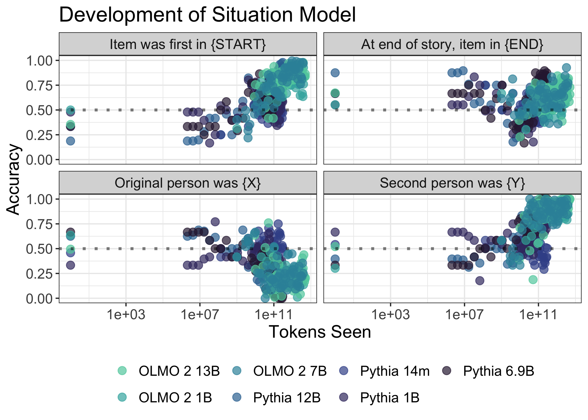<!-- -->

``` r
# PAPER FIGURE: plot same for the Pythias as well
df_summ_attn %>%
  filter(grepl("Pythia", model_shorthand)) %>%
  ggplot(aes(x = tokens_seen_numeric_mod,
             y = mean_accuracy,
             color = model_shorthand)) +
  geom_point(size = 3,
             alpha = .7) +
  geom_hline(yintercept = .5, linetype = "dotted",
             size = 1.2, alpha = .5) +
  scale_x_log10(labels = scales::comma_format()) +
  # geom_text_repel(aes(label=model_shorthand), size=3) +
  scale_y_continuous(limits = c(0, 1)) +
  labs(title = "Development of Situation Model",
       x = "Tokens Seen",
       y = "Accuracy",
       color = "",
       shape = "") +
  theme_bw() +
  scale_color_manual(values = viridisLite::viridis(4, option = "mako", 
                                                  begin = 0.8, end = 0.15)) +
  theme(text = element_text(size = 15),
        legend.position="bottom") +
  facet_wrap(~reorder(q_label, question_id))
```

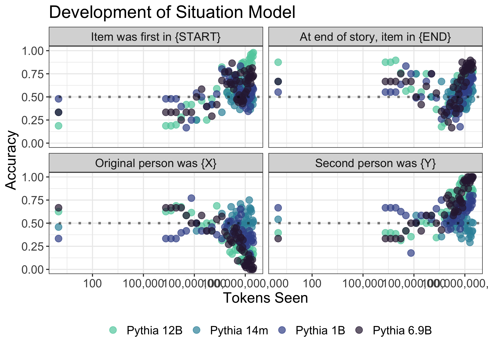<!-- -->

``` r
### Final step
df_model_max = df_attn_check %>%
  group_by(model_shorthand) %>%
  summarise(max_step = max(step, na.rm = TRUE))

df_attn_check %>% 
  inner_join(df_model_max) %>%
  filter(step == max_step) %>%
  ggplot(aes(x = log_odds,
             y = factor(question_id),
             fill = model_shorthand)) +
  geom_density_ridges2(aes(height = ..density..), 
                       color=NA, 
                       scale=.85, 
                       # size=1, 
                       alpha = .6,
                       stat="density") +
  labs(x = "Log Odds (Start vs. End)",
       y = "",
       fill = "") +
  theme_minimal() +
  geom_vline(xintercept = 0, linetype = "dotted") +
  theme(
    legend.position = "bottom"
  ) + 
  theme(axis.title = element_text(size=rel(1.2)),
        axis.text = element_text(size = rel(1.2)),
        legend.text = element_text(size = rel(1.2)),
        legend.title = element_text(size = rel(1.2)),
        strip.text.x = element_text(size = rel(1.2))) +
    scale_fill_manual(values = viridisLite::viridis(7, option = "mako", 
                                                    begin = 0.8, end = 0.15)) 
```

```
## Joining with `by = join_by(model_shorthand)`
```

```
## Warning: The dot-dot notation (`..density..`) was deprecated in ggplot2 3.4.0.
## ℹ Please use `after_stat(density)` instead.
## This warning is displayed once every 8 hours.
## Call `lifecycle::last_lifecycle_warnings()` to see where this warning was
## generated.
```

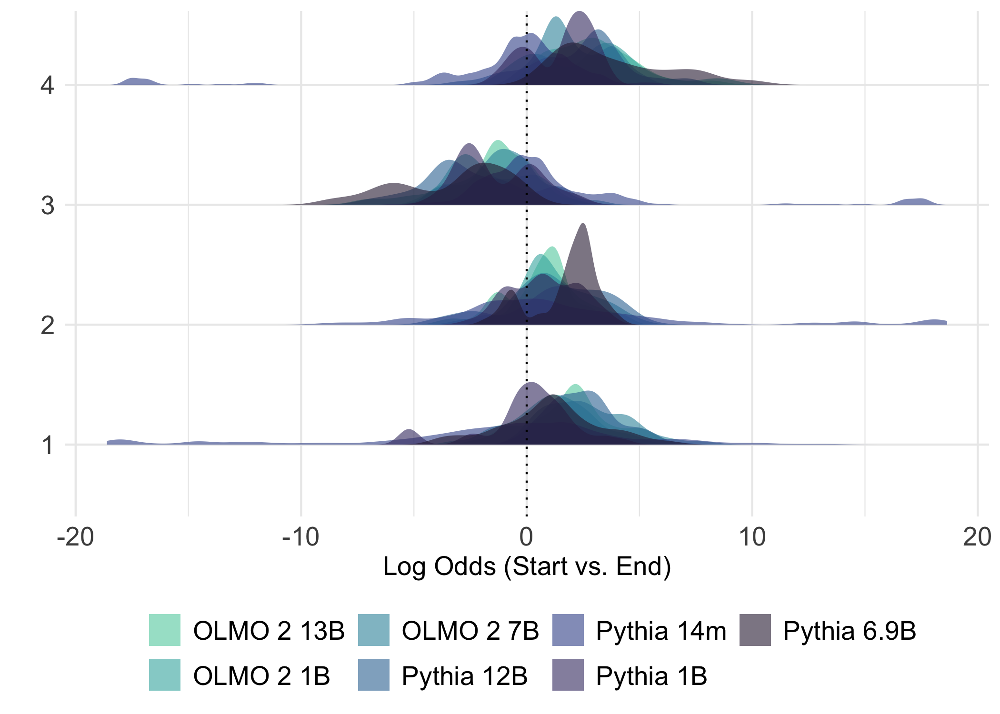<!-- -->

``` r
#df_olmo13_attn_check %>% 
#  inner_join(df_model_max) %>%
#  filter(step == max_step) %>%
#  group_by(model_shorthand, question_id) %>%
#  summarise(mean_accuracy = mean(correct),
#            step = mean(step))


#df_items = df_olmo13_attn_check %>% 
 # inner_join(df_model_max) %>%
 # filter(step == max_step) %>%
 # group_by(model_shorthand, item, question_id, q_label,
 #          correct_answer, distractor_answer) %>%
 # summarise(mean_accuracy = mean(correct))


#df_items %>%
#  filter(model_shorthand == "OLMO 2 13B") %>%
#  ggplot(aes(x = factor(item),
 #            y = mean_accuracy)) +
 ## geom_bar(stat = "identity") +
#  facet_wrap(~q_label) +
#  labs(x = "Scenario",
 #      y = "Accuracy") +
 # theme_minimal()
```


``` r
# Want to plot:
# 1. overall Situation Model accuracy superimposed over False Belief Task accuracy
# 2. individual situation model items accuracy over False Belief Task accuracy

## ====== ====== ====== ====== ====== 
## ====== FB + ATTN CHECK 1 ======
## ====== ====== ====== ====== ======
# Fully join false belief and filtered attention check dataframes, then pivot into tidy data
# creating `task_type` column 
fb_and_attn_q1 <- bind_rows(
  df_summ_fb %>% mutate(task_type = "false belief"),
  df_summ_attn %>%
    filter(question_id == 1) %>%
    mutate(task_type = "situation model 1")) %>%
    mutate(model_shorthand = str_replace(model_shorthand, "B$", "b")) %>%
    mutate(model_shorthand = str_replace(model_shorthand, "OLMO", "Olmo"))

# Define your desired order
model_order <- c("Pythia 14m", "Pythia 1b", "Pythia 6.9b", "Pythia 12b", 
                 "Olmo 2 1b", "Olmo 2 7b", "Olmo 2 13b")

# Convert to factor with desired order
fb_and_attn_q1 <- fb_and_attn_q1 %>%
  mutate(model_shorthand = factor(model_shorthand, levels = model_order))

# Filter for individual attention check questions
# Extract the unique question label
subtitle_text_1 <- df_summ_attn %>%
  filter(question_id == 1) %>%
  filter(stage == "stage1" | is.na(stage)) %>%
  pull(q_label) %>%
  unique()

# PAPER APPENDIX FIG: Plot accuracy for attention check 1 and false belief by tokens seen
# PAPER APPENDIX FIG: Plot accuracy for attention check 1 and false belief by tokens seen
fb_and_attn_q1 %>%
  filter(stage == "stage1" | is.na(stage)) %>%
  ggplot(aes(x = tokens_seen_numeric_mod,
             y = mean_accuracy,
             color = task_type)) +
  geom_line(size = 1,
             alpha = .5) +
  scale_x_log10() +
  scale_y_continuous(limits = c(0, 1)) +
  labs(title = "Development of Situation Model",
       subtitle = subtitle_text_1,
       x = "Tokens Seen",
       y = "Accuracy",
       color = "",
       shape = "") +
  theme_bw() +
  scale_color_manual(values = viridisLite::viridis(2, option = "mako", 
                                                  begin = 0.8, end = 0.15)) +
  theme(text = element_text(size = 15),
        legend.position="bottom") + 
  facet_wrap(~model_shorthand)
```

```
## Warning: Removed 1 row containing missing values or values outside the scale range
## (`geom_line()`).
```

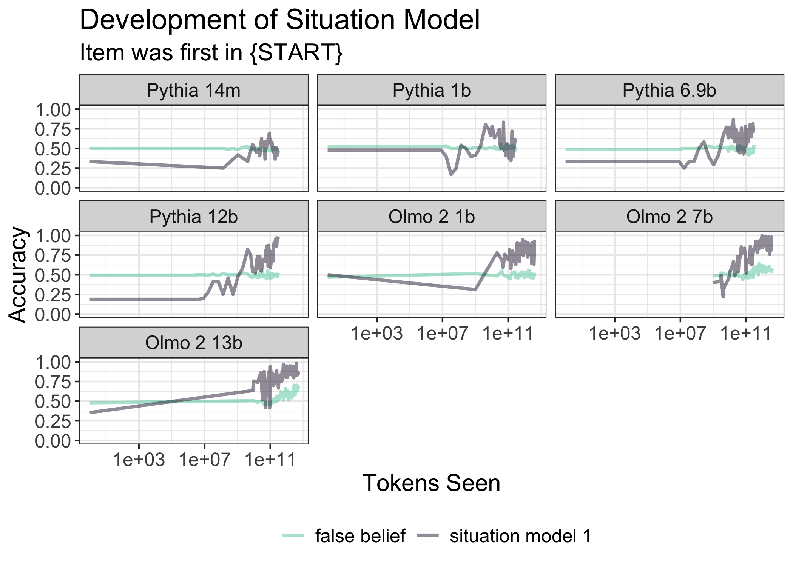<!-- -->

``` r
fb_and_attn_q1 %>%
  filter(model_shorthand == "Olmo 2 13b") %>%
  filter(stage == "stage1" | is.na(stage)) %>%
  ggplot(aes(x = tokens_seen_numeric_mod,
             y = mean_accuracy,
             color = task_type)) +
  geom_line(size = 1,
             alpha = .5) +
  scale_x_log10() +
  scale_y_continuous(limits = c(0, 1)) +
  labs(
       subtitle = subtitle_text_1,
       x = "Tokens Seen",
       y = "Accuracy",
       color = "",
       shape = "") +
  theme_minimal() +
  scale_color_manual(values = viridisLite::viridis(2, option = "mako", 
                                                  begin = 0.8, end = 0.15)) +
  theme(text = element_text(size = 15),
        legend.position="bottom") 
```

```
## Warning: Removed 1 row containing missing values or values outside the scale range
## (`geom_line()`).
```

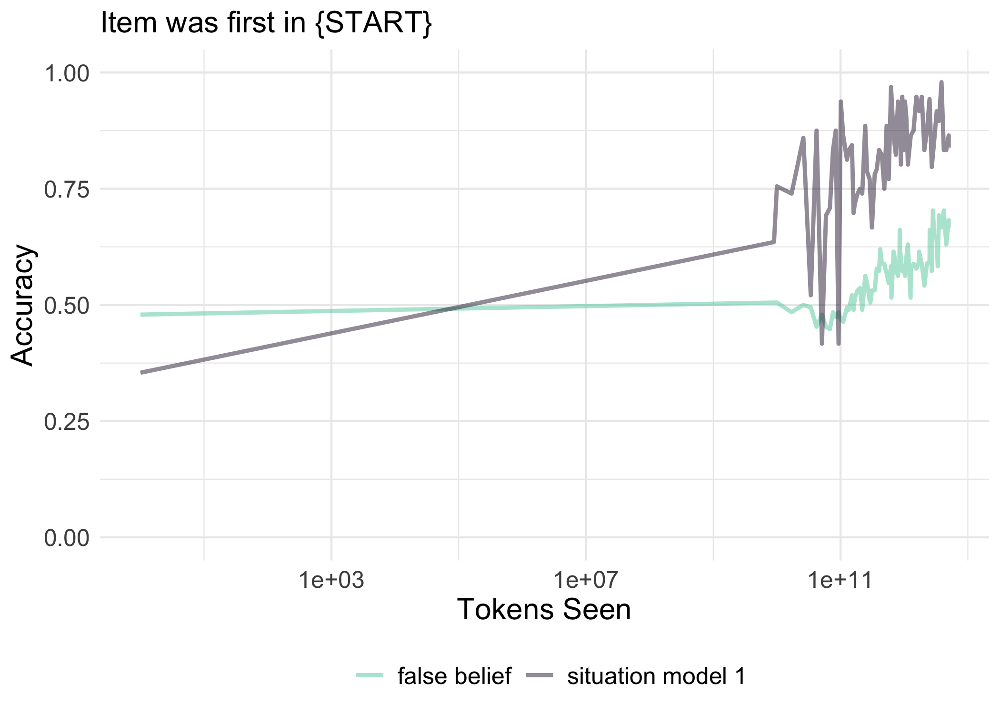<!-- -->

``` r
## ====== ====== ====== ====== ====== 
## ====== FB + ATTN CHECK 2 ======
## ====== ====== ====== ====== ======
# Fully join false belief and filtered attention check dataframes, then pivot into tidy data
# creating `task_type` column 
fb_and_attn_q2 <- bind_rows(
  df_summ_fb %>% mutate(task_type = "false belief"),
  df_summ_attn %>%
    filter(question_id == 2) %>%
    mutate(task_type = "situation model 2")) %>%
    mutate(model_shorthand = str_replace(model_shorthand, "B$", "b")) %>%
    mutate(model_shorthand = str_replace(model_shorthand, "OLMO", "Olmo"))

# Convert to factor with desired order
fb_and_attn_q2 <- fb_and_attn_q2 %>%
  mutate(model_shorthand = factor(model_shorthand, levels = model_order))

# Filter for individual attention check questions
# Extract the unique question label
subtitle_text_2 <- df_summ_attn %>%
  filter(question_id == 2) %>%
  filter(stage == "stage1" | is.na(stage)) %>%
  pull(q_label) %>%
  unique()

# PAPER APPENDIX FIG: Plot accuracy for attention check 2 and false belief by tokens seen
fb_and_attn_q2 %>%
  filter(stage == "stage1" | is.na(stage)) %>%
  ggplot(aes(x = tokens_seen_numeric_mod,
             y = mean_accuracy,
             color = task_type)) +
  geom_line(size = 1,
             alpha = .5) +
  scale_x_log10() +
  scale_y_continuous(limits = c(0, 1)) +
  labs(title = "Development of Situation Model",
       subtitle = subtitle_text_2,
       x = "Tokens Seen",
       y = "Accuracy",
       color = "",
       shape = "") +
  theme_bw() +
  scale_color_manual(values = viridisLite::viridis(2, option = "mako", 
                                                  begin = 0.7, end = 0.15)) +
  theme(text = element_text(size = 15),
        legend.position="bottom") + 
  facet_wrap(~model_shorthand)
```

```
## Warning: Removed 1 row containing missing values or values outside the scale range
## (`geom_line()`).
```

<!-- -->

``` r
# PAPER APPENDIX FIG: Plot accuracy for attention check 2 and false belief by tokens seen
fb_and_attn_q2 %>%
  filter(model_shorthand == "Olmo 2 13b") %>%
  filter(stage == "stage1" | is.na(stage)) %>%
  ggplot(aes(x = tokens_seen_numeric_mod,
             y = mean_accuracy,
             color = task_type)) +
  geom_line(size = 1,
             alpha = .5) +
  scale_x_log10() +
  scale_y_continuous(limits = c(0, 1)) +
  labs(subtitle = subtitle_text_2,
       x = "Tokens Seen",
       y = "Accuracy",
       color = "",
       shape = "") +
  theme_minimal() +
  scale_color_manual(values = viridisLite::viridis(2, option = "mako", 
                                                  begin = 0.7, end = 0.15)) +
  theme(text = element_text(size = 15),
        legend.position="bottom") 
```

```
## Warning: Removed 1 row containing missing values or values outside the scale range
## (`geom_line()`).
```

<!-- -->

``` r
## ====== ====== ====== ====== ====== 
## ====== FB + ATTN CHECK 3 ======
## ====== ====== ====== ====== ======
# Fully join false belief and filtered attention check dataframes, then pivot into tidy data
# creating `task_type` column 
fb_and_attn_q3 <- bind_rows(
  df_summ_fb %>% mutate(task_type = "false belief"),
  df_summ_attn %>%
    filter(question_id == 3) %>%
    mutate(task_type = "situation model 3")) %>%
    mutate(model_shorthand = str_replace(model_shorthand, "B$", "b")) %>%
    mutate(model_shorthand = str_replace(model_shorthand, "OLMO", "Olmo"))

# Convert to factor with desired order
fb_and_attn_q3 <- fb_and_attn_q3 %>%
  mutate(model_shorthand = factor(model_shorthand, levels = model_order))

# Filter for individual attention check questions
# Extract the unique question label
subtitle_text_3 <- df_summ_attn %>%
  filter(question_id == 3) %>%
  filter(stage == "stage1" | is.na(stage)) %>%
  pull(q_label) %>%
  unique()

# PAPER APPENDIX FIG: Plot accuracy for attention check 3 and false belief by tokens seen
fb_and_attn_q3 %>%
  filter(stage == "stage1" | is.na(stage)) %>%
  ggplot(aes(x = tokens_seen_numeric_mod,
             y = mean_accuracy,
             color = task_type)) +
  geom_line(size = 1,
             alpha = .5) +
  scale_x_log10() +
  scale_y_continuous(limits = c(0, 1)) +
  labs(title = "Development of Situation Model",
       subtitle = subtitle_text_3,
       x = "Tokens Seen",
       y = "Accuracy",
       color = "",
       shape = "") +
  theme_bw() +
  scale_color_manual(values = viridisLite::viridis(2, option = "mako", 
                                                  begin = 0.7, end = 0.15)) +
  theme(text = element_text(size = 15),
        legend.position="bottom") + 
  facet_wrap(~model_shorthand)
```

```
## Warning: Removed 1 row containing missing values or values outside the scale range
## (`geom_line()`).
```

<!-- -->

``` r
fb_and_attn_q3 %>%
  filter(model_shorthand == "Olmo 2 13b") %>%
  ggplot(aes(x = tokens_seen_numeric_mod,
             y = mean_accuracy,
             color = task_type)) +
  geom_line(size = 1,
             alpha = .5) +
  scale_x_log10() +
  scale_y_continuous(limits = c(0, 1)) +
  labs(subtitle = subtitle_text_3,
       x = "Tokens Seen",
       y = "Accuracy",
       color = "",
       shape = "") +
  theme_minimal() +
  scale_color_manual(values = viridisLite::viridis(2, option = "mako", 
                                                  begin = 0.7, end = 0.15)) +
  theme(text = element_text(size = 15),
        legend.position="bottom") 
```

```
## Warning: Removed 1 row containing missing values or values outside the scale range
## (`geom_line()`).
```

<!-- -->

``` r
## ====== ====== ====== ====== ====== 
## ====== FB + ATTN CHECK 4 ======
## ====== ====== ====== ====== ======
# Fully join false belief and filtered attention check dataframes, then pivot into tidy data
# creating `task_type` column 
fb_and_attn_q4 <- bind_rows(
  df_summ_fb %>% mutate(task_type = "false belief"),
  df_summ_attn %>%
    filter(question_id == 4) %>%
    mutate(task_type = "situation model 4")) %>%
    mutate(model_shorthand = str_replace(model_shorthand, "B$", "b")) %>%
    mutate(model_shorthand = str_replace(model_shorthand, "OLMO", "Olmo"))

# Convert to factor with desired order
fb_and_attn_q4 <- fb_and_attn_q4 %>%
  mutate(model_shorthand = factor(model_shorthand, levels = model_order))

# Filter for individual attention check questions
# Extract the unique question label
subtitle_text_4 <- df_summ_attn %>%
  filter(question_id == 4) %>%
  filter(stage == "stage1" | is.na(stage)) %>%
  pull(q_label) %>%
  unique()

# PAPER APPENDIX FIG: Plot accuracy for attention check 3 and false belief by tokens seen
fb_and_attn_q4 %>%
  filter(stage == "stage1" | is.na(stage)) %>%
  ggplot(aes(x = tokens_seen_numeric_mod,
             y = mean_accuracy,
             color = task_type)) +
  geom_line(size = 1,
             alpha = .5) +
  scale_x_log10() +
  scale_y_continuous(limits = c(0, 1)) +
  labs(subtitle = subtitle_text_4,
       x = "Tokens Seen",
       y = "Accuracy",
       color = "",
       shape = "") +
  theme_bw() +
  scale_color_manual(values = viridisLite::viridis(2, option = "mako", 
                                                  begin = 0.7, end = 0.15)) +
  theme(text = element_text(size = 15),
        legend.position="bottom") + 
  facet_wrap(~model_shorthand)
```

```
## Warning: Removed 1 row containing missing values or values outside the scale range
## (`geom_line()`).
```

<!-- -->

``` r
fb_and_attn_q4 %>%
  filter(model_shorthand == "Olmo 2 13b") %>%
  ggplot(aes(x = tokens_seen_numeric_mod,
             y = mean_accuracy,
             color = task_type)) +
  geom_line(size = 1,
             alpha = .5) +
  scale_x_log10() +
  scale_y_continuous(limits = c(0, 1)) +
  labs(title = "Development of Situation Model",
       subtitle = subtitle_text_4,
       x = "Tokens Seen",
       y = "Accuracy",
       color = "",
       shape = "") +
  theme_minimal() +
  scale_color_manual(values = viridisLite::viridis(2, option = "mako", 
                                                  begin = 0.7, end = 0.15)) +
  theme(text = element_text(size = 15),
        legend.position="bottom") 
```

```
## Warning: Removed 1 row containing missing values or values outside the scale range
## (`geom_line()`).
```

<!-- -->

``` r
## ====== ====== ====== ====== ====== 
## ====== FB + ALL ATTN CHECKS ======
## ====== ====== ====== ====== ======

# Concatenate the individual attention check dataframes, keeping only one instance
# of the rows corresponding to false belief task accuracies
fb_and_all_attn <- bind_rows(
  fb_and_attn_q1,
  fb_and_attn_q2 %>% filter(task_type == "situation model 2"),
  fb_and_attn_q3 %>% filter(task_type == "situation model 3"),
  fb_and_attn_q4 %>% filter(task_type == "situation model 4")
)

  
situation_model_avg <- fb_and_all_attn %>%
  filter(task_type != "false belief task") %>%
  group_by(model_family, model_shorthand, step, tokens_seen_numeric, tokens_seen_numeric_mod) %>%
  summarise(mean_accuracy = mean(mean_accuracy, na.rm = TRUE),
            .groups = "drop") %>%
  mutate(task_type = "situation model")

# Now combine this new df with the false belief task df
fb_and_all_attn <- bind_rows(
  fb_and_attn_q1 %>% filter(task_type == "false belief"),
  situation_model_avg
)

# Convert to factor with desired order
fb_and_all_attn <- fb_and_all_attn %>%
  mutate(model_shorthand = factor(model_shorthand, levels = model_order))

## PAPER FIGURE: FB & OVERALL SITUATION MODEL
fb_and_all_attn %>%
  filter(stage == "stage1" | is.na(stage)) %>%
  ggplot(aes(x = tokens_seen_numeric_mod,
             y = mean_accuracy,
             color = task_type)) + 
   geom_line(size = 1,
             alpha = .5) + 
  scale_x_log10() + 
  scale_y_continuous(limits = c(0, 1)) + 
  labs(title = "Development of Situation Model",
       x = "Tokens Seen",
       y = "Accuracy",
       color = "",
       shape = "") +
  theme_bw() +
  scale_color_manual(values = viridisLite::viridis(2, option = "mako", 
                                                  begin = 0.7, end = 0.15)) +
  theme(text = element_text(size = 15),
        legend.position="bottom") + 
  facet_wrap(~model_shorthand)
```

```
## Warning: Removed 1 row containing missing values or values outside the scale range
## (`geom_line()`).
```

<!-- -->


## Time series modeling

Ideas:

- Cross-correlation analysis (ccf) 
- Granger causality
- Changepoint / onset analysis


CCF: Here, we quantify the correlation between each AC and FB at various "lags". 


``` r
### Multiple obs. per step/token seen ,so group across?
df_summ_fb_tokens = df_summ_fb %>%
  filter(stage == "stage1") %>%
  group_by(model_shorthand, tokens_seen_numeric_mod, step) %>%
  summarise(fb_accuracy = mean(mean_accuracy))
```

```
## `summarise()` has grouped output by 'model_shorthand',
## 'tokens_seen_numeric_mod'. You can override using the `.groups` argument.
```

``` r
### Multiple obs. per step/token seen ,so group across?
df_all = df_summ_attn %>%
  mutate(model_shorthand = str_to_title(model_shorthand)) %>%
  filter(model_shorthand == "Olmo 2 13b") %>%
  transmute(ac_accuracy = mean_accuracy) %>%
  group_by(model_shorthand, tokens_seen_numeric_mod, step, question_id) %>%
  summarise(ac_accuracy = mean(ac_accuracy)) %>%
  # filter(question_id == 1) %>%
  inner_join(df_summ_fb_tokens) %>%
  arrange(tokens_seen_numeric_mod)
```

```
## `summarise()` has grouped output by 'model_shorthand',
## 'tokens_seen_numeric_mod', 'step'. You can override using the `.groups`
## argument.
## Joining with `by = join_by(model_shorthand, tokens_seen_numeric_mod, step)`
```

``` r
### New plot
plot_data <- df_all %>%
  dplyr::select(model_shorthand, tokens_seen_numeric_mod, step, question_id, 
         ac_accuracy, fb_accuracy) %>%
  pivot_longer(cols = c(ac_accuracy, fb_accuracy),
               names_to = "task_type",
               values_to = "accuracy") %>%
  mutate(task_type = case_when(
    task_type == "ac_accuracy" ~ "Situation Model",
    task_type == "fb_accuracy" ~ "False Belief"
  )) %>%
  mutate(q_label = case_when(
    question_id == 1 ~ "Item was first in {START}",
    question_id == 2 ~ "At end of story, item in {END}",
    question_id == 3 ~ "Original person was {X}",
    question_id == 4 ~ "Second person was {Y}"
  ))


# Create the plot
# Create the plot
plot_data %>%
  filter(question_id <= 2) %>%
  ggplot(aes(x = tokens_seen_numeric_mod, 
                      y = accuracy, 
                      color = task_type)) +
  geom_line(size = 1, alpha = 0.8) +
  geom_point(size = 2, alpha = 0.6) +
  facet_wrap(~ reorder(q_label, question_id), ncol = 2) +
  scale_x_log10() +
  # scale_x_continuous(labels = scales::scientific,
  #                   name = "Tokens Seen") +
  scale_y_continuous(limits = c(0, 1),
                     name = "Accuracy") +
  scale_color_manual(values = c("Situation Model" = "#808080", 
                                 "False Belief" = "#21908CFF")) +
  labs(x = "Tokens Seen (Log10)",
       color = "Task Type") +
  theme_minimal(base_size = 14) +
  theme(legend.position = "bottom",
        strip.text = element_text(face = "bold", size = 12))
```

<!-- -->

``` r
plot_data %>%
  filter(question_id > 2) %>%
  ggplot(aes(x = tokens_seen_numeric_mod, 
                      y = accuracy, 
                      color = task_type)) +
  geom_line(size = 1, alpha = 0.8) +
  geom_point(size = 2, alpha = 0.6) +
  facet_wrap(~ reorder(q_label, question_id), ncol = 2) +
  scale_x_log10() +
  # scale_x_continuous(labels = scales::scientific,
  #                   name = "Tokens Seen") +
  scale_y_continuous(limits = c(0, 1),
                     name = "Accuracy") +
  scale_color_manual(values = c("Situation Model" = "#808080", 
                                 "False Belief" = "#21908CFF")) +
  labs(x = "Tokens Seen (Log10)",
       color = "Task Type") +
  theme_minimal(base_size = 14) +
  theme(legend.position = "bottom",
        strip.text = element_text(face = "bold", size = 12))
```

<!-- -->

``` r
plot_data %>%
  ggplot(aes(x = tokens_seen_numeric_mod, 
                      y = accuracy, 
                      color = task_type)) +
  geom_line(size = 1, alpha = 0.8) +
  geom_point(size = 2, alpha = 0.6) +
  facet_wrap(~ reorder(q_label, question_id),, ncol = 2) +
  scale_x_log10() +
  # scale_x_continuous(labels = scales::scientific,
  #                   name = "Tokens Seen") +
  scale_y_continuous(limits = c(0, 1),
                     name = "Accuracy") +
  scale_color_manual(values = c("Situation Model" = "#808080", 
                                 "False Belief" = "#21908CFF")) +
  labs(x = "Tokens Seen (Log10)",
       color = "Task Type") +
  theme_minimal(base_size = 14) +
  theme(legend.position = "bottom",
        strip.text = element_text(face = "bold", size = 12))
```

<!-- -->

``` r
model_data_wide <- df_all %>%
  pivot_wider(
    names_from = question_id,
    values_from = c(ac_accuracy),  # or just the columns you want
    names_prefix = "q"  # optional: adds "q" prefix to column names
  )


# Compute cross-correlation
ccf_result <- ccf(
  model_data_wide$q1, 
  model_data_wide$fb_accuracy,
  lag.max = 10,  # test up to 10 lags
  plot = TRUE,
  main = "Cross-Correlation: Situation Model → False Belief"
)
```

<!-- -->

``` r
# Positive lags indicate situation model leads FB
print(ccf_result)
```

```
## 
## Autocorrelations of series 'X', by lag
## 
##   -10    -9    -8    -7    -6    -5    -4    -3    -2    -1     0     1     2 
## 0.243 0.358 0.314 0.336 0.409 0.253 0.356 0.332 0.308 0.392 0.382 0.267 0.249 
##     3     4     5     6     7     8     9    10 
## 0.236 0.272 0.212 0.229 0.184 0.206 0.223 0.173
```

``` r
max_lag <- ccf_result$lag[which.max(ccf_result$acf)]
max_corr <- max(ccf_result$acf)

cat(sprintf("Maximum correlation: %.3f at lag %d\n", max_corr, max_lag))
```

```
## Maximum correlation: 0.409 at lag -6
```

``` r
cat(sprintf("This means q1 leads FB by %d time steps\n", abs(max_lag)))
```

```
## This means q1 leads FB by 6 time steps
```

``` r
# Compute cross-correlation
ccf_result <- ccf(
  model_data_wide$q2, 
  model_data_wide$fb_accuracy,
  lag.max = 10,  # test up to 10 lags
  plot = TRUE,
  main = "Cross-Correlation: Situation Model → False Belief"
)
```

<!-- -->

``` r
# Positive lags indicate situation model leads FB
print(ccf_result)
```

```
## 
## Autocorrelations of series 'X', by lag
## 
##   -10    -9    -8    -7    -6    -5    -4    -3    -2    -1     0     1     2 
## 0.165 0.166 0.225 0.192 0.171 0.228 0.264 0.312 0.188 0.286 0.269 0.261 0.300 
##     3     4     5     6     7     8     9    10 
## 0.161 0.146 0.145 0.107 0.128 0.132 0.171 0.145
```

``` r
max_lag <- ccf_result$lag[which.max(ccf_result$acf)]
max_corr <- max(ccf_result$acf)

cat(sprintf("Maximum correlation: %.3f at lag %d\n", max_corr, max_lag))
```

```
## Maximum correlation: 0.312 at lag -3
```

``` r
cat(sprintf("This means q1 leads FB by %d time steps\n", abs(max_lag)))
```

```
## This means q1 leads FB by 3 time steps
```

``` r
# Compute cross-correlation
ccf_result <- ccf(
  model_data_wide$q3, 
  model_data_wide$fb_accuracy,
  lag.max = 10,  # test up to 10 lags
  plot = TRUE,
  main = "Cross-Correlation: Situation Model → False Belief"
)
```

<!-- -->

``` r
# Positive lags indicate situation model leads FB
print(ccf_result)
```

```
## 
## Autocorrelations of series 'X', by lag
## 
##    -10     -9     -8     -7     -6     -5     -4     -3     -2     -1      0 
## -0.358 -0.358 -0.324 -0.366 -0.302 -0.257 -0.172 -0.094 -0.071 -0.115 -0.011 
##      1      2      3      4      5      6      7      8      9     10 
## -0.057  0.054 -0.019 -0.025 -0.028  0.039  0.022  0.060  0.077  0.131
```

``` r
max_lag <- ccf_result$lag[which.max(ccf_result$acf)]
max_corr <- max(ccf_result$acf)

cat(sprintf("Maximum correlation: %.3f at lag %d\n", max_corr, max_lag))
```

```
## Maximum correlation: 0.131 at lag 10
```

``` r
cat(sprintf("This means q1 leads FB by %d time steps\n", abs(max_lag)))
```

```
## This means q1 leads FB by 10 time steps
```

``` r
# Compute cross-correlation
ccf_result <- ccf(
  model_data_wide$q4, 
  model_data_wide$fb_accuracy,
  lag.max = 10,  # test up to 10 lags
  plot = TRUE,
  main = "Cross-Correlation: Situation Model → False Belief"
)
```

<!-- -->

``` r
# Positive lags indicate situation model leads FB
print(ccf_result)
```

```
## 
## Autocorrelations of series 'X', by lag
## 
##   -10    -9    -8    -7    -6    -5    -4    -3    -2    -1     0     1     2 
## 0.268 0.313 0.331 0.363 0.391 0.312 0.333 0.339 0.391 0.385 0.345 0.360 0.231 
##     3     4     5     6     7     8     9    10 
## 0.211 0.218 0.178 0.156 0.118 0.082 0.070 0.033
```

``` r
max_lag <- ccf_result$lag[which.max(ccf_result$acf)]
max_corr <- max(ccf_result$acf)

cat(sprintf("Maximum correlation: %.3f at lag %d\n", max_corr, max_lag))
```

```
## Maximum correlation: 0.391 at lag -2
```

``` r
cat(sprintf("This means q1 leads FB by %d time steps\n", abs(max_lag)))
```

```
## This means q1 leads FB by 2 time steps
```


Granger causality:


``` r
library(lmtest)
library(vars)
```

```
## Loading required package: MASS
```

```
## 
## Attaching package: 'MASS'
```

```
## The following object is masked from 'package:dplyr':
## 
##     select
```

```
## Loading required package: strucchange
```

```
## Loading required package: sandwich
```

```
## 
## Attaching package: 'strucchange'
```

```
## The following object is masked from 'package:stringr':
## 
##     boundary
```

```
## Loading required package: urca
```

``` r
# Prepare time series
ts_data <- model_data_wide %>%
  dplyr::select(tokens_seen_numeric_mod, q1, q2, q3, q4, fb_accuracy) %>%
  drop_na()
```

```
## Adding missing grouping variables: `model_shorthand`, `step`
```

``` r
# Prepare data as multivariate time series
ts_data_clean <- model_data_wide %>%
  ungroup() %>%
  dplyr::select(q1, fb_accuracy) %>%
  drop_na()

# Test different lag orders
VARselect(ts_data_clean, lag.max = 10, type = "const")
```

```
## $selection
## AIC(n)  HQ(n)  SC(n) FPE(n) 
##      2      2      1      2 
## 
## $criteria
##                    1             2             3             4             5
## AIC(n) -1.187257e+01 -1.195305e+01 -1.191944e+01 -1.187883e+01 -1.176723e+01
## HQ(n)  -1.178626e+01 -1.180919e+01 -1.171804e+01 -1.161989e+01 -1.145074e+01
## SC(n)  -1.164743e+01 -1.157781e+01 -1.139411e+01 -1.120340e+01 -1.094170e+01
## FPE(n)  6.981035e-06  6.447260e-06  6.681604e-06  6.984683e-06  7.855824e-06
##                    6             7             8             9            10
## AIC(n) -1.176307e+01 -1.170603e+01 -1.175598e+01 -1.165594e+01 -1.156684e+01
## HQ(n)  -1.138904e+01 -1.127446e+01 -1.126686e+01 -1.110928e+01 -1.096264e+01
## SC(n)  -1.078745e+01 -1.058031e+01 -1.048016e+01 -1.023003e+01 -9.990836e+00
## FPE(n)  7.957285e-06  8.526535e-06  8.242960e-06  9.303372e-06  1.044611e-05
```

``` r
# Test if situation model "Granger-causes" false belief
grangertest(fb_accuracy ~ q1, 
            order = 1,  # number of lags
            data = ts_data)
```

```
## Granger causality test
## 
## Model 1: fb_accuracy ~ Lags(fb_accuracy, 1:1) + Lags(q1, 1:1)
## Model 2: fb_accuracy ~ Lags(fb_accuracy, 1:1)
##   Res.Df Df      F Pr(>F)
## 1     58                 
## 2     59 -1 1.0287 0.3147
```

``` r
grangertest(fb_accuracy ~ q2, 
            order = 3,  # number of lags
            data = ts_data)
```

```
## Granger causality test
## 
## Model 1: fb_accuracy ~ Lags(fb_accuracy, 1:3) + Lags(q2, 1:3)
## Model 2: fb_accuracy ~ Lags(fb_accuracy, 1:3)
##   Res.Df Df      F Pr(>F)
## 1     52                 
## 2     55 -3 1.2843 0.2895
```
