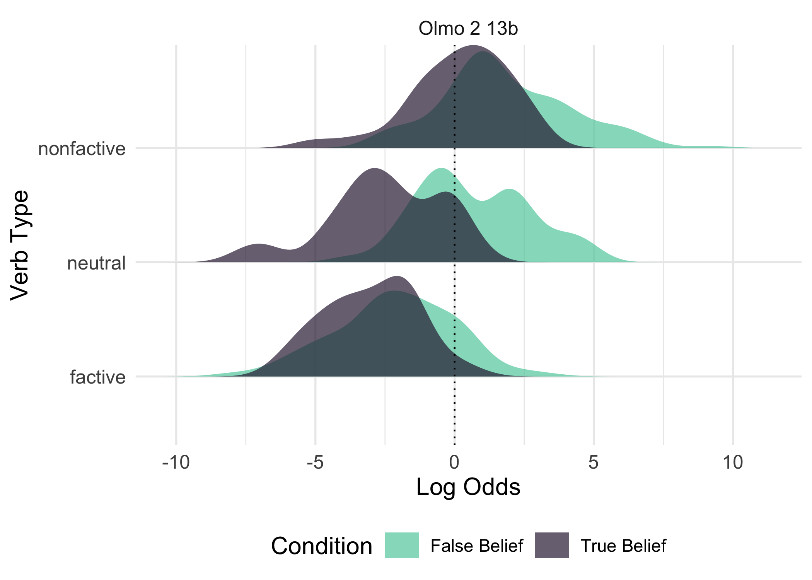
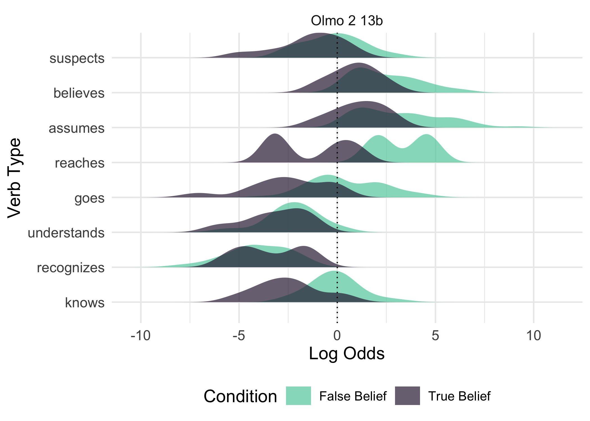
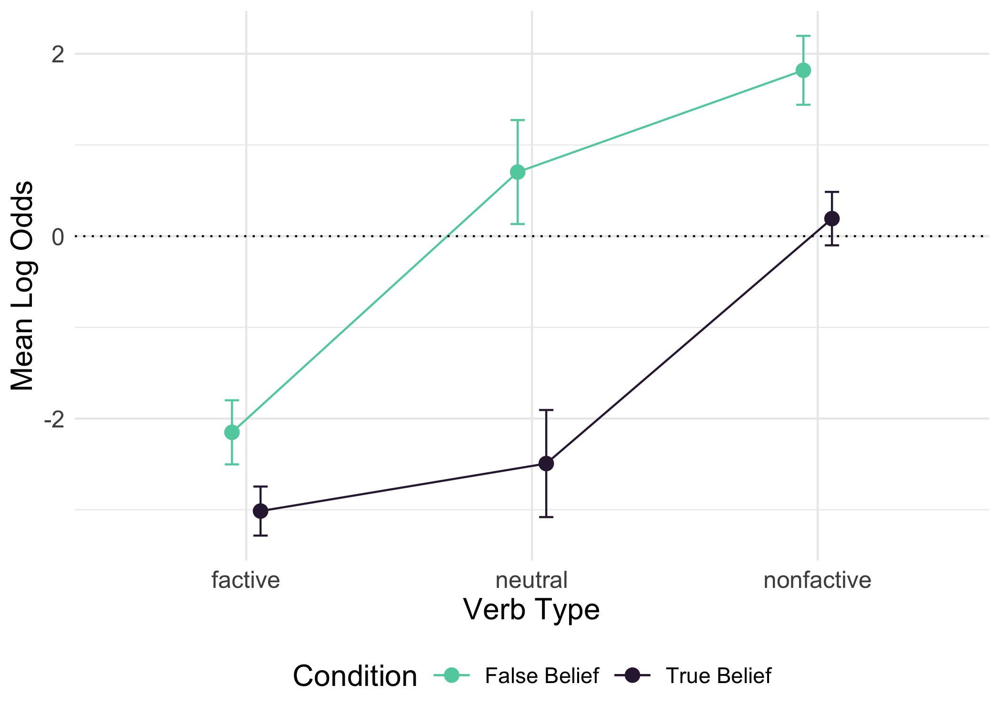
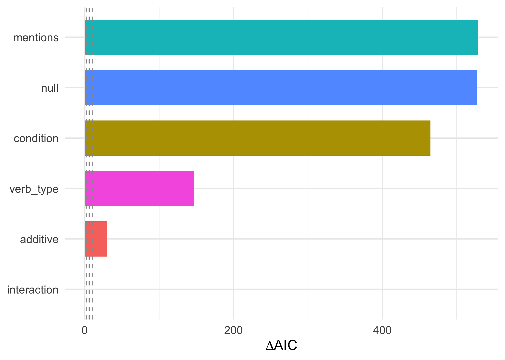
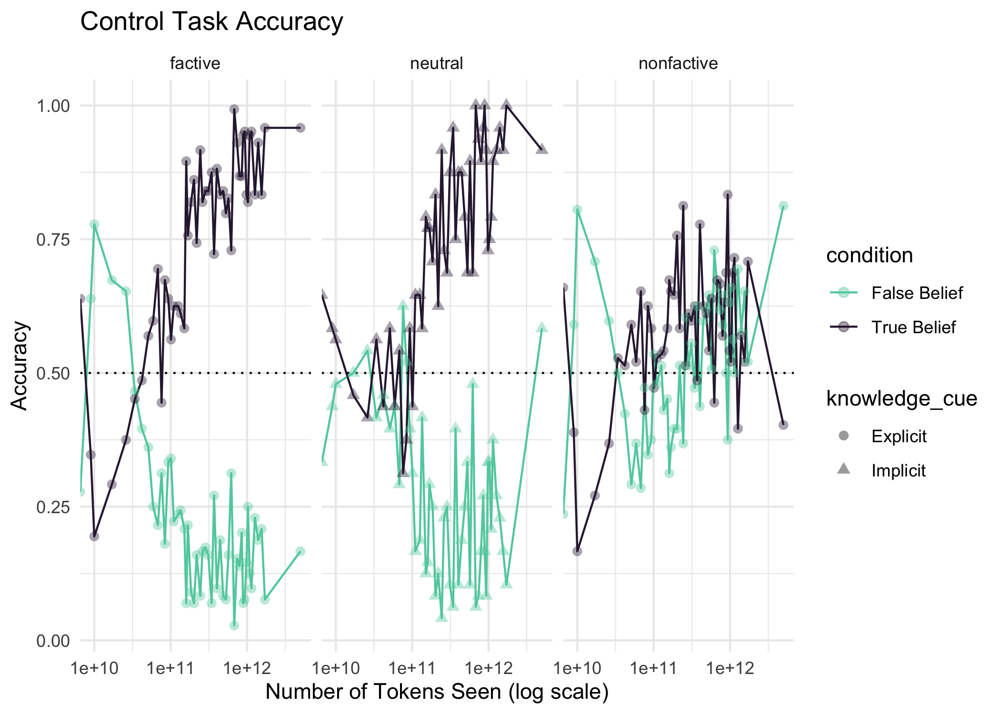
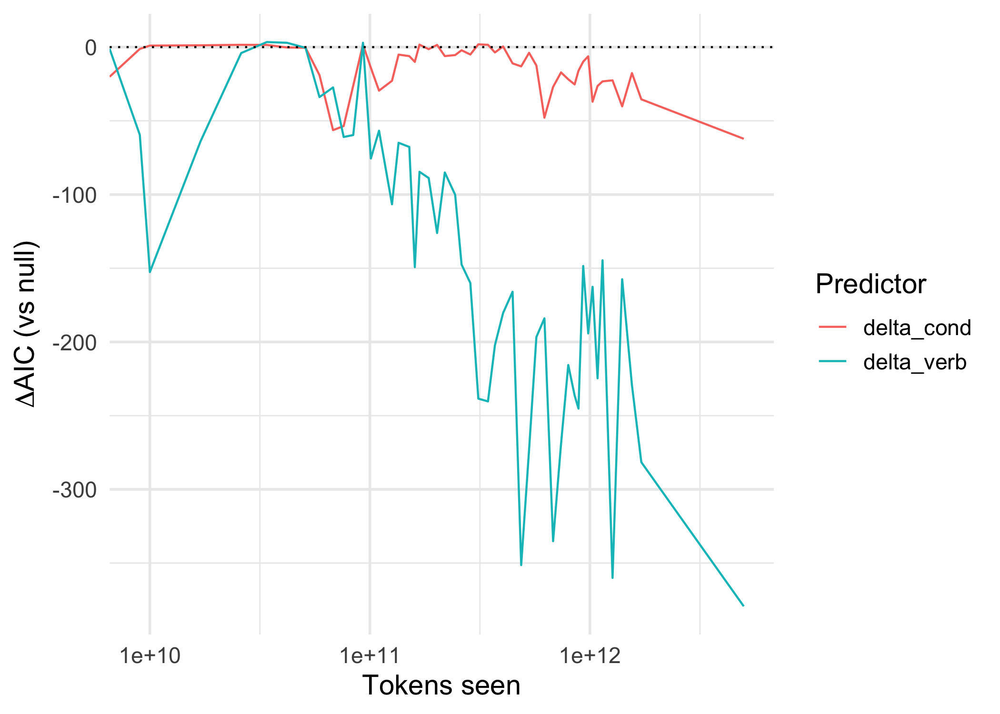

```r
# setwd("/Users/seantrott/Dropbox/UCSD/Research/NLMs/epistemology/dev_tom/src/analysis")

# Grab data for false belief task
directory_path <- "../../data/processed/fb_local_multi_verb/"
csv_files <- list.files(path = directory_path, pattern = "*.csv", full.names = TRUE)
csv_list <- csv_files %>%
  map(~ read_csv(.))
```

```
## Rows: 672 Columns: 18
## ── Column specification ────────────────────────────────────────────────────────
## Delimiter: ","
## chr (13): passage, start, end, knowledge_cue, first_mention, recent_mention,...
## dbl  (4): start_prob, end_prob, log_odds, step
## lgl  (1): ingredient
## 
## ℹ Use `spec()` to retrieve the full column specification for this data.
## ℹ Specify the column types or set `show_col_types = FALSE` to quiet this message.
## Rows: 672 Columns: 18
## ── Column specification ────────────────────────────────────────────────────────
## Delimiter: ","
## chr (13): passage, start, end, knowledge_cue, first_mention, recent_mention,...
## dbl  (4): start_prob, end_prob, log_odds, step
## lgl  (1): ingredient
## 
## ℹ Use `spec()` to retrieve the full column specification for this data.
## ℹ Specify the column types or set `show_col_types = FALSE` to quiet this message.
## Rows: 672 Columns: 18
## ── Column specification ────────────────────────────────────────────────────────
## Delimiter: ","
## chr (13): passage, start, end, knowledge_cue, first_mention, recent_mention,...
## dbl  (4): start_prob, end_prob, log_odds, step
## lgl  (1): ingredient
## 
## ℹ Use `spec()` to retrieve the full column specification for this data.
## ℹ Specify the column types or set `show_col_types = FALSE` to quiet this message.
## Rows: 672 Columns: 18
## ── Column specification ────────────────────────────────────────────────────────
## Delimiter: ","
## chr (13): passage, start, end, knowledge_cue, first_mention, recent_mention,...
## dbl  (4): start_prob, end_prob, log_odds, step
## lgl  (1): ingredient
## 
## ℹ Use `spec()` to retrieve the full column specification for this data.
## ℹ Specify the column types or set `show_col_types = FALSE` to quiet this message.
## Rows: 672 Columns: 18
## ── Column specification ────────────────────────────────────────────────────────
## Delimiter: ","
## chr (13): passage, start, end, knowledge_cue, first_mention, recent_mention,...
## dbl  (4): start_prob, end_prob, log_odds, step
## lgl  (1): ingredient
## 
## ℹ Use `spec()` to retrieve the full column specification for this data.
## ℹ Specify the column types or set `show_col_types = FALSE` to quiet this message.
## Rows: 672 Columns: 18
## ── Column specification ────────────────────────────────────────────────────────
## Delimiter: ","
## chr (13): passage, start, end, knowledge_cue, first_mention, recent_mention,...
## dbl  (4): start_prob, end_prob, log_odds, step
## lgl  (1): ingredient
## 
## ℹ Use `spec()` to retrieve the full column specification for this data.
## ℹ Specify the column types or set `show_col_types = FALSE` to quiet this message.
## Rows: 672 Columns: 18
## ── Column specification ────────────────────────────────────────────────────────
## Delimiter: ","
## chr (13): passage, start, end, knowledge_cue, first_mention, recent_mention,...
## dbl  (4): start_prob, end_prob, log_odds, step
## lgl  (1): ingredient
## 
## ℹ Use `spec()` to retrieve the full column specification for this data.
## ℹ Specify the column types or set `show_col_types = FALSE` to quiet this message.
## Rows: 672 Columns: 18
## ── Column specification ────────────────────────────────────────────────────────
## Delimiter: ","
## chr (13): passage, start, end, knowledge_cue, first_mention, recent_mention,...
## dbl  (4): start_prob, end_prob, log_odds, step
## lgl  (1): ingredient
## 
## ℹ Use `spec()` to retrieve the full column specification for this data.
## ℹ Specify the column types or set `show_col_types = FALSE` to quiet this message.
## Rows: 672 Columns: 18
## ── Column specification ────────────────────────────────────────────────────────
## Delimiter: ","
## chr (13): passage, start, end, knowledge_cue, first_mention, recent_mention,...
## dbl  (4): start_prob, end_prob, log_odds, step
## lgl  (1): ingredient
## 
## ℹ Use `spec()` to retrieve the full column specification for this data.
## ℹ Specify the column types or set `show_col_types = FALSE` to quiet this message.
## Rows: 672 Columns: 18
## ── Column specification ────────────────────────────────────────────────────────
## Delimiter: ","
## chr (13): passage, start, end, knowledge_cue, first_mention, recent_mention,...
## dbl  (4): start_prob, end_prob, log_odds, step
## lgl  (1): ingredient
## 
## ℹ Use `spec()` to retrieve the full column specification for this data.
## ℹ Specify the column types or set `show_col_types = FALSE` to quiet this message.
## Rows: 672 Columns: 18
## ── Column specification ────────────────────────────────────────────────────────
## Delimiter: ","
## chr (13): passage, start, end, knowledge_cue, first_mention, recent_mention,...
## dbl  (4): start_prob, end_prob, log_odds, step
## lgl  (1): ingredient
## 
## ℹ Use `spec()` to retrieve the full column specification for this data.
## ℹ Specify the column types or set `show_col_types = FALSE` to quiet this message.
## Rows: 672 Columns: 18
## ── Column specification ────────────────────────────────────────────────────────
## Delimiter: ","
## chr (13): passage, start, end, knowledge_cue, first_mention, recent_mention,...
## dbl  (4): start_prob, end_prob, log_odds, step
## lgl  (1): ingredient
## 
## ℹ Use `spec()` to retrieve the full column specification for this data.
## ℹ Specify the column types or set `show_col_types = FALSE` to quiet this message.
## Rows: 672 Columns: 18
## ── Column specification ────────────────────────────────────────────────────────
## Delimiter: ","
## chr (13): passage, start, end, knowledge_cue, first_mention, recent_mention,...
## dbl  (4): start_prob, end_prob, log_odds, step
## lgl  (1): ingredient
## 
## ℹ Use `spec()` to retrieve the full column specification for this data.
## ℹ Specify the column types or set `show_col_types = FALSE` to quiet this message.
## Rows: 672 Columns: 18
## ── Column specification ────────────────────────────────────────────────────────
## Delimiter: ","
## chr (13): passage, start, end, knowledge_cue, first_mention, recent_mention,...
## dbl  (4): start_prob, end_prob, log_odds, step
## lgl  (1): ingredient
## 
## ℹ Use `spec()` to retrieve the full column specification for this data.
## ℹ Specify the column types or set `show_col_types = FALSE` to quiet this message.
## Rows: 672 Columns: 18
## ── Column specification ────────────────────────────────────────────────────────
## Delimiter: ","
## chr (13): passage, start, end, knowledge_cue, first_mention, recent_mention,...
## dbl  (4): start_prob, end_prob, log_odds, step
## lgl  (1): ingredient
## 
## ℹ Use `spec()` to retrieve the full column specification for this data.
## ℹ Specify the column types or set `show_col_types = FALSE` to quiet this message.
## Rows: 672 Columns: 18
## ── Column specification ────────────────────────────────────────────────────────
## Delimiter: ","
## chr (13): passage, start, end, knowledge_cue, first_mention, recent_mention,...
## dbl  (4): start_prob, end_prob, log_odds, step
## lgl  (1): ingredient
## 
## ℹ Use `spec()` to retrieve the full column specification for this data.
## ℹ Specify the column types or set `show_col_types = FALSE` to quiet this message.
## Rows: 672 Columns: 18
## ── Column specification ────────────────────────────────────────────────────────
## Delimiter: ","
## chr (13): passage, start, end, knowledge_cue, first_mention, recent_mention,...
## dbl  (4): start_prob, end_prob, log_odds, step
## lgl  (1): ingredient
## 
## ℹ Use `spec()` to retrieve the full column specification for this data.
## ℹ Specify the column types or set `show_col_types = FALSE` to quiet this message.
## Rows: 672 Columns: 18
## ── Column specification ────────────────────────────────────────────────────────
## Delimiter: ","
## chr (13): passage, start, end, knowledge_cue, first_mention, recent_mention,...
## dbl  (4): start_prob, end_prob, log_odds, step
## lgl  (1): ingredient
## 
## ℹ Use `spec()` to retrieve the full column specification for this data.
## ℹ Specify the column types or set `show_col_types = FALSE` to quiet this message.
## Rows: 672 Columns: 18
## ── Column specification ────────────────────────────────────────────────────────
## Delimiter: ","
## chr (13): passage, start, end, knowledge_cue, first_mention, recent_mention,...
## dbl  (4): start_prob, end_prob, log_odds, step
## lgl  (1): ingredient
## 
## ℹ Use `spec()` to retrieve the full column specification for this data.
## ℹ Specify the column types or set `show_col_types = FALSE` to quiet this message.
## Rows: 672 Columns: 18
## ── Column specification ────────────────────────────────────────────────────────
## Delimiter: ","
## chr (13): passage, start, end, knowledge_cue, first_mention, recent_mention,...
## dbl  (4): start_prob, end_prob, log_odds, step
## lgl  (1): ingredient
## 
## ℹ Use `spec()` to retrieve the full column specification for this data.
## ℹ Specify the column types or set `show_col_types = FALSE` to quiet this message.
## Rows: 672 Columns: 18
## ── Column specification ────────────────────────────────────────────────────────
## Delimiter: ","
## chr (13): passage, start, end, knowledge_cue, first_mention, recent_mention,...
## dbl  (4): start_prob, end_prob, log_odds, step
## lgl  (1): ingredient
## 
## ℹ Use `spec()` to retrieve the full column specification for this data.
## ℹ Specify the column types or set `show_col_types = FALSE` to quiet this message.
## Rows: 672 Columns: 18
## ── Column specification ────────────────────────────────────────────────────────
## Delimiter: ","
## chr (13): passage, start, end, knowledge_cue, first_mention, recent_mention,...
## dbl  (4): start_prob, end_prob, log_odds, step
## lgl  (1): ingredient
## 
## ℹ Use `spec()` to retrieve the full column specification for this data.
## ℹ Specify the column types or set `show_col_types = FALSE` to quiet this message.
## Rows: 672 Columns: 18
## ── Column specification ────────────────────────────────────────────────────────
## Delimiter: ","
## chr (13): passage, start, end, knowledge_cue, first_mention, recent_mention,...
## dbl  (4): start_prob, end_prob, log_odds, step
## lgl  (1): ingredient
## 
## ℹ Use `spec()` to retrieve the full column specification for this data.
## ℹ Specify the column types or set `show_col_types = FALSE` to quiet this message.
## Rows: 672 Columns: 18
## ── Column specification ────────────────────────────────────────────────────────
## Delimiter: ","
## chr (13): passage, start, end, knowledge_cue, first_mention, recent_mention,...
## dbl  (4): start_prob, end_prob, log_odds, step
## lgl  (1): ingredient
## 
## ℹ Use `spec()` to retrieve the full column specification for this data.
## ℹ Specify the column types or set `show_col_types = FALSE` to quiet this message.
## Rows: 672 Columns: 18
## ── Column specification ────────────────────────────────────────────────────────
## Delimiter: ","
## chr (13): passage, start, end, knowledge_cue, first_mention, recent_mention,...
## dbl  (4): start_prob, end_prob, log_odds, step
## lgl  (1): ingredient
## 
## ℹ Use `spec()` to retrieve the full column specification for this data.
## ℹ Specify the column types or set `show_col_types = FALSE` to quiet this message.
## Rows: 672 Columns: 18
## ── Column specification ────────────────────────────────────────────────────────
## Delimiter: ","
## chr (13): passage, start, end, knowledge_cue, first_mention, recent_mention,...
## dbl  (4): start_prob, end_prob, log_odds, step
## lgl  (1): ingredient
## 
## ℹ Use `spec()` to retrieve the full column specification for this data.
## ℹ Specify the column types or set `show_col_types = FALSE` to quiet this message.
## Rows: 672 Columns: 18
## ── Column specification ────────────────────────────────────────────────────────
## Delimiter: ","
## chr (13): passage, start, end, knowledge_cue, first_mention, recent_mention,...
## dbl  (4): start_prob, end_prob, log_odds, step
## lgl  (1): ingredient
## 
## ℹ Use `spec()` to retrieve the full column specification for this data.
## ℹ Specify the column types or set `show_col_types = FALSE` to quiet this message.
## Rows: 672 Columns: 18
## ── Column specification ────────────────────────────────────────────────────────
## Delimiter: ","
## chr (13): passage, start, end, knowledge_cue, first_mention, recent_mention,...
## dbl  (4): start_prob, end_prob, log_odds, step
## lgl  (1): ingredient
## 
## ℹ Use `spec()` to retrieve the full column specification for this data.
## ℹ Specify the column types or set `show_col_types = FALSE` to quiet this message.
## Rows: 672 Columns: 18
## ── Column specification ────────────────────────────────────────────────────────
## Delimiter: ","
## chr (13): passage, start, end, knowledge_cue, first_mention, recent_mention,...
## dbl  (4): start_prob, end_prob, log_odds, step
## lgl  (1): ingredient
## 
## ℹ Use `spec()` to retrieve the full column specification for this data.
## ℹ Specify the column types or set `show_col_types = FALSE` to quiet this message.
## Rows: 672 Columns: 18
## ── Column specification ────────────────────────────────────────────────────────
## Delimiter: ","
## chr (13): passage, start, end, knowledge_cue, first_mention, recent_mention,...
## dbl  (4): start_prob, end_prob, log_odds, step
## lgl  (1): ingredient
## 
## ℹ Use `spec()` to retrieve the full column specification for this data.
## ℹ Specify the column types or set `show_col_types = FALSE` to quiet this message.
## Rows: 672 Columns: 18
## ── Column specification ────────────────────────────────────────────────────────
## Delimiter: ","
## chr (13): passage, start, end, knowledge_cue, first_mention, recent_mention,...
## dbl  (4): start_prob, end_prob, log_odds, step
## lgl  (1): ingredient
## 
## ℹ Use `spec()` to retrieve the full column specification for this data.
## ℹ Specify the column types or set `show_col_types = FALSE` to quiet this message.
## Rows: 672 Columns: 18
## ── Column specification ────────────────────────────────────────────────────────
## Delimiter: ","
## chr (13): passage, start, end, knowledge_cue, first_mention, recent_mention,...
## dbl  (4): start_prob, end_prob, log_odds, step
## lgl  (1): ingredient
## 
## ℹ Use `spec()` to retrieve the full column specification for this data.
## ℹ Specify the column types or set `show_col_types = FALSE` to quiet this message.
## Rows: 672 Columns: 18
## ── Column specification ────────────────────────────────────────────────────────
## Delimiter: ","
## chr (13): passage, start, end, knowledge_cue, first_mention, recent_mention,...
## dbl  (4): start_prob, end_prob, log_odds, step
## lgl  (1): ingredient
## 
## ℹ Use `spec()` to retrieve the full column specification for this data.
## ℹ Specify the column types or set `show_col_types = FALSE` to quiet this message.
## Rows: 672 Columns: 18
## ── Column specification ────────────────────────────────────────────────────────
## Delimiter: ","
## chr (13): passage, start, end, knowledge_cue, first_mention, recent_mention,...
## dbl  (4): start_prob, end_prob, log_odds, step
## lgl  (1): ingredient
## 
## ℹ Use `spec()` to retrieve the full column specification for this data.
## ℹ Specify the column types or set `show_col_types = FALSE` to quiet this message.
## Rows: 672 Columns: 18
## ── Column specification ────────────────────────────────────────────────────────
## Delimiter: ","
## chr (13): passage, start, end, knowledge_cue, first_mention, recent_mention,...
## dbl  (4): start_prob, end_prob, log_odds, step
## lgl  (1): ingredient
## 
## ℹ Use `spec()` to retrieve the full column specification for this data.
## ℹ Specify the column types or set `show_col_types = FALSE` to quiet this message.
## Rows: 672 Columns: 18
## ── Column specification ────────────────────────────────────────────────────────
## Delimiter: ","
## chr (13): passage, start, end, knowledge_cue, first_mention, recent_mention,...
## dbl  (4): start_prob, end_prob, log_odds, step
## lgl  (1): ingredient
## 
## ℹ Use `spec()` to retrieve the full column specification for this data.
## ℹ Specify the column types or set `show_col_types = FALSE` to quiet this message.
## Rows: 672 Columns: 18
## ── Column specification ────────────────────────────────────────────────────────
## Delimiter: ","
## chr (13): passage, start, end, knowledge_cue, first_mention, recent_mention,...
## dbl  (4): start_prob, end_prob, log_odds, step
## lgl  (1): ingredient
## 
## ℹ Use `spec()` to retrieve the full column specification for this data.
## ℹ Specify the column types or set `show_col_types = FALSE` to quiet this message.
## Rows: 672 Columns: 18
## ── Column specification ────────────────────────────────────────────────────────
## Delimiter: ","
## chr (13): passage, start, end, knowledge_cue, first_mention, recent_mention,...
## dbl  (4): start_prob, end_prob, log_odds, step
## lgl  (1): ingredient
## 
## ℹ Use `spec()` to retrieve the full column specification for this data.
## ℹ Specify the column types or set `show_col_types = FALSE` to quiet this message.
## Rows: 672 Columns: 18
## ── Column specification ────────────────────────────────────────────────────────
## Delimiter: ","
## chr (13): passage, start, end, knowledge_cue, first_mention, recent_mention,...
## dbl  (4): start_prob, end_prob, log_odds, step
## lgl  (1): ingredient
## 
## ℹ Use `spec()` to retrieve the full column specification for this data.
## ℹ Specify the column types or set `show_col_types = FALSE` to quiet this message.
## Rows: 672 Columns: 18
## ── Column specification ────────────────────────────────────────────────────────
## Delimiter: ","
## chr (13): passage, start, end, knowledge_cue, first_mention, recent_mention,...
## dbl  (4): start_prob, end_prob, log_odds, step
## lgl  (1): ingredient
## 
## ℹ Use `spec()` to retrieve the full column specification for this data.
## ℹ Specify the column types or set `show_col_types = FALSE` to quiet this message.
## Rows: 672 Columns: 18
## ── Column specification ────────────────────────────────────────────────────────
## Delimiter: ","
## chr (13): passage, start, end, knowledge_cue, first_mention, recent_mention,...
## dbl  (4): start_prob, end_prob, log_odds, step
## lgl  (1): ingredient
## 
## ℹ Use `spec()` to retrieve the full column specification for this data.
## ℹ Specify the column types or set `show_col_types = FALSE` to quiet this message.
## Rows: 672 Columns: 18
## ── Column specification ────────────────────────────────────────────────────────
## Delimiter: ","
## chr (13): passage, start, end, knowledge_cue, first_mention, recent_mention,...
## dbl  (4): start_prob, end_prob, log_odds, step
## lgl  (1): ingredient
## 
## ℹ Use `spec()` to retrieve the full column specification for this data.
## ℹ Specify the column types or set `show_col_types = FALSE` to quiet this message.
## Rows: 672 Columns: 18
## ── Column specification ────────────────────────────────────────────────────────
## Delimiter: ","
## chr (13): passage, start, end, knowledge_cue, first_mention, recent_mention,...
## dbl  (4): start_prob, end_prob, log_odds, step
## lgl  (1): ingredient
## 
## ℹ Use `spec()` to retrieve the full column specification for this data.
## ℹ Specify the column types or set `show_col_types = FALSE` to quiet this message.
## Rows: 672 Columns: 18
## ── Column specification ────────────────────────────────────────────────────────
## Delimiter: ","
## chr (13): passage, start, end, knowledge_cue, first_mention, recent_mention,...
## dbl  (4): start_prob, end_prob, log_odds, step
## lgl  (1): ingredient
## 
## ℹ Use `spec()` to retrieve the full column specification for this data.
## ℹ Specify the column types or set `show_col_types = FALSE` to quiet this message.
## Rows: 672 Columns: 18
## ── Column specification ────────────────────────────────────────────────────────
## Delimiter: ","
## chr (13): passage, start, end, knowledge_cue, first_mention, recent_mention,...
## dbl  (4): start_prob, end_prob, log_odds, step
## lgl  (1): ingredient
## 
## ℹ Use `spec()` to retrieve the full column specification for this data.
## ℹ Specify the column types or set `show_col_types = FALSE` to quiet this message.
## Rows: 672 Columns: 18
## ── Column specification ────────────────────────────────────────────────────────
## Delimiter: ","
## chr (13): passage, start, end, knowledge_cue, first_mention, recent_mention,...
## dbl  (4): start_prob, end_prob, log_odds, step
## lgl  (1): ingredient
## 
## ℹ Use `spec()` to retrieve the full column specification for this data.
## ℹ Specify the column types or set `show_col_types = FALSE` to quiet this message.
## Rows: 672 Columns: 18
## ── Column specification ────────────────────────────────────────────────────────
## Delimiter: ","
## chr (13): passage, start, end, knowledge_cue, first_mention, recent_mention,...
## dbl  (4): start_prob, end_prob, log_odds, step
## lgl  (1): ingredient
## 
## ℹ Use `spec()` to retrieve the full column specification for this data.
## ℹ Specify the column types or set `show_col_types = FALSE` to quiet this message.
## Rows: 672 Columns: 18
## ── Column specification ────────────────────────────────────────────────────────
## Delimiter: ","
## chr (13): passage, start, end, knowledge_cue, first_mention, recent_mention,...
## dbl  (4): start_prob, end_prob, log_odds, step
## lgl  (1): ingredient
## 
## ℹ Use `spec()` to retrieve the full column specification for this data.
## ℹ Specify the column types or set `show_col_types = FALSE` to quiet this message.
## Rows: 672 Columns: 18
## ── Column specification ────────────────────────────────────────────────────────
## Delimiter: ","
## chr (13): passage, start, end, knowledge_cue, first_mention, recent_mention,...
## dbl  (4): start_prob, end_prob, log_odds, step
## lgl  (1): ingredient
## 
## ℹ Use `spec()` to retrieve the full column specification for this data.
## ℹ Specify the column types or set `show_col_types = FALSE` to quiet this message.
## Rows: 672 Columns: 18
## ── Column specification ────────────────────────────────────────────────────────
## Delimiter: ","
## chr (13): passage, start, end, knowledge_cue, first_mention, recent_mention,...
## dbl  (4): start_prob, end_prob, log_odds, step
## lgl  (1): ingredient
## 
## ℹ Use `spec()` to retrieve the full column specification for this data.
## ℹ Specify the column types or set `show_col_types = FALSE` to quiet this message.
```

```r
df_all_models <- bind_rows(csv_list) %>%
  mutate(model_shorthand = str_to_title(model_shorthand))
nrow(df_all_models)
```

```
## [1] 33600
```

```r
# Create a column with numeric versions of the tokens seen for that step, using 
# the Olmo file naming convention
df_all_models$tokens_seen_numeric <- as.numeric(sub("B", "", df_all_models$tokens_seen)) * 1e9

df_all_models = df_all_models %>%
  # filter(stage == "stage1") %>%
  mutate(model_id = paste(stage, "step", "-", step)) %>%
  mutate(tokens_seen_numeric_mod = tokens_seen_numeric + 1)

## NOTE: Pythia model data contains a "main" checkpoint/step that appears as a NaN in the `step` column
## must change this to the actual value of the final step, 143000
df_all_models$step[is.na(df_all_models$step)] <- 143000 #hard-coded the final step 

# sort df columns by model name and step value
df_all_models <- df_all_models %>%
  arrange(model_shorthand, step)  # arrange in ascending order

metadata <- read_csv("../../data/raw/metadata_models.csv")
```

```
## Rows: 7 Columns: 6
## ── Column specification ────────────────────────────────────────────────────────
## Delimiter: ","
## chr (2): model_shorthand, model_stage
## dbl (4): n_params_approx, n_heads, n_layers, total_train_tokens_approx
## 
## ℹ Use `spec()` to retrieve the full column specification for this data.
## ℹ Specify the column types or set `show_col_types = FALSE` to quiet this message.
```

```r
# merge the metadata with the fb task df
df_all_models_verb_task <- df_all_models %>% left_join(metadata, by = "model_shorthand")

tokens_seen_pythia <- read_csv("../../data/raw/pythia_tokens_seen.csv")
```

```
## Rows: 616 Columns: 3
## ── Column specification ────────────────────────────────────────────────────────
## Delimiter: ","
## chr (1): model_shorthand
## dbl (1): step
## num (1): tokens_seen_numeric
## 
## ℹ Use `spec()` to retrieve the full column specification for this data.
## ℹ Specify the column types or set `show_col_types = FALSE` to quiet this message.
```

```r
# merge stepwise tokens data for Pythia models
df_all_models_verb_task <- df_all_models_verb_task %>%
  left_join(tokens_seen_pythia %>% select(model_shorthand, step, tokens_seen_from_df1 = tokens_seen_numeric), 
            by = c("model_shorthand", "step")) %>%
  mutate(tokens_seen_numeric = coalesce(tokens_seen_numeric, tokens_seen_from_df1)) %>%
  select(-tokens_seen_from_df1) %>%
  mutate(tokens_seen_numeric_mod = tokens_seen_numeric + 1)


df_all_models_verb_task = df_all_models_verb_task %>%
  mutate(model_family = case_when(
    model_shorthand %in% c("Pythia 14m", "Pythia 1b", 
                           "Pythia 6.9b", "Pythia 12b") ~ "Pythia",
    model_shorthand %in% c("Olmo 2 1b", "Olmo 2 7b", "Olmo 2 13b") ~ "Olmo 2",
  ))
```

## Analysis

### Final step


```r
df_all_models_verb_task %>%
  group_by(model_path) %>%
  mutate(max_tokens = max(tokens_seen_numeric)) %>%
  filter(tokens_seen_numeric == max_tokens) %>%
  ggplot(aes(x = log_odds,
           fill = condition,
           y = verb_type)) +
  geom_density_ridges(color = NA, alpha = 0.7, scale = 0.9) +
  labs(x = "Log Odds",
       y = "Verb Type",
       fill = "Condition") +
  theme_minimal(base_size = 13) +
  geom_vline(xintercept = 0, linetype = "dotted") +
  theme(text = element_text(size = 15),
        legend.position = "bottom",
        legend.box = "vertical",          # stack the shape + color legends
        legend.text = element_text(size = 11),   # shrink legend text
        legend.key.width = unit(0.8, "cm")) +
  scale_fill_manual(values = viridisLite::viridis(2, option = "mako", 
                                                  begin = 0.8, end = 0.15)) +
  guides(color = guide_legend(nrow = 2, byrow = TRUE)) +
  facet_wrap(~reorder(model_shorthand, n_params_approx), nrow=2)
```

```
## Picking joint bandwidth of 0.707
```

<!-- -->

```r
library(dplyr)
library(forcats)
library(emmeans)
```

```
## Warning: package 'emmeans' was built under R version 4.3.3
```

```
## Welcome to emmeans.
## Caution: You lose important information if you filter this package's results.
## See '? untidy'
```

```r
df_plot <- df_all_models_verb_task %>%
  group_by(model_path) %>%
  mutate(max_tokens = max(tokens_seen_numeric)) %>%
  filter(tokens_seen_numeric == max_tokens) %>%
  ungroup() %>%
  arrange(verb_type, verb) %>%
  mutate(
    verb = factor(verb, levels = unique(verb))
  )

ggplot(df_plot,
       aes(x = log_odds,
           fill = condition,
           y = verb)) +
  geom_density_ridges(color = NA, alpha = 0.7, scale = 0.9) +
  labs(x = "Log Odds",
       y = "Verb Type",
       fill = "Condition") +
  theme_minimal(base_size = 13) +
  geom_vline(xintercept = 0, linetype = "dotted") +
  theme(
    text = element_text(size = 15),
    legend.position = "bottom",
    legend.box = "vertical",
    legend.text = element_text(size = 11),
    legend.key.width = unit(0.8, "cm")
  ) +
  scale_fill_manual(values = viridisLite::viridis(2, option = "mako", 
                                                  begin = 0.8, end = 0.15)) +
  guides(color = guide_legend(nrow = 2, byrow = TRUE)) +
  facet_wrap(~reorder(model_shorthand, n_params_approx))
```

```
## Picking joint bandwidth of 0.713
```

<!-- -->

```r
df_final = df_all_models_verb_task %>%
  group_by(model_path) %>%
  mutate(max_tokens = max(tokens_seen_numeric)) %>%
  filter(tokens_seen_numeric == max_tokens) 


### Need to update
mod_final = lmer(data = df_final,
                 log_odds ~ verb_type * condition + 
                   recent_mention + first_mention +
                   # (1 | model_shorthand) + 
                   (1 | verb) +
                   (1 | start),
                 REML = FALSE)

summary(mod_final)
```

```
## Linear mixed model fit by maximum likelihood . t-tests use Satterthwaite's
##   method [lmerModLmerTest]
## Formula: log_odds ~ verb_type * condition + recent_mention + first_mention +  
##     (1 | verb) + (1 | start)
##    Data: df_final
## 
##      AIC      BIC   logLik deviance df.resid 
##   2349.4   2399.0  -1163.7   2327.4      661 
## 
## Scaled residuals: 
##     Min      1Q  Median      3Q     Max 
## -3.5362 -0.6581  0.0116  0.6241  4.2998 
## 
## Random effects:
##  Groups   Name        Variance Std.Dev.
##  start    (Intercept) 1.169    1.081   
##  verb     (Intercept) 1.083    1.040   
##  Residual             1.696    1.302   
## Number of obs: 672, groups:  start, 10; verb, 8
## 
## Fixed effects:
##                                          Estimate Std. Error       df t value
## (Intercept)                               -2.1507     0.7034  12.7381  -3.058
## verb_typeneutral                           3.1816     0.9954   8.8964   3.196
## verb_typenonfactive                        3.9696     0.8633   7.9464   4.598
## conditionTrue Belief                      -0.8632     0.1535 655.2790  -5.625
## recent_mentionStart                        0.1751     0.1005 655.2790   1.742
## first_mentionStart                         0.1886     0.1005 655.2790   1.877
## verb_typeneutral:conditionTrue Belief     -2.3331     0.3069 655.2790  -7.601
## verb_typenonfactive:conditionTrue Belief  -0.7630     0.2170 655.2790  -3.516
##                                          Pr(>|t|)    
## (Intercept)                              0.009352 ** 
## verb_typeneutral                         0.011054 *  
## verb_typenonfactive                      0.001791 ** 
## conditionTrue Belief                     2.76e-08 ***
## recent_mentionStart                      0.081907 .  
## first_mentionStart                       0.060953 .  
## verb_typeneutral:conditionTrue Belief    1.02e-13 ***
## verb_typenonfactive:conditionTrue Belief 0.000469 ***
## ---
## Signif. codes:  0 '***' 0.001 '**' 0.01 '*' 0.05 '.' 0.1 ' ' 1
## 
## Correlation of Fixed Effects:
##              (Intr) vrb_typnt vrb_typnn cndtTB rcnt_S frst_S vrb_typnt:TB
## vrb_typntrl  -0.533                                                      
## vrb_typnnfc  -0.614  0.434                                               
## condtnTrBlf  -0.109  0.077     0.089                                     
## rcnt_mntnSt  -0.071  0.000     0.000     0.000                           
## frst_mntnSt  -0.071  0.000     0.000     0.000  0.000                    
## vrb_typnt:TB  0.055 -0.154    -0.044    -0.500  0.000  0.000             
## vrb_typnn:TB  0.077 -0.055    -0.126    -0.707  0.000  0.000  0.354
```

```r
### Show overall
df_summary <- df_final %>%
  group_by(verb_type, condition) %>%
  summarize(
    mean_log_odds = mean(log_odds, na.rm = TRUE),
    se = sd(log_odds, na.rm = TRUE) / sqrt(n()),
    .groups = "drop"
  )

ggplot(df_summary,
       aes(x = verb_type,
           y = mean_log_odds,
           color = condition,
           group = condition)) +
  geom_point(size = 3,
             position = position_dodge(width = 0.2)) +
  geom_line(position = position_dodge(width = 0.2)) +
  geom_hline(yintercept = 0, linetype = "dotted") +
  scale_color_manual(values = viridisLite::viridis(2, option = "mako", 
                                                  begin = 0.8, end = 0.15)) +
  geom_errorbar(aes(ymin = mean_log_odds - 1.96 * se,
                    ymax = mean_log_odds + 1.96 * se),
                width = 0.1,
                position = position_dodge(width = 0.2)) +
  labs(
    x = "Verb Type",
    y = "Mean Log Odds",
    color = "Condition"
  ) +
  theme_minimal() +
  theme(
    text = element_text(size = 15),
    legend.position = "bottom",
    legend.box = "vertical",
    legend.text = element_text(size = 11),
    legend.key.width = unit(0.8, "cm")
  ) 
```

<!-- -->

#### Explanatory power


```r
library(lme4)
library(dplyr)
library(ggplot2)

### Remove verb as random factor b/c otherwise it'll soak up too much variance
### That would be attributed to verb_type
mods <- list(

  null =
    lmer(
      log_odds ~
        (1 | start),
      data = df_final,
      REML = FALSE
    ),

  condition =
    lmer(
      log_odds ~
        condition +
        (1 | start),
      data = df_final,
      REML = FALSE
    ),

  verb_type =
    lmer(
      log_odds ~
        verb_type +
        (1 | start),
      data = df_final,
      REML = FALSE
    ),

  mentions =
    lmer(
      log_odds ~
        recent_mention +
        first_mention +
        (1 | start),
      data = df_final,
      REML = FALSE
    ),

  additive =
    lmer(
      log_odds ~
        verb_type +
        condition +
        recent_mention +
        first_mention +
        (1 | start),
      data = df_final,
      REML = FALSE
    ),

  interaction =
    lmer(
      log_odds ~
        verb_type * condition +
        recent_mention +
        first_mention +
        (1 | start),
      data = df_final,
      REML = FALSE
    )
)

aic_df <- tibble(
  model = names(mods),
  AIC = sapply(mods, AIC)
) %>%
  mutate(
    delta_AIC = AIC - min(AIC)
  ) %>%
  arrange(delta_AIC)

aic_df
```

```
## # A tibble: 6 × 3
##   model         AIC delta_AIC
##   <chr>       <dbl>     <dbl>
## 1 interaction 2656.       0  
## 2 additive    2686.      30.4
## 3 verb_type   2803.     147. 
## 4 condition   3120.     465. 
## 5 null        3182.     527. 
## 6 mentions    3185.     529.
```

```r
ggplot(aic_df,
       aes(x = reorder(model, delta_AIC),
           y = delta_AIC,
           fill = model)) +
  geom_col(width = 0.7) +
  coord_flip() +
  geom_hline(yintercept = c(2, 6, 10),
             linetype = "dashed",
             color = "grey60") +
  labs(
    x = NULL,
    y = expression(Delta*AIC)
  ) +
  theme_minimal(base_size = 14) +
  theme(legend.position = "none")
```

<!-- -->

```r
### test
summary(lm(data = df_final,
                 log_odds ~ verb_type))
```

```
## 
## Call:
## lm(formula = log_odds ~ verb_type, data = df_final)
## 
## Residuals:
##     Min      1Q  Median      3Q     Max 
## -6.7867 -1.4120  0.0367  1.2325  8.2484 
## 
## Coefficients:
##                     Estimate Std. Error t value Pr(>|t|)    
## (Intercept)           -2.582      0.128 -20.177  < 2e-16 ***
## verb_typeneutral       1.688      0.256   6.592  8.8e-11 ***
## verb_typenonfactive    3.588      0.181  19.823  < 2e-16 ***
## ---
## Signif. codes:  0 '***' 0.001 '**' 0.01 '*' 0.05 '.' 0.1 ' ' 1
## 
## Residual standard error: 2.172 on 669 degrees of freedom
## Multiple R-squared:  0.3701,	Adjusted R-squared:  0.3683 
## F-statistic: 196.6 on 2 and 669 DF,  p-value: < 2.2e-16
```

```r
summary(lm(data = df_final,
                 log_odds ~ condition))
```

```
## 
## Call:
## lm(formula = log_odds ~ condition, data = df_final)
## 
## Residuals:
##     Min      1Q  Median      3Q     Max 
## -8.2105 -1.7887  0.0304  1.7830  9.2959 
## 
## Coefficients:
##                      Estimate Std. Error t value Pr(>|t|)    
## (Intercept)          -0.04184    0.14327  -0.292     0.77    
## conditionTrue Belief -1.52348    0.20262  -7.519 1.78e-13 ***
## ---
## Signif. codes:  0 '***' 0.001 '**' 0.01 '*' 0.05 '.' 0.1 ' ' 1
## 
## Residual standard error: 2.626 on 670 degrees of freedom
## Multiple R-squared:  0.07781,	Adjusted R-squared:  0.07644 
## F-statistic: 56.53 on 1 and 670 DF,  p-value: 1.779e-13
```

### Over time


```r
### Mark correct answers
df_all_models_verb_task = df_all_models_verb_task %>%
  mutate(correct = case_when(
    condition == "False Belief" & log_odds > 0 ~ TRUE,
    condition == "True Belief" & log_odds <= 0 ~ TRUE,
    TRUE ~ FALSE  # all other cases are incorrect
  ))


df_summ_verbs <- df_all_models_verb_task %>%
  group_by(model_path, model_shorthand,
           step, tokens_seen_numeric, model_family, stage, condition, knowledge_cue, verb_type) %>%
  summarise(mean_accuracy = mean(correct),
            mean_lo = mean(log_odds)) %>%
  mutate(tokens_seen_numeric_mod = tokens_seen_numeric + 1)
```

```
## `summarise()` has grouped output by 'model_path', 'model_shorthand', 'step',
## 'tokens_seen_numeric', 'model_family', 'stage', 'condition', 'knowledge_cue'.
## You can override using the `.groups` argument.
```

```r
df_summ_verbs %>%
  select(model_shorthand, mean_accuracy)
```

```
## Adding missing grouping variables: `model_path`, `step`, `tokens_seen_numeric`,
## `model_family`, `stage`, `condition`, `knowledge_cue`
```

```
## # A tibble: 300 × 9
## # Groups:   model_path, model_shorthand, step, tokens_seen_numeric,
## #   model_family, stage, condition, knowledge_cue [200]
##    model_path              step tokens_seen_numeric model_family stage condition
##    <chr>                  <dbl>               <dbl> <chr>        <chr> <chr>    
##  1 allenai/OLMo-2-1124-1…     0                   0 Olmo 2       stag… False Be…
##  2 allenai/OLMo-2-1124-1…     0                   0 Olmo 2       stag… False Be…
##  3 allenai/OLMo-2-1124-1…     0                   0 Olmo 2       stag… False Be…
##  4 allenai/OLMo-2-1124-1…     0                   0 Olmo 2       stag… True Bel…
##  5 allenai/OLMo-2-1124-1…     0                   0 Olmo 2       stag… True Bel…
##  6 allenai/OLMo-2-1124-1…     0                   0 Olmo 2       stag… True Bel…
##  7 allenai/OLMo-2-1124-1…  1000          9000000000 Olmo 2       stag… False Be…
##  8 allenai/OLMo-2-1124-1…  1000          9000000000 Olmo 2       stag… False Be…
##  9 allenai/OLMo-2-1124-1…  1000          9000000000 Olmo 2       stag… False Be…
## 10 allenai/OLMo-2-1124-1…  1000          9000000000 Olmo 2       stag… True Bel…
## # ℹ 290 more rows
## # ℹ 3 more variables: knowledge_cue <chr>, model_shorthand <chr>,
## #   mean_accuracy <dbl>
```

```r
mean(df_all_models_verb_task$correct)
```

```
## [1] 0.5142857
```

```r
df_summ_verbs %>%
  ungroup() %>%
  arrange(desc(mean_accuracy)) %>%
  select(model_shorthand, mean_accuracy, step, stage, condition, knowledge_cue, verb_type) %>%
  head(5)
```

```
## # A tibble: 5 × 7
##   model_shorthand mean_accuracy   step stage  condition  knowledge_cue verb_type
##   <chr>                   <dbl>  <dbl> <chr>  <chr>      <chr>         <chr>    
## 1 Olmo 2 13b              1      81000 stage1 True Beli… Implicit      neutral  
## 2 Olmo 2 13b              1     105700 stage1 True Beli… Implicit      neutral  
## 3 Olmo 2 13b              1     204000 stage1 True Beli… Implicit      neutral  
## 4 Olmo 2 13b              0.993  81000 stage1 True Beli… Explicit      factive  
## 5 Olmo 2 13b              0.958  41000 stage1 True Beli… Implicit      neutral
```

```r
df_summ_verbs %>%
  ggplot(aes(x = tokens_seen_numeric,
             y = mean_accuracy,
             color = condition,
             shape = knowledge_cue)) +
  geom_line() +
  geom_hline(yintercept = .5, linetype = "dotted") +
  geom_point(size = 2, alpha = .4) +
  scale_x_log10() +
  scale_color_manual(values = viridisLite::viridis(2, option = "mako", 
                                                  begin = 0.8, end = 0.15)) +
  labs(title = "Control Task Accuracy",
       y = "Accuracy",
       x = "Number of Tokens Seen (log scale)") + 
  theme_minimal() +
  facet_wrap(~verb_type)
```

```
## Warning in scale_x_log10(): log-10 transformation introduced infinite values.
## log-10 transformation introduced infinite values.
```

<!-- -->

```r
df_summ_verbs %>%
  ggplot(aes(x = tokens_seen_numeric,
             y = mean_lo,
             color = condition,
             shape = knowledge_cue)) +
  geom_line() +
  geom_point(size = 2, alpha = .5) +
  geom_hline(yintercept = 0, linetype = "dotted") +
  scale_x_log10() +
  scale_color_manual(values = viridisLite::viridis(2, option = "mako", 
                                                  begin = 0.8, end = 0.15)) +
  labs(title = "False Belief Task Log Odds (Start v. End)",
       y = "Log Odds",
       x = "Number of Tokens Seen (log scale)") +
  facet_wrap(~verb_type) + 
  theme_minimal() +
  theme(legend.position = "bottom")
```

```
## Warning in scale_x_log10(): log-10 transformation introduced infinite values.
## log-10 transformation introduced infinite values.
```

<!-- -->


### Track explanatory power


```r
fit_aic_by_step <- function(dat) {

  m_null <- lmer(log_odds ~  (1 | start),
                 data = dat, REML = FALSE)

  m_cond <- lmer(log_odds ~ condition +
                   (1 | start),
                 data = dat, REML = FALSE)

  m_verb <- lmer(log_odds ~ verb_type +
                   (1 | start),
                 data = dat, REML = FALSE)

  tibble(
    AIC_null = AIC(m_null),
    AIC_condition = AIC(m_cond),
    AIC_verb_type = AIC(m_verb)
  ) %>%
    mutate(
      step = unique(dat$step),
      tokens = unique(dat$tokens_seen_numeric),
      delta_cond = AIC_condition - AIC_null,
      delta_verb = AIC_verb_type - AIC_null
    )
}

aic_time <- df_all_models_verb_task %>%
  group_by(step, tokens_seen_numeric) %>%
  group_modify(~fit_aic_by_step(.x)) %>%
  ungroup()
```

```
## Warning: There were 2 warnings in `mutate()`.
## The first warning was:
## ℹ In argument: `step = unique(dat$step)`.
## Caused by warning:
## ! Unknown or uninitialised column: `step`.
## ℹ Run `dplyr::last_dplyr_warnings()` to see the 1 remaining warning.
## There were 2 warnings in `mutate()`.
## The first warning was:
## ℹ In argument: `step = unique(dat$step)`.
## Caused by warning:
## ! Unknown or uninitialised column: `step`.
## ℹ Run `dplyr::last_dplyr_warnings()` to see the 1 remaining warning.
## There were 2 warnings in `mutate()`.
## The first warning was:
## ℹ In argument: `step = unique(dat$step)`.
## Caused by warning:
## ! Unknown or uninitialised column: `step`.
## ℹ Run `dplyr::last_dplyr_warnings()` to see the 1 remaining warning.
## There were 2 warnings in `mutate()`.
## The first warning was:
## ℹ In argument: `step = unique(dat$step)`.
## Caused by warning:
## ! Unknown or uninitialised column: `step`.
## ℹ Run `dplyr::last_dplyr_warnings()` to see the 1 remaining warning.
## There were 2 warnings in `mutate()`.
## The first warning was:
## ℹ In argument: `step = unique(dat$step)`.
## Caused by warning:
## ! Unknown or uninitialised column: `step`.
## ℹ Run `dplyr::last_dplyr_warnings()` to see the 1 remaining warning.
## There were 2 warnings in `mutate()`.
## The first warning was:
## ℹ In argument: `step = unique(dat$step)`.
## Caused by warning:
## ! Unknown or uninitialised column: `step`.
## ℹ Run `dplyr::last_dplyr_warnings()` to see the 1 remaining warning.
## There were 2 warnings in `mutate()`.
## The first warning was:
## ℹ In argument: `step = unique(dat$step)`.
## Caused by warning:
## ! Unknown or uninitialised column: `step`.
## ℹ Run `dplyr::last_dplyr_warnings()` to see the 1 remaining warning.
## There were 2 warnings in `mutate()`.
## The first warning was:
## ℹ In argument: `step = unique(dat$step)`.
## Caused by warning:
## ! Unknown or uninitialised column: `step`.
## ℹ Run `dplyr::last_dplyr_warnings()` to see the 1 remaining warning.
## There were 2 warnings in `mutate()`.
## The first warning was:
## ℹ In argument: `step = unique(dat$step)`.
## Caused by warning:
## ! Unknown or uninitialised column: `step`.
## ℹ Run `dplyr::last_dplyr_warnings()` to see the 1 remaining warning.
## There were 2 warnings in `mutate()`.
## The first warning was:
## ℹ In argument: `step = unique(dat$step)`.
## Caused by warning:
## ! Unknown or uninitialised column: `step`.
## ℹ Run `dplyr::last_dplyr_warnings()` to see the 1 remaining warning.
## There were 2 warnings in `mutate()`.
## The first warning was:
## ℹ In argument: `step = unique(dat$step)`.
## Caused by warning:
## ! Unknown or uninitialised column: `step`.
## ℹ Run `dplyr::last_dplyr_warnings()` to see the 1 remaining warning.
## There were 2 warnings in `mutate()`.
## The first warning was:
## ℹ In argument: `step = unique(dat$step)`.
## Caused by warning:
## ! Unknown or uninitialised column: `step`.
## ℹ Run `dplyr::last_dplyr_warnings()` to see the 1 remaining warning.
## There were 2 warnings in `mutate()`.
## The first warning was:
## ℹ In argument: `step = unique(dat$step)`.
## Caused by warning:
## ! Unknown or uninitialised column: `step`.
## ℹ Run `dplyr::last_dplyr_warnings()` to see the 1 remaining warning.
## There were 2 warnings in `mutate()`.
## The first warning was:
## ℹ In argument: `step = unique(dat$step)`.
## Caused by warning:
## ! Unknown or uninitialised column: `step`.
## ℹ Run `dplyr::last_dplyr_warnings()` to see the 1 remaining warning.
## There were 2 warnings in `mutate()`.
## The first warning was:
## ℹ In argument: `step = unique(dat$step)`.
## Caused by warning:
## ! Unknown or uninitialised column: `step`.
## ℹ Run `dplyr::last_dplyr_warnings()` to see the 1 remaining warning.
## There were 2 warnings in `mutate()`.
## The first warning was:
## ℹ In argument: `step = unique(dat$step)`.
## Caused by warning:
## ! Unknown or uninitialised column: `step`.
## ℹ Run `dplyr::last_dplyr_warnings()` to see the 1 remaining warning.
## There were 2 warnings in `mutate()`.
## The first warning was:
## ℹ In argument: `step = unique(dat$step)`.
## Caused by warning:
## ! Unknown or uninitialised column: `step`.
## ℹ Run `dplyr::last_dplyr_warnings()` to see the 1 remaining warning.
## There were 2 warnings in `mutate()`.
## The first warning was:
## ℹ In argument: `step = unique(dat$step)`.
## Caused by warning:
## ! Unknown or uninitialised column: `step`.
## ℹ Run `dplyr::last_dplyr_warnings()` to see the 1 remaining warning.
## There were 2 warnings in `mutate()`.
## The first warning was:
## ℹ In argument: `step = unique(dat$step)`.
## Caused by warning:
## ! Unknown or uninitialised column: `step`.
## ℹ Run `dplyr::last_dplyr_warnings()` to see the 1 remaining warning.
## There were 2 warnings in `mutate()`.
## The first warning was:
## ℹ In argument: `step = unique(dat$step)`.
## Caused by warning:
## ! Unknown or uninitialised column: `step`.
## ℹ Run `dplyr::last_dplyr_warnings()` to see the 1 remaining warning.
## There were 2 warnings in `mutate()`.
## The first warning was:
## ℹ In argument: `step = unique(dat$step)`.
## Caused by warning:
## ! Unknown or uninitialised column: `step`.
## ℹ Run `dplyr::last_dplyr_warnings()` to see the 1 remaining warning.
## There were 2 warnings in `mutate()`.
## The first warning was:
## ℹ In argument: `step = unique(dat$step)`.
## Caused by warning:
## ! Unknown or uninitialised column: `step`.
## ℹ Run `dplyr::last_dplyr_warnings()` to see the 1 remaining warning.
## There were 2 warnings in `mutate()`.
## The first warning was:
## ℹ In argument: `step = unique(dat$step)`.
## Caused by warning:
## ! Unknown or uninitialised column: `step`.
## ℹ Run `dplyr::last_dplyr_warnings()` to see the 1 remaining warning.
## There were 2 warnings in `mutate()`.
## The first warning was:
## ℹ In argument: `step = unique(dat$step)`.
## Caused by warning:
## ! Unknown or uninitialised column: `step`.
## ℹ Run `dplyr::last_dplyr_warnings()` to see the 1 remaining warning.
## There were 2 warnings in `mutate()`.
## The first warning was:
## ℹ In argument: `step = unique(dat$step)`.
## Caused by warning:
## ! Unknown or uninitialised column: `step`.
## ℹ Run `dplyr::last_dplyr_warnings()` to see the 1 remaining warning.
## There were 2 warnings in `mutate()`.
## The first warning was:
## ℹ In argument: `step = unique(dat$step)`.
## Caused by warning:
## ! Unknown or uninitialised column: `step`.
## ℹ Run `dplyr::last_dplyr_warnings()` to see the 1 remaining warning.
## There were 2 warnings in `mutate()`.
## The first warning was:
## ℹ In argument: `step = unique(dat$step)`.
## Caused by warning:
## ! Unknown or uninitialised column: `step`.
## ℹ Run `dplyr::last_dplyr_warnings()` to see the 1 remaining warning.
## There were 2 warnings in `mutate()`.
## The first warning was:
## ℹ In argument: `step = unique(dat$step)`.
## Caused by warning:
## ! Unknown or uninitialised column: `step`.
## ℹ Run `dplyr::last_dplyr_warnings()` to see the 1 remaining warning.
## There were 2 warnings in `mutate()`.
## The first warning was:
## ℹ In argument: `step = unique(dat$step)`.
## Caused by warning:
## ! Unknown or uninitialised column: `step`.
## ℹ Run `dplyr::last_dplyr_warnings()` to see the 1 remaining warning.
## There were 2 warnings in `mutate()`.
## The first warning was:
## ℹ In argument: `step = unique(dat$step)`.
## Caused by warning:
## ! Unknown or uninitialised column: `step`.
## ℹ Run `dplyr::last_dplyr_warnings()` to see the 1 remaining warning.
## There were 2 warnings in `mutate()`.
## The first warning was:
## ℹ In argument: `step = unique(dat$step)`.
## Caused by warning:
## ! Unknown or uninitialised column: `step`.
## ℹ Run `dplyr::last_dplyr_warnings()` to see the 1 remaining warning.
## There were 2 warnings in `mutate()`.
## The first warning was:
## ℹ In argument: `step = unique(dat$step)`.
## Caused by warning:
## ! Unknown or uninitialised column: `step`.
## ℹ Run `dplyr::last_dplyr_warnings()` to see the 1 remaining warning.
## There were 2 warnings in `mutate()`.
## The first warning was:
## ℹ In argument: `step = unique(dat$step)`.
## Caused by warning:
## ! Unknown or uninitialised column: `step`.
## ℹ Run `dplyr::last_dplyr_warnings()` to see the 1 remaining warning.
## There were 2 warnings in `mutate()`.
## The first warning was:
## ℹ In argument: `step = unique(dat$step)`.
## Caused by warning:
## ! Unknown or uninitialised column: `step`.
## ℹ Run `dplyr::last_dplyr_warnings()` to see the 1 remaining warning.
## There were 2 warnings in `mutate()`.
## The first warning was:
## ℹ In argument: `step = unique(dat$step)`.
## Caused by warning:
## ! Unknown or uninitialised column: `step`.
## ℹ Run `dplyr::last_dplyr_warnings()` to see the 1 remaining warning.
## There were 2 warnings in `mutate()`.
## The first warning was:
## ℹ In argument: `step = unique(dat$step)`.
## Caused by warning:
## ! Unknown or uninitialised column: `step`.
## ℹ Run `dplyr::last_dplyr_warnings()` to see the 1 remaining warning.
## There were 2 warnings in `mutate()`.
## The first warning was:
## ℹ In argument: `step = unique(dat$step)`.
## Caused by warning:
## ! Unknown or uninitialised column: `step`.
## ℹ Run `dplyr::last_dplyr_warnings()` to see the 1 remaining warning.
## There were 2 warnings in `mutate()`.
## The first warning was:
## ℹ In argument: `step = unique(dat$step)`.
## Caused by warning:
## ! Unknown or uninitialised column: `step`.
## ℹ Run `dplyr::last_dplyr_warnings()` to see the 1 remaining warning.
## There were 2 warnings in `mutate()`.
## The first warning was:
## ℹ In argument: `step = unique(dat$step)`.
## Caused by warning:
## ! Unknown or uninitialised column: `step`.
## ℹ Run `dplyr::last_dplyr_warnings()` to see the 1 remaining warning.
## There were 2 warnings in `mutate()`.
## The first warning was:
## ℹ In argument: `step = unique(dat$step)`.
## Caused by warning:
## ! Unknown or uninitialised column: `step`.
## ℹ Run `dplyr::last_dplyr_warnings()` to see the 1 remaining warning.
## There were 2 warnings in `mutate()`.
## The first warning was:
## ℹ In argument: `step = unique(dat$step)`.
## Caused by warning:
## ! Unknown or uninitialised column: `step`.
## ℹ Run `dplyr::last_dplyr_warnings()` to see the 1 remaining warning.
## There were 2 warnings in `mutate()`.
## The first warning was:
## ℹ In argument: `step = unique(dat$step)`.
## Caused by warning:
## ! Unknown or uninitialised column: `step`.
## ℹ Run `dplyr::last_dplyr_warnings()` to see the 1 remaining warning.
## There were 2 warnings in `mutate()`.
## The first warning was:
## ℹ In argument: `step = unique(dat$step)`.
## Caused by warning:
## ! Unknown or uninitialised column: `step`.
## ℹ Run `dplyr::last_dplyr_warnings()` to see the 1 remaining warning.
## There were 2 warnings in `mutate()`.
## The first warning was:
## ℹ In argument: `step = unique(dat$step)`.
## Caused by warning:
## ! Unknown or uninitialised column: `step`.
## ℹ Run `dplyr::last_dplyr_warnings()` to see the 1 remaining warning.
## There were 2 warnings in `mutate()`.
## The first warning was:
## ℹ In argument: `step = unique(dat$step)`.
## Caused by warning:
## ! Unknown or uninitialised column: `step`.
## ℹ Run `dplyr::last_dplyr_warnings()` to see the 1 remaining warning.
## There were 2 warnings in `mutate()`.
## The first warning was:
## ℹ In argument: `step = unique(dat$step)`.
## Caused by warning:
## ! Unknown or uninitialised column: `step`.
## ℹ Run `dplyr::last_dplyr_warnings()` to see the 1 remaining warning.
## There were 2 warnings in `mutate()`.
## The first warning was:
## ℹ In argument: `step = unique(dat$step)`.
## Caused by warning:
## ! Unknown or uninitialised column: `step`.
## ℹ Run `dplyr::last_dplyr_warnings()` to see the 1 remaining warning.
## There were 2 warnings in `mutate()`.
## The first warning was:
## ℹ In argument: `step = unique(dat$step)`.
## Caused by warning:
## ! Unknown or uninitialised column: `step`.
## ℹ Run `dplyr::last_dplyr_warnings()` to see the 1 remaining warning.
## There were 2 warnings in `mutate()`.
## The first warning was:
## ℹ In argument: `step = unique(dat$step)`.
## Caused by warning:
## ! Unknown or uninitialised column: `step`.
## ℹ Run `dplyr::last_dplyr_warnings()` to see the 1 remaining warning.
## There were 2 warnings in `mutate()`.
## The first warning was:
## ℹ In argument: `step = unique(dat$step)`.
## Caused by warning:
## ! Unknown or uninitialised column: `step`.
## ℹ Run `dplyr::last_dplyr_warnings()` to see the 1 remaining warning.
```

```r
aic_long <- aic_time %>%
  select(step, tokens_seen_numeric, delta_cond, delta_verb) %>%
  tidyr::pivot_longer(
    cols = c(delta_cond, delta_verb),
    names_to = "predictor",
    values_to = "delta_AIC"
  )

ggplot(aic_long,
       aes(x = tokens_seen_numeric,
           y = delta_AIC,
           color = predictor)) +
  geom_line() +
  geom_hline(yintercept = 0, linetype = "dotted") +
  scale_x_log10() +
  labs(
    y = expression(Delta*AIC ~ "(vs null)"),
    x = "Tokens seen",
    color = "Predictor"
  ) +
  theme_minimal(base_size = 14)
```

```
## Warning in scale_x_log10(): log-10 transformation introduced infinite values.
```

<!-- -->

